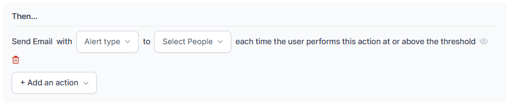

# SLAs & Alerts

SLAs and Alerts targets establish the acceptable threshold for key performance indicators, such as Average Speed to Answer, Response Service Level, Abandonment Rate, and Transfer Rate, for interactions, including voice calls and chats.

Administrators can access service levels by going to Contact Center AI > PERFORMANCE MANAGEMENT > SLAs & Alerts.  

The following information appears:  

For more information about Service Levels, refer to [Service Levels](../../console/monitor-queues-agents-and-interactions.md#service-levels).

## Service Level

### Create a New Service Level

Steps to create a new service level:

1. Select **+ New Service Level** in the upper-right corner.  
    

2. On the New Service Level Rule panel, enter a **Name** and **Description** for the service rule.  
    

3. Under Configuration Setup, select and select the **Queues** and **Channels** from the drop-down menus.  
    

4. Choose a trigger from the following options.  
    

    Based on your selected trigger, you can choose the following:  

    **Abandonment rate**:  
    

    **Average speed to answer (ASA)**:  
    

    **Response Service Level (RSL)**:  
    

    **Transfer rate**:  
    

5. Select **+ Add an action** and choose an action.  
    

    Based on your selected action, you can choose the following:  

    **Alert**:  
    

    **Email**:  
    

6. Select **Save** to create the service level.  
    

    A confirmation message appears, and creates the service level.

### Edit a Service Level

Steps to edit a service level:

1. Select **Edit**.  
    

2. Make the necessary changes to the service level and select **Save**.  
    

    A confirmation message appears.

### Edit a Service Level Name

Steps to edit a service level name:

1. Select **Edit**.  
    

2. Edit the Service Level Name or Description and select **Save**.  
    

    The revised service level name appears.

### Delete a Service Level

Steps to delete a service level:

1. Select **Delete**.  
    

2. Select **Delete**.  
    

    A notification appears, and deletes the service level.

## General Alerts

Administrators and Supervisors use this flexible alert system to configure and receive alerts for operational metrics and general system events.

Example:

Alerts triggered when users perform specific activities, such as:

* Exporting the **Interaction Details Report**
* Exporting data from the **Interaction Dashboard**
* Exporting the **Interaction Details Report by Segment**

### Create a General Alert

Steps to create a new General Alert:

1. Select the General Alerts tab and then select **+ New Alert** in the upper right corner.  
    

2. On the New General Alert panel, enter a **Name** and **Description** for the general alert.  
    

    The general alerts page displays.

3. Under Configuration Setup, choose a module from the following options.  
    

    **After Call Work (ACW)**

    1. Select the Queues, Channels, and Duration.  
        
    2. Select **+ Add an action** and choose an action.  
          
        Based on your selected action, you can choose the following:

        Alert:  
          

        Email:  
          

    3. Select **Save**. A notification displays, and creates the alert.

    **Analytics** > **Interactions**

    1. Select and select the trigger.  
        

    2. Select the number of times the system exports data within the selected time interval.  
        

    3. Select **+ Add an action** and choose an action.  
        

        Based on your selected action, you can choose the following:  

        **Alert**:  
        

        **Email**:  
        

    4. Select **Save**.  
        

    A notification displays, and creates the alert.

    **Voicemail in Agent Console**

    1. Select the Queues, the number of Voice Mails, and the Time Interval.  
        

    2. Select **+ Add an action** and choose an action.  
        

        Based on your selected action, you can choose the following:  

        **Alert**:  
        

        **Email**:  
        

    3. Select **Save**. A notification appears, and creates the alert.

### Edit a General Alert

Steps to edit a general alert

1. Select **Edit**.  
    

2. Make the necessary changes to the general alert and select **Save**.  
    

    A confirmation message is displayed.

### Edit a General Alert Name

Steps to edit a service level name:

1. Select **Edit**.  
    

2. Edit the Alert Name or Description and select **Save**.  
    

### Delete a General Alert

Steps to delete a General Alert:

1. Select **Delete**.  
    

2. Confirm **Delete**.  
    

    A message appears, and deletes the alert.