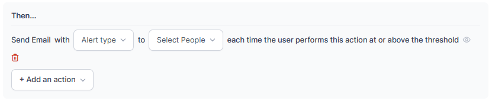

SLAs & Alerts let you set acceptable thresholds for key performance indicators (KPIs)—such as Average Speed to Answer, Response Service Level, Abandonment Rate, and Transfer Rate-—across voice and chat interactions.

**Navigation:** Contact Center AI > Performance Management > SLAs & Alerts.

For details on Service Levels See, [Service Levels](/ai-for-service/contact-center/supervisor#service-levels)

---

## Service Level

### Create a Service Level

1. Select **+ New Service Level** in the upper-right corner.

   

2. In the **New Service Level Rule** panel, enter a **Name** and **Description**.

   

3. Under **Configuration Setup**, select the **Queues** and **Channels**.

   

4. Select a trigger.

   

   | Trigger | Screenshot |
   |---|---|
   | **Abandonment Rate** |  |
   | **Average Speed to Answer (ASA)** |  |
   | **Response Service Level (RSL)** |  |
   | **Transfer Rate** |  |

5. Select **+ Add an action** and choose an action.

   

   | Action | Screenshot |
   |---|---|
   | **Alert** |  |
   | **Email** |  |

6. Select **Save**. A confirmation message appears and the service level is created.

   

---

### Edit a Service Level

1. Select **Edit**.

   

2. Make your changes and select **Save**. A confirmation message appears.

   

---

### Edit a Service Level Name

1. Select **Edit**.

   

2. Update the **Name** or **Description** and select **Save**. The updated name appears.

   

---

### Delete a Service Level

1. Select **Delete**.

   

2. Confirm by selecting **Delete**. A notification appears and the service level is deleted.

   

---

## General Alerts

General Alerts let administrators and supervisors set up notifications for operational metrics and system events. For example, you can trigger alerts when users export:

- The **Interaction Details Report**
- Data from the **Interaction Dashboard**
- The **Interaction Details Report by Segment**

---

### Create a General Alert

1. Select the **General Alerts** tab, then select **+ New Alert** in the upper-right corner.

   

2. In the **New General Alert** panel, enter a **Name** and **Description**.

   

3. Under **Configuration Setup**, select a module and configure it as follows.

   

#### After Call Work (ACW)

1. Select the **Queues**, **Channels**, and **Duration**.

   

2. Select **+ Add an action** and choose an action.

   

   | Action | Screenshot |
   |---|---|
   | **Alert** |  |
   | **Email** |  |

3. Select **Save**. A notification appears and the alert is created.

#### Analytics > Interactions

1. Select a trigger.

   

2. Set the number of times the system exports data within the selected time interval.

   

3. Select **+ Add an action** and choose an action.

   

   | Action | Screenshot |
   |---|---|
   | **Alert** |  |
   | **Email** |  |

4. Select **Save**. A notification appears and the alert is created.

   

#### Voicemail in Agent Console

1. Select the **Queues**, number of **Voice Mails**, and **Time Interval**.

   

2. Select **+ Add an action** and choose an action.

   

   | Action | Screenshot |
   |---|---|
   | **Alert** |  |
   | **Email** |  |

3. Select **Save**. A notification appears and the alert is created.

---

### Edit a General Alert

1. Select **Edit**.

   

2. Make your changes and select **Save**. A confirmation message appears.

   

---

### Edit a General Alert Name

1. Select **Edit**.

   

2. Update the **Name** or **Description** and select **Save**.

   

---

### Delete a General Alert

1. Select **Delete**.

   

2. Confirm by selecting **Delete**. A notification appears and the alert is deleted.

   

---
