Connect the XO Platform to Azure OpenAI to resolve general queries using GPT models. See [Azure OpenAI Service](https://azure.microsoft.com/en-us/products/cognitive-services/openai-service) for details.

---

## Supported Authorization Types

The platform supports Basic Auth for Azure OpenAI integration. See [App Authorization Overview](../../../dev-tools/bot-authorization/bot-authentication.md) for details.

| Authorization Type | Supported |
|---|---|
| Pre-Authorize the Integration | Yes |
| Allow Users to Authorize the Integration | Yes |

---

## Step 1: Create an Azure OpenAI App

**Prerequisites:**

- Create an [Azure OpenAI](https://learn.microsoft.com/en-us/azure/cognitive-services/openai/overview) developer account.
- Copy the **API Key**, **User Sub Domain**, and **Deployment ID** values for later use.

**Steps:**

1. Log in to the [Azure portal](https://portal.azure.com) and search for **Azure OpenAI**.

   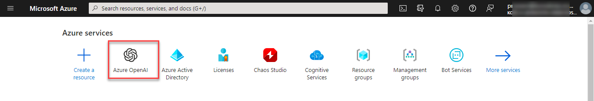

2. On the Cognitive Services Azure OpenAI page, click **Create**.

   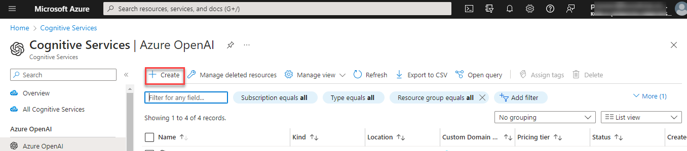

3. Fill in the required fields:
   - **Resource Group** – Select or create a resource group.
   - **Region** – e.g., South Central US.
   - **Name** – e.g., PlatformIntegration.
   - **Pricing Tier** – e.g., Standard.

   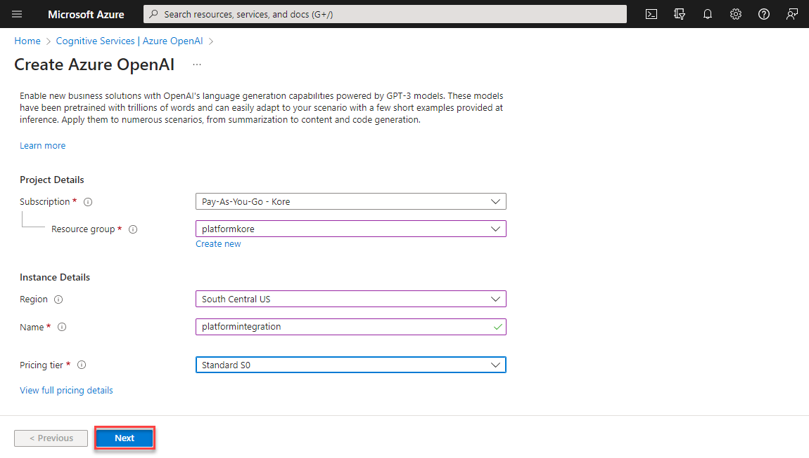

4. Click **Next** > **Review + Submit**, then click **Create** after validation passes.

   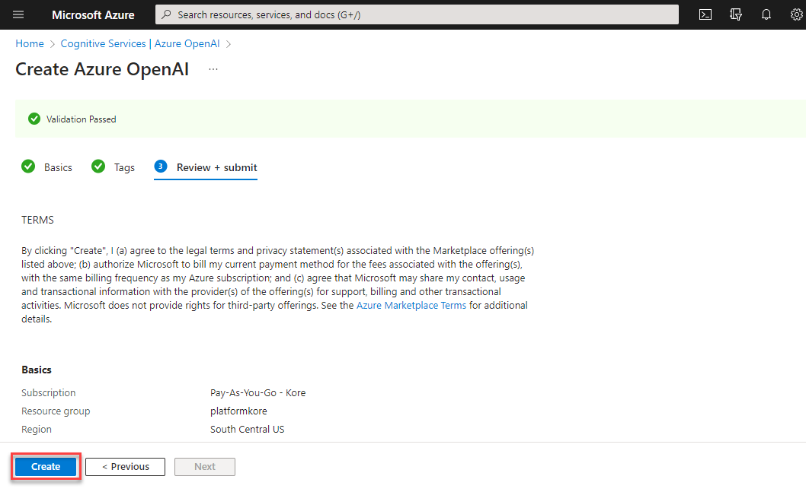

5. Click **Go to Resource** to view app details.

   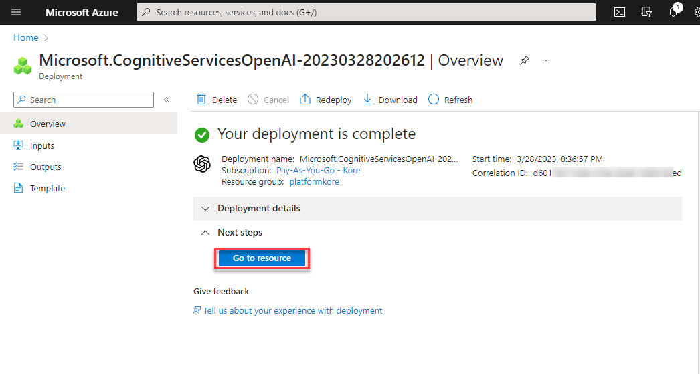

6. On the Overview page, copy the **User Domain Name**.

   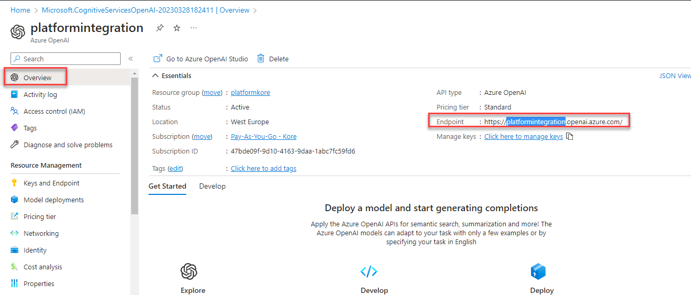

7. Under **Keys and Endpoints**, click **Show Keys** and copy the **API Key**.

   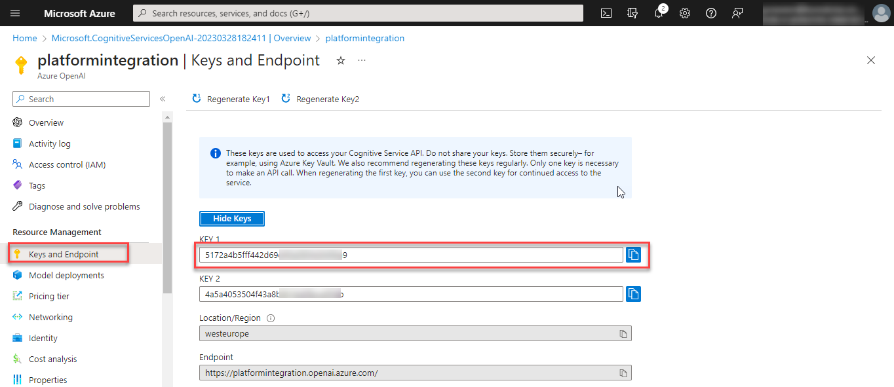

8. Under **Model Deployments**, create a new deployment (e.g., name: _PlatformDeploy_, model: _text-davinci-001_) and click **Save**.

   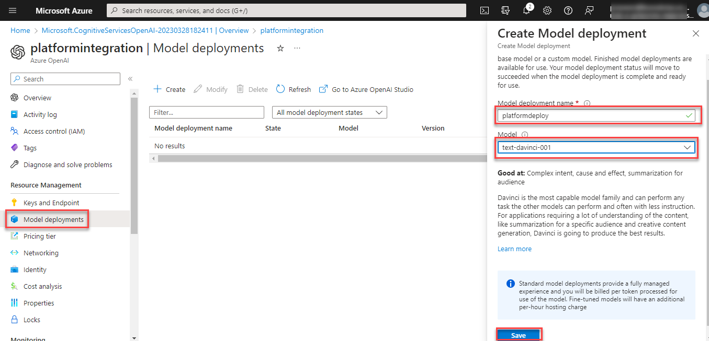

9. Copy the **Model Name** of the new deployment.

   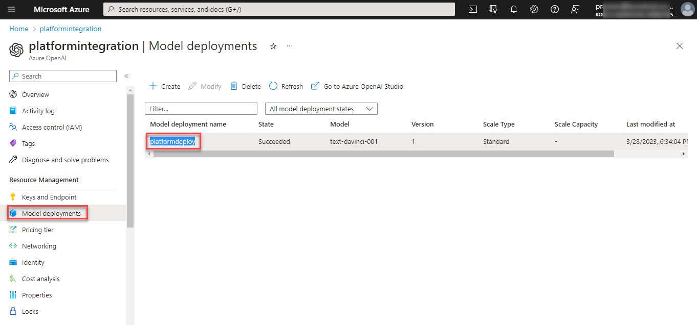

10. Alternatively, copy credentials from **Azure OpenAI Studio > Playground > GPT-3 > View Code**.

    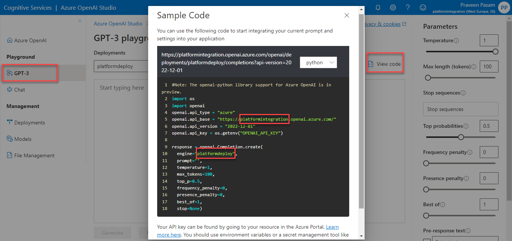

---

## Step 2: Enable the Azure OpenAI Action

Go to **App Settings > Integrations > Actions** and select **Azure OpenAI**.

### Pre-authorize the Integration (Basic Auth)

1. In the **Configurations** dialog, select the **Authorization** tab.
2. Set **Authorization Type** to **Pre-authorize the Integration** > **Basic Auth**.

   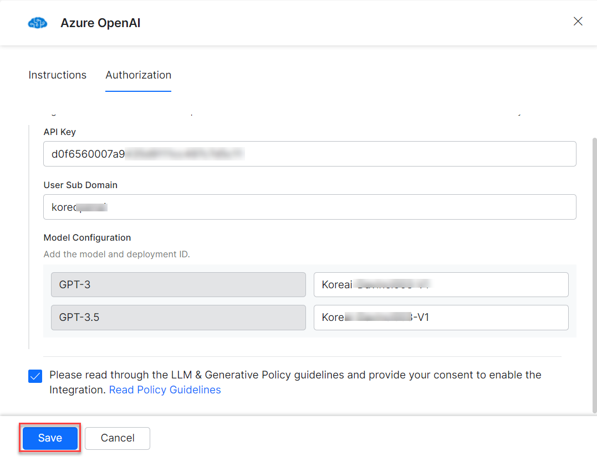

3. Enter the following fields:

   | Field | Description |
   |---|---|
   | API Key | Secret API key from Step 1 |
   | User Sub Domain | Domain name from Step 1 |
   | Deployment ID | Deployment ID/model name from Step 1 |

   <Note>You can enter the deployment ID for ChatGPT-3 or ChatGPT-3.5 to configure the GPT model.</Note>

4. Click **Enable**. The Integration Successful pop-up appears on first configuration.

   

<Note>The Azure OpenAI action moves from Available to Configured.</Note>

### Allow End Users to Authorize (Basic Auth)

1. In the **Configurations** dialog, select the **Authorization** tab.
2. Set **Authorization Type** to **Allow Users to Authorize the Integration** > **Basic Auth**.
3. Click **Select Authorization** > **Create New**.

   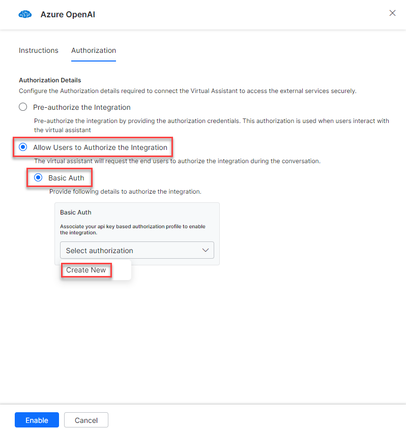

4. Select the authorization mechanism (e.g., **API Key**).

   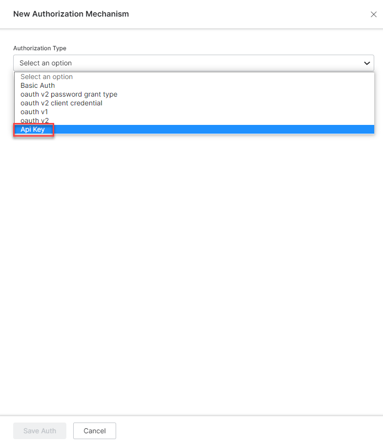

   See [App Authorization Overview](../../../dev-tools/bot-authorization/bot-authentication.md) for creating Basic Auth profiles.

5. Enter the following credentials:

   | Field | Description |
   |---|---|
   | Name | Name for the Basic Auth profile |
   | Tenancy URLs | Select Yes if tasks require tenancy URLs |
   | Base URL | Base tenant URL for the Azure OpenAI instance |
   | Authorization Check URL | Auth check URL |
   | Description | Description of the auth profile |

6. Click **Save Auth**, then select the new profile.

   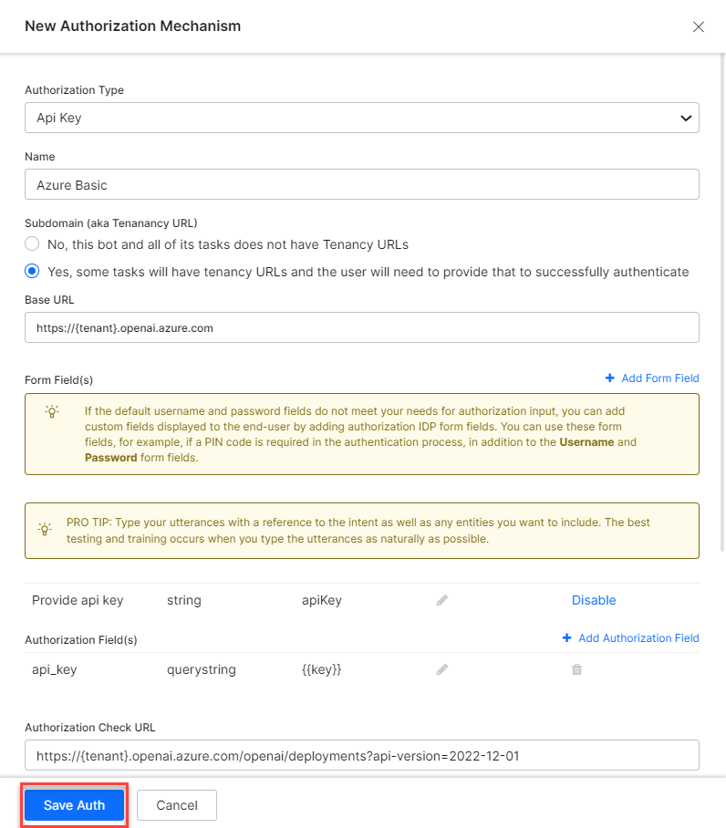

7. Click **Enable**. The Integration Successful pop-up appears.

   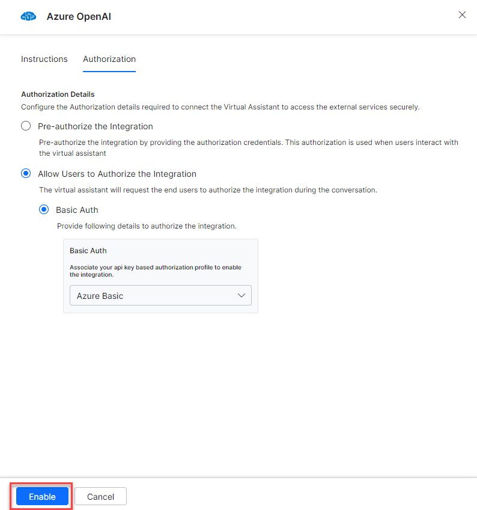

---

## Step 3: Install Azure OpenAI Action Templates

1. On the Integration Successful dialog, click **Explore Templates**.

   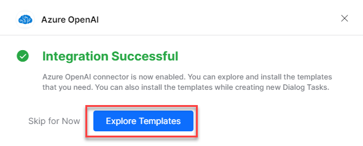

2. Click **Install** for the desired template.

   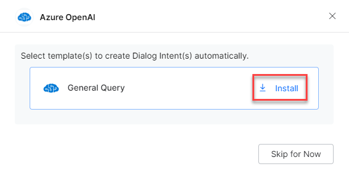

3. The associated dialog task is auto-created. Click **Go to Dialog** or navigate to **Automation AI > Use Cases > Dialogs**.

4. To use the templates, see [Using Azure OpenAI Action Templates](using-the-azure-openai-action-templates.md).
