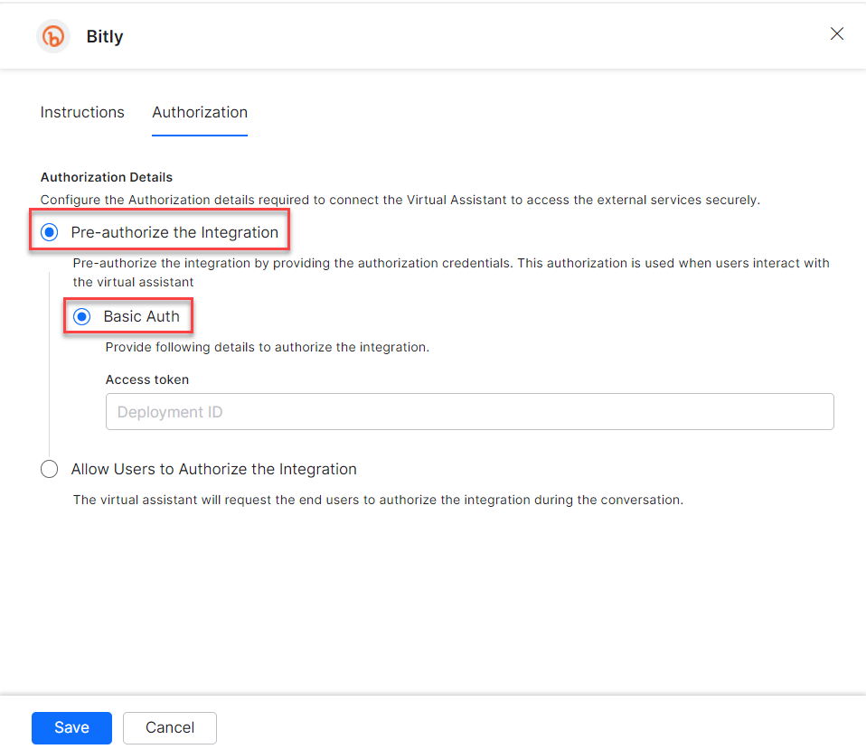
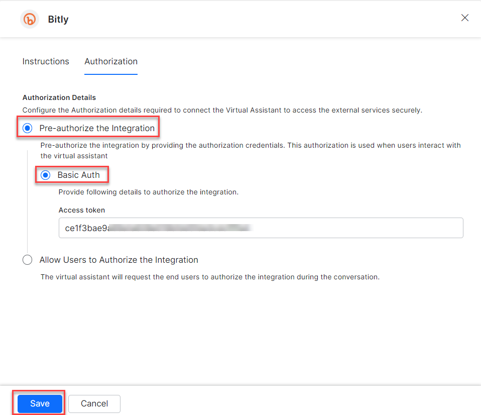
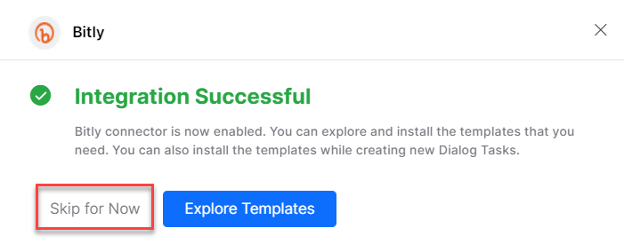
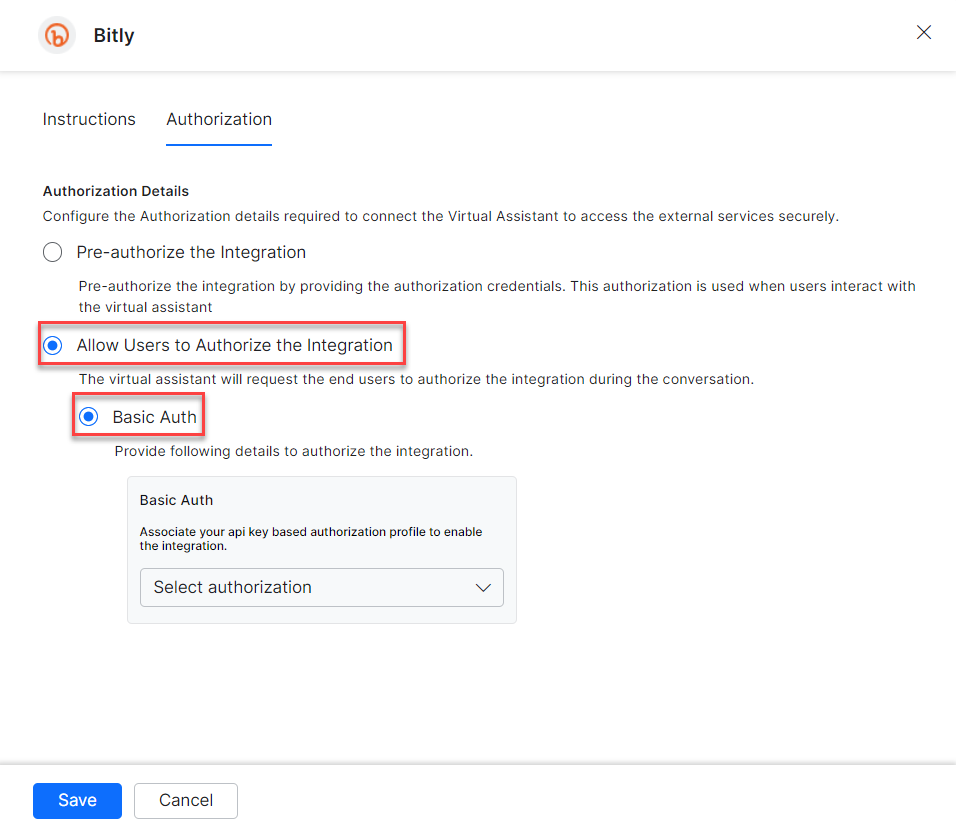
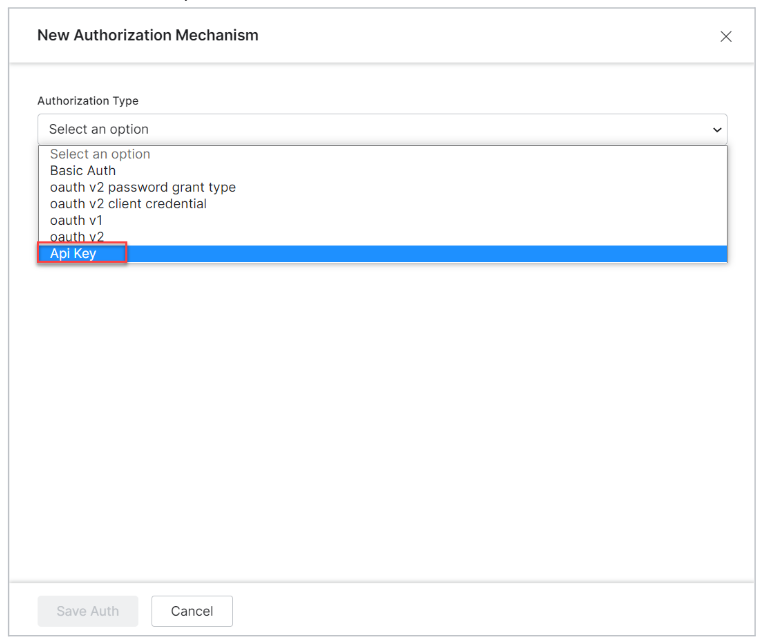
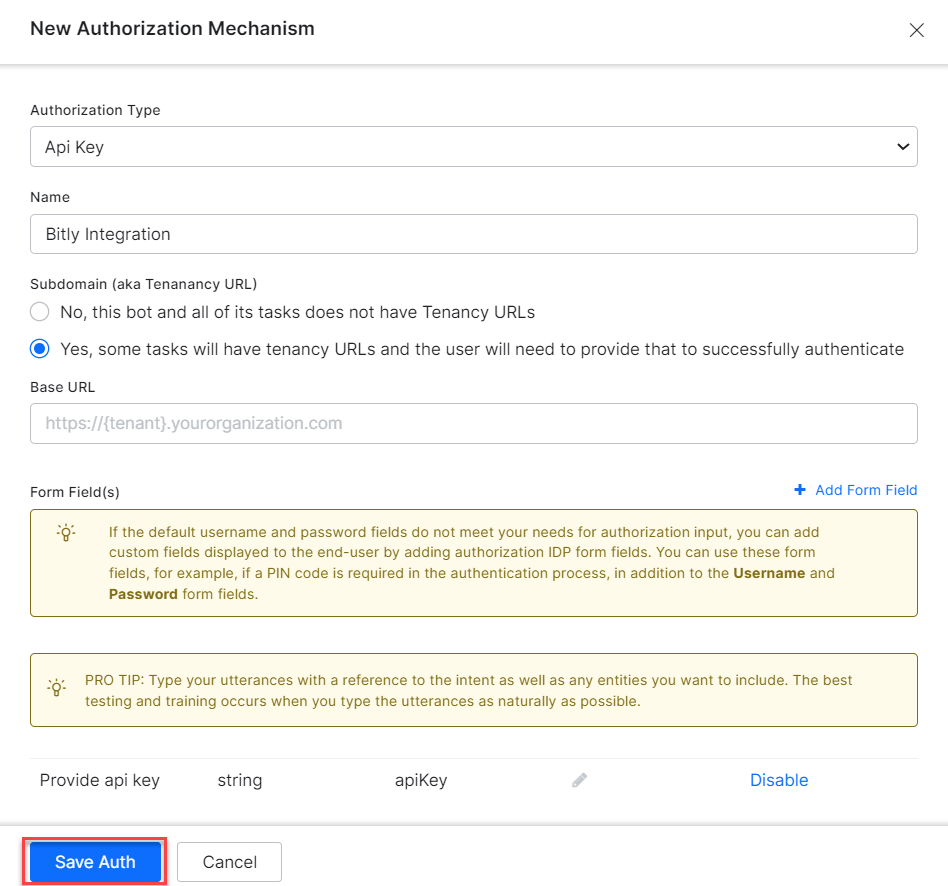
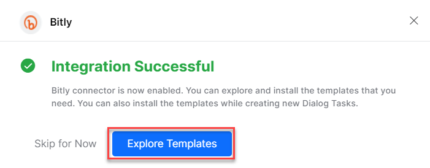
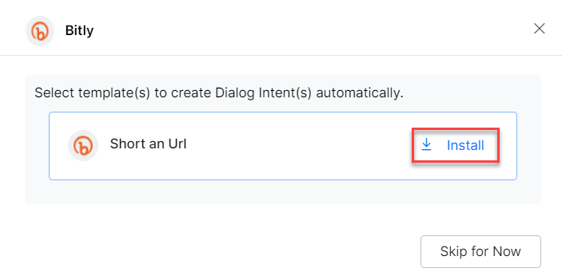

<Badge icon="arrow-left" color="gray">[Back to Actions Integrations](/ai-for-service/integrations/overview#actions)</Badge>

Connect the XO Platform to Bitly to shorten long URLs. See [Bitly documentation](https://dev.bitly.com/docs/getting-started/authentication/) for details.

---

## Supported Authorization Types

The platform supports API key authentication for Bitly integration. See [App Authorization Overview](/ai-for-service/app-settings#authorization-profiles) for details.

| Authorization Type | Supported |
|---|---|
| Pre-Authorize the Integration | Yes |
| Allow Users to Authorize the Integration | Yes |

---

## Prerequisites

Before enabling the Bitly action:

- Create a [Bitly Developer](https://dev.bitly.com/) account.
- Create a custom app on the Bitly admin page.
- Copy your Bitly personal access token.

---

## Enable the Bitly Action

Go to **App Settings > Integrations > Actions** and select **Bitly** from the Available actions list.

### Pre-authorize the Integration (Basic Auth)

1. In the **Configurations** dialog, select the **Authorization** tab.
2. Set **Authorization Type** to **Pre-authorize the Integration** > **Basic Auth**.

   

3. Enter your **Personal Access Token**.

   

4. Click **Save**. On first configuration, the Integration Successful pop-up appears.

<Note>The Bitly action moves from Available to Configured.</Note>

5. Click **Skip for Now** to install templates later.

   

### Allow End Users to Authorize (Basic Auth)

1. In the **Configurations** dialog, select the **Authorization** tab.
2. Set **Authorization Type** to **Allow Users to Authorize the Integration** > **Basic Auth**.

   

3. Click **Select Authorization** > **Create New**.
4. Select the authorization mechanism (e.g., **API Key**).

   

   See [App Authorization Overview](/ai-for-service/app-settings#authorization-profiles) for creating Basic Auth profiles.

5. Enter the following credentials:

   | Field | Description |
   |---|---|
   | Name | Name for the Basic Auth profile |
   | Tenancy URLs | Select Yes if tasks require tenancy URLs |
   | Base URL | Base tenant URL for the Bitly instance |
   | Authorization Check URL | Auth check URL |
   | Description | Description of the auth profile |

   

6. Click **Save Auth**, then select the new profile.
7. Click **Save**. The Integration Successful pop-up appears.

---

## Install Bitly Action Templates

1. On the Integration Successful dialog, click **Explore Templates**.

   

2. Click **Install** for the desired template.

   

3. The associated dialog task is auto-created. Click **Go to Dialog** or navigate to **Automation AI > Use Cases > Dialogs**.

4. To use the templates, see [Using Bitly Action Templates](using-the-bitly-action-template.md).
