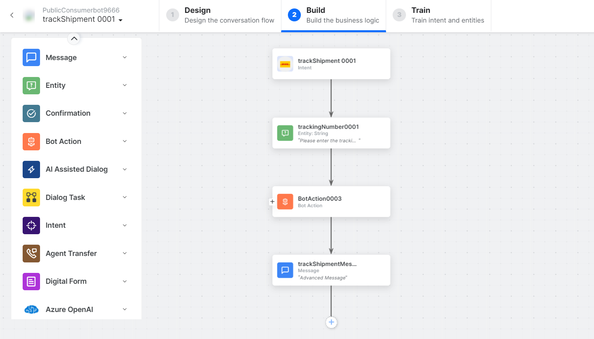
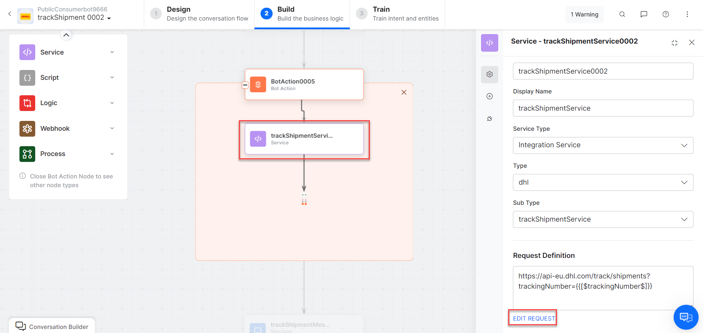
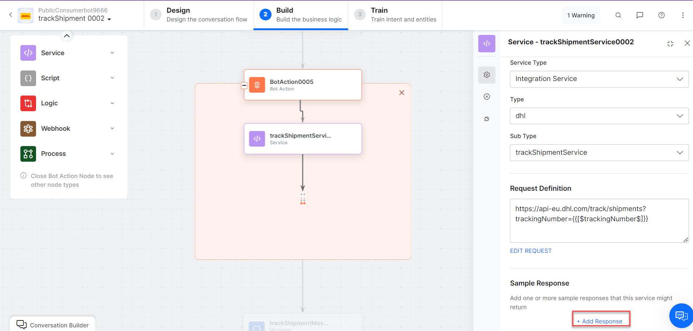
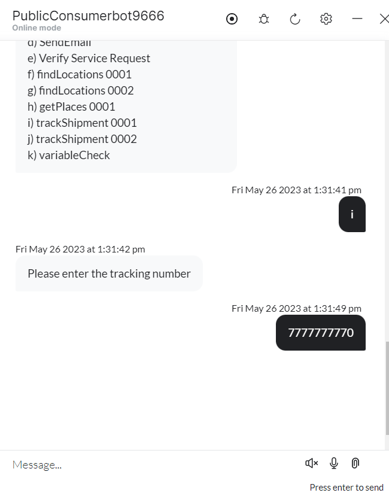
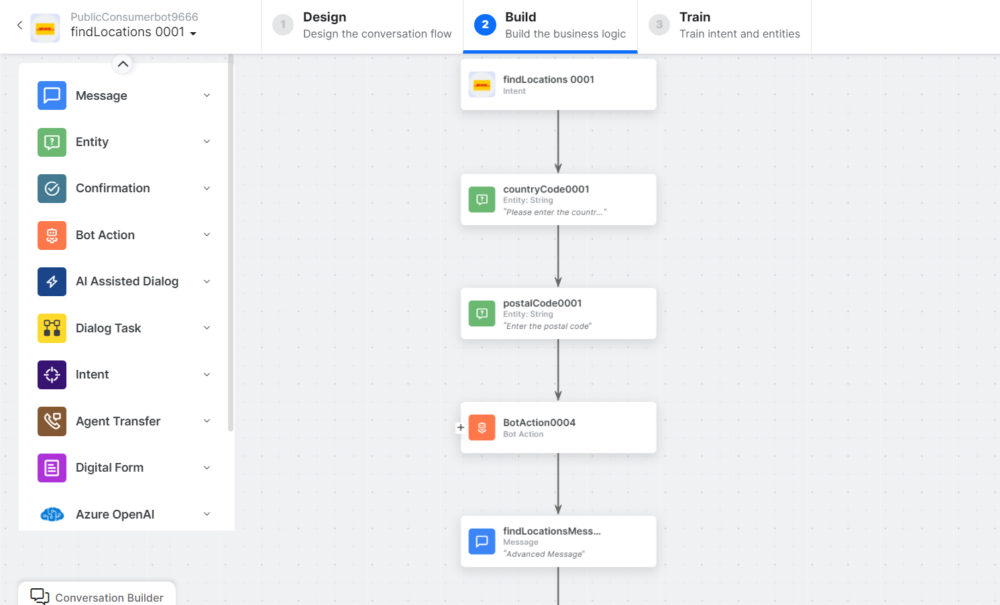
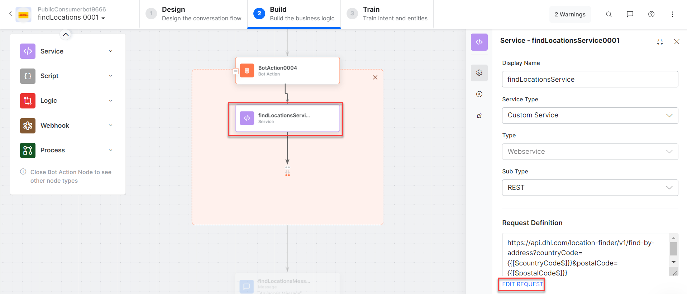
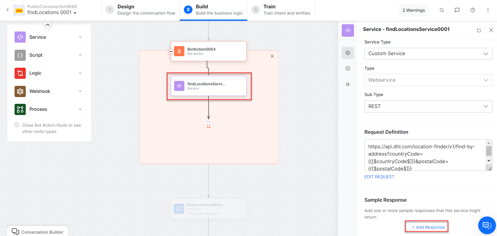
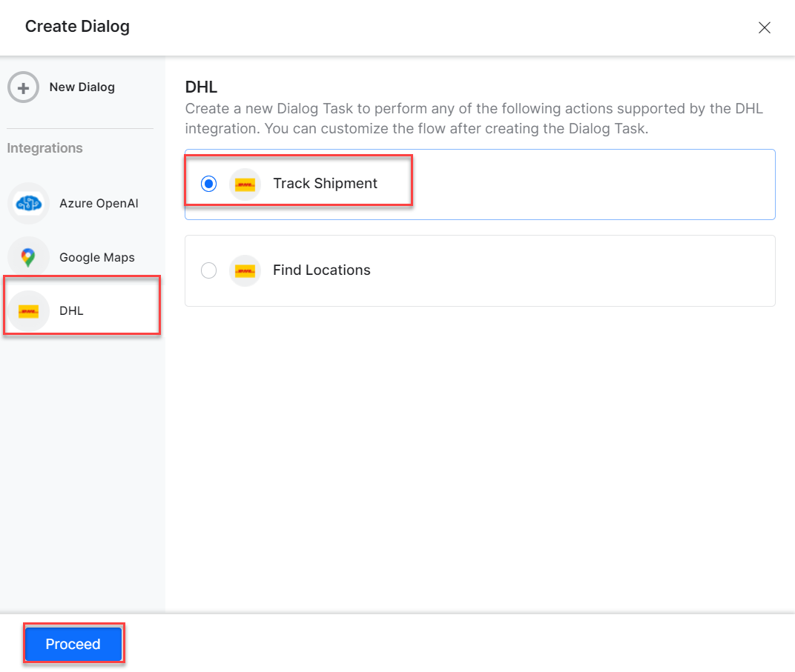

Use prebuilt DHL action templates to auto-create dialog tasks.

**Prerequisites:** Configure [DHL](configuring-the-dhl-action.md) and [install templates](configuring-the-dhl-action.md#install-dhl-action-templates) before proceeding.

Navigate to **Automation AI > Use Cases > Dialogs**, then click the auto-created dialog to open the canvas.

---

## Supported Actions

| Action | Description | Method |
|---|---|---|
| Track Shipment | Tracks a shipment using the DHL tracking ID | GET |
| Find Locations | Retrieves locations by country code and postal code | GET |

---

## Track Shipment

1. Install the template from [DHL Templates](configuring-the-dhl-action.md#install-dhl-action-templates).
2. The _Track Shipment_ dialog task is added with:

   

   - **trackShipment** – User intent to track a shipment by DHL ID.
   - **trackingNumber** – Entity node for the tracking number.
   - **trackShipmentService** – Bot action service to track the shipment. Optionally click **Edit Request**:

     

     Click **+Add Response**:

     

     **Sample Response:**
     ```json
     {
       "shipments": [
         {
           "id": "7777777770",
           "service": "express",
           "origin": { "address": { "addressLocality": "-" } },
           "destination": { "address": { "addressLocality": "-" } },
           "status": {
             "timestamp": "2023-05-23T12:30:00",
             "location": { "address": { "addressLocality": "NUREMBERG - GERMANY" } },
             "statusCode": "transit",
             "description": "Arrived at DHL Delivery Facility NUREMBERG - GERMANY"
           },
           "events": [
             { "description": "Arrived at DHL Delivery Facility NUREMBERG - GERMANY" },
             { "description": "Shipment picked up" }
           ]
         }
       ]
     }
     ```

   - **trackShipmentMessage** – Message node to display results.

3. Click **Train**, then **Talk to Bot** to test.
4. Follow prompts to track a shipment.

   

---

## Find Locations

1. Install the template from [DHL Templates](configuring-the-dhl-action.md#install-dhl-action-templates).
2. The _Find Locations_ dialog task is added with:

   

   - **findLocations** – User intent to find locations by coordinates.
   - **countryCode** and **postalCode** – Entity nodes for country and postal codes.
   - **findLocationsService** – Bot action service to find locations. Optionally click **Edit Request**:

     

     Click **+Add Response**:

     

     **Sample Response:**
     ```json
     {
       "locations": [
         {
           "url": "/locations/HYD102",
           "name": "Madhapur Office, HYDERABAD",
           "distance": 1076,
           "place": {
             "address": {
               "countryCode": "IN",
               "postalCode": "500081",
               "addressLocality": "HYDERABAD",
               "streetAddress": "H.No.2-52/1, Plot No.12 Opp Kasanigr Hotel,"
             },
             "geo": { "latitude": 17.441049, "longitude": 78.392052 }
           },
           "serviceTypes": [
             "express:drop-off-easy",
             "express:drop-off",
             "express:pick-up"
           ]
         }
       ]
     }
     ```

   - **getLocationsbyCoordinatesMessage** – Message node to display results.

3. Click **Train**, then **Talk to Bot** to test.
4. Follow prompts to find locations.

   

5. Click and expand the desired result to view location details.

   
