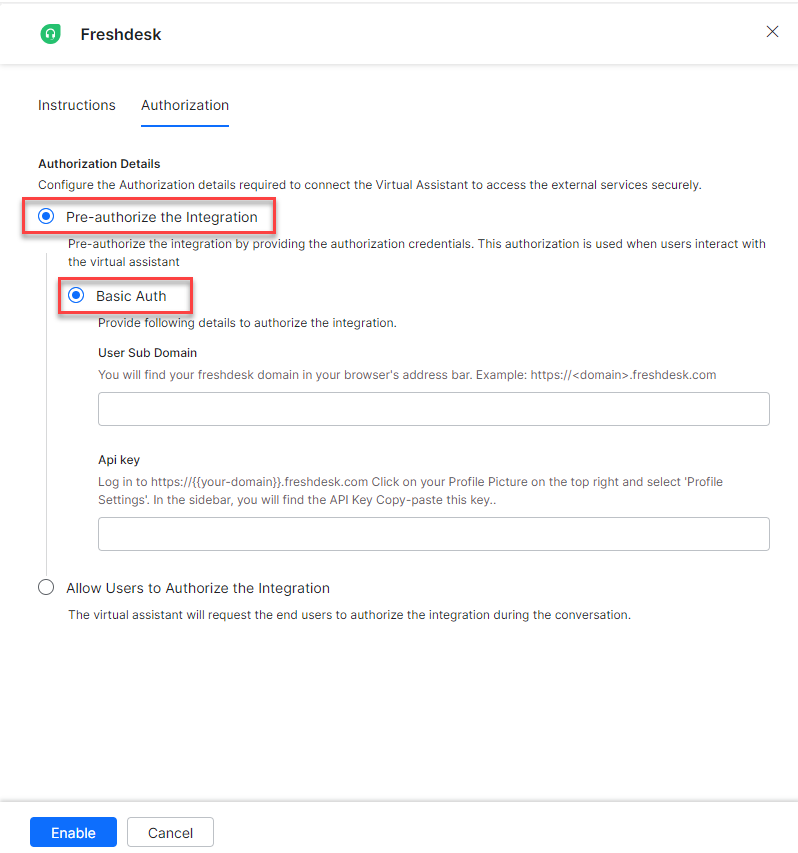
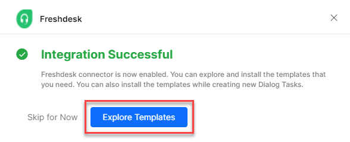
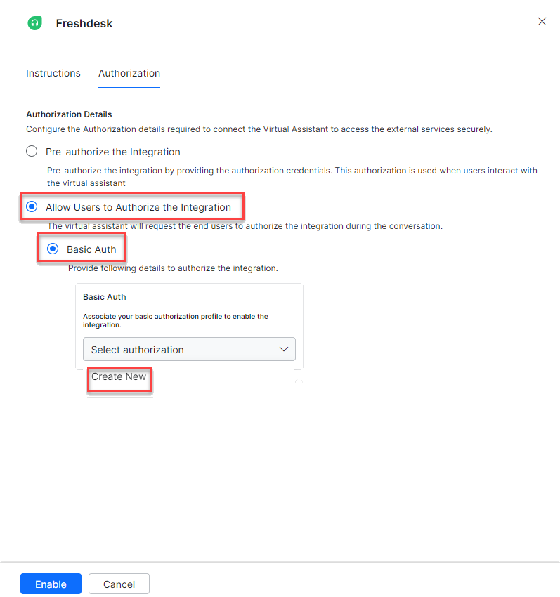
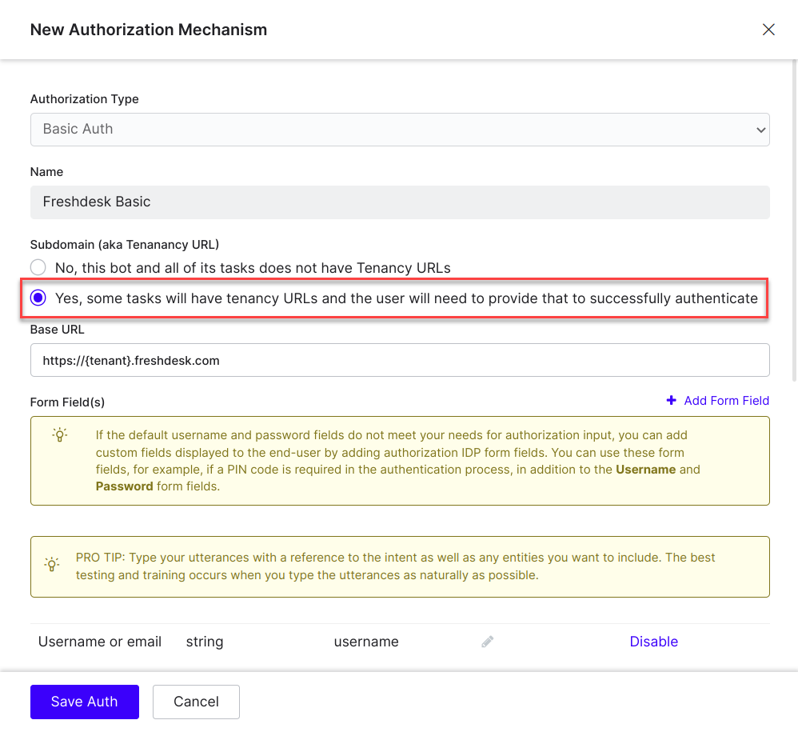
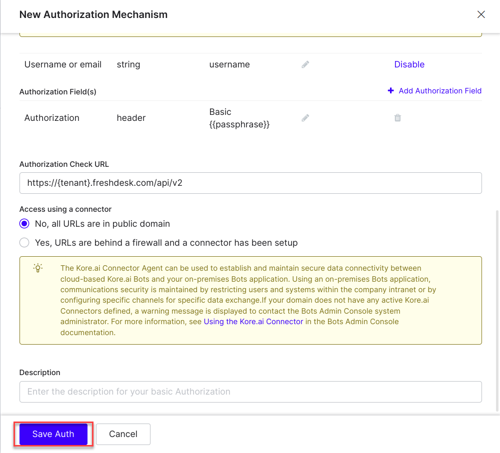
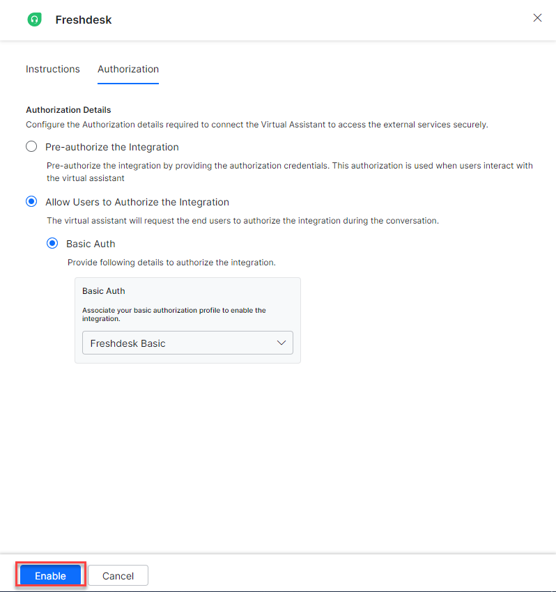
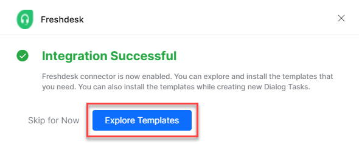
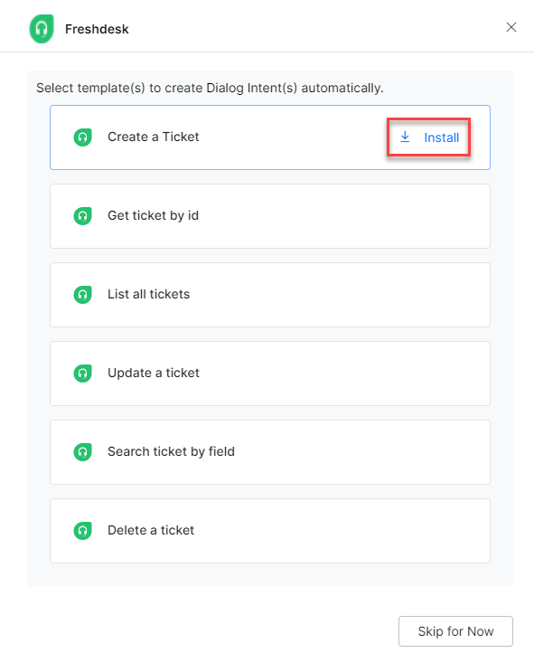
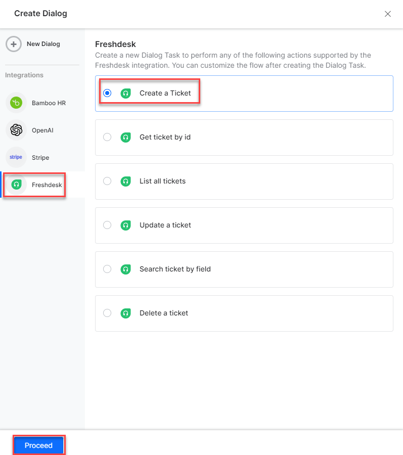
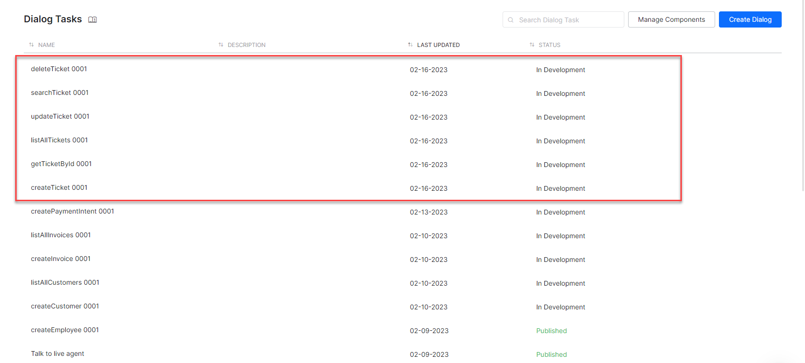

Connect the XO Platform to Freshdesk to create, view, update, search, and delete tickets. See [Freshdesk documentation](https://www.freshworks.com/freshdesk/resources/) for details.

---

## Supported Authorization Types

The platform supports Basic Auth for Freshdesk integration. See [App Authorization Overview](../../../dev-tools/bot-authorization/bot-authentication.md) for details.

| Authorization Type | Supported |
|---|---|
| Pre-Authorize the Integration | Yes |
| Allow Users to Authorize the Integration | Yes |

---

## Prerequisites

Before enabling the Freshdesk action:

- Create a [Freshdesk](https://www.freshworks.com/freshdesk/resources/) developer account.
- Copy the **API Key** and **Domain name** of your Freshdesk account.

---

## Step 1: Enable the Freshdesk Action

Go to **App Settings > Integrations > Actions** and select **Freshdesk**.

### Pre-authorize the Integration (Basic Auth)

1. Select **Freshdesk** in the **Available Actions** region.
2. In the **Configurations** dialog, select the **Authorization** tab.
3. Set **Authorization Type** to **Pre-authorize the Integration** > **Basic Auth**.

   

4. Enter the following fields:

   | Field | Description |
   |---|---|
   | User Sub Domain | Domain name of the Freshdesk account |
   | API Key | Secret API key of your Freshdesk account |

5. Click **Enable**. The Integration Successful pop-up appears on first configuration.

   

<Note>The Freshdesk action moves from Available to Configured.</Note>

### Allow End Users to Authorize (Basic Auth)

1. In the **Configurations** dialog, select the **Authorization** tab.
2. Set **Authorization Type** to **Allow Users to Authorize the Integration** > **Basic Auth**.
3. Click **Select Authorization** > **Create New**.

   

4. Select the authorization mechanism (e.g., **Basic Auth**). See [App Authorization Overview](../../../dev-tools/bot-authorization/bot-authentication.md).
5. Enter the following credentials:

   | Field | Description |
   |---|---|
   | Name | Name for the Basic Auth profile |
   | Tenancy URLs | Select No |
   | Base URL | Base tenant URL for the Freshdesk instance |
   | Authorization Check URL | Auth check URL |
   | Description | Description of the auth profile |

   

6. Click **Save Auth**.

   

7. Select the new profile.
8. Click **Enable**. The Integration Successful pop-up appears.

   

---

## Step 2: Install Freshdesk Action Templates

1. On the Integration Successful dialog, click **Explore Templates**.

   

2. Click **Install** for the desired template.

   

3. Click **Go to Dialog** to view the dialog task.
4. A dialog task is auto-created for each installed template.
5. Select the desired dialog task and click **Proceed** (e.g., **Create a Ticket**).

   

6. The canvas opens with all required entity nodes, service nodes, and message scripts.

   
