<Badge icon="arrow-left" color="gray">[Back to Actions Integrations](/ai-for-service/integrations/overview#actions)</Badge>

Use prebuilt Freshdesk action templates to auto-create dialog tasks.

**Prerequisites:** Configure [Freshdesk](configuring-the-freshdesk-action.md) and install templates before proceeding.

To access templates:
1. Go to **Automation AI > Use Cases > Dialogs** and click **Create Dialog**.
2. Under **Integration**, select **Freshdesk** to view action templates.

   

If no integration is configured, click **Explore Integrations** to go to the Actions page.


---

## Supported Actions

| Action | Description | Method |
|---|---|---|
| Create a Ticket | Creates a ticket in Freshdesk | POST |
| Get Ticket by ID | Fetches ticket details by ID | GET |
| List All Tickets | Retrieves all tickets | GET |
| Update a Ticket | Updates a ticket | PUT |
| Search Ticket by Field | Searches tickets by field | GET |
| Delete a Ticket | Deletes a ticket | DELETE |

---

## Create a Ticket

1. Install the template from [Freshdesk Templates](configuring-the-freshdesk-action.md#step-2-install-freshdesk-action-templates).
2. The _Create Ticket_ dialog task is added with:

   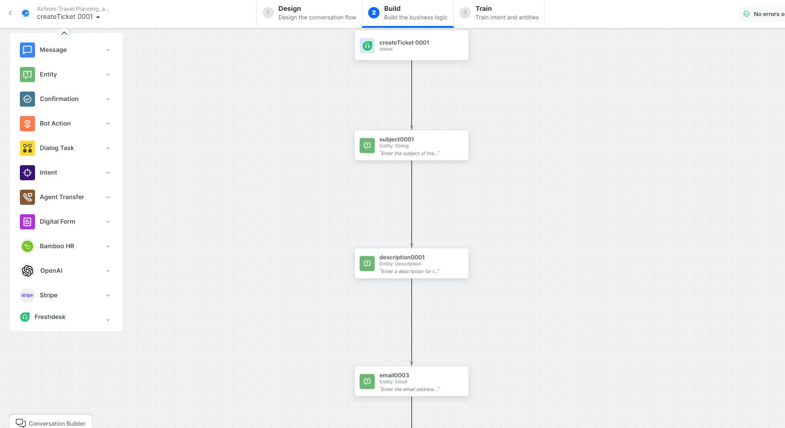

   - **createTicket** – User intent to create a ticket.
   - **subject**, **description**, **email**, **priority**, **status**, **phone** – Entity nodes for ticket details.
   - **createTicketScript** – Bot action script to prepare the request.
   - **createTicketService** – Bot action service to create the ticket. Click **Edit Request**:

     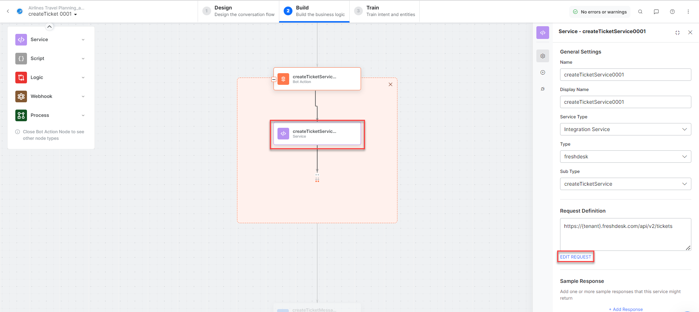

     **Sample Request:**
     ```json
     {
       "email": "john.doe@example.com",
       "subject": "Support payment",
       "description": "Payment is pending issue",
       "status": 2,
       "priority": 3
     }
     ```

     **Sample Response:**
     ```json
     {
       "ticket": {
         "id": 57,
         "subject": "Support payment...",
         "description": "Payment is pending issue",
         "status": 2,
         "priority": 1,
         "type": "Incident",
         "created_at": "2022-09-28T07:00:14Z"
       }
     }
     ```

   - **createTicketMessage** – Message node to display the result.

3. Click **Train**, then **Talk to Bot** to test.
4. Follow prompts to create a ticket.

   

---

## Get Ticket by ID

1. Install the template from [Freshdesk Templates](configuring-the-freshdesk-action.md#step-2-install-freshdesk-action-templates).
2. The _Get Ticket by ID_ dialog task is added with:

   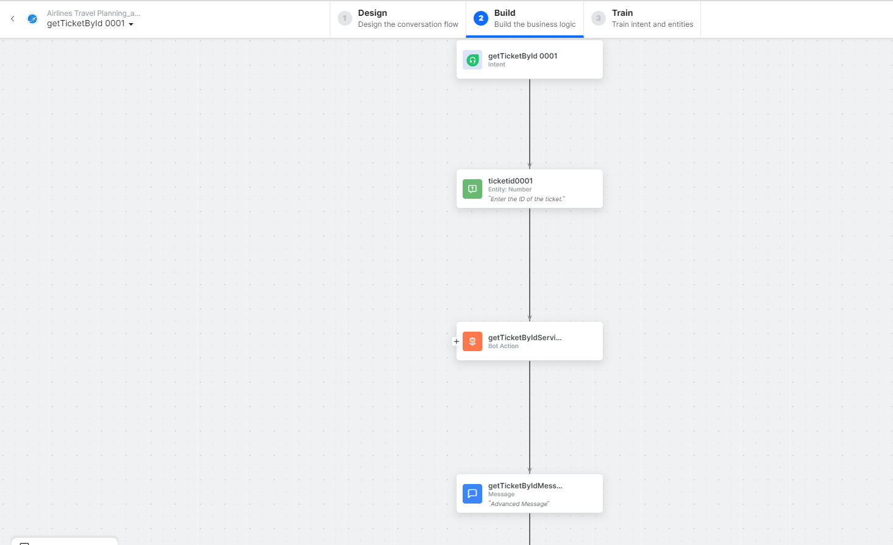

   - **getTicketbyId** – User intent to find a ticket by ID.
   - **ticketID** – Entity node for the ticket ID.
   - **getTicketbyIdService** – Bot action service to find the ticket. Click **+Add Response**:

     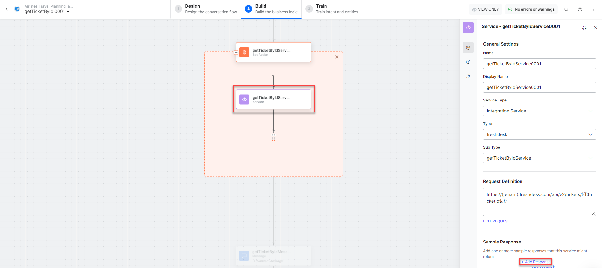

     **Sample Response:**
     ```json
     {
       "ticket": {
         "id": 57,
         "subject": "Support payment...",
         "description": "Payment is pending issue",
         "status": 2,
         "priority": 1,
         "type": "Incident"
       }
     }
     ```

   - **getTicketbyIdMessage** – Message node to display the result.

3. Click **Train**, then **Talk to Bot** to test.
4. Follow prompts to find a ticket by ID.

   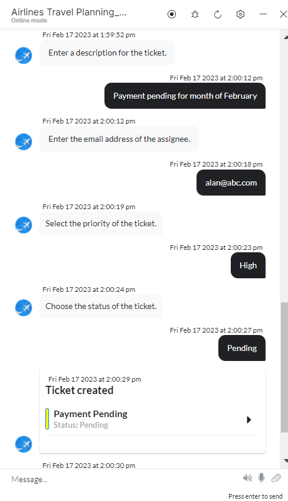

---

## List All Tickets

1. Install the template from [Freshdesk Templates](configuring-the-freshdesk-action.md#step-2-install-freshdesk-action-templates).
2. The _List All Tickets_ dialog task is added with:

   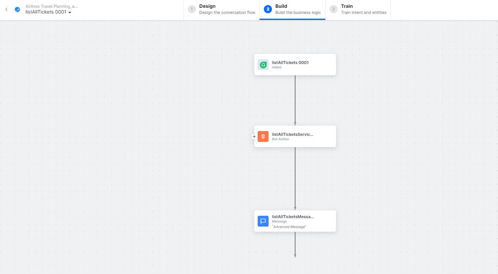

   - **listAllTickets** – User intent to view all tickets.
   - **listAllTicketsService** – Bot action service to fetch all tickets. Click **+Add Response**:

     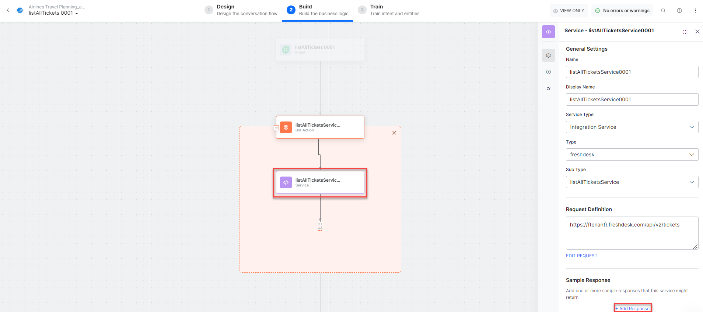

   - **listAllTicketsMessage** – Message node to display results.

3. Click **Train**, then **Talk to Bot** to test.
4. Follow prompts to view all tickets.

   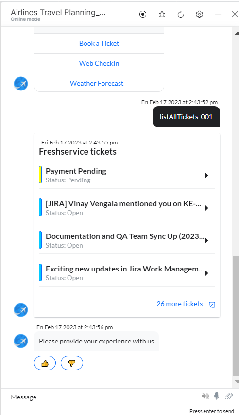

---

## Update a Ticket

1. Install the template from [Freshdesk Templates](configuring-the-freshdesk-action.md#step-2-install-freshdesk-action-templates).
2. The _Update a Ticket_ dialog task is added with:

   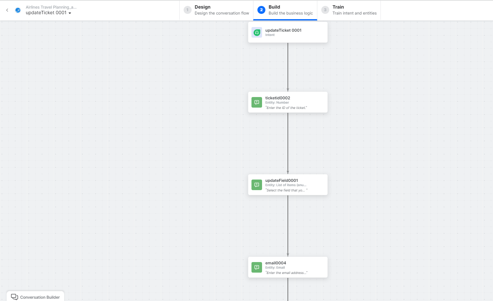

   - **updateTicket** – User intent to update a ticket.
   - **ticketID**, **updateField**, **email**, **subject**, **description**, **status**, **priority** – Entity nodes.
   - **updateTicketScript** – Bot action script for the update.

     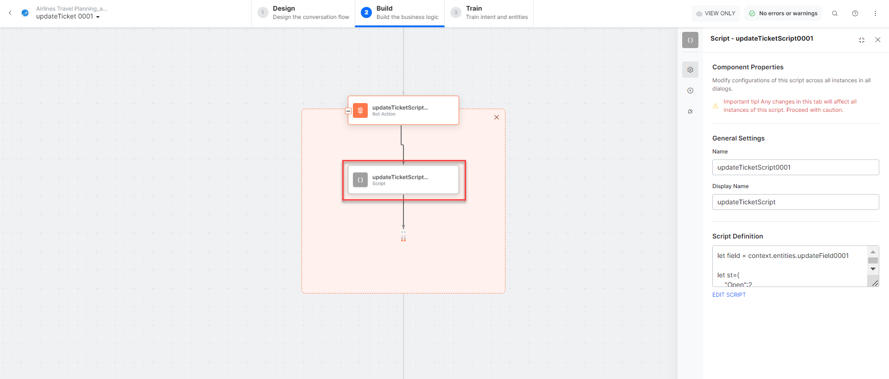

   - Click **Edit Request**:

     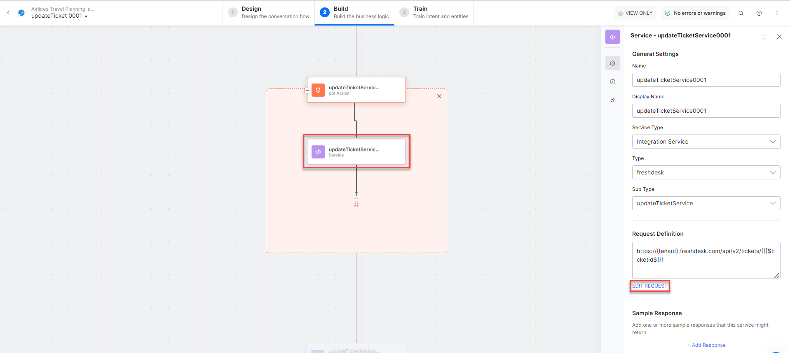

     **Sample Request:**
     ```json
     {
       "email": "john.doe@example.com",
       "subject": "LOGIN ISSUE...",
       "description": "Unable to login...",
       "status": 4,
       "priority": 2
     }
     ```

     **Sample Response:**
     ```json
     {
       "ticket": {
         "id": 54,
         "subject": "LOGIN ISSUE...",
         "description": "Unable to login...",
         "status": 4,
         "priority": 2
       }
     }
     ```

   - **updateTicketMessage** – Message node to display the result.

3. Click **Train**, then **Talk to Bot** to test.
4. Follow prompts to update a ticket.

   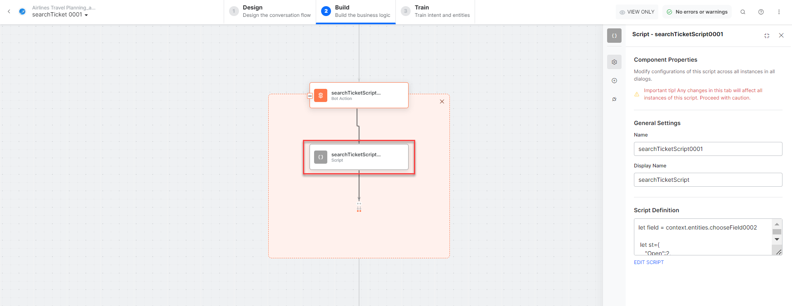

---

## Search Ticket by Field

1. Install the template from [Freshdesk Templates](configuring-the-freshdesk-action.md#step-2-install-freshdesk-action-templates).
2. The _Search Ticket by Field_ dialog task is added with:

   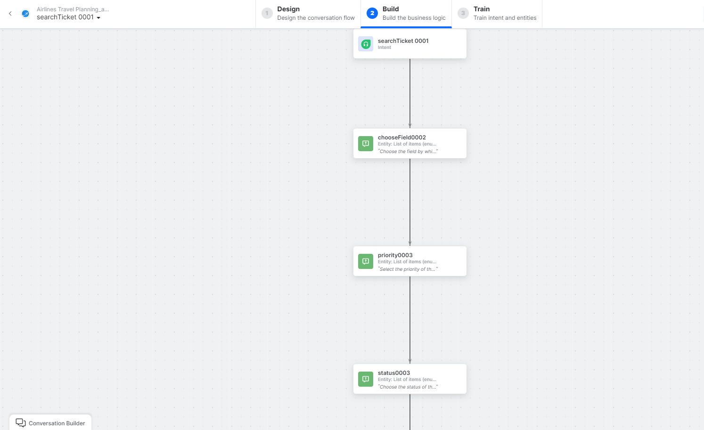

   - **searchTicket** – User intent to search tickets.
   - **chooseField**, **priority**, **email**, **status** – Entity nodes for search criteria.
   - **searchTicketScript** – Bot action script to prepare the search.
   - **searchTicketService** – Bot action service to search tickets. Click **+Add Response**:

     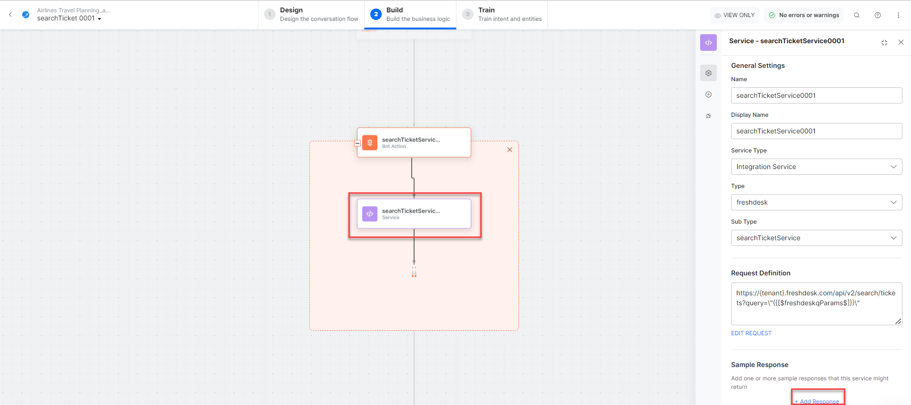

     **Sample Response:**
     ```json
     {
       "tickets": [
         { "subject": "refer", "id": 55, "priority": 3, "status": 5 },
         { "subject": "Support payment...", "id": 7, "priority": 3, "status": 2 }
       ],
       "total": 2
     }
     ```

   - **searchTicketMessage** – Message node to display results.

3. Click **Train**, then **Talk to Bot** to test.
4. Follow prompts to search tickets.

   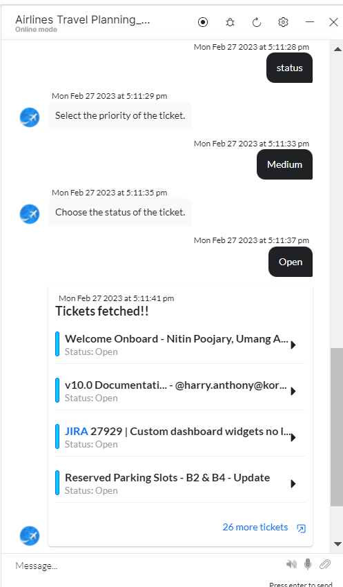

---

## Delete a Ticket

1. Install the template from [Freshdesk Templates](configuring-the-freshdesk-action.md#step-2-install-freshdesk-action-templates).
2. The _Delete a Ticket_ dialog task is added with:

   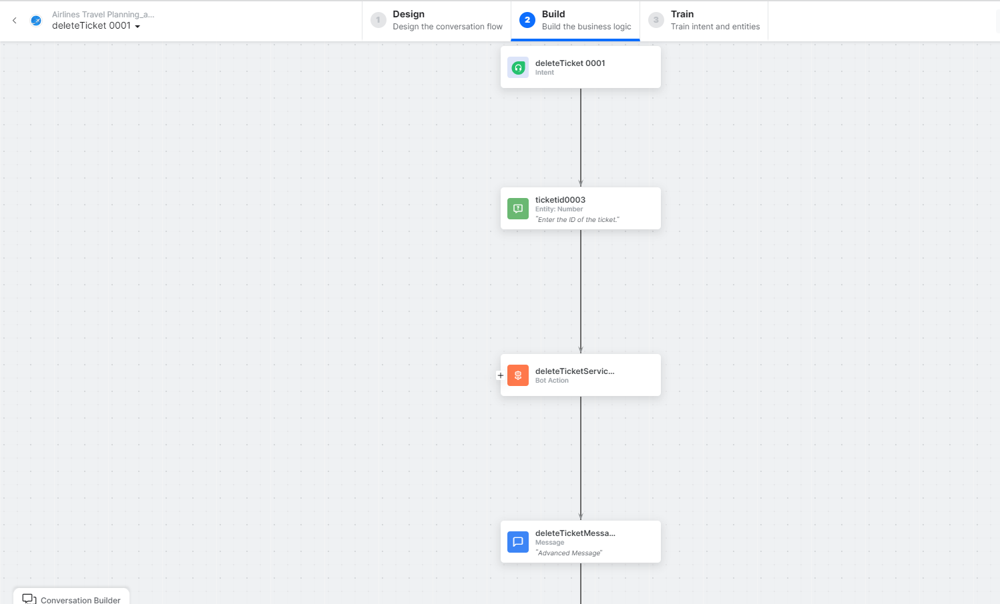

   - **deleteTicket** – User intent to delete a ticket.
   - **ticketID** – Entity node for the ticket ID.
   - **deleteTicketService** – Bot action service to delete the ticket. Click **Edit Request**:

     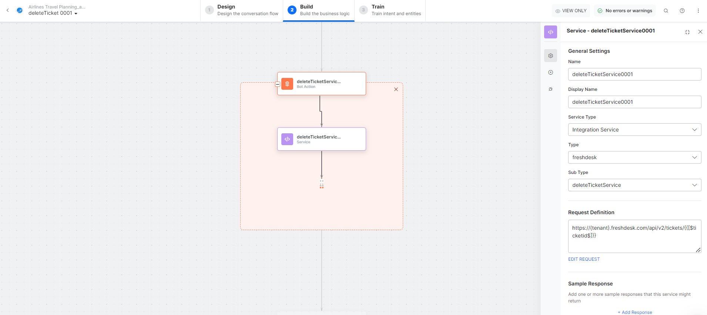

   - **deleteTicketMessage** – Message node to display the result.

3. Click **Train**, then **Talk to Bot** to test.
4. Follow prompts to delete a ticket.
