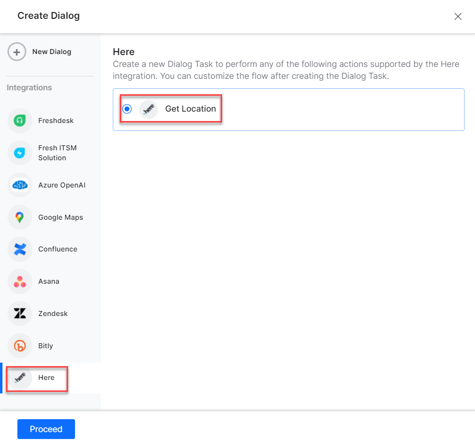
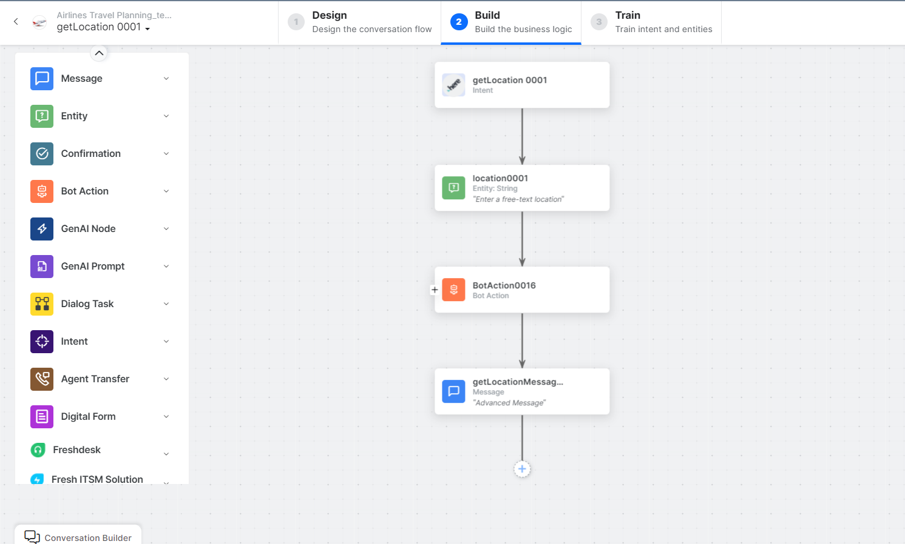
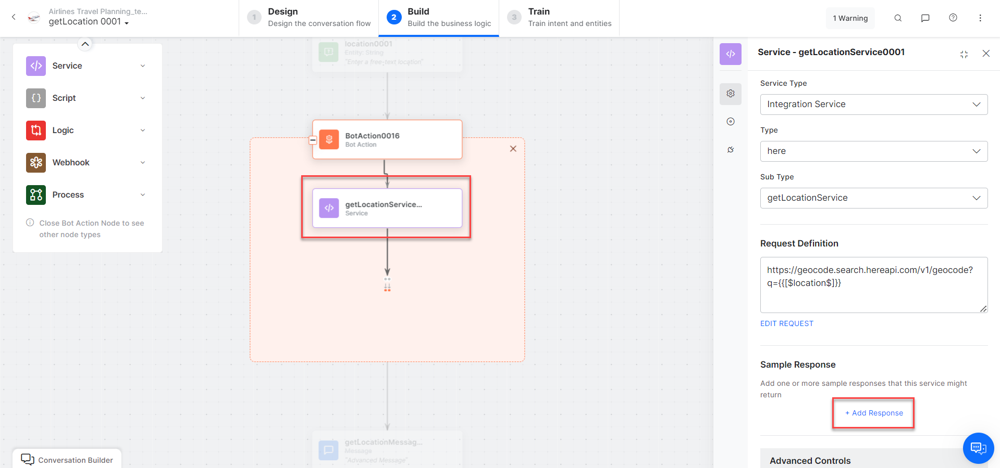
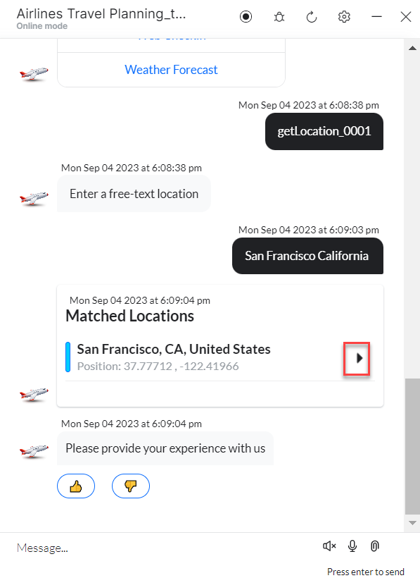
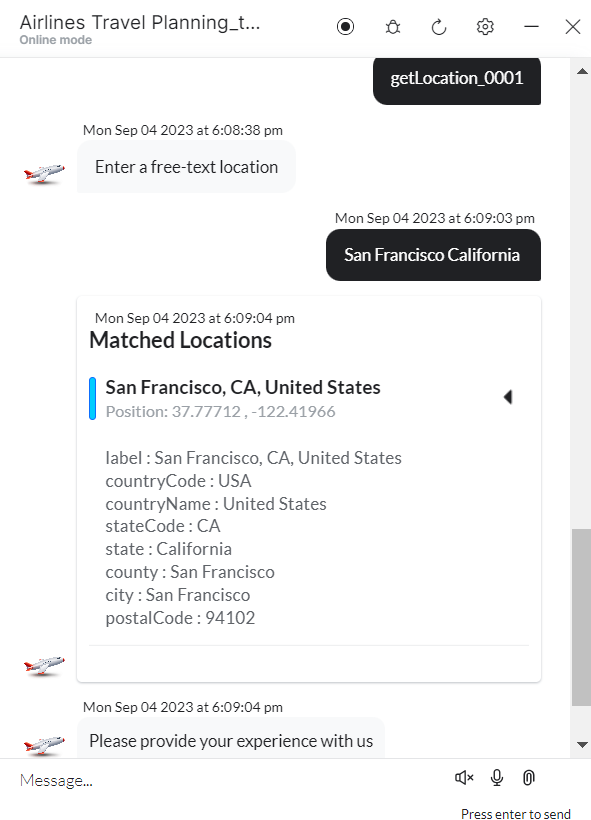

Use prebuilt Here action templates to auto-create dialog tasks.

**Prerequisites:** Configure [Here](configuring-the-here-action.md) and install templates before proceeding.

To access templates:
1. Go to **Automation AI > Use Cases > Dialogs** and click **Create a Dialog Task**.
2. Under **Integration**, select **Here** to view action templates.

   

If no integration is configured, click **Explore Integrations** to go to the Actions page.


---

## Supported Actions

| Action | Description | Method |
|---|---|---|
| Get Location | Finds a location by free text | POST |

---

## Get Locations

1. Install the template from [Here Templates](configuring-the-here-action.md#install-here-action-templates).
2. The _Get Location_ dialog task is added with:

   

   - **getLocation** – User intent to find a location.
   - **location** – Entity node to enter a location.
   - **getLocationService** – Bot action service to find the location. Click **+Add Response**:

     

     **Sample Response:**
     ```json
     {
       "items": [
         {
           "title": "DS Road, Nagarathpete, Bengaluru 560002, India",
           "id": "herestreet:Ivcd5Wbnv3Xdt4.XXX",
           "resultType": "street",
           "address": {
             "label": "DS Road, Nagarathpete, Bengaluru 560002, India",
             "countryCode": "IND",
             "countryName": "India",
             "state": "Karnataka",
             "city": "Bengaluru",
             "district": "Nagarathpete",
             "street": "DS Road",
             "postalCode": "560002"
           },
           "position": { "lat": 12.96564, "lng": 77.58555 },
           "scoring": {
             "queryScore": 0.99,
             "fieldScore": { "streets": [0.9] }
           }
         }
       ]
     }
     ```

   - **getLocationMessage** – Message node to display the result.

3. Click **Train** to complete training.
4. Click **Talk to Bot** to test.
5. Enter a free text location when prompted.

   

6. A location is identified based on your text.

   
