<Badge icon="arrow-left" color="gray">[Back to Actions Integrations](/ai-for-service/integrations/overview#actions)</Badge>

Connect the HubSpot integration to create, view, update, search, and delete deals and contacts using pre-built templates. See [HubSpot](https://www.hubspot.com/) for more information.

---

## Authorizations Supported

The XO Platform supports OAuth 2.0 for HubSpot. See [Setting Up Authorization Using OAuth v2](../../../dev-tools/bot-authorization/setting-up-authorization-using-oauth-v2.md) for details.

| Authorization Type | OAuth – System | OAuth – Custom |
|---|---|---|
| Pre-authorize the Integration | Yes | Yes |
| Allow Users to Authorize the Integration | Yes | Yes |

---

## Step 1: Enable the HubSpot Action

**Prerequisites:**

- Create a developer account in HubSpot. See [HubSpot Developer Center](https://developers.hubspot.com/docs/api/creating-an-app) for details.
- Copy the Client ID and Client Secret key values.

**Steps:**

1. Go to **App Settings** > **Integrations** > **Actions**.
2. In the **Available** section, select **HubSpot**.

### Pre-authorize the Integration

**System Authorization**

Pre-authorize with Kore.ai's preconfigured HubSpot app:

1. Go to **App Settings** > **Integrations** > **Actions** and select **HubSpot**.
2. In **Configurations**, select the **Authorization** tab.
3. Set **Authorization Type** to **Pre-authorize the Integration** > **OAuth**.
4. Select the **System** card and click **Authorize**.

   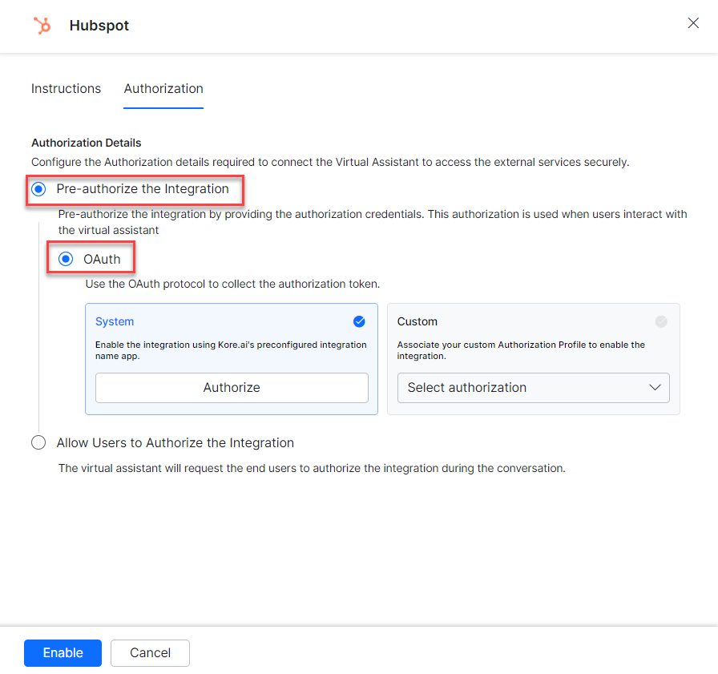

   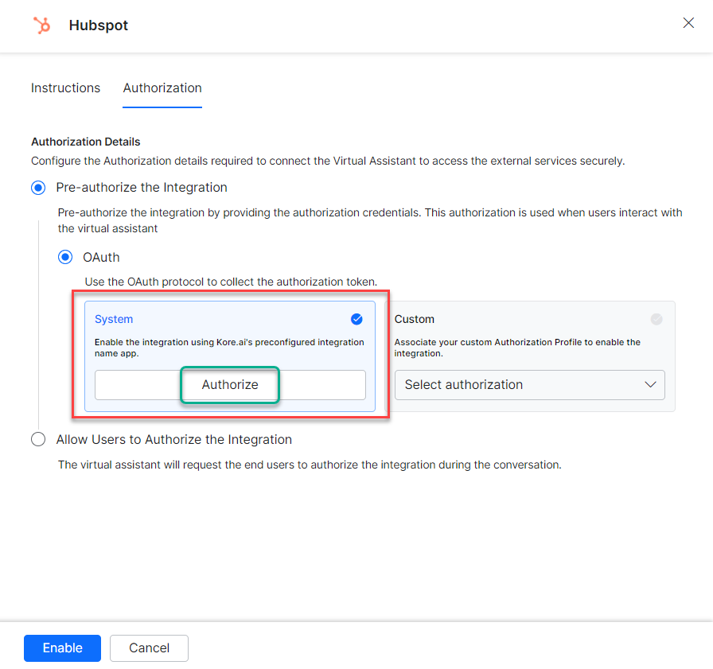

5. You are redirected to `login.hubspot.com`. Enter your developer account credentials.

   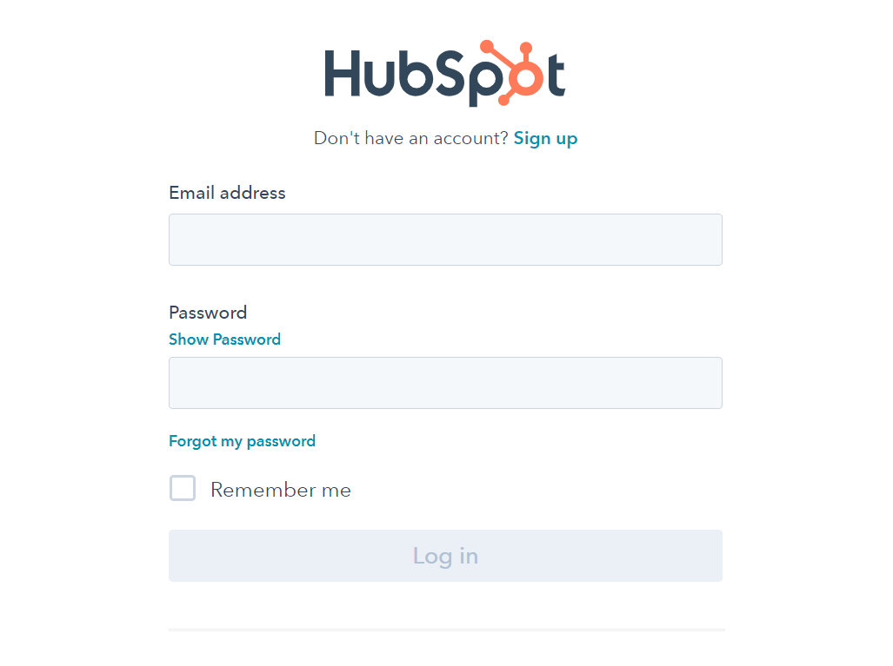

6. Select a HubSpot account and click **Choose Account**.
7. Click **Enable**.

**Custom Authorization**

Use your own OAuth profile instead of Kore.ai's app:

1. Select **Custom** and click **Select Authorization** > **Create New**.

   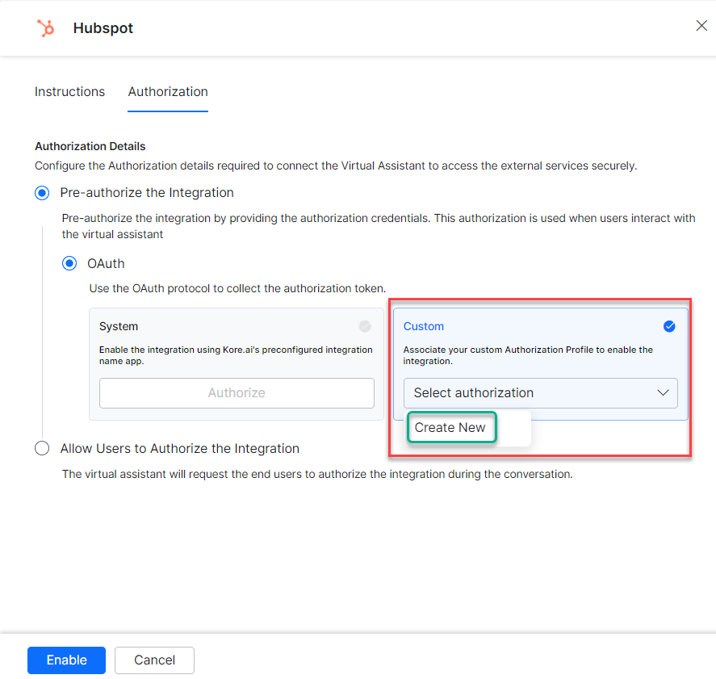

2. Select **OAuth v2**. See [Setting Up Authorization Using OAuth v2](../../../dev-tools/bot-authorization/setting-up-authorization-using-oauth-v2.md).

   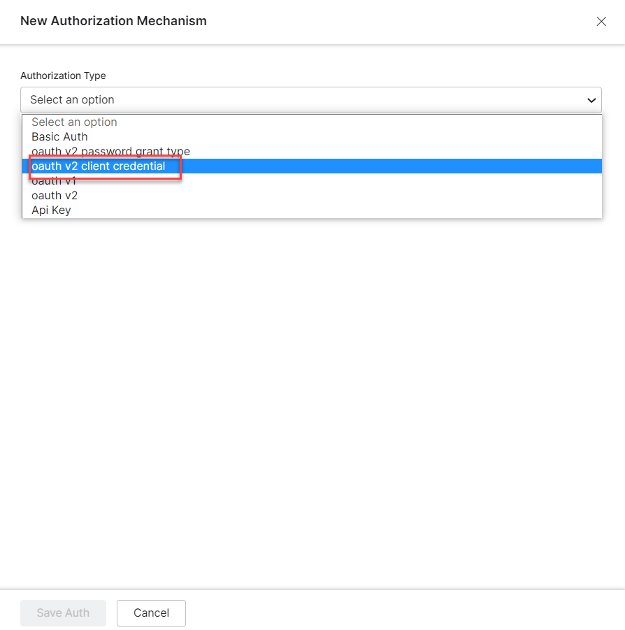

3. Enter the OAuth v2 credentials:
   - Call back URL
   - Identity Provider Name
   - Client ID
   - Client Secret
   - Authorization URL
   - Token Request URL
   - Scope
   - Refresh Token URL

   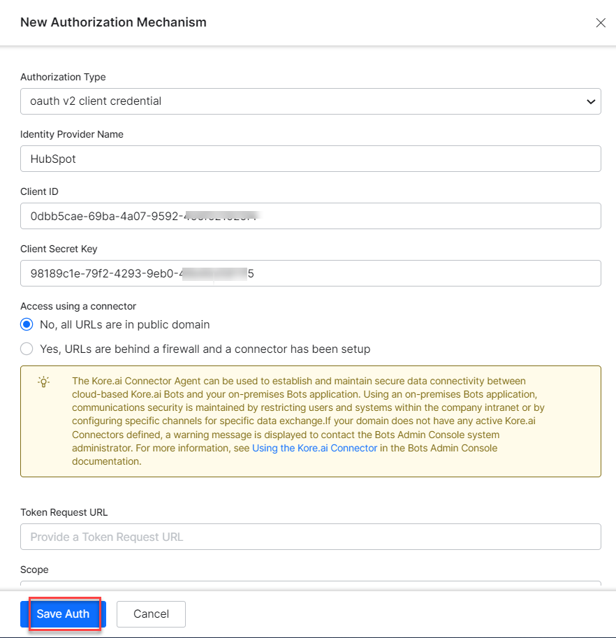

4. Click **Save Auth**, select the new profile, then click **Authorize**.
5. Enter credentials at `login.hubspot.com`.

   

6. Select a HubSpot account, click **Choose Account**, then click **Enable**.

   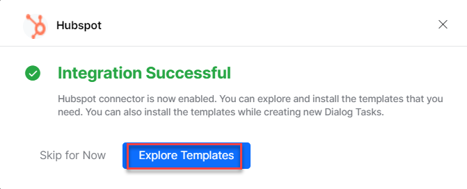

<Note>The HubSpot action moves from _Available_ to _Configured_ after enabling.</Note>

### Allow End User to Authorize

**System Authorization**

1. Go to **App Settings** > **Integrations** > **Actions** and select **HubSpot**.
2. In **Configurations**, select the **Authorization** tab.
3. Set **Authorization Type** to **Allow Users to Authorize the Integration** > **OAuth**.
4. Select the **System** card.
5. Click **Enable**. A link is sent to the end user to authorize integration.

   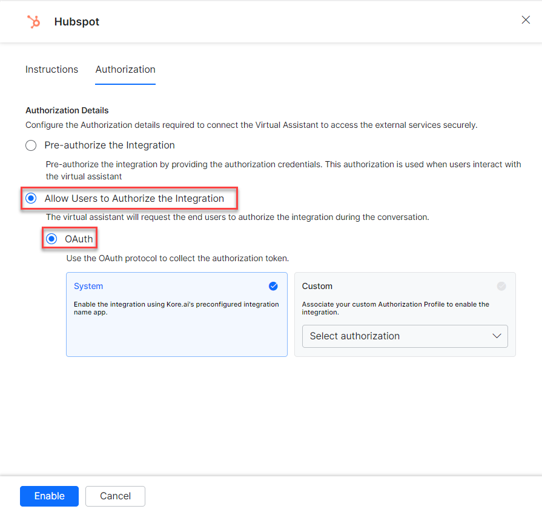

**Custom Authorization**

1. Select **Allow Users to Authorize the Integration** > **OAuth** > **Custom**.
2. Click **Select Authorization** > **Create New** and follow the Custom Authorization steps above.

   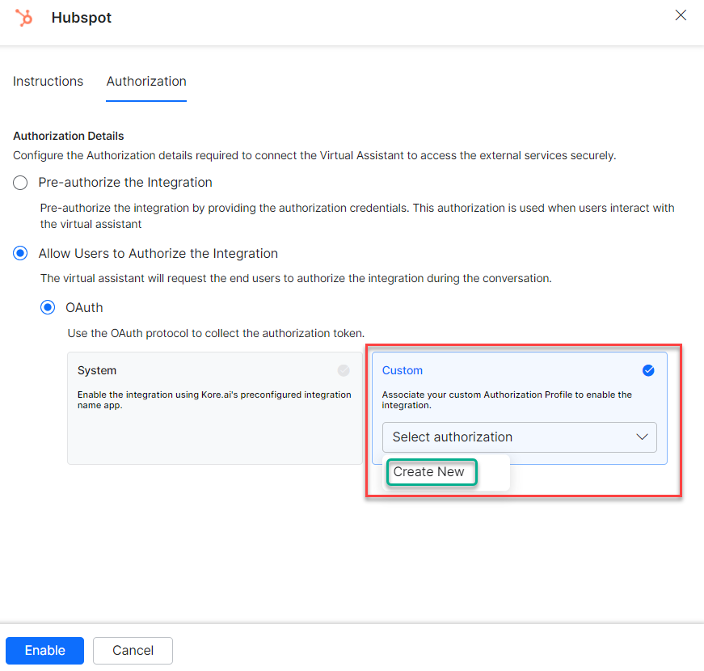

   You can also select an existing profile:

   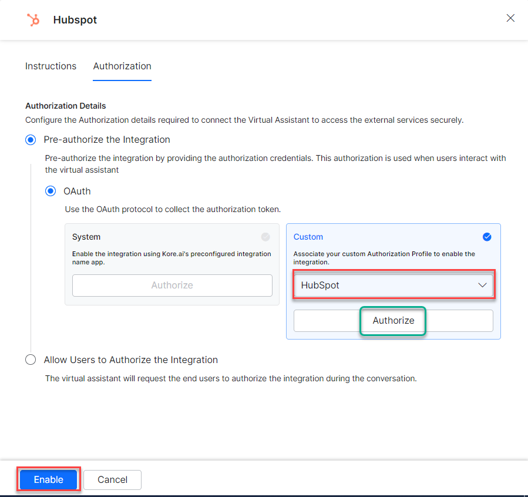

3. Click **Enable**.

---

## Step 2: Install the HubSpot Action Templates

1. On the **Integration Successful** dialog, click **Explore Templates**.

   

2. In the Integration Templates dialog, click **Install**.

   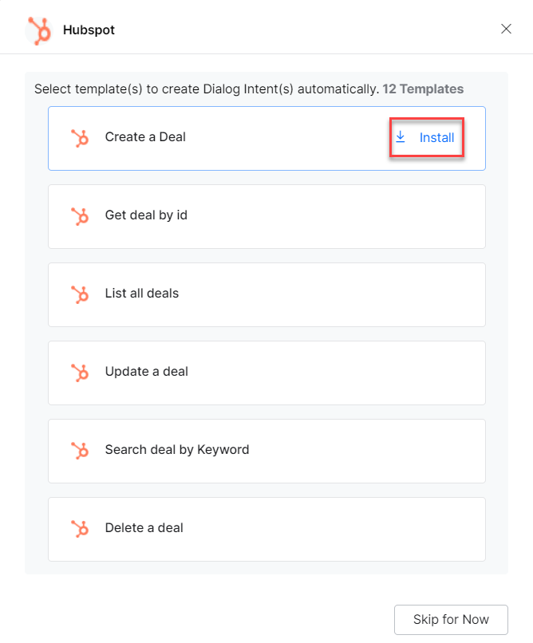

3. Once installed, the associated dialog task is auto-created. Click **Go to Dialog** or go to **Automation AI** > **Use Cases** > **Dialogs**.
4. To use the templates, see [Using HubSpot Templates](using-the-hubspot-action-templates.md).
