Use prebuilt HubSpot action templates to auto-create dialog tasks for managing deals and contacts.

**Prerequisites:** Configure [HubSpot](configuring-the-hubspot-action.md) and [install templates](configuring-the-hubspot-action.md#step-2-install-the-hubspot-action-templates).

To access dialog tasks: Go to **Automation AI** > **Use Cases** > **Dialogs** and click the auto-created dialog. The canvas opens with all required entity nodes, service nodes, and message scripts.

---

## Supported Actions

| Task | Description | Method |
|---|---|---|
| Create a Deal | Creates a new deal. | POST |
| Get Deal by Id | Retrieves deal details. | GET |
| Update a Deal | Updates deal details. | PATCH |
| List all Deals | Retrieves all deals. | GET |
| Search Deal by Keyword | Searches deals by keyword. | GET |
| Delete Deal | Deletes a deal. | DELETE |
| Create a Contact | Creates a new contact. | POST |
| Get Contact by Id | Retrieves contact details. | GET |
| List All Contacts | Retrieves all contacts. | GET |
| Update a Contact | Updates contact details. | PATCH |
| Search Contact by Keyword | Searches contacts by keyword. | GET |
| Delete a Contact | Deletes a contact. | DELETE |

---

### Create a Deal

1. Install the template from [HubSpot Action Templates](configuring-the-hubspot-action.md#step-2-install-the-hubspot-action-templates).
2. The _Create a Deal_ dialog task is added with the following components:

   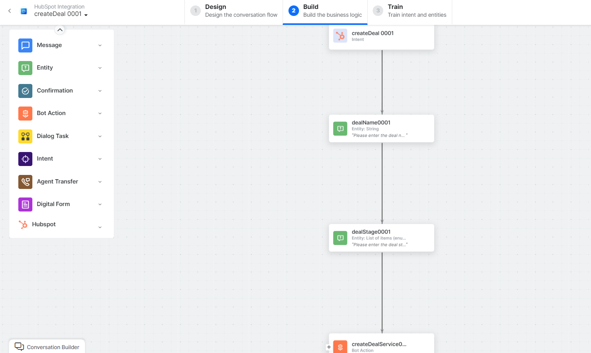

   - **createDeal** – User intent to create a deal.
   - **dealName**, **dealStage** – Entity nodes for deal details.
   - **createDealService** – Bot action service to create a deal. Click **+** to expand and click **Edit Request** to modify parameters.

     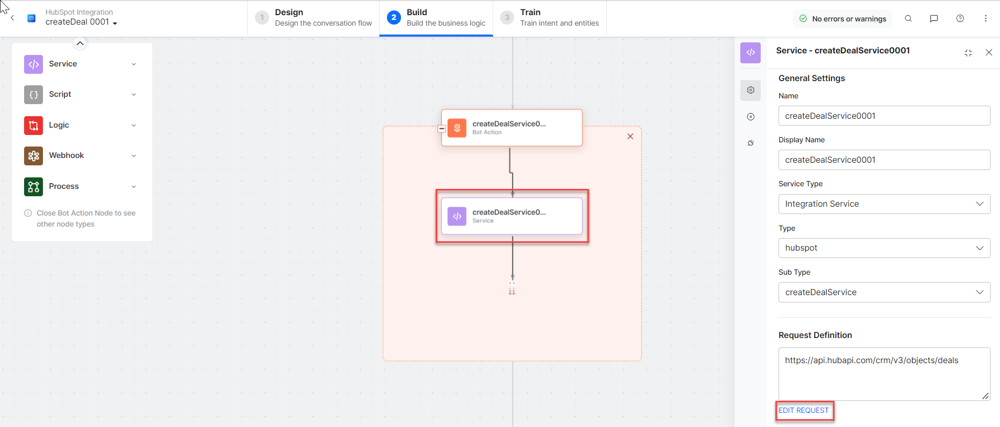

     **Sample Request:**
     ```json
     {
       "properties": {
         "dealname": "Custom data integrations",
         "dealstage": "presentationscheduled",
         "pipeline": "default"
       }
     }
     ```

     Click **+Add Response** to add responses:

     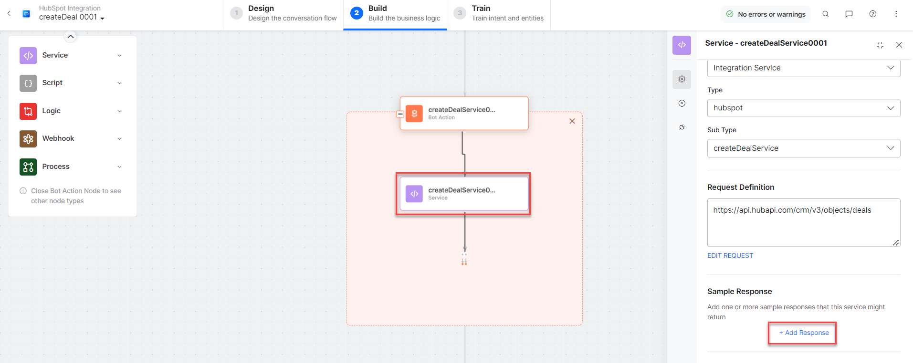

     **Sample Response:**
     ```json
     {
       "id": "10146264661",
       "properties": {
         "createdate": "2022-09-11T10:06:55.570Z",
         "dealname": "Integrations",
         "dealstage": "presentationscheduled",
         "pipeline": "default"
       },
       "createdAt": "2022-09-11T10:06:55.570Z",
       "updatedAt": "2022-09-11T10:06:55.570Z",
       "archived": false
     }
     ```

   - **getAccountService** – Bot action service to get account details.

     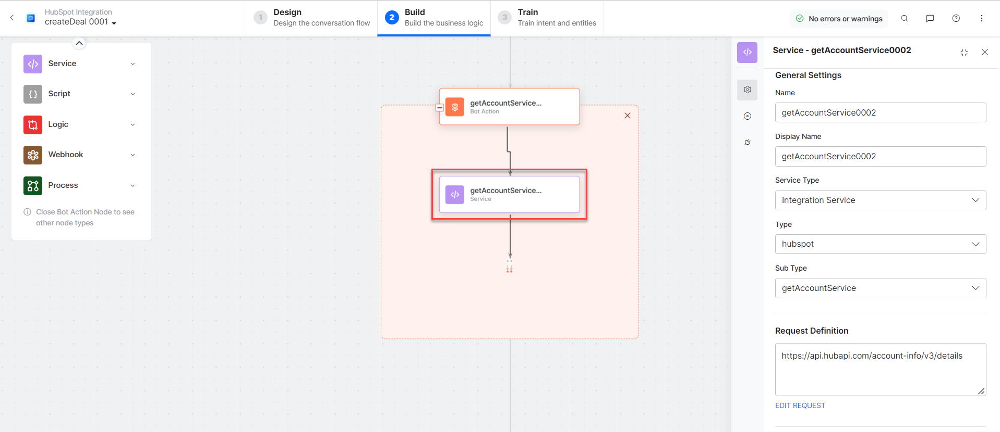

   - **createDealMessage** – Message node to display responses.

3. Click **Train** to complete dialog task training.
4. Click **Talk to Bot** to test and debug.
5. Follow prompts to create a deal:

   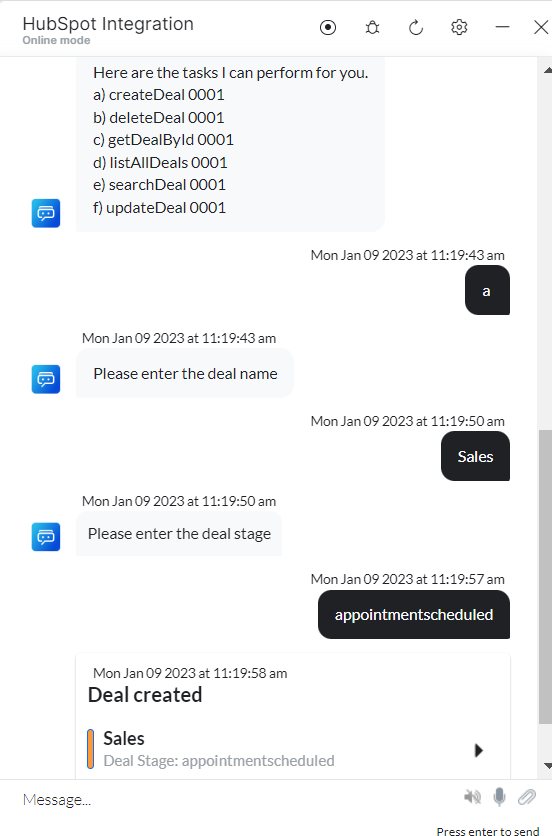

6. The new deal is created in HubSpot:

   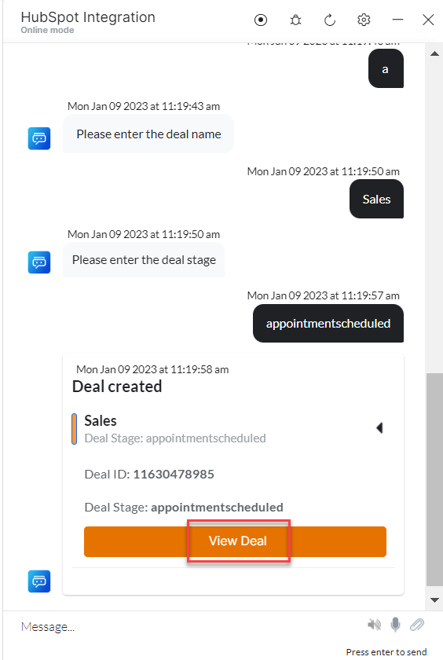

7. Click **View Deal** to see deal details in HubSpot:

   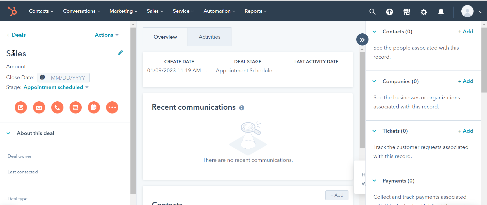

---

### Get a Deal by ID

1. Install the template from [HubSpot Action Templates](configuring-the-hubspot-action.md#step-2-install-the-hubspot-action-templates).
2. The _Get Deal by Id_ dialog task is added with the following components:

   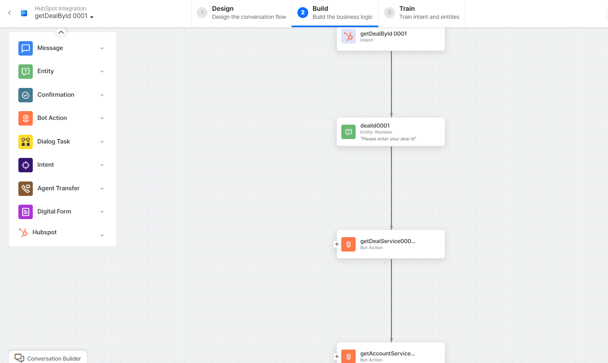

   - **getDeal by Id** – User intent to get a deal by ID.
   - **dealID** – Entity node for entering the deal ID.
   - **getDealService** – Bot action service to fetch deal. Click **+Add Response**:

     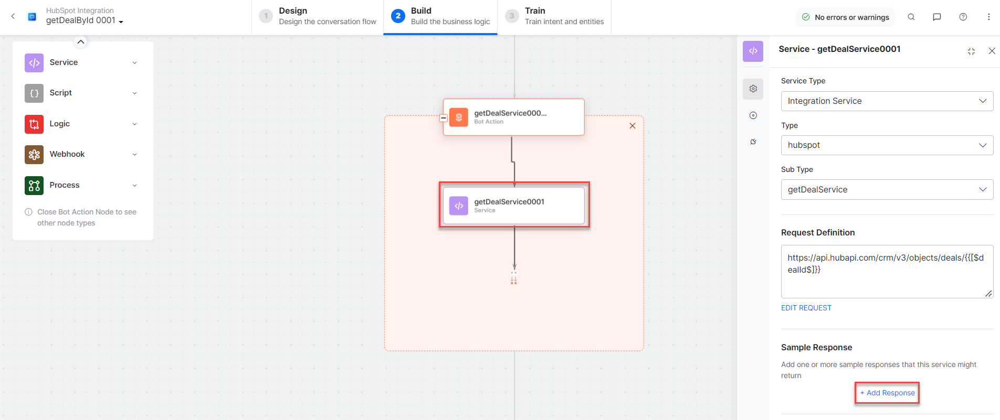

     **Sample Response:**
     ```json
     {
       "id": "10099894869",
       "properties": {
         "dealname": "Nike deal",
         "dealstage": "appointmentscheduled",
         "pipeline": "default"
       },
       "createdAt": "2022-09-07T13:52:04.184Z",
       "updatedAt": "2022-09-10T14:13:05.712Z",
       "archived": false
     }
     ```

   - **getAccountService** – Bot action service to get account details.
   - **getDealMessage** – Message node to display responses.

3. Click **Train**, then **Talk to Bot** to test:

   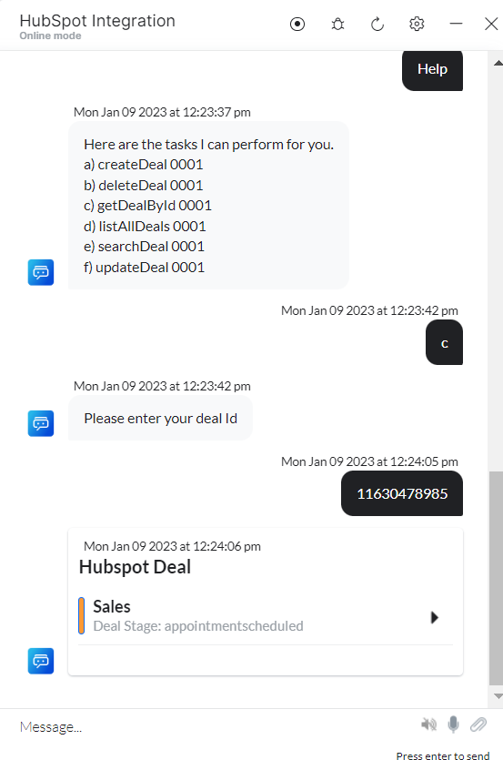

4. Click **View Deal** to see deal details.

---

### List All Deals

1. Install the template from [HubSpot Action Templates](configuring-the-hubspot-action.md#step-2-install-the-hubspot-action-templates).
2. The _List All Deals_ dialog task is added with the following components:

   

   - **List All Deals** – User intent to list all deals.
   - **listAllDealsService** – Bot action script to view all deals. Click **+Add Response**:

     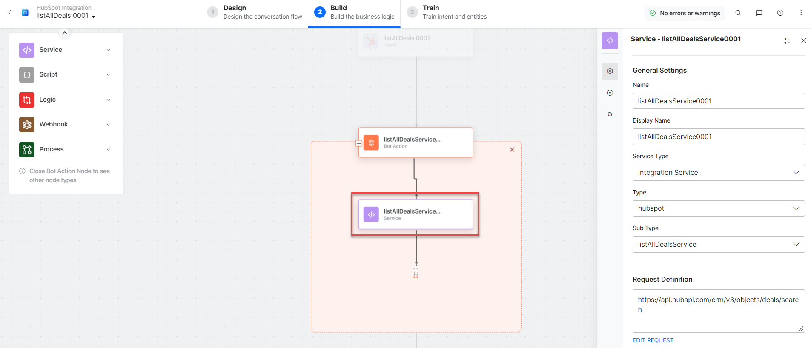

     **Sample Response:** (truncated for brevity)
     ```json
     {
       "total": 7,
       "results": [
         {
           "id": "10274255383",
           "properties": {
             "dealname": "Adidas deal",
             "dealstage": "qualifiedtobuy",
             "pipeline": "default"
           },
           "createdAt": "2022-09-22T07:23:17.500Z",
           "archived": false
         }
       ]
     }
     ```

   - **getAccountService** – Bot action service to get account details.
   - **listAllDealsMessage** – Message node to display responses.

3. Click **Train**, then **Talk to Bot** to test and follow prompts.

---

### Update a Deal

1. Install the template from [HubSpot Action Templates](configuring-the-hubspot-action.md#step-2-install-the-hubspot-action-templates).
2. The _Update a Deal_ dialog task is added with the following components:

   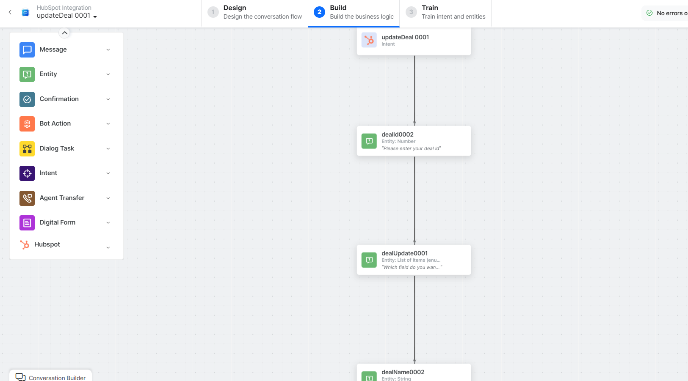

   - **Update a Deal** – User intent to update a deal.
   - **dealId**, **dealUpdate**, **dealName**, **dealStage** – Entity nodes for updating deal details.
   - **updateDealScript** – Bot action script to update a deal.
   - **updateDealService** – Bot action service to update a deal:

     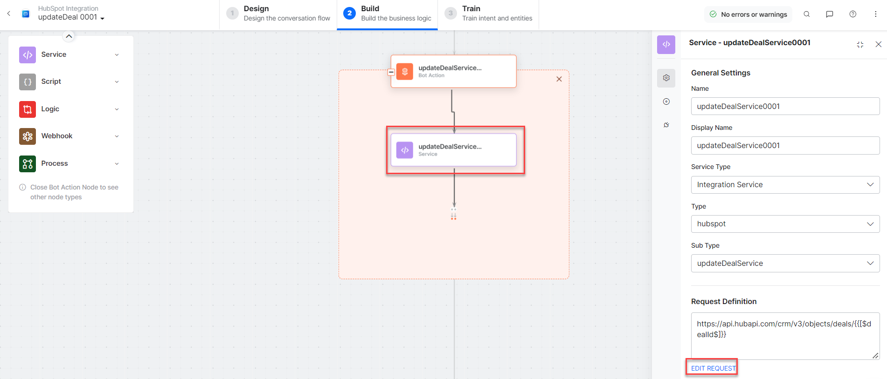

     **Sample Request:**
     ```json
     {
       "properties": {
         "dealname": "Adidas Deal",
         "dealstage": "closedwon"
       }
     }
     ```

     Click **+Add Response**:

     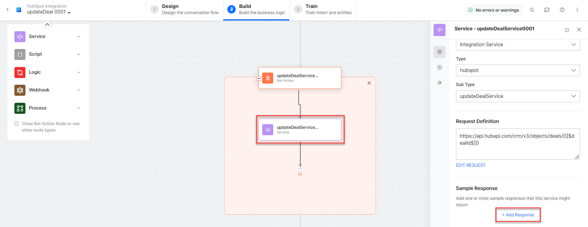

     **Sample Response:**
     ```json
     {
       "id": "10123889765",
       "properties": {
         "dealname": "Adidas Deal",
         "dealstage": "closedwon",
         "pipeline": "default"
       },
       "createdAt": "2022-09-09T06:45:26.228Z",
       "updatedAt": "2022-09-11T10:54:30.961Z",
       "archived": false
     }
     ```

   - **getAccountService**, **getDealService** – Bot action services.
   - **updateDealMessage** – Message node to display responses.

3. Click **Train**, then **Talk to Bot** to test:

   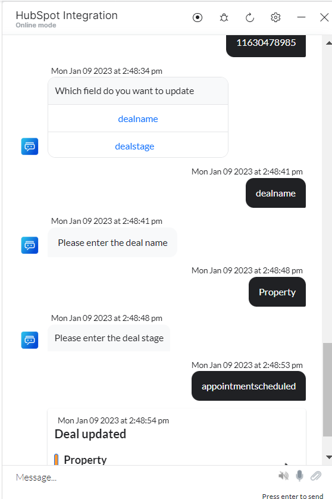

4. Enter all deal details when prompted. The deal is updated in HubSpot:

   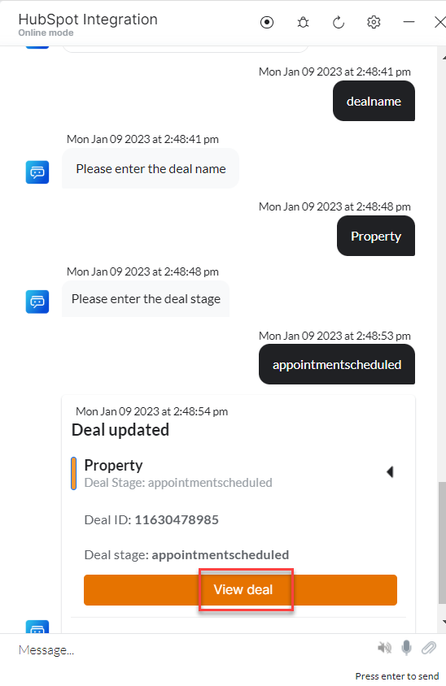

5. Click **View Deal** to see updated details.

---

### Search Deal by Keyword

1. Install the template from [HubSpot Action Templates](configuring-the-hubspot-action.md#step-2-install-the-hubspot-action-templates).
2. The _Search Deal by Keyword_ dialog task is added with the following components:

   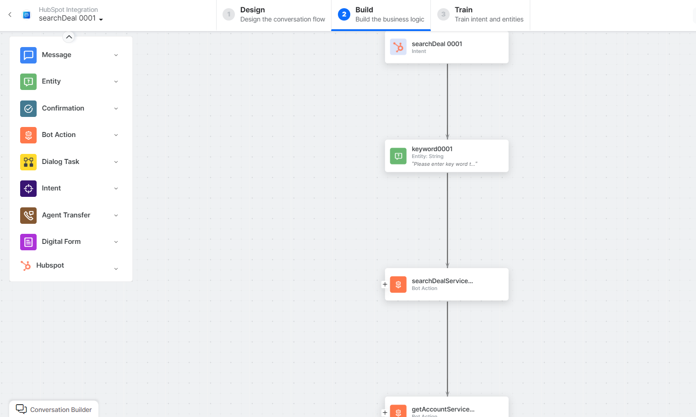

   - **Search Deal** – User intent to search a deal.
   - **Keyword** – Entity node for search keywords.
   - **searchDealService** – Bot action script to search deals:

     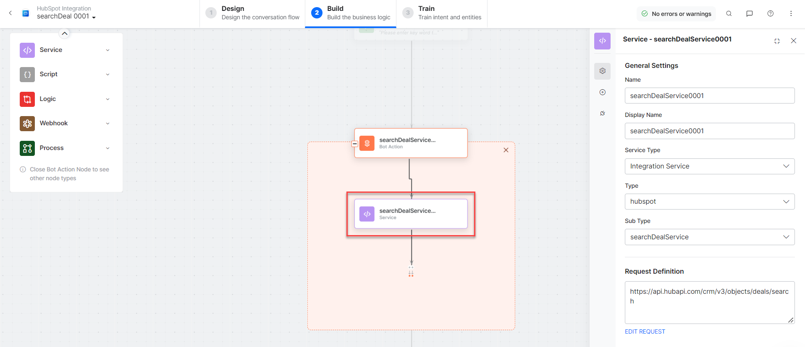

     **Sample Request:**
     ```json
     {
       "sorts": [{"propertyName": "createdate", "direction": "DESCENDING"}],
       "query": "abac"
     }
     ```

     **Sample Response:** (truncated)
     ```json
     {
       "total": 3,
       "results": [
         {
           "id": "10274255383",
           "properties": {
             "dealname": "Adidas deal",
             "dealstage": "qualifiedtobuy"
           },
           "archived": false
         }
       ]
     }
     ```

   - **getAccountService** – Bot action service to get account details.
   - **searchDealMessage** – Message node to display responses.

3. Click **Train**, then **Talk to Bot** to test:

   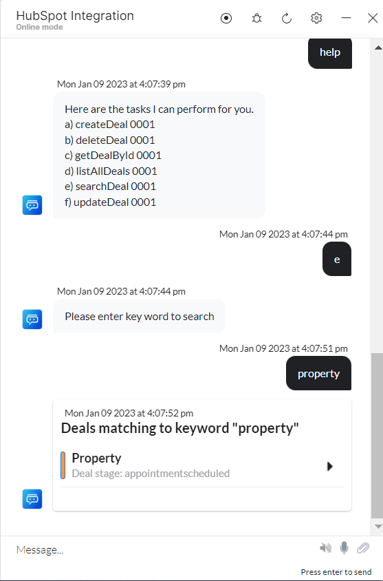

---

### Delete a Deal

1. Install the template from [HubSpot Action Templates](configuring-the-hubspot-action.md#step-2-install-the-hubspot-action-templates).
2. The _Delete Deal_ dialog task is added with the following components:

   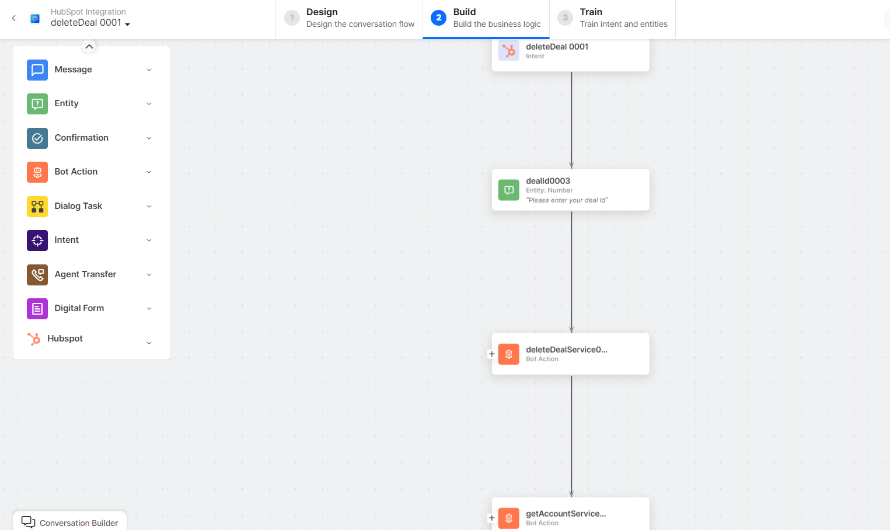

   - **Delete Deal** – User intent to delete a deal.
   - **DealId** – Entity node for the deal ID.
   - **deleteDealService** – Bot action script to delete a deal:

     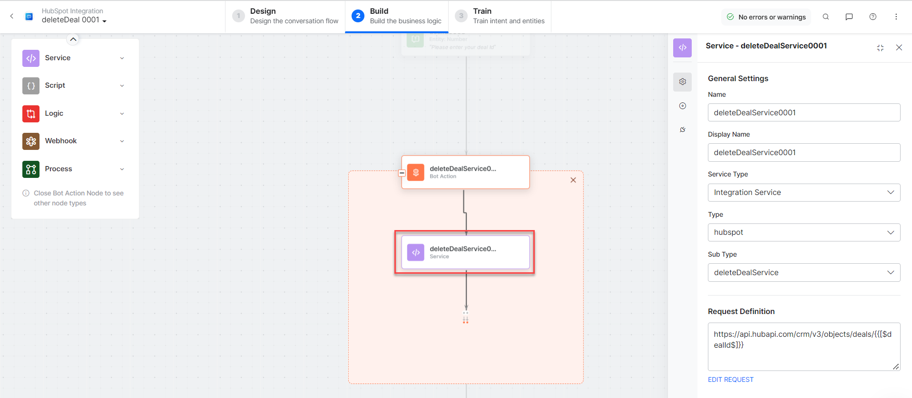

   - **getAccountService** – Bot action service to get account details.
   - **deleteDealMessage** – Message node to display responses.

3. Click **Train**, then **Talk to Bot** to test:

   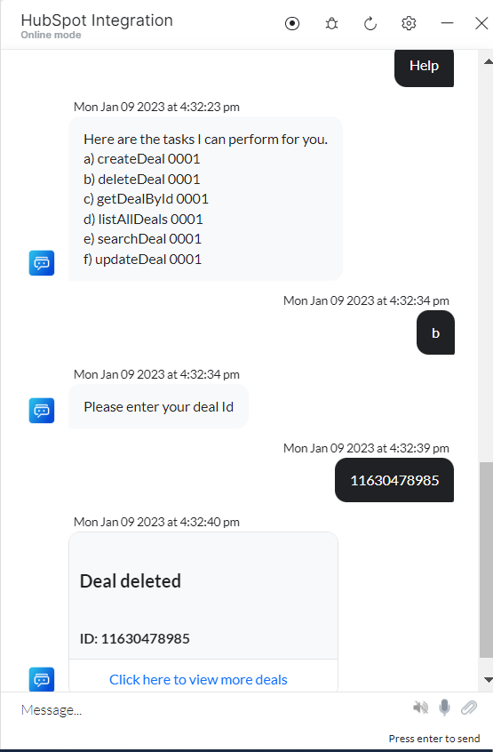

<Note>If you enter an incorrect ID, a _404 – No Record Found_ error is displayed.</Note>

---

### Create a Contact

1. Install the template from [HubSpot Action Templates](configuring-the-hubspot-action.md#step-2-install-the-hubspot-action-templates).
2. The _Create a Contact_ dialog task is added with the following components:

   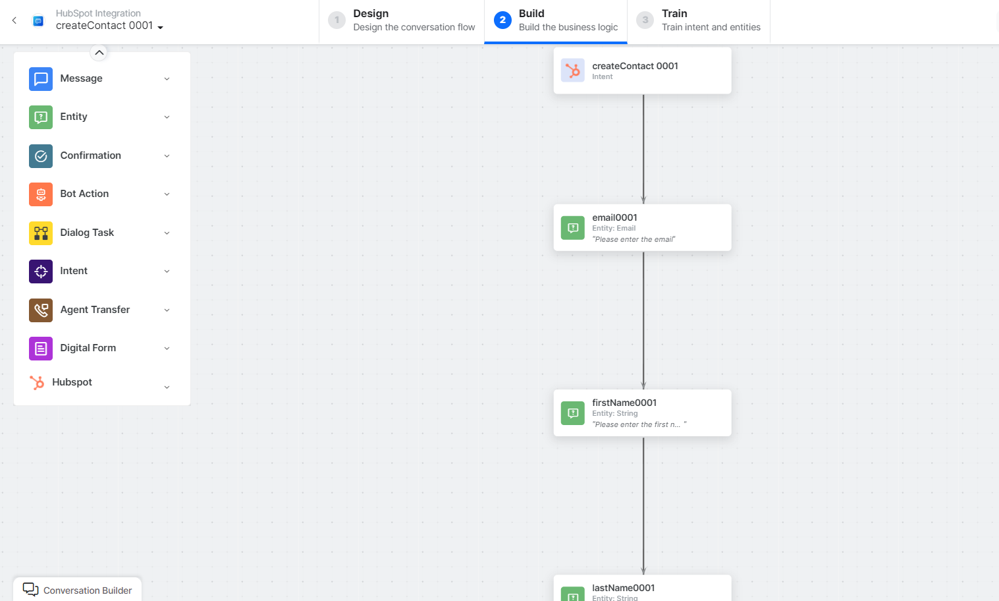

   - **createContact** – User intent to create a contact.
   - **Email**, **firstName**, **lastName**, **phone** – Entity nodes for contact details.
   - **createContactService** – Bot action service to create a contact. Click **Edit Request**:

     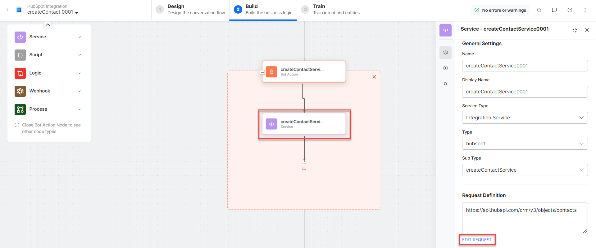

     **Sample Request:**
     ```json
     {
       "properties": {
         "email": "harry@abac.com",
         "firstname": "Harry",
         "lastname": "Anthony",
         "phone": "(877) 829-06966777"
       }
     }
     ```

     Click **+Add Response**:

     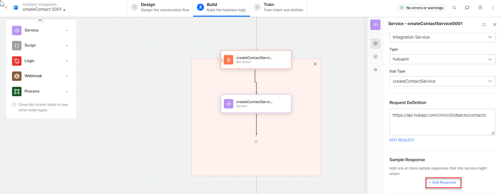

     **Sample Response:**
     ```json
     {
       "id": "1201",
       "properties": {
         "email": "harry.anthony@abac.com",
         "firstname": "harry",
         "lastname": "anthony",
         "lifecyclestage": "lead"
       },
       "createdAt": "2022-09-21T05:54:29.872Z",
       "archived": false
     }
     ```

   - **getAccountService** – Bot action service to get account details.
   - **createContactMessage** – Message node to display responses.

3. Click **Train**, then **Talk to Bot** to test.

---

### Get a Contact by ID

1. Install the template from [HubSpot Action Templates](configuring-the-hubspot-action.md#step-2-install-the-hubspot-action-templates).
2. The _Get Contact by Id_ dialog task is added with the following components:
   - **getContact by Id** – User intent to get a contact by ID.
   - **contactID** – Entity node for the contact ID.
   - **getContactService** – Bot action service to fetch contact. Click **Edit Request**:

     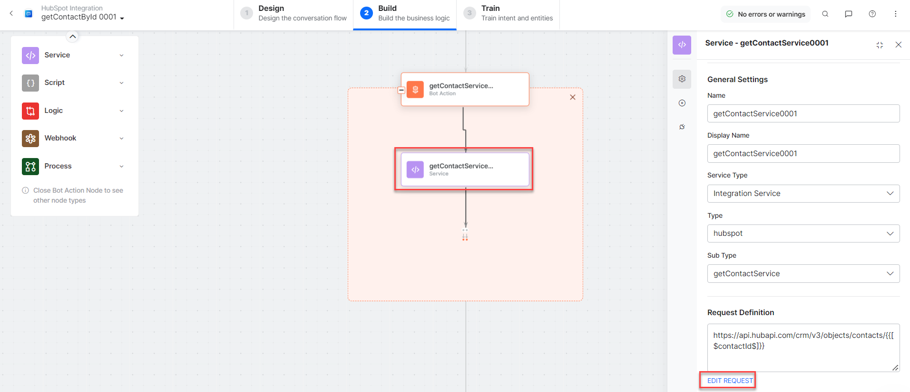

   - Click **+Add Response**:

     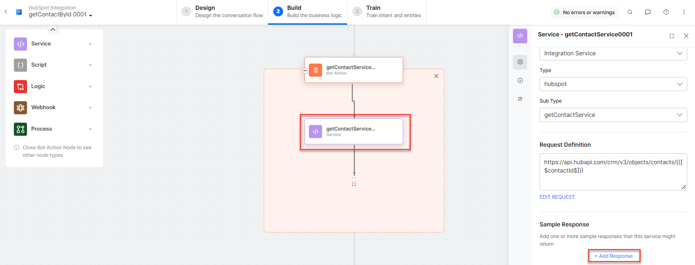

     **Sample Response:**
     ```json
     {
       "id": "1201",
       "properties": {
         "email": "harry.anthony@abac.com",
         "firstname": "harry",
         "lastname": "anthony"
       },
       "createdAt": "2022-09-21T05:54:29.872Z",
       "archived": false
     }
     ```

   - **getAccountService** – Bot action service to get account details.
   - **getContactMessage** – Message node to display responses.

3. Click **Train**, then **Talk to Bot** to test.

---

### List All Contacts

1. Install the template from [HubSpot Action Templates](configuring-the-hubspot-action.md#step-2-install-the-hubspot-action-templates).
2. The _List All Contacts_ dialog task is added with the following components:

   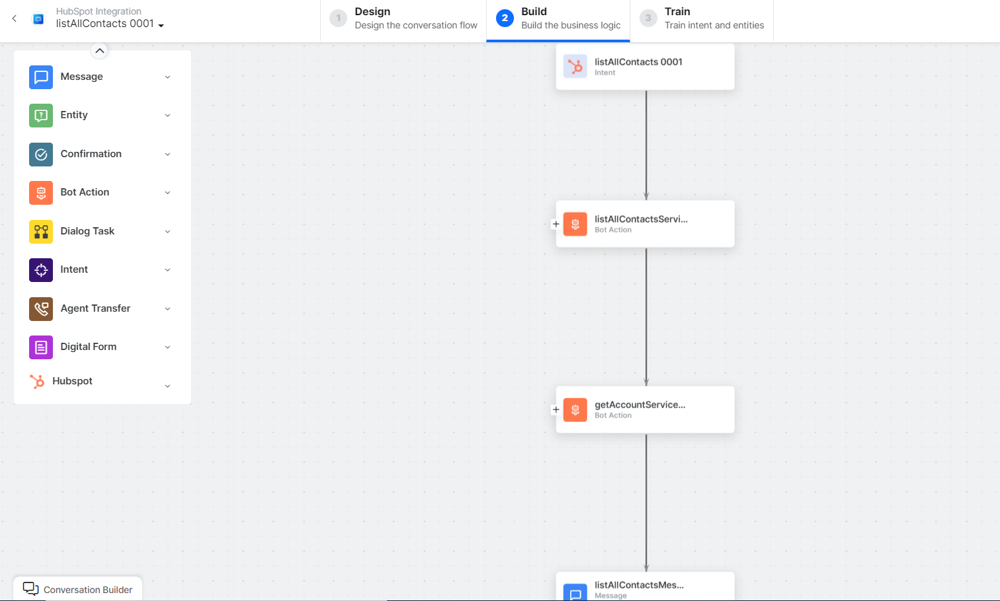

   - **List All Contacts** – User intent to list all contacts.
   - **listAllContactsService** – Bot action script to view all contacts:

     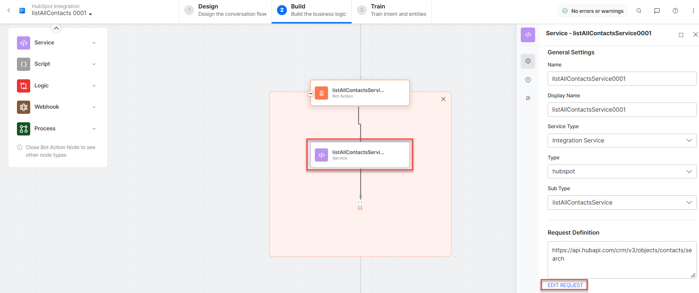

     **Sample Request:**
     ```json
     {
       "sorts": [{"propertyName": "createdate", "direction": "DESCENDING"}]
     }
     ```

     Click **+Add Response**:

     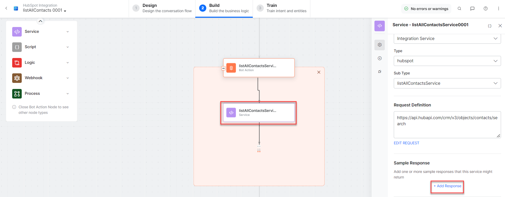

     **Sample Response:** (truncated)
     ```json
     {
       "total": 6,
       "results": [
         {
           "id": "1401",
           "properties": {
             "email": "getkgw@zomato.com",
             "firstname": "John",
             "lastname": "Doe"
           },
           "archived": false
         }
       ]
     }
     ```

   - **getAccountService** – Bot action service to get account details.
   - **listAllContactsMessage** – Message node to display responses.

3. Click **Train**, then **Talk to Bot** to test.

---

### Update a Contact

1. Install the template from [HubSpot Action Templates](configuring-the-hubspot-action.md#step-2-install-the-hubspot-action-templates).
2. The _Update a Contact_ dialog task is added with the following components:

   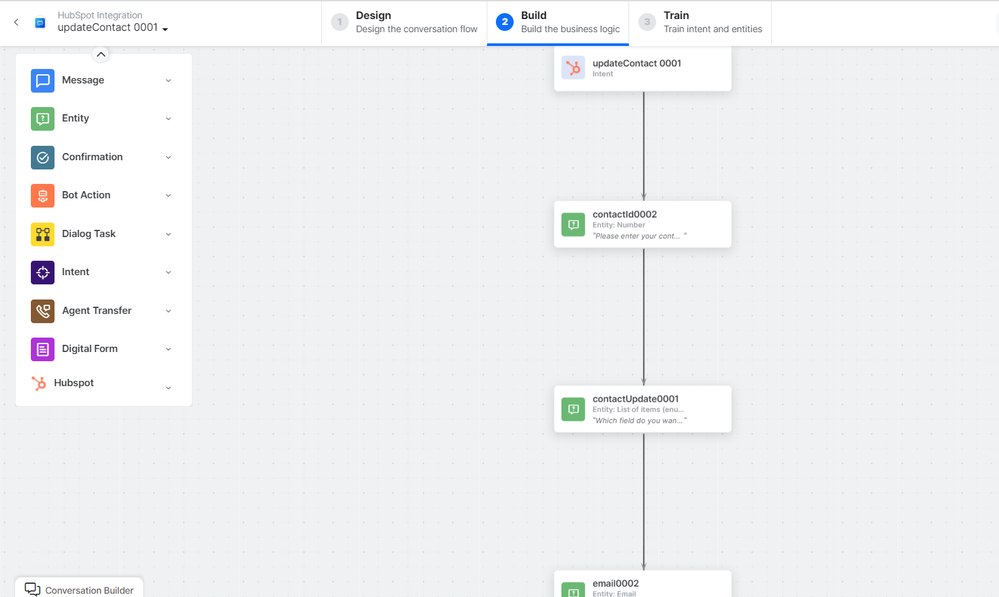

   - **UpdateContact** – User intent to update a contact.
   - **contactId**, **contactUpdate**, **email**, **firstName**, **lastName**, **phone** – Entity nodes.
   - **updateContactScript** – Bot action script to update contact.
   - **updateContactService** – Bot action service to update contact:

     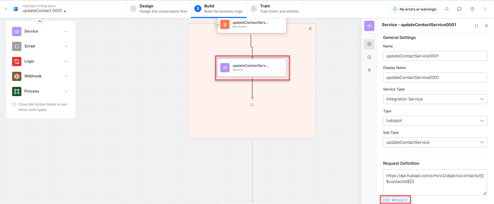

     **Sample Request:**
     ```json
     {
       "properties": {
         "email": "harry.anthony@abac.com"
       }
     }
     ```

     Click **+Add Response**:

     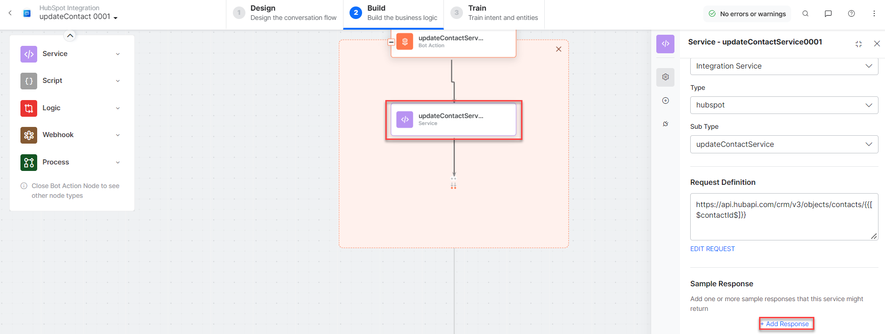

     **Sample Response:**
     ```json
     {
       "id": "1201",
       "properties": {
         "email": "harry.anthony@abac.com",
         "lastmodifieddate": "2022-09-21T06:18:56.655Z"
       },
       "updatedAt": "2022-09-21T06:18:56.655Z",
       "archived": false
     }
     ```

   - **getAccountService**, **getContactService** – Bot action services.
   - **updateContactMessage** – Message node to display responses.

3. Click **Train**, then **Talk to Bot** to test.

---

### Search Contact by Keyword

1. Install the template from [HubSpot Action Templates](configuring-the-hubspot-action.md#step-2-install-the-hubspot-action-templates).
2. The _Search Contact by Keyword_ dialog task is added with the following components:

   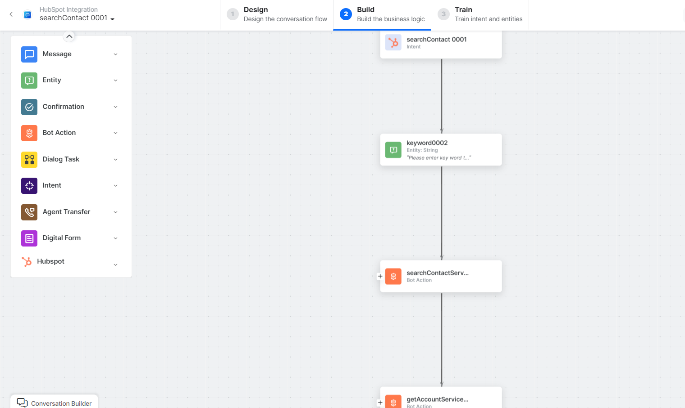

   - **Search Contact** – User intent to search a contact.
   - **Keyword** – Entity node for search keywords.
   - **searchContactService** – Bot action script to search contacts:

     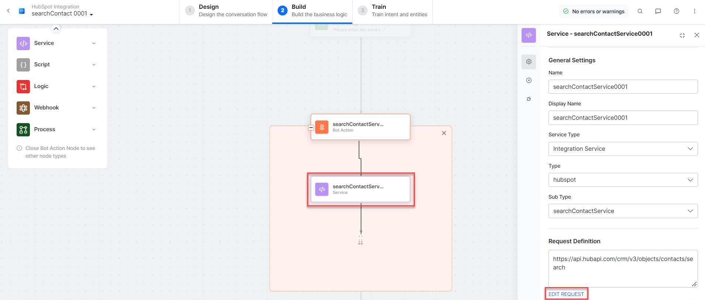

     **Sample Request:**
     ```json
     {
       "sorts": [{"propertyName": "createdate", "direction": "DESCENDING"}],
       "query": "abac"
     }
     ```

     **Sample Response:**
     ```json
     {
       "total": 1,
       "results": [
         {
           "id": "1201",
           "properties": {
             "email": "john.doe@example.com",
             "firstname": "Work",
             "lastname": "Assist"
           },
           "archived": false
         }
       ]
     }
     ```

   - **getAccountService** – Bot action service to get account details.
   - **searchContactMessage** – Message node to display responses.

3. Click **Train**, then **Talk to Bot** to test.

---

### Delete a Contact

1. Install the template from [HubSpot Action Templates](configuring-the-hubspot-action.md#step-2-install-the-hubspot-action-templates).
2. The _Delete Contact_ dialog task is added with the following components:

   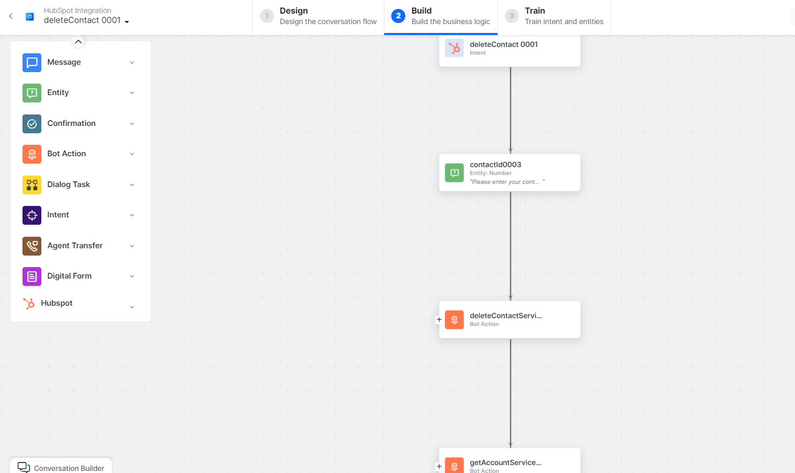

   - **Delete Contact** – User intent to delete a contact.
   - **ContactId** – Entity node for the contact ID.
   - **deleteContactService** – Bot action script to delete a contact:

     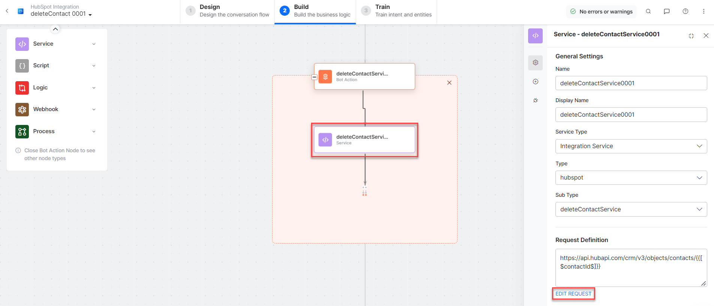

   - **getAccountService** – Bot action service to get account details.
   - **deleteContactMessage** – Message node to display responses.

3. Click **Train**, then **Talk to Bot** to test.

<Note>If you enter an incorrect ID, a _404 – No Record Found_ error is displayed.</Note>
