<Badge icon="arrow-left" color="gray">[Back to Actions Integrations](/ai-for-service/integrations/overview#actions)</Badge>

Use prebuilt JIRA action templates to auto-create dialog tasks for managing issues.

**To access templates:**

1. Go to **Automation AI** > **Use Cases** > **Dialogs** and click **Create a Dialog Task**.
2. Under **Integration**, select **JIRA**.

   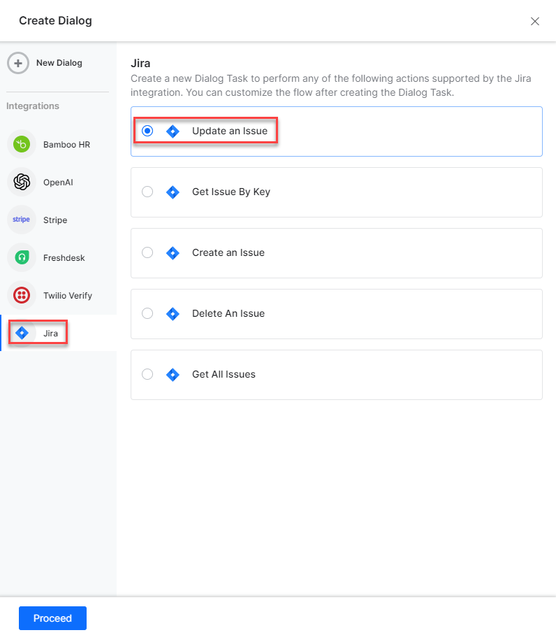

3. If no integration is configured, click **Explore Integrations** to set one up. See [Actions Overview](../actions.md).

   

---

## Supported Actions

| Task | Description | Method |
|---|---|---|
| Create an Issue | Creates an issue in JIRA. | POST |
| Get an Issue by ID | Fetches issue details by ID. | GET |
| Get all issues | Retrieves all issues. | GET |
| Update an Issue | Updates an issue. | PUT |
| Delete an issue | Deletes an issue. | GET |

---

### Create an Issue

1. Install the template from [JIRA Action Templates](configuring-the-jira-action.md#step-2-install-the-jira-action-templates).
2. The _Create an issue_ dialog task is added with the following components:

   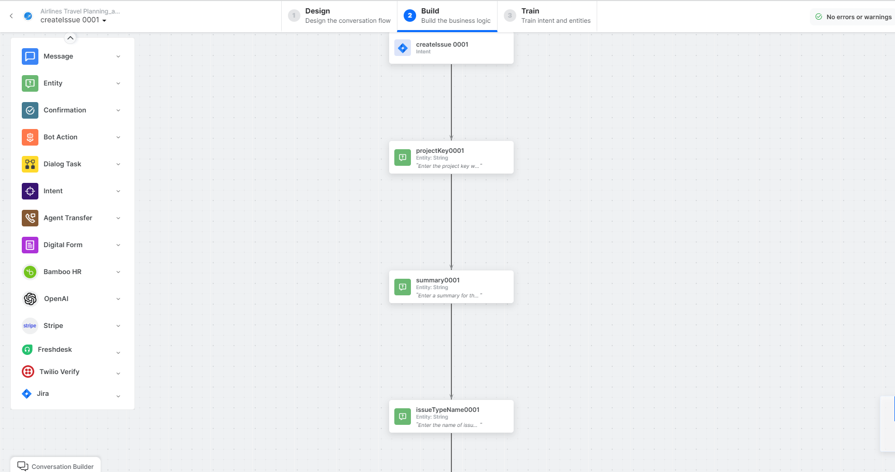

   - **createIssue** - User intent to create an issue.
   - **projectKey**, **summary**, **issueTypeName** - Entity nodes for issue details.
   - **getResourceIdService** - Bot action service to get JIRA site resource ID.
   - **createIssueService** - Bot action service to create an issue. Click **Edit Request**:

     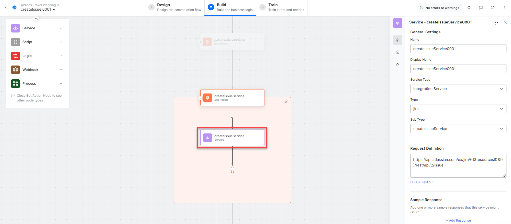

     **Sample Request:**
     ```json
     {
       "fields": {
         "summary": "messaging module is not working",
         "issuetype": {"name": "Bug"},
         "project": {"key": "DFJIIP"}
       }
     }
     ```

     **Sample Response:**
     ```json
     {
       "id": "10000",
       "key": "ED-24",
       "self": "https://your-domain.atlassian.net/rest/api/3/issue/10000"
     }
     ```

   - **createdIssueInfoService** - Bot action service for additional issue details.
   - **createIssueMessage** - Message node to display responses.

3. Click **Train**, then **Talk to Bot** to test:

   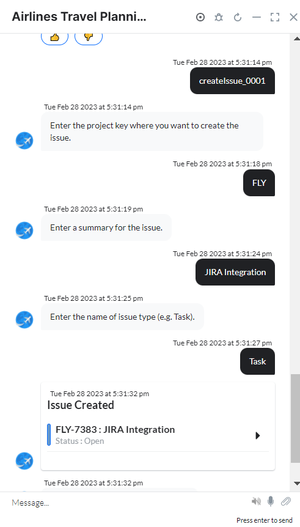

---

### Get an Issue by Key

1. Install the template from [JIRA Action Templates](configuring-the-jira-action.md#step-2-install-the-jira-action-templates).
2. The _Get Issues by Key_ dialog task is added with the following components:

   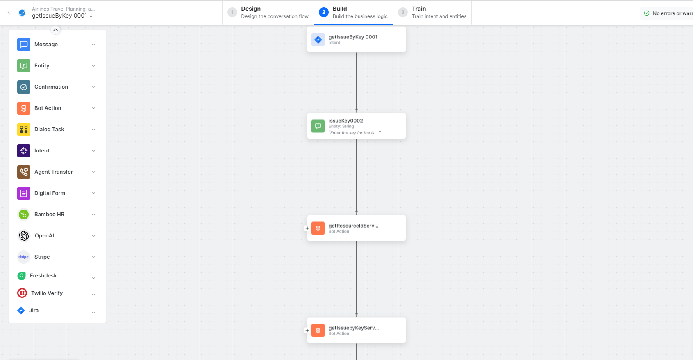

   - **getIssuebyKey** - User intent to find an issue by key.
   - **issueKey** - Entity node for the issue key.
   - **getResourceIdService** - Bot action service to get JIRA site resource ID.
   - **getIssuebyKeyService** - Bot action service to find an issue. Click **+Add Response**:

     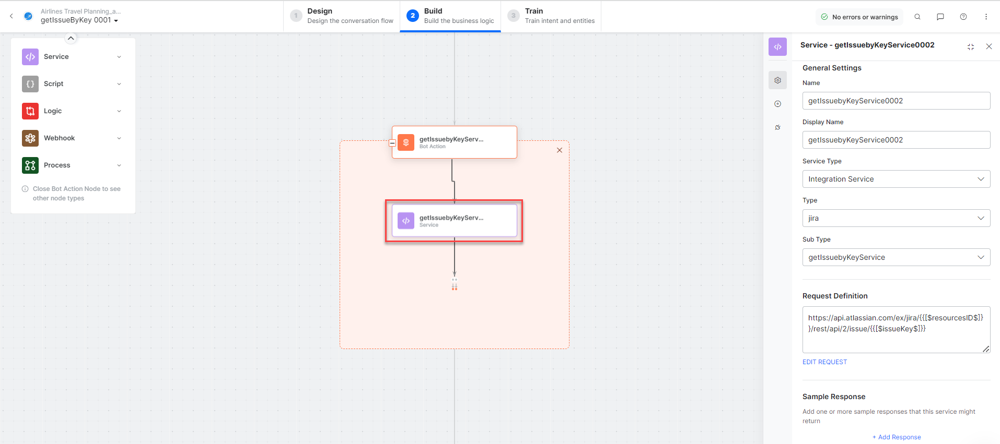

     **Sample Response:** (truncated)
     ```json
     {
       "id": "10002",
       "timetracking": {
         "originalEstimate": "10m",
         "remainingEstimate": "3m",
         "timeSpent": "6m"
       }
     }
     ```

   - **getIssuebyKeyMessage** - Message node to display responses.

3. Click **Train**, then **Talk to Bot** to test:

   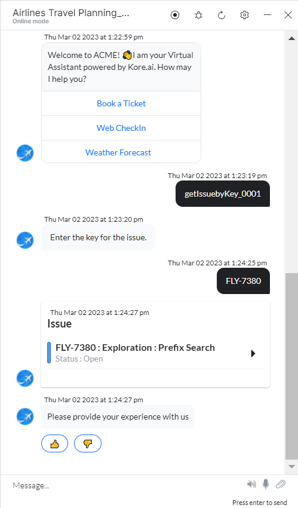

---

### Get All Issues

1. Install the template from [JIRA Action Templates](configuring-the-jira-action.md#step-2-install-the-jira-action-templates).
2. The _Get All Issues_ dialog task is added with the following components:

   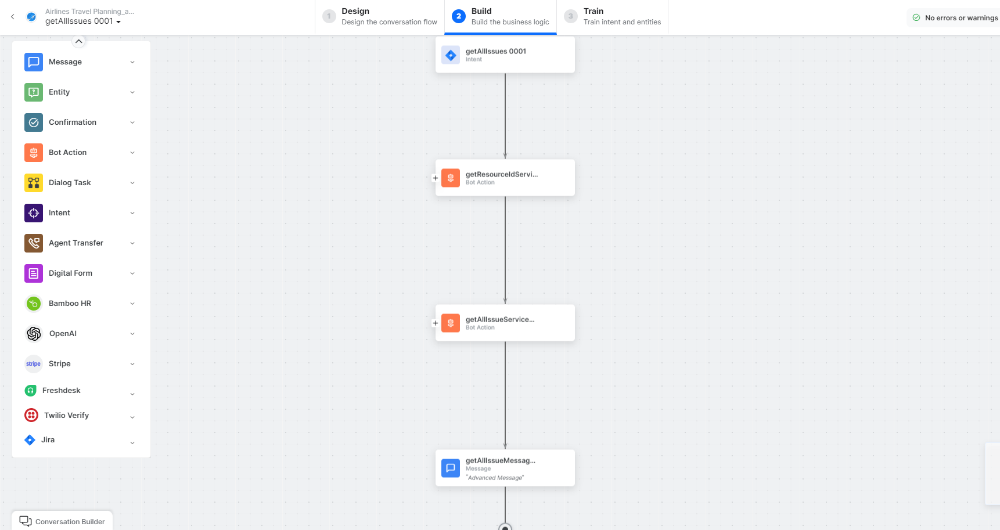

   - **getAllIssues** - User intent to view all issues.
   - **getResourceIdService** - Bot action service to get JIRA site resource ID.
   - **getAllIssuesService** - Bot action service to fetch all issues. Click **+Add Response**:

     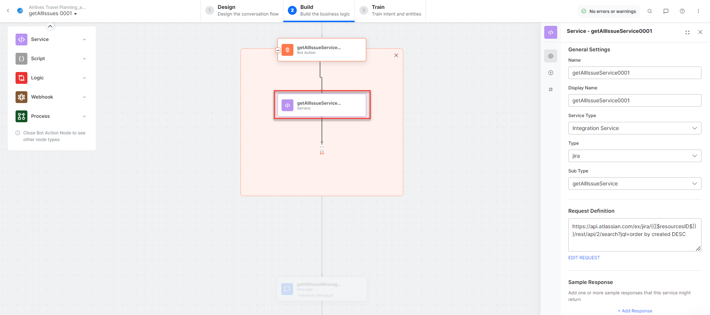

     **Sample Response:** (truncated)
     ```json
     {
       "expand": "names,schema",
       "startAt": 0,
       "maxResults": 50,
       "total": 1,
       "issues": [
         {
           "id": "10002",
           "key": "ED-1"
         }
       ]
     }
     ```

   - **getAllIssuesMessage** - Message node to display responses.

3. Click **Train**, then **Talk to Bot** to test:

   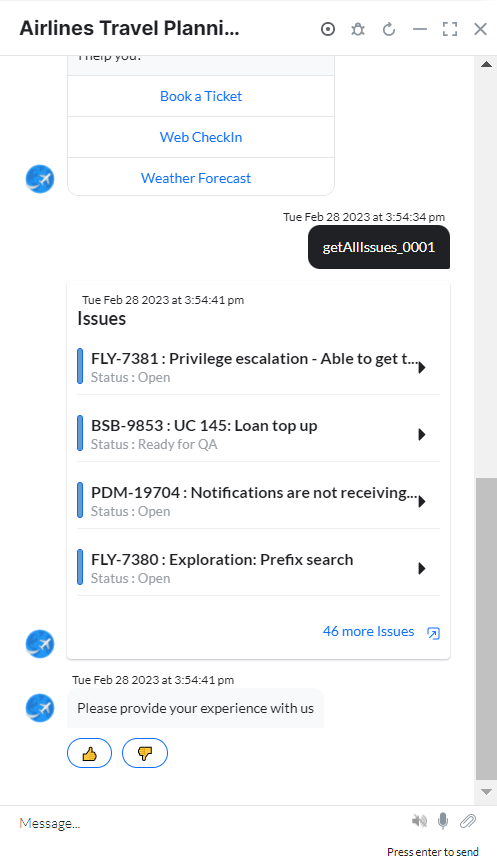

---

### Update an Issue

1. Install the template from [JIRA Action Templates](configuring-the-jira-action.md#step-2-install-the-jira-action-templates).
2. The _Update an Issue_ dialog task is added with the following components:

   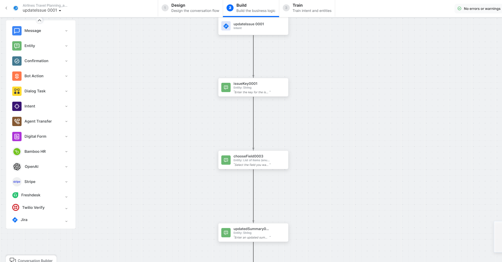

   - **updateIssue** - User intent to update an issue.
   - **issueKey**, **chooseField**, **updatedSummary**, **newLabel** - Entity nodes for update details.
   - **prepareUpdateIssuePayloadScript** - Bot action script to prepare update payload:

     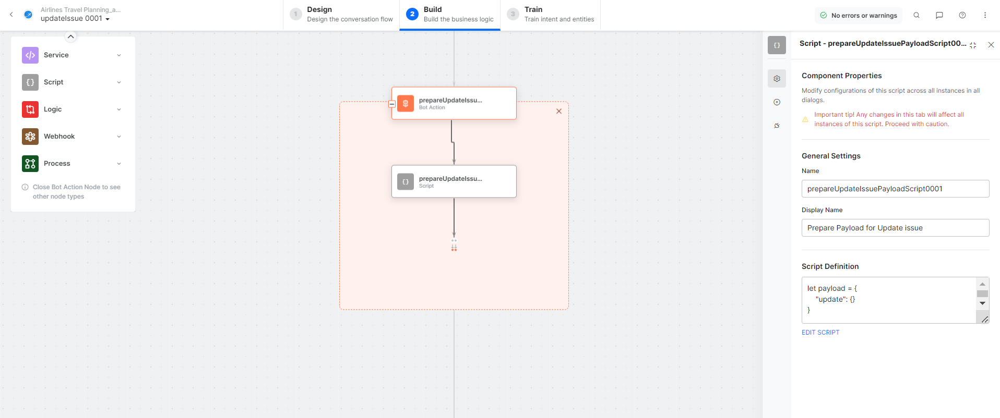

   - **getResourceIdService** - Bot action service to get JIRA site resource ID.
   - **updateIssueService** - Bot action service to update an issue. Click **Edit Request**:

     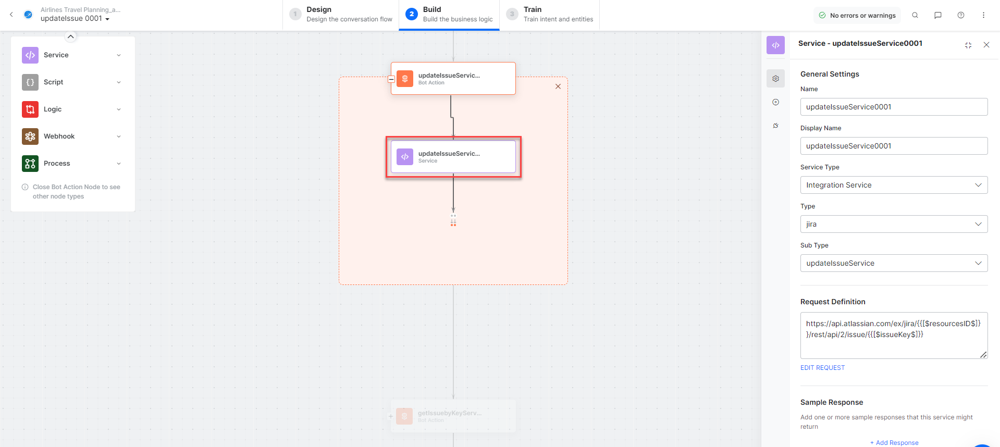

     **Sample Request:**
     ```json
     {
       "update": {
         "summary": [{"set": "The updated summary"}],
         "labels": {"add": "Label_to_add_without_space"}
       }
     }
     ```

   - **getIssuebyKeyService** - Bot action service for issue details.
   - **updateIssueMessage** - Message node to display responses.

3. Click **Train**, then **Talk to Bot** to test:

   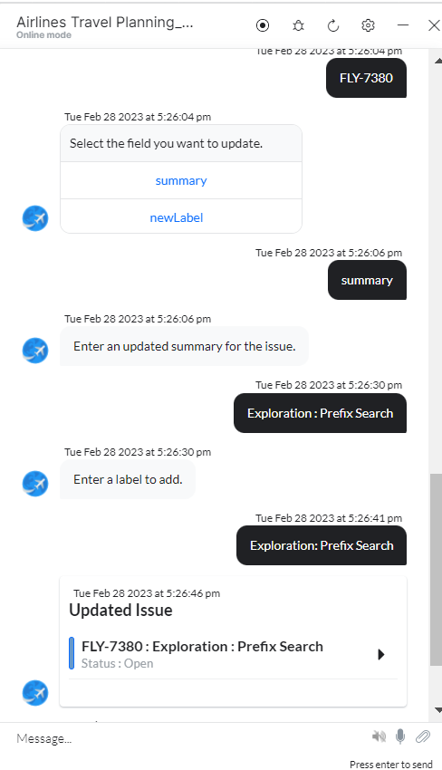

---

### Delete an Issue

<Note>You can delete an issue only if the JIRA admin or project owner grants you delete permission.</Note>

1. Install the template from [JIRA Action Templates](configuring-the-jira-action.md#step-2-install-the-jira-action-templates).
2. The _Delete an Issue_ dialog task is added with the following components:

   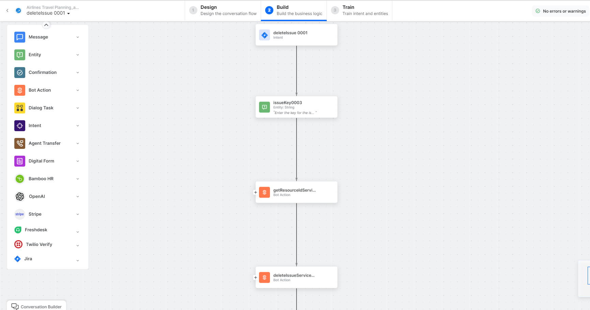

   - **deleteIssue** - User intent to delete an issue.
   - **issueKey** - Entity node for the issue key.
   - **getResourceIdService** - Bot action service to get JIRA site resource ID.
   - **deleteIssueService** - Bot action service to delete an issue. Click **Edit Request**:

     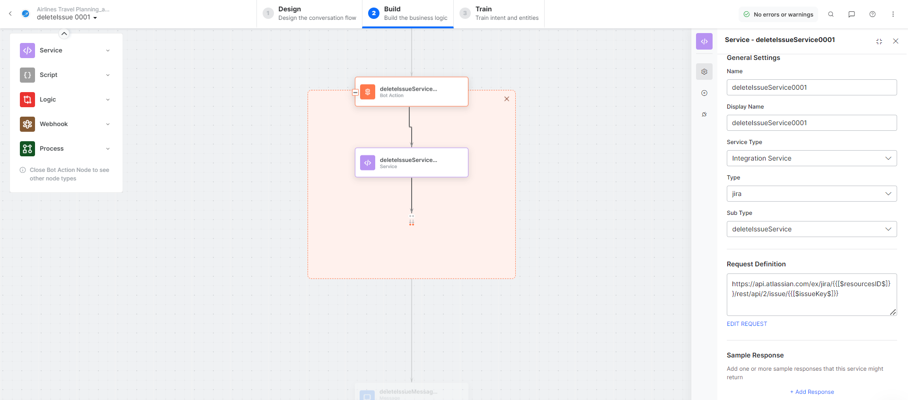

   - **deleteIssueMessage** - Message node to display responses.

3. Click **Train**, then **Talk to Bot** and follow prompts to delete an issue.
