Connect Microsoft Graph to create, view, and update events and to-do lists, and send emails. See [Microsoft Graph](https://azure.microsoft.com/en-us/get-started/azure-portal) for more information.

---

## Authorizations Supported

The XO Platform supports basic authentication for Microsoft Graph. See [App Authorization Overview](../../../dev-tools/bot-authorization/bot-authentication.md) for details.

<Note>Microsoft Graph integration can only be authorized for Developer and Enterprise editions — not Trial. See [Microsoft Graph documentation](https://developer.microsoft.com/en-us/graph/graph-explorer) for account types.</Note>

| Authorization Type | Basic OAuth |
|---|---|
| Pre-authorize the Integration | Yes |
| Allow Users to Authorize the Integration | Yes |

---

## Step 1: Enable the Microsoft Graph Action

**Prerequisites:**

- Create a developer account in Microsoft Graph. See [Microsoft Graph Documentation](https://developer.microsoft.com/en-us/graph/graph-explorer).
- Copy the Client ID, Client Secret Key, Authorization URL, and Callback URL.

**Steps:**

1. Go to **App Settings** > **Integrations** > **Actions**.
2. In the **Available** region, select **Microsoft Graph**.

### Pre-authorize the Integration

**System Authorization**

1. Go to **App Settings** > **Integrations** > **Actions** and select **Microsoft Graph**.
2. In **Configurations**, select the **Authorization** tab.
3. Set **Authorization Type** to **Pre-authorize the Integration** > **OAuth**.

   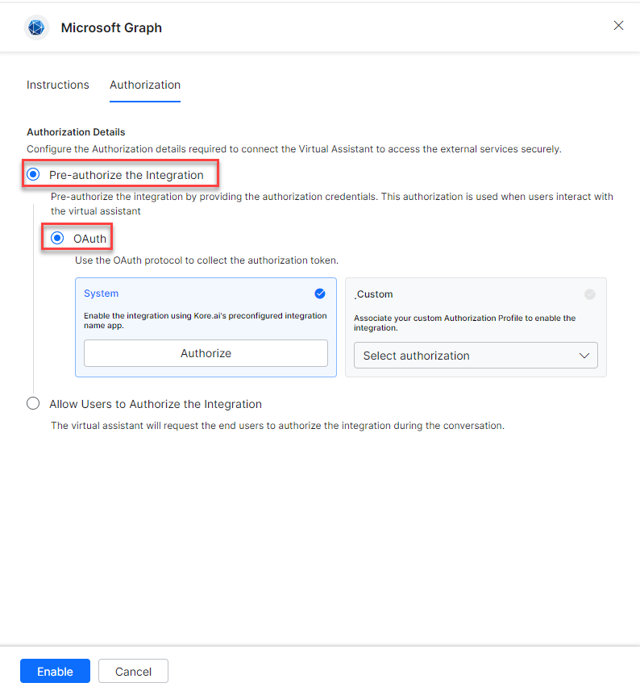

4. Select the **System** card and click **Authorize**.

   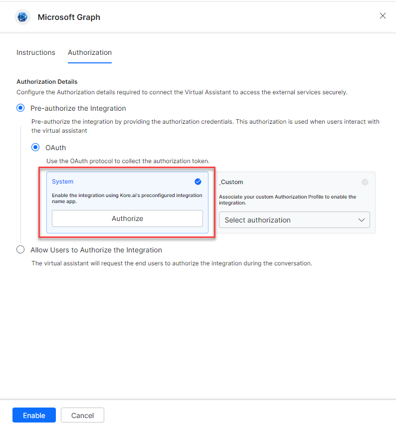

5. You are redirected to `https://login.microsoftonline.com/`. Enter your credentials and click **Allow Access**.

**Custom Authorization**

1. Select **Custom** and click **Select Authorization** > **Create New**.

   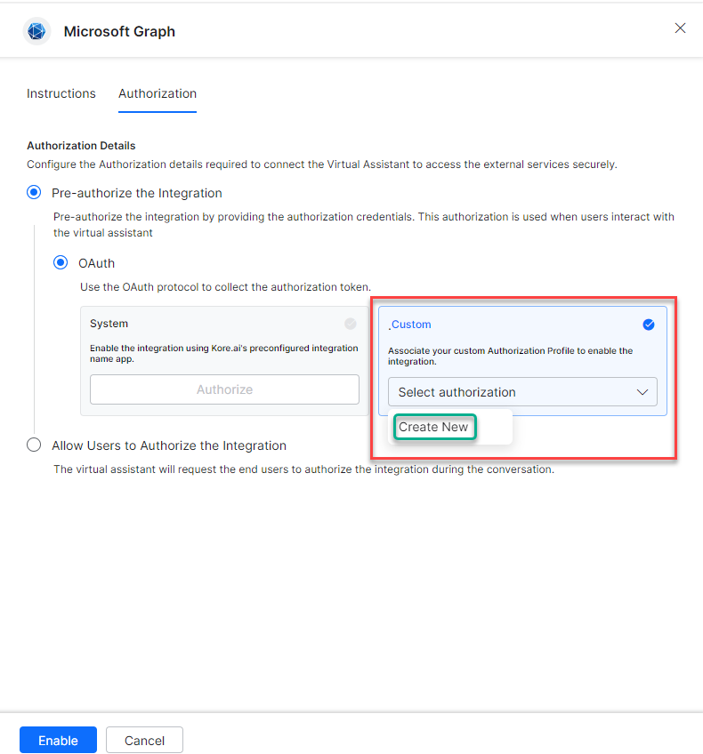

2. Select **OAuth v2**. See [Setting Up Authorization Using OAuth v2](../../../dev-tools/bot-authorization/setting-up-authorization-using-oauth-v2.md).

   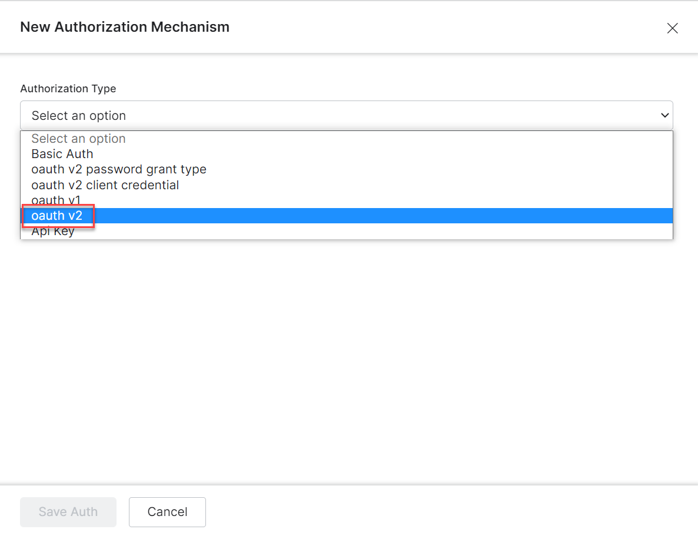

3. Enter the OAuth v2 credentials:

   | Field | Description |
   |---|---|
   | Call back URL | Kore.ai XO Platform callback URL |
   | Identity Provider Name | Name of your custom auth profile |
   | Client ID | Client ID from Azure Portal |
   | Client Secret Key | Client secret value from Azure portal |
   | Authorization URL | Microsoft Azure Portal authorization URL |
   | Token Request URL | Microsoft Azure Portal token request URL |
   | Scope | `email Mail.ReadWrite Mail.Send offline_access openid profile User.Read Tasks.ReadWrite Calendars.ReadWrite MailboxSettings.Read` |
   | Refresh Token URL | Microsoft Azure Portal refresh token URL |

   To register an Azure App, see [Adding the Microsoft Teams Channel](../../../../channels/add-microsoft-teams-channel.md).

   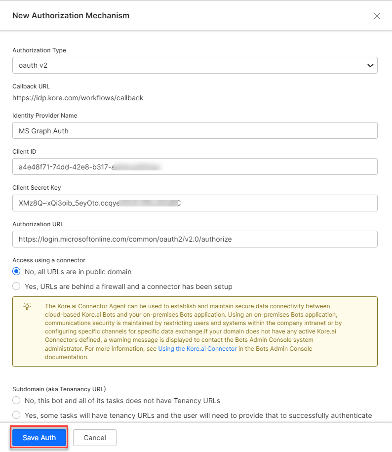

4. Click **Save Auth**, then select the new profile.

   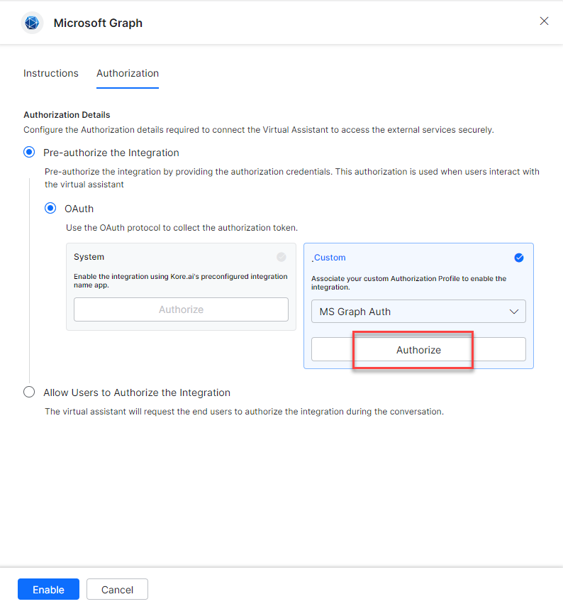

5. Click **Authorize**, enter credentials at `https://login.microsoftonline.com/`, and click **Allow Access**.
6. Click **Enable**.

   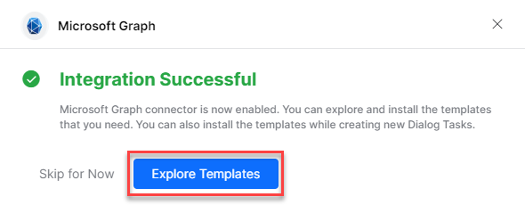

<Note>The Microsoft Graph action moves from _Available_ to _Configured_ after enabling.</Note>

### Allow End User to Authorize

1. Go to **App Settings** > **Integrations** > **Actions** and select **Microsoft Graph**.
2. In **Configurations**, select the **Authorization** tab.
3. Set **Authorization Type** to **Allow Users to Authorize the Integration** > **OAuth**.

   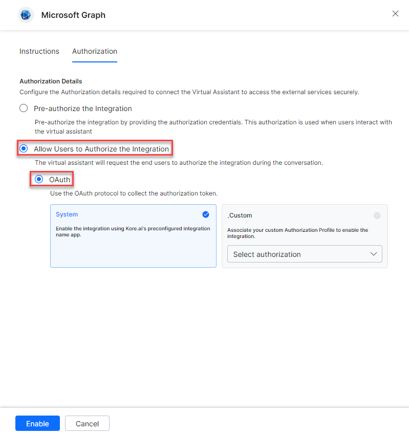

**System Authorization**

1. Select the **System** card.

   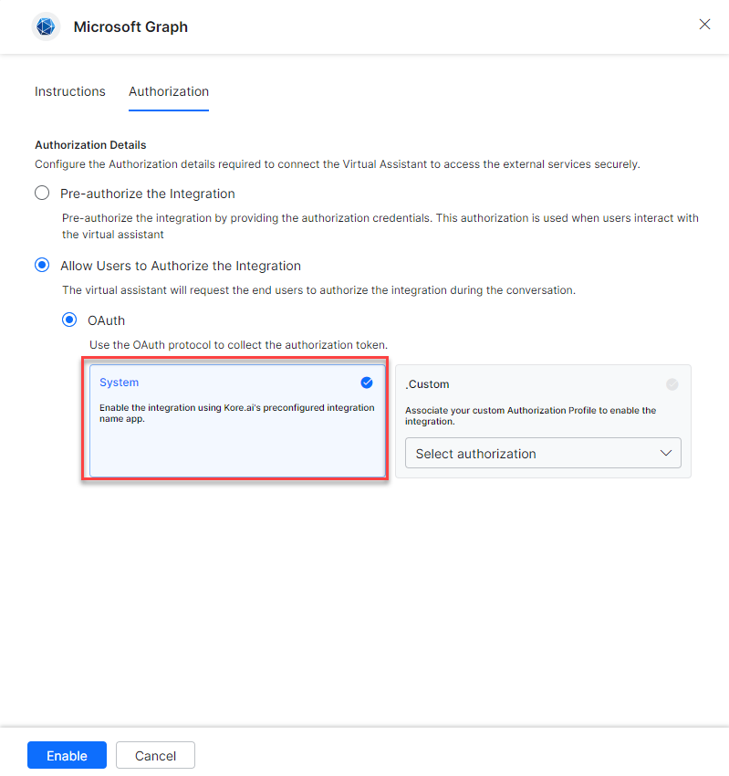

2. Click **Enable**. A link is sent to the end user to authorize.

**Custom Authorization**

1. Select **Custom** and click **Select Authorization** > **Create New**, following the Custom Authorization steps above.
2. You can also select an existing profile:

   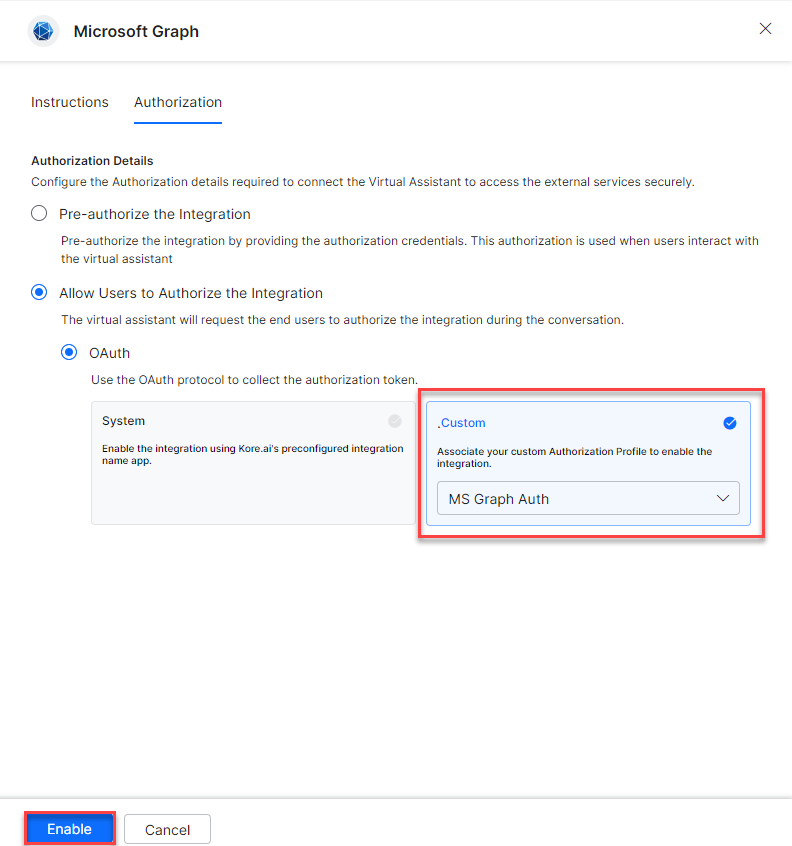

3. Click **Enable**.

---

## Step 2: Install the Microsoft Graph Action Templates

1. On the **Integration Successful** dialog, click **Explore Templates**.

   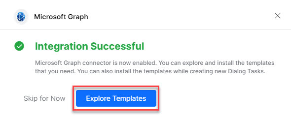

2. Click **Install** to begin installation.

   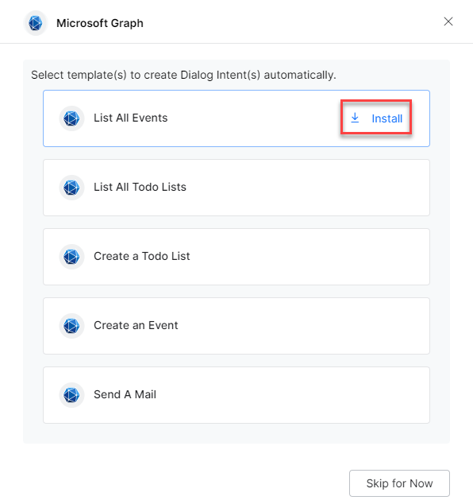

3. Once installed, click **Go to Dialog**. A dialog task for each template is auto-created.

   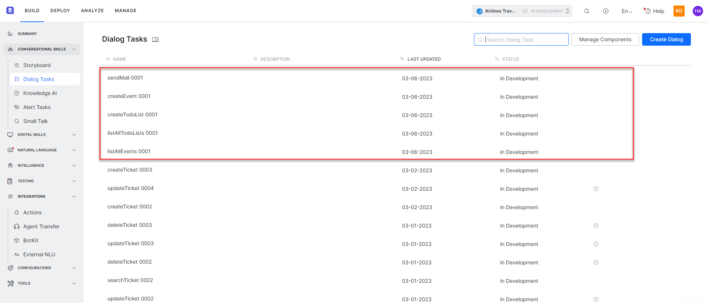

4. Select the desired dialog task and click **Proceed**.

   

5. The dialog task is auto-created and the canvas opens with all required entity nodes, service nodes, and message scripts.

   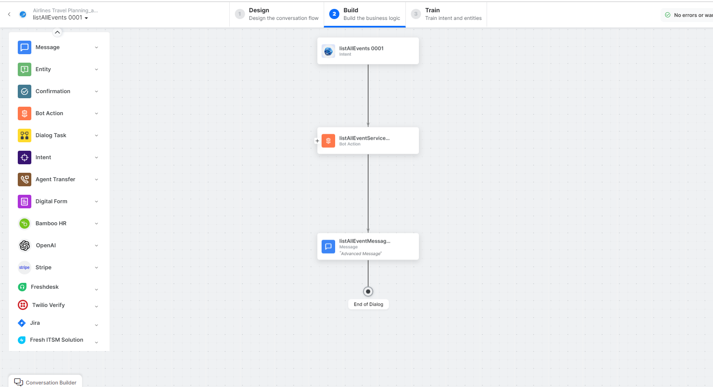
