<Badge icon="arrow-left" color="gray">[Back to Actions Integrations](/ai-for-service/integrations/overview#actions)</Badge>

Use prebuilt Microsoft Graph action templates to auto-create dialog tasks for managing events, to-do lists, and email.

**To access templates:**

1. Go to **Automation AI** > **Use Cases** > **Dialogs** and click **Create a Dialog Task**.
2. Under **Integration**, select **Microsoft Graph**.

   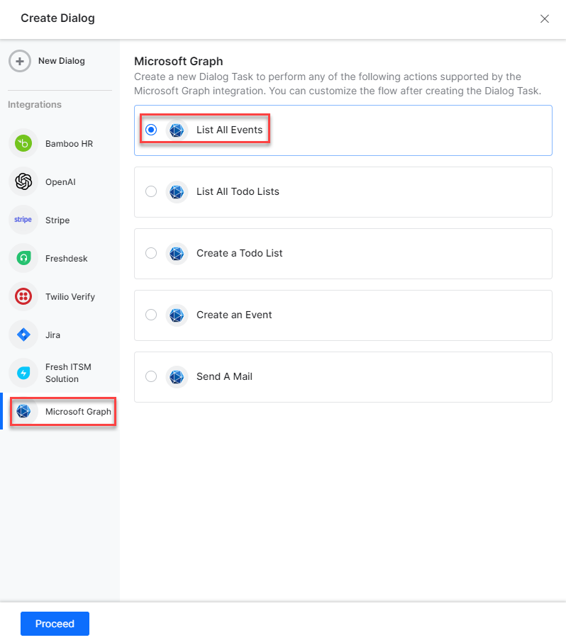

3. If no integration is configured, click **Explore Integrations** to set one up. See [Actions Overview](../actions.md).

   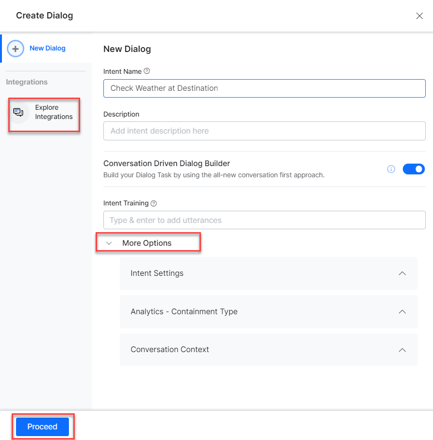

---

## Supported Actions

| Task | Description | Method |
|---|---|---|
| List all events | Retrieves all calendar events. | GET |
| List all to-do lists | Retrieves all to-do list items. | GET |
| Create a to-do list | Creates a to-do list. | POST |
| Create an event | Creates a calendar event. | POST |
| Send an Email | Sends an email to a user. | POST |

---

### List All Events

1. Install the template from [Microsoft Graph Action Templates](configuring-the-microsoft-graph-action.md#step-2-install-the-microsoft-graph-action-templates).
2. The _List All Events_ dialog task is added with the following components:

   

   - **listallEvents** – User intent to view all events.
   - **listAllEventsService** – Bot action service to fetch all events. Click **+Add Response**:

     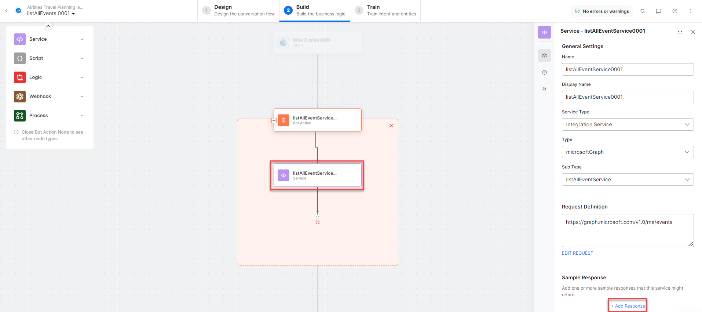

     **Sample Response:** (truncated)
     ```json
     {
       "@odata.context": "https://graph.microsoft.com/v1.0/$metadata#users('john.doe%40outlook.com')/events",
       "value": [
         {
           "id": "AQMkADAwATNiZmY...",
           "subject": "event test",
           "start": {"dateTime": "2022-12-10T04:30:00.0000000", "timeZone": "UTC"},
           "end": {"dateTime": "2022-12-10T05:10:00.0000000", "timeZone": "UTC"}
         }
       ]
     }
     ```

   - **listAllEventstMessage** – Message node to display responses.

3. Click **Train**, then **Talk to Bot** to test:

   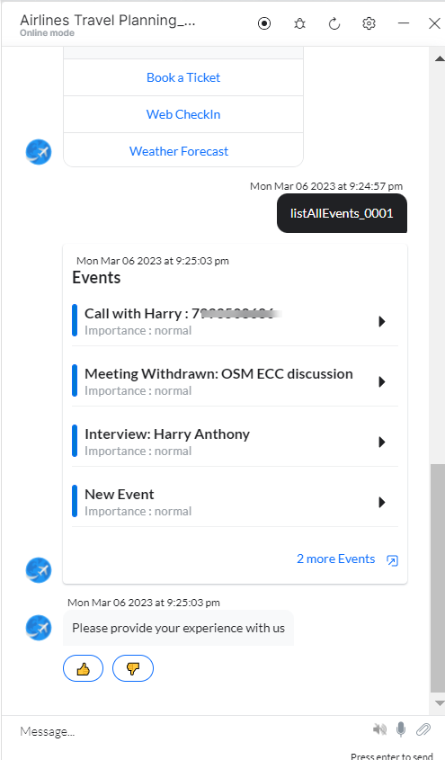

---

### List All To-Do (Tasks) Lists

1. Install the template from [Microsoft Graph Action Templates](configuring-the-microsoft-graph-action.md#step-2-install-the-microsoft-graph-action-templates).
2. The _List All Todo Lists_ dialog task is added with the following components:

   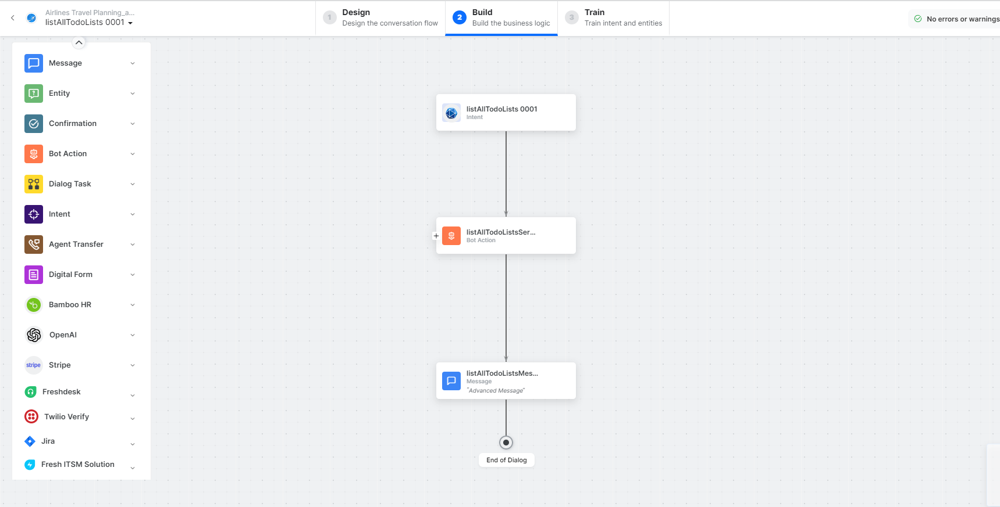

   - **listAllToDolists** – User intent to view all to-do lists.
   - **listAllToDoListService** – Bot action service to fetch all to-do lists. Click **+Add Response**:

     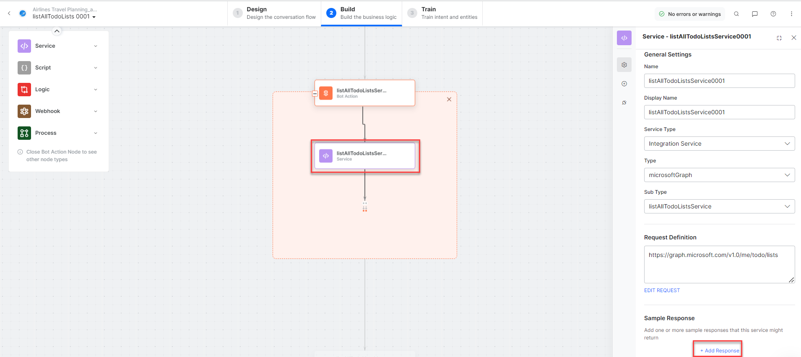

     **Sample Response:** (truncated)
     ```json
     {
       "@odata.context": "https://graph.microsoft.com/v1.0/$metadata#users('john1215%40outlook.com')/todo/lists",
       "value": [
         {"displayName": "Tasks", "isOwner": true, "wellknownListName": "defaultList"},
         {"displayName": "create List from bot", "isOwner": true}
       ]
     }
     ```

   - **listAllTodoListsMessage** – Message node to display responses.

3. Click **Train**, then **Talk to Bot** to test:

   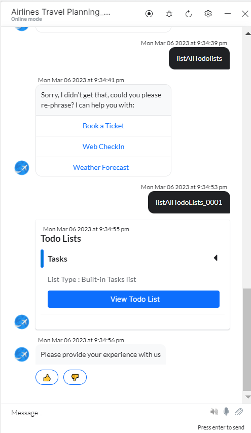

---

### Create an Event

1. Install the template from [Microsoft Graph Action Templates](configuring-the-microsoft-graph-action.md#step-2-install-the-microsoft-graph-action-templates).
2. The _Create an Event_ dialog task is added with the following components:

   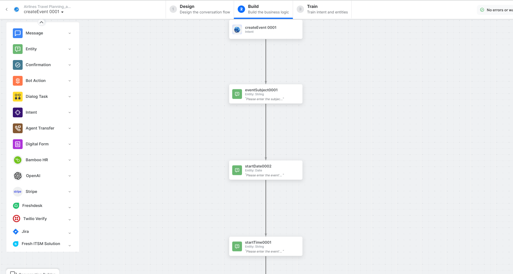

   - **createEvent** – User intent to create an event.
   - **eventSubject**, **startDate**, **startTime**, **endDate**, **endTime**, **attendeesEmailAddresses** – Entity nodes.
   - **getMailboxSettingsService** – Bot action service to fetch mailbox settings.
   - **entityFormatterScript** – Script to format attendee email entities.
   - **createEventService** – Bot action service to create an event. Click **Edit Request**:

     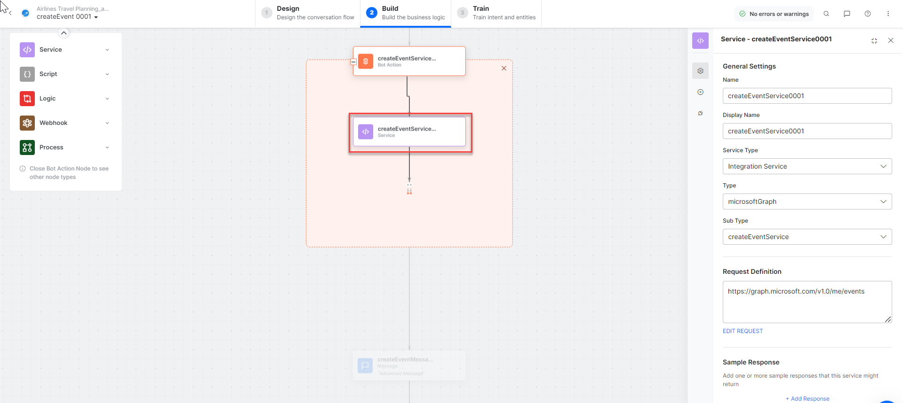

     **Sample Request:**
     ```json
     {
       "subject": "My event 1",
       "start": {"dateTime": "2022-11-09T11:45", "timeZone": "India Standard Time"},
       "end": {"dateTime": "2022-11-09T11:50", "timeZone": "India Standard Time"},
       "attendees": [{"emailAddress": {"address": "john.doe@example.com"}}]
     }
     ```

   - **createEventMessage** – Message node to display responses.

3. Click **Train**, then **Talk to Bot** to test:

   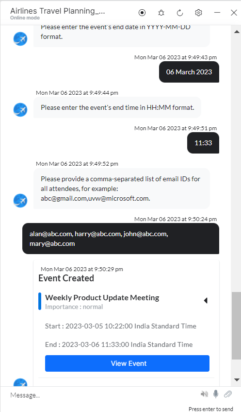

---

### Create a To-do (Tasks) List

1. Install the template from [Microsoft Graph Action Templates](configuring-the-microsoft-graph-action.md#step-2-install-the-microsoft-graph-action-templates).
2. The _Create a todo list_ dialog task is added with the following components:

   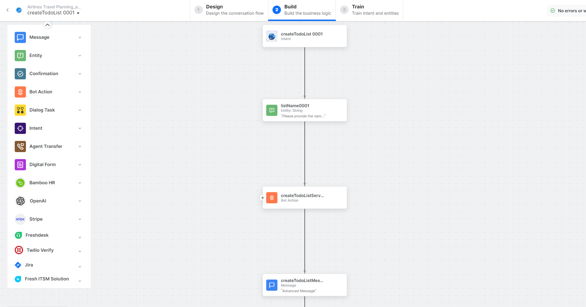

   - **createTodolist** – User intent to create a task list.
   - **listName** – Entity node for the todo list name.
   - **createTodolistService** – Bot action service to create a todo list. Click **Edit Request**:

     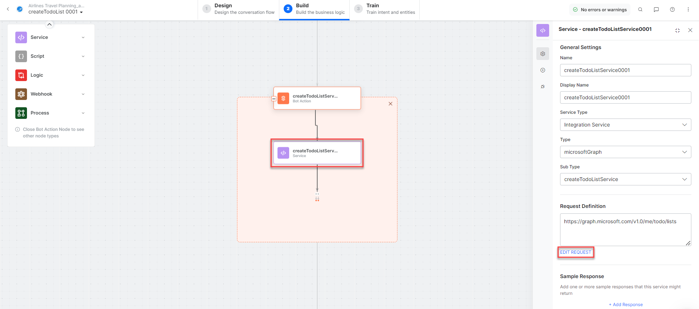

     **Sample Request:**
     ```json
     {"displayName": "Postman created list3"}
     ```

     **Sample Response:**
     ```json
     {
       "displayName": "Postman created list3 (1)",
       "isOwner": true,
       "isShared": false,
       "wellknownListName": "none"
     }
     ```

   - **createTodolistMessage** – Message node to display responses.

3. Click **Train**, then **Talk to Bot** to test:

   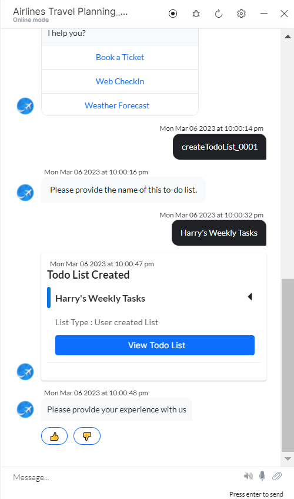

---

### Send an Email

1. Install the template from [Microsoft Graph Action Templates](configuring-the-microsoft-graph-action.md#step-2-install-the-microsoft-graph-action-templates).
2. The _Send email_ dialog task is added with the following components:

   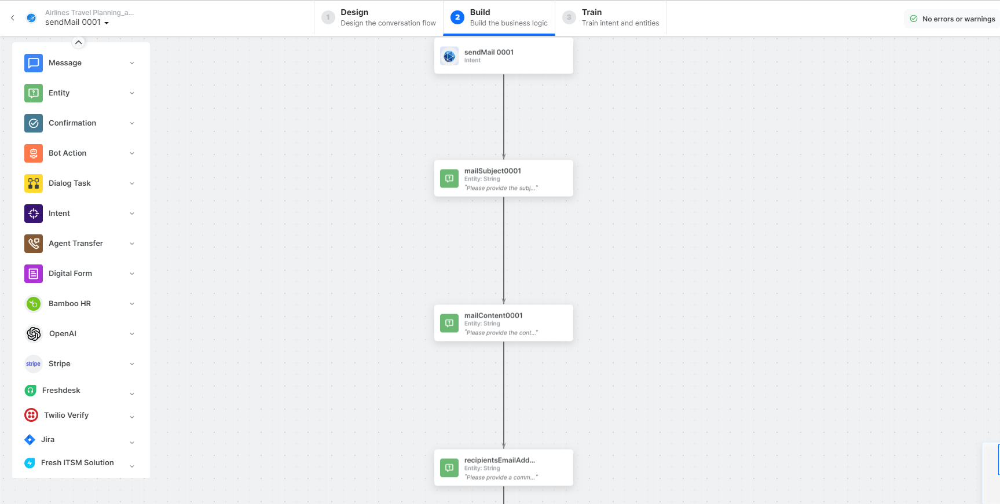

   - **sendEmail** – User intent to send an email.
   - **mailSubject**, **mailContent**, **recipientsEmailAddresses** – Entity nodes.
   - **prepareEmailIdsScript** – Bot action service to format email IDs.
   - **sendEmailService** – Bot action service to send email. Click **Edit Request**:

     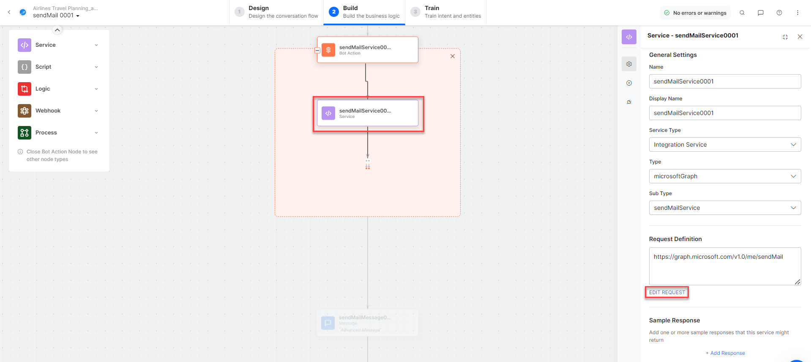

     **Sample Request:**
     ```json
     {
       "message": {
         "subject": "Testing MS graph",
         "body": {"contentType": "Text", "content": "Integration is working fine"},
         "toRecipients": [
           {"emailAddress": {"address": "alan@abc.com"}},
           {"emailAddress": {"address": "john@abc.com"}}
         ]
       }
     }
     ```

   - **sendMailMessage** – Message node to display responses.

3. Click **Train**, then **Talk to Bot** to test:

   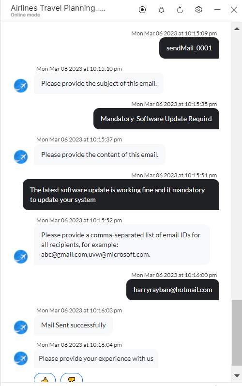
