<Badge icon="arrow-left" color="gray">[Back to Actions Integrations](/ai-for-service/integrations/overview#actions)</Badge>

Use prebuilt OpenAI action templates to auto-create dialog tasks for generating answers and extracting skills.

**To access templates:**

1. Go to **Automation AI** > **Use Cases** > **Dialogs** and click **Create a Dialog Task**.
2. Under **Integration**, select **OpenAI**.

   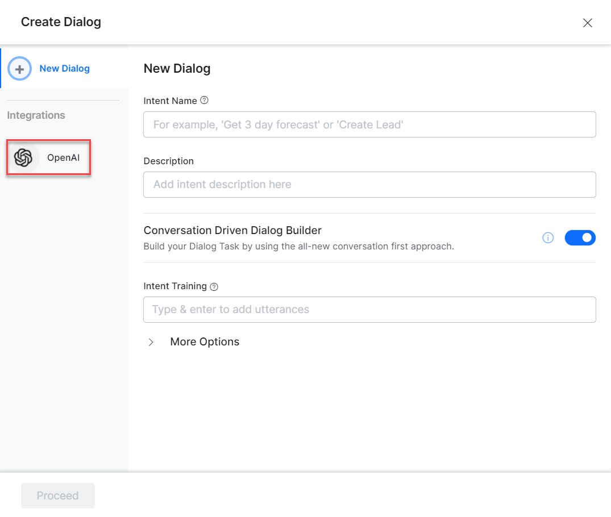

3. If no integration is configured, click **Explore Integrations** to set one up. See [Actions Overview](../actions.md).

   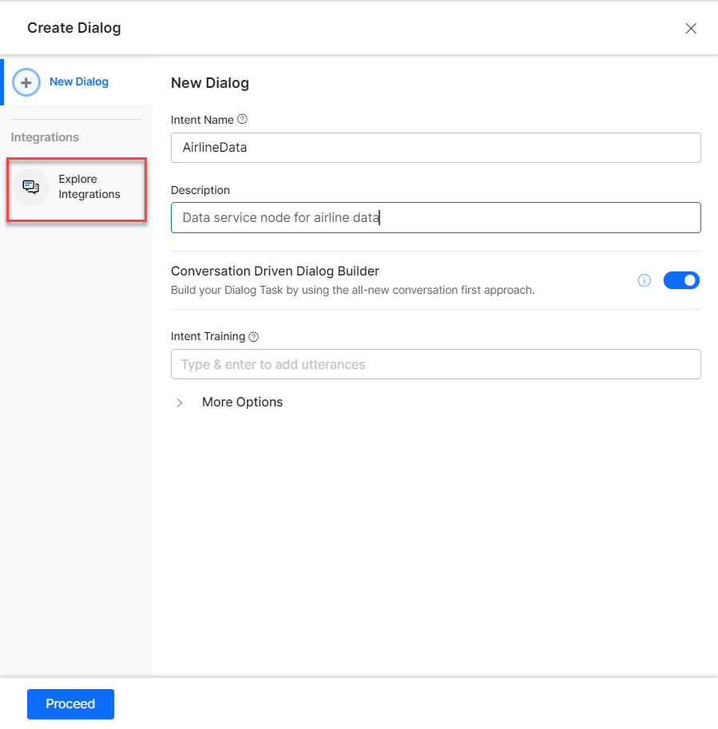

---

## Supported Actions

| Task | Description | Method |
|---|---|---|
| Generate Answers from Context | Generates answers for questions based on the given context. | POST |
| Extract Skills from Resume | Extracts skills from resume content provided as input. | POST |

---

### Generate Answers from Context

1. Install the template from [OpenAI Action Templates](configuring-the-openai-action.md#step-2-install-the-openai-action-templates).
2. The _Generate answers from context_ dialog task is added with the following components:

   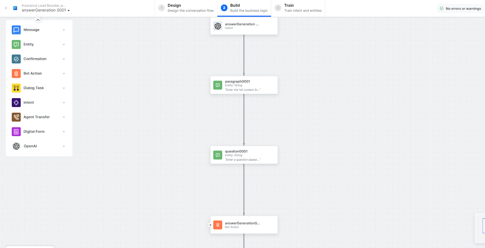

   - **answerGeneration** – User intent to generate answers.
   - **paragraph** and **question** – Entity nodes for the required details.
   - **answerGenerationService** – Bot action service to generate answers. Click **Edit Request**:

     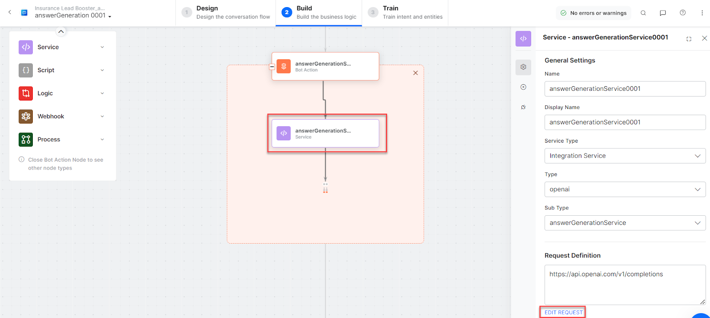

     **Sample Request:**
     ```json
     {
       "model": "text-davinci-003",
       "prompt": "Context: <your context text> Q: <your question>",
       "temperature": 0,
       "max_tokens": 256,
       "top_p": 1,
       "frequency_penalty": 0,
       "presence_penalty": 0
     }
     ```

     <Note>You can enter a maximum of 1500 words with no line breaks, single or double quotes in the content.</Note>

     Click **+Add Response**:

     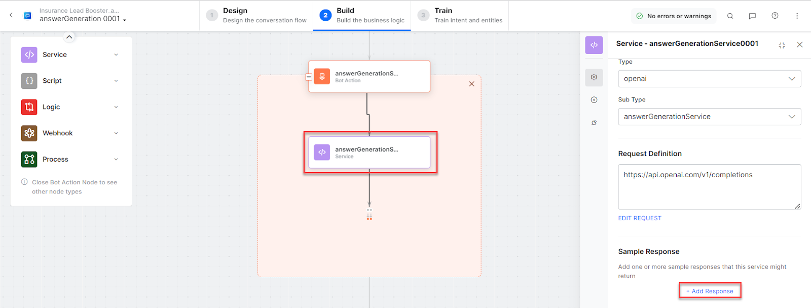

     **Sample Response:**
     ```json
     {
       "id": "cmpl-6f2Q0ZeQIOoSpX428wUr3rp7T7zgc",
       "object": "text_completion",
       "created": 1675238764,
       "model": "text-davinci-003",
       "choices": [
         {
           "text": "\n\nA: Under this policy, you can avail a maximum relocation reimbursement of up to $20,000, inclusive of tax gross-up.",
           "index": 0,
           "logprobs": null,
           "finish_reason": "stop"
         }
       ],
       "usage": {
         "prompt_tokens": 396,
         "completion_tokens": 30,
         "total_tokens": 426
       }
     }
     ```

   - **answerGenerationMessage** – Message node to display responses.

3. Click **Train**, then **Talk to Bot** to test:

   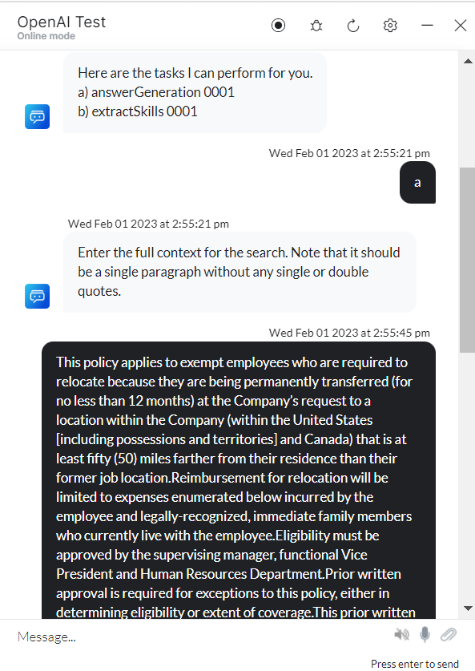

4. Enter a question based on context when prompted:

   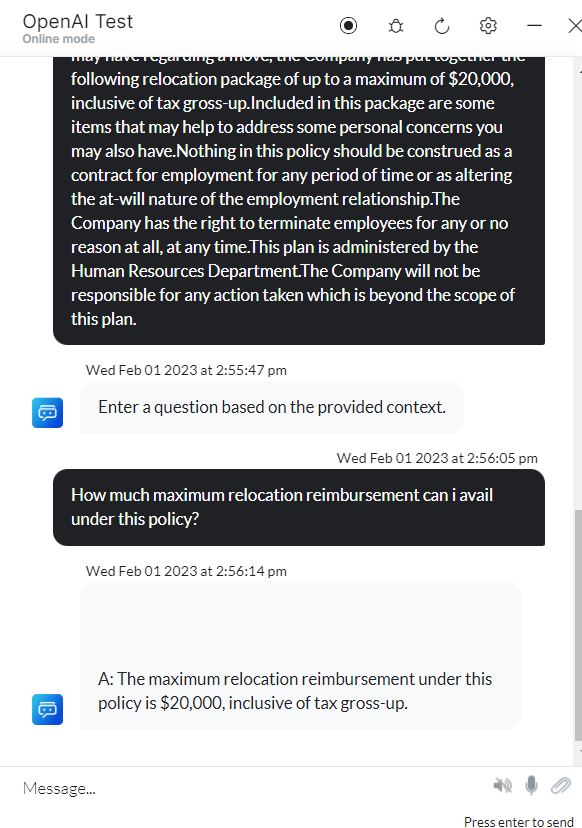

---

### Extract Skills from Resume

1. Install the template from [OpenAI Action Templates](configuring-the-openai-action.md#step-2-install-the-openai-action-templates).
2. The _Extract Skills from resume_ dialog task is added with the following components:

   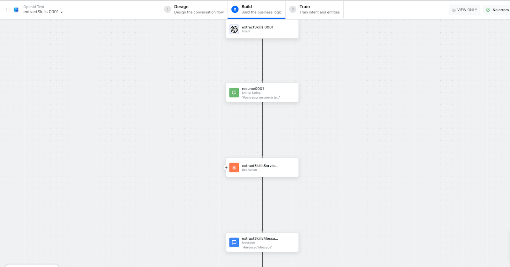

   - **extractSkills** – User intent to extract skills from resume content.
   - **resume** – Entity node for extracting skills.
   - **extractSkillsService** – Bot action service to extract skills. Click **Edit Request**:

     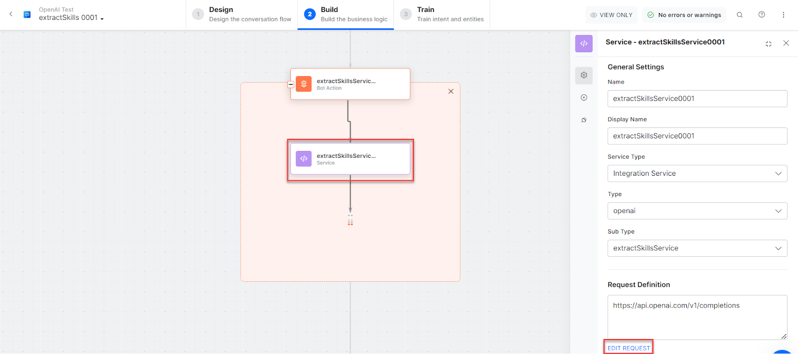

     **Sample Request:**
     ```json
     {
       "model": "text-davinci-002",
       "prompt": "<resume content>",
       "temperature": 0.7,
       "stop": "Q:"
     }
     ```

     <Note>You can enter a maximum of 1500 words with no line breaks, single or double quotes in the content.</Note>

     Click **+Add Response**:

     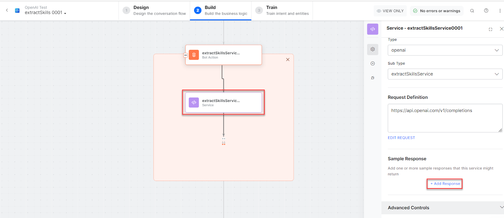

     **Sample Response:**
     ```json
     {
       "id": "cmpl-6U8OZ4pJmLgGliKfCgfBjzgUgEV5Q",
       "object": "text_completion",
       "created": 1672640131,
       "model": "text-davinci-002",
       "choices": [
         {
           "text": "\n\n-Advanced automated aerated system-Wi-Fi technology-ESP8266 Wi-Fi module",
           "index": 0,
           "logprobs": null,
           "finish_reason": "stop"
         }
       ],
       "usage": {
         "prompt_tokens": 163,
         "completion_tokens": 27,
         "total_tokens": 190
       }
     }
     ```

   - **extractSkillsMessage** – Message node to display responses.

3. Click **Train**, then **Talk to Bot** to test.
4. Enter resume content when prompted:

   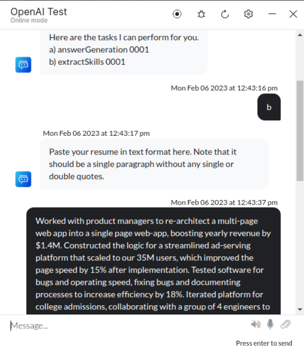

5. The VA extracts skills from the resume content:

   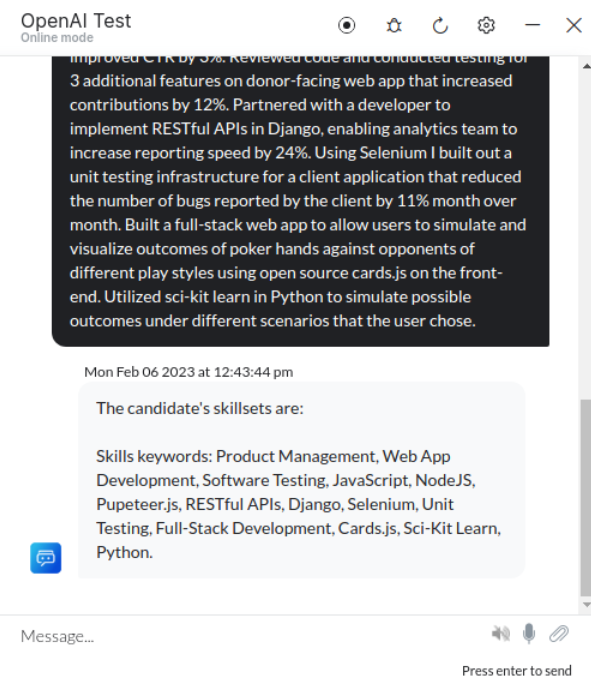
