<Badge icon="arrow-left" color="gray">[Back to Actions Integrations](/ai-for-service/integrations/overview#actions)</Badge>

Use prebuilt Salesforce CRM action templates to auto-create dialog tasks for managing leads and opportunities.

**To access templates:**

1. Go to **Automation AI** > **Use Cases** > **Dialogs** and click **Create a Dialog Task**.
2. Under **Integration**, select **Salesforce**.

   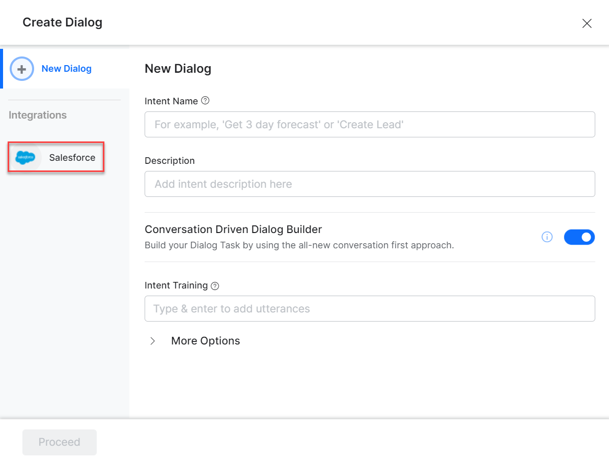

3. If no integration is configured, click **Explore Integrations** to set one up. See [Actions Overview](../actions.md).

---

## Supported Actions

| Task | Description | Method |
|---|---|---|
| Create a Lead | Creates a new marketing lead in the CRM. | POST |
| Create an Opportunity | Creates a new opportunity in the CRM. | POST |
| Update a Lead | Updates the lead with changes. | PATCH |
| View a Lead By ID | Retrieves the lead details. | GET |
| List All Leads | Retrieves all leads from the CRM. | GET |
| Search Leads | Searches all leads that match a keyword. | GET |
| Delete a Lead | Deletes a lead. | DELETE |

---

### Create a Lead

1. Install the template from [Salesforce Action Templates](configuring-the-salesforce-crm-action.md#step-2-install-the-salesforce-action-templates).
2. The _Create a Lead_ dialog task is added with the following components:

   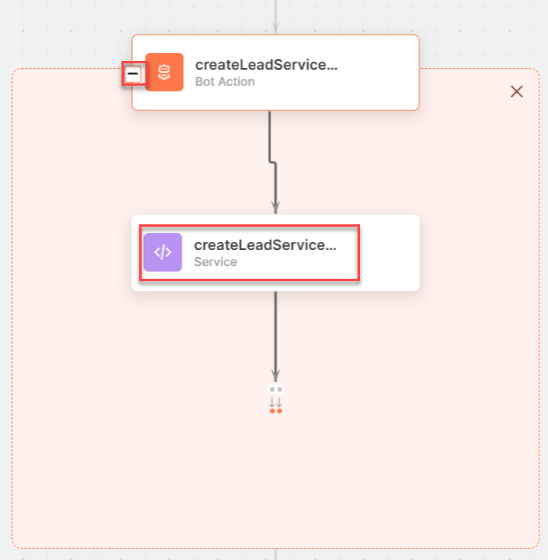

   - **Createlead** – User intent to create a lead.
   - **firstName**, **lastName**, **companyName** – Entity nodes for lead details.
   - **CreateLeadService** – Bot action service to create a lead. Click **Edit Request**:

     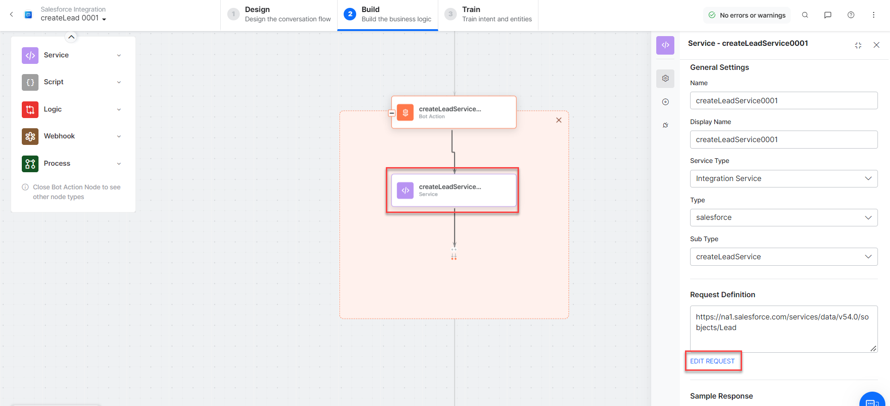

     **Sample Request:**
     ```json
     {
       "attributes": {"type": "Lead"},
       "LastName": "Doe",
       "FirstName": "John",
       "Company": "ABC",
       "MobilePhone": "93445667xx",
       "Status": "Open - Not Contacted",
       "OwnerId": "0055g00000ECRvPAAX",
       "IsConverted": false
     }
     ```

     Click **+Add Response**:

     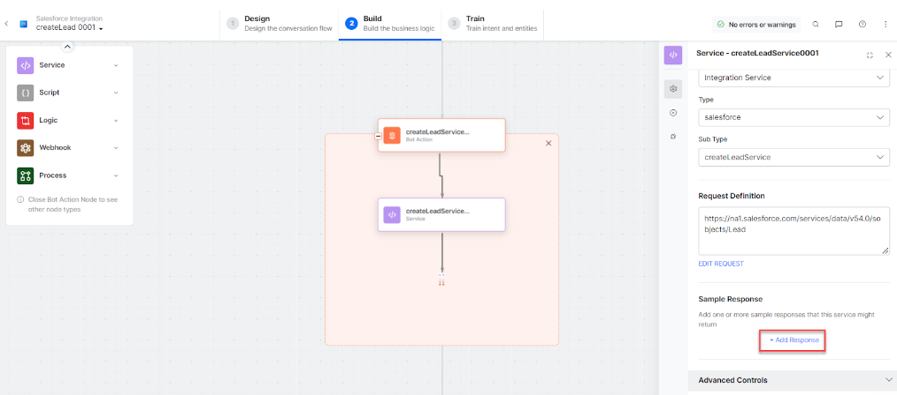

     **Sample Response:**
     ```json
     {
       "id": "00Q5g00000DZ0d4EAD",
       "success": true,
       "errors": []
     }
     ```

   - **subDomainService** – Bot action service to fetch subdomain.

     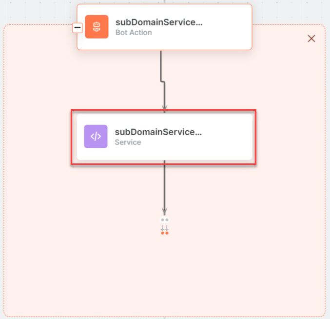

   - **createLeadMessage** – Message node to display responses.

3. Click **Train**, then **Talk to Bot** to test:

   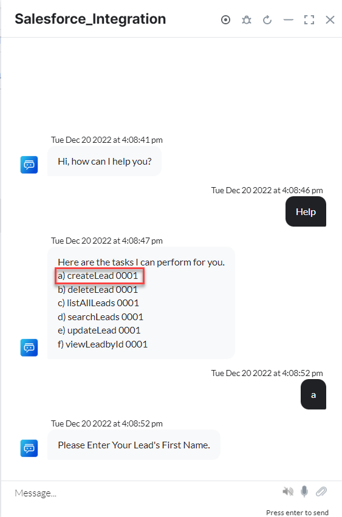

4. Enter lead details when prompted:

   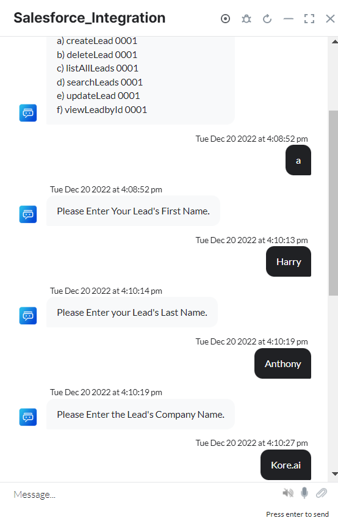

5. The new lead is created in Salesforce CRM:

   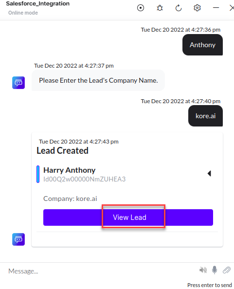

6. Click **View Lead** to see lead details:

   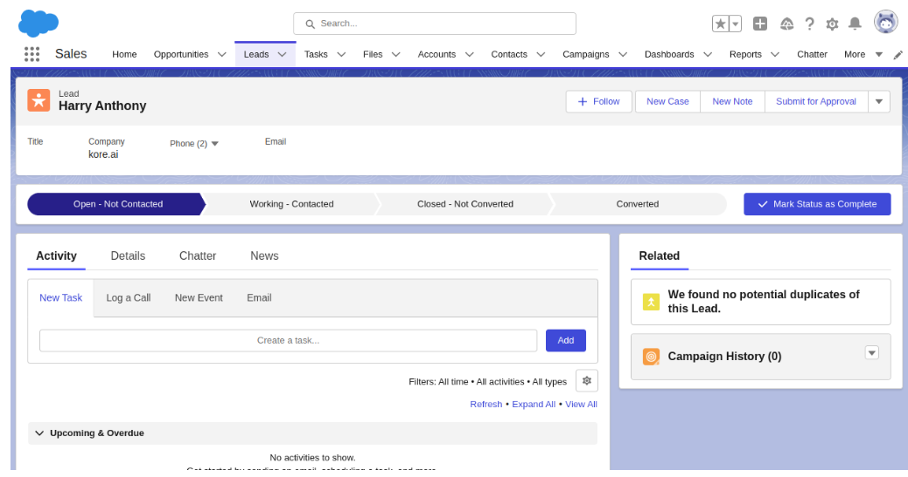

---

### Update a Lead

1. Install the template from [Salesforce Action Templates](configuring-the-salesforce-crm-action.md#step-2-install-the-salesforce-action-templates).
2. The _Update a Lead_ dialog task is added with the following components:

   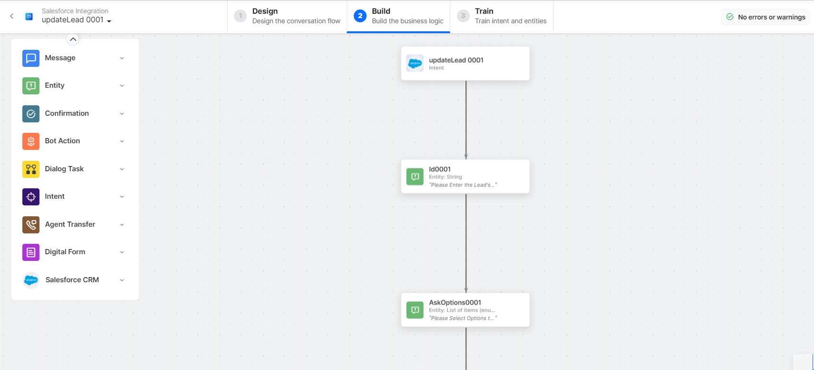

   - **Update lead** – User intent to update a lead.
   - **Id**, **AskOptions**, **LeadStatus**, **Title**, **MobilePhone** – Entity nodes for update details.
   - **updateLeadScript** – Bot action script to update a lead.

     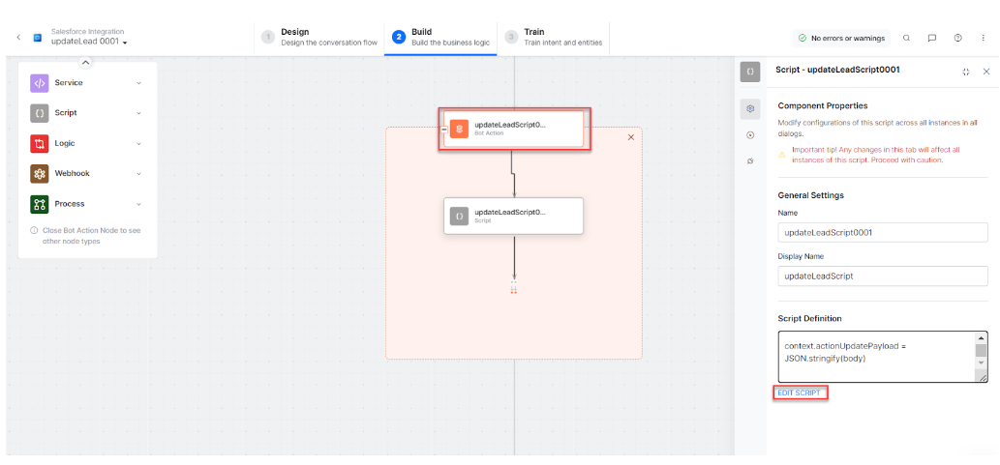

   - **updateLeadService** – Bot action service to update a lead.
   - **subDomainService** – Bot action service to fetch subdomain.
   - **updateLeadMessage** – Message node to display responses.

3. Click **Train**, then **Talk to Bot** to test. After entering lead details, the lead is updated in Salesforce CRM. Click **View Lead** to see updated details:

   

---

### Delete a Lead

1. Install the template from [Salesforce Action Templates](configuring-the-salesforce-crm-action.md#step-2-install-the-salesforce-action-templates).
2. The _Delete Lead_ dialog task is added with the following components:

   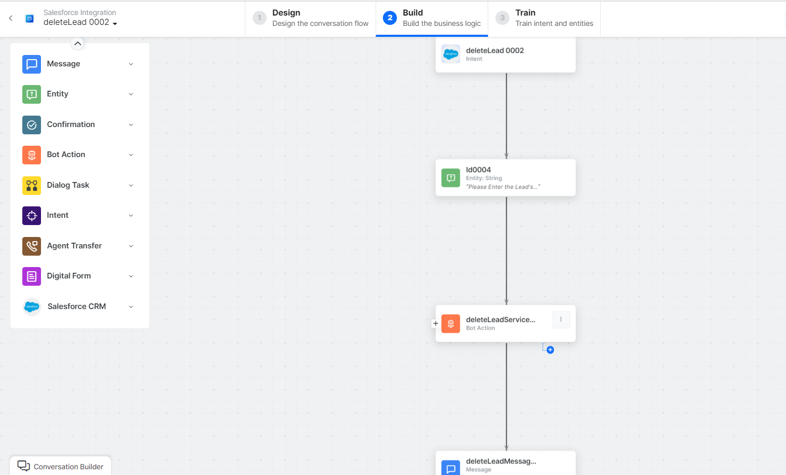

   - **Delete Lead** – User intent to delete a lead.
   - **ID** – Entity node for the lead ID.
   - **deleteLeadService** – Bot action service to delete a lead.

     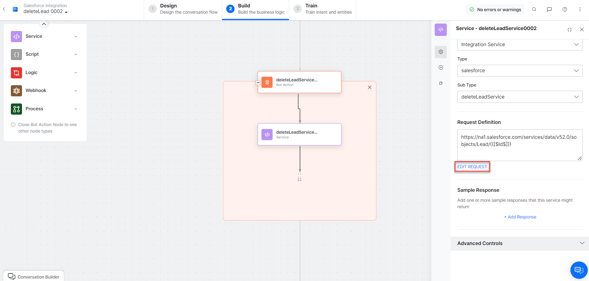

   - **deleteLeadMessage** – Message node to display responses.

3. Click **Train**, then **Talk to Bot** to test:

   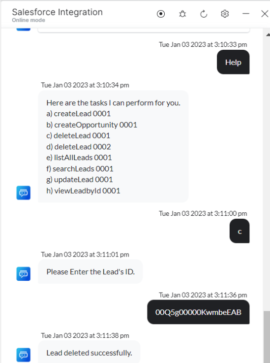

---

### List All Leads

1. Install the template from [Salesforce Action Templates](configuring-the-salesforce-crm-action.md#step-2-install-the-salesforce-action-templates).
2. The _List All Leads_ dialog task is added with the following components:

   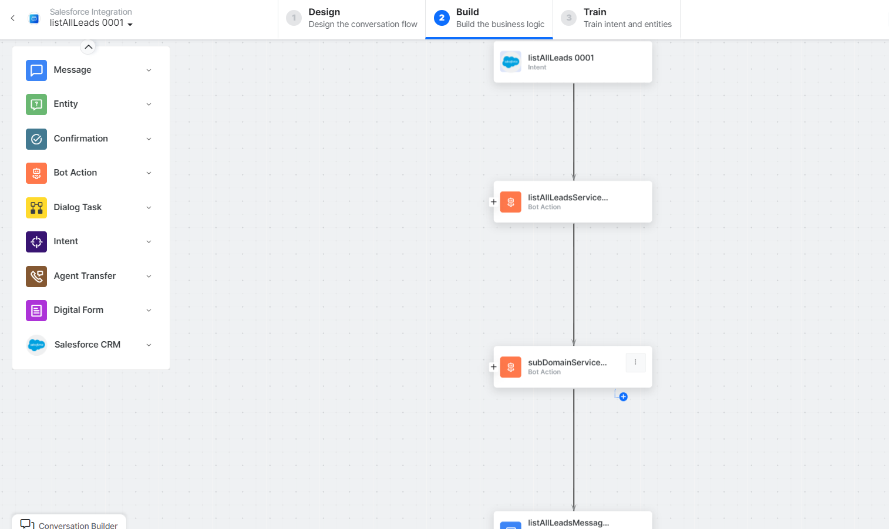

   - **List All Lead** – User intent to list all leads.
   - **listAllLeadsService** – Bot action service to fetch all leads. Click **+Add Response**:

     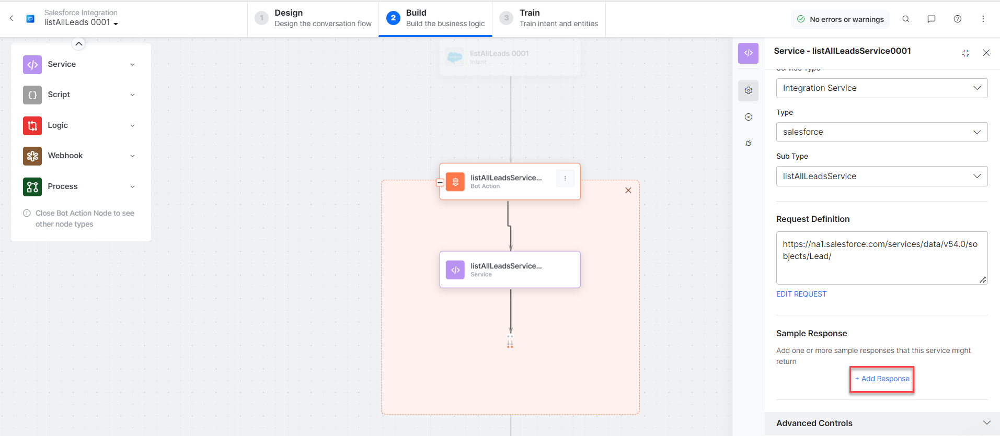

   - **subDomainService** – Bot action service to fetch subdomain.
   - **listAllLeadsMessage** – Message node to display responses.

3. Click **Train**, then **Talk to Bot** to test:

   

---

### View a Lead By ID

1. Install the template from [Salesforce Action Templates](configuring-the-salesforce-crm-action.md#step-2-install-the-salesforce-action-templates).
2. The _View Lead by Id_ dialog task is added with the following components:

   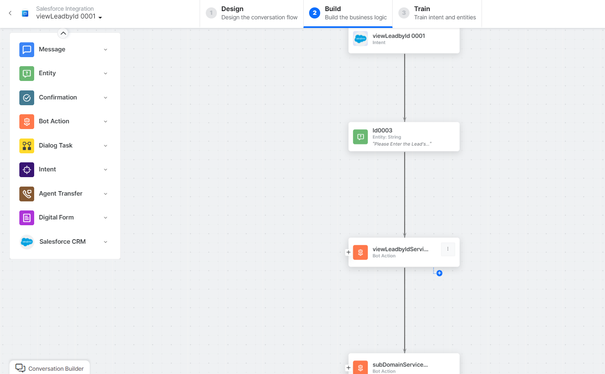

   - **View Lead by Id** – User intent to view a lead by ID.
   - **ID** – Entity node for the lead ID.
   - **viewLeadbyIdService** – Bot action service to view a lead by ID. Click **+Add Response**:

     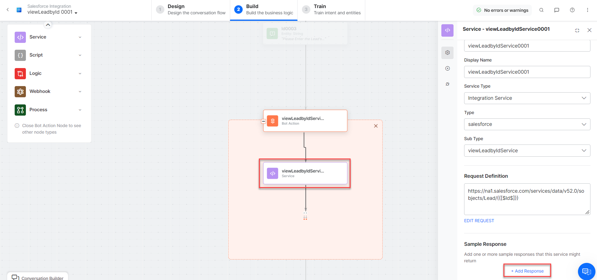

   - **subDomainService** – Bot action service to fetch subdomain.
   - **viewLeadbyIdMessage** – Message node to display responses.

3. Click **Train**, then **Talk to Bot** to test:

   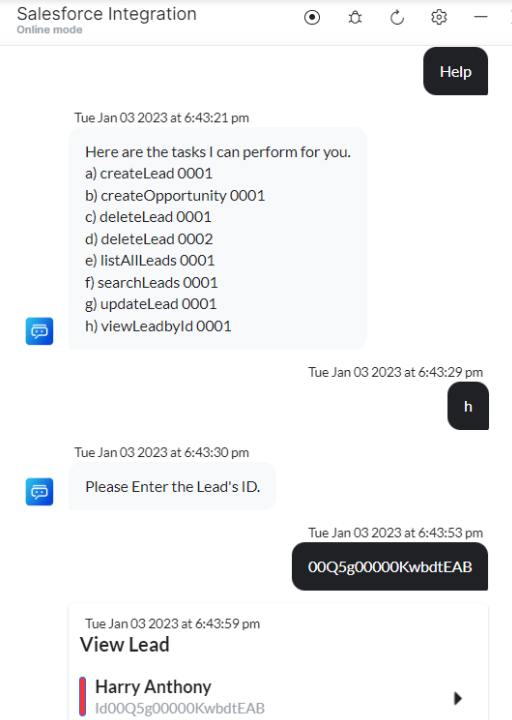

---

### Search Leads

1. Install the template from [Salesforce Action Templates](configuring-the-salesforce-crm-action.md#step-2-install-the-salesforce-action-templates).
2. The _Search Leads_ dialog task is added with the following components:

   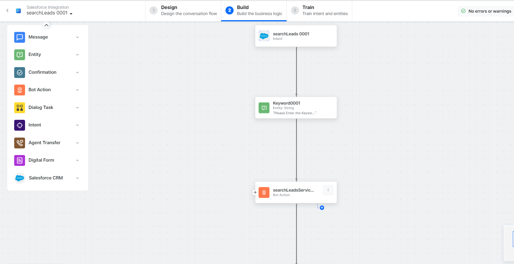

   - **Search Leads** – User intent to search leads.
   - **Keyword** – Entity node for search keywords.
   - **searchLeadsService** – Bot action service to search leads. Click **+Add Response**:

     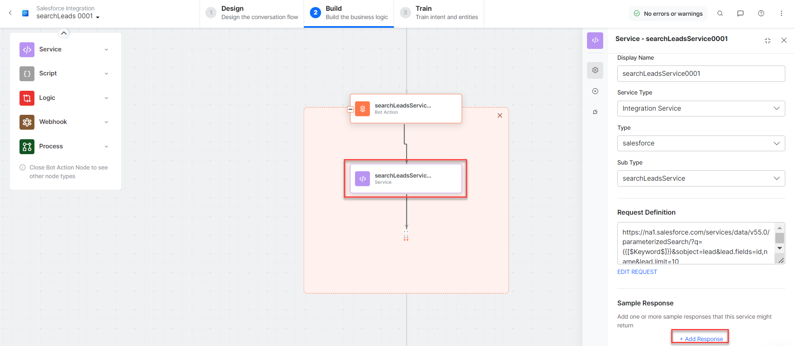

   - **subDomainService** – Bot action service to fetch subdomain.
   - **searchLeadsMessage** – Message node to display responses.

3. Click **Train**, then **Talk to Bot** to test:

   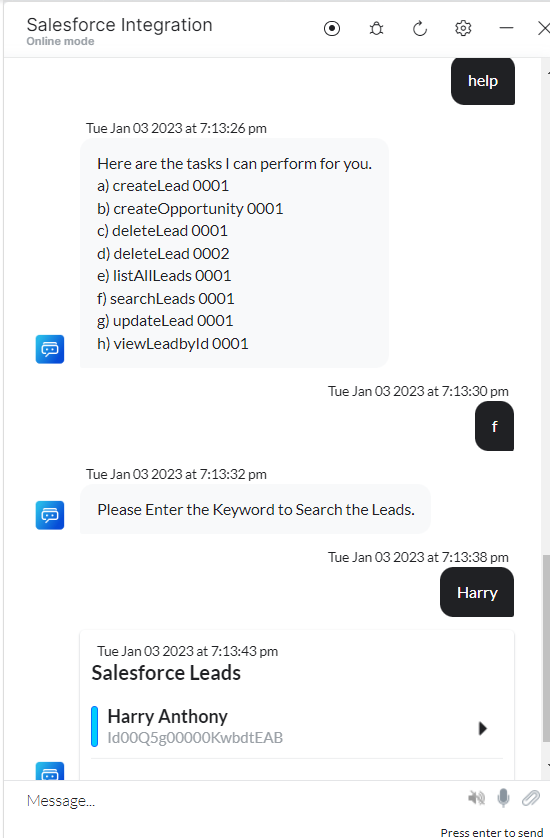

---

### Create an Opportunity

1. Install the template from [Salesforce Action Templates](configuring-the-salesforce-crm-action.md#step-2-install-the-salesforce-action-templates).
2. The _Create Opportunity_ dialog task is added with the following components:

   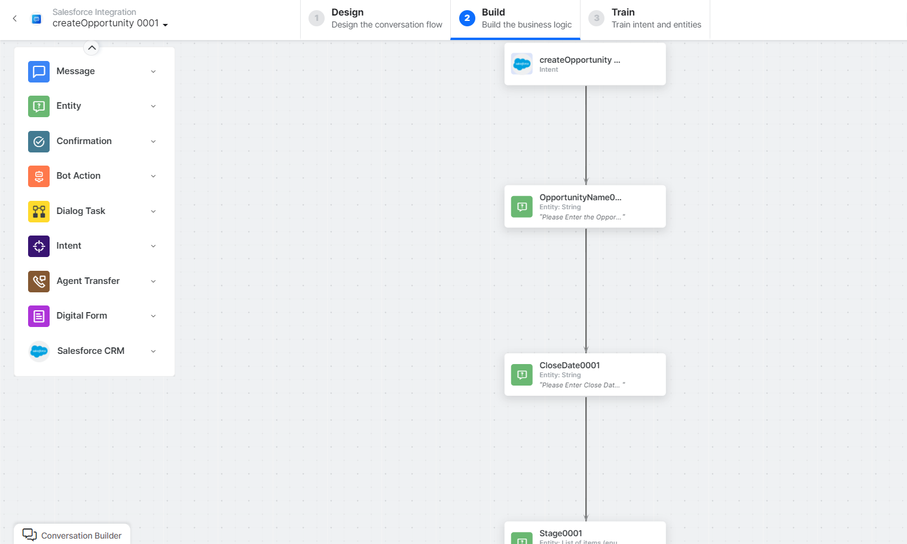

   - **Create Opportunity** – User intent to create an opportunity.
   - **Opportunity Name**, **Closed Date**, **Stage of Opportunity** – Entity nodes for opportunity details.
   - **CreateOpportunityService** – Bot action service to create an opportunity. Click **Edit Request**:

     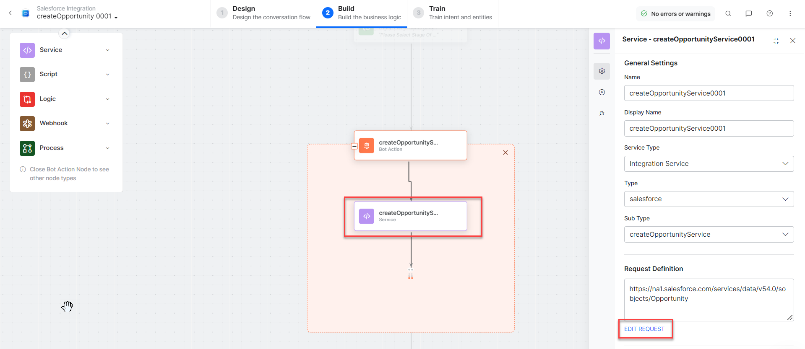

     **Sample Request:**
     ```json
     {
       "attributes": {"type": "Opportunity"},
       "Name": "Project Charlie",
       "CloseDate": "2022-08-31",
       "StageName": "Prospecting"
     }
     ```

     Click **+Add Response**:

     

     **Sample Response:**
     ```json
     {
       "id": "0065g00000O4bgDAAR",
       "success": true,
       "errors": []
     }
     ```

   - **subDomainService** – Bot action service to add subdomain.
   - **createOpportunityMessage** – Message node to display responses.

3. Click **Train**, then **Talk to Bot** to test:

   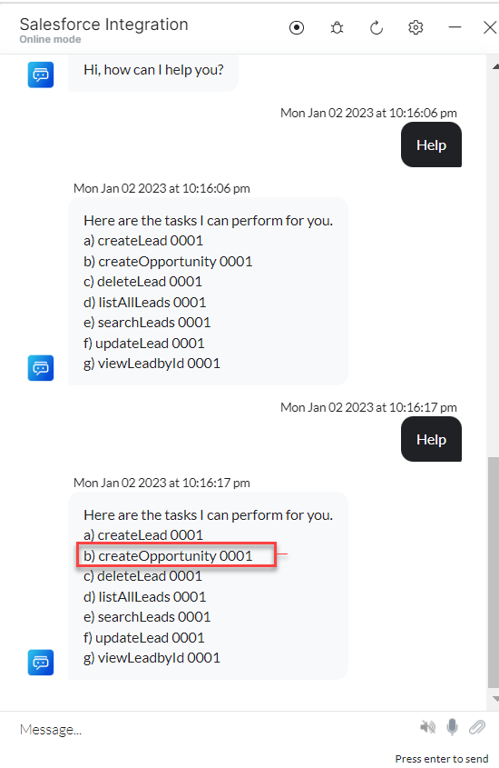

4. Click the **Chevron** icon to expand the new opportunity:

   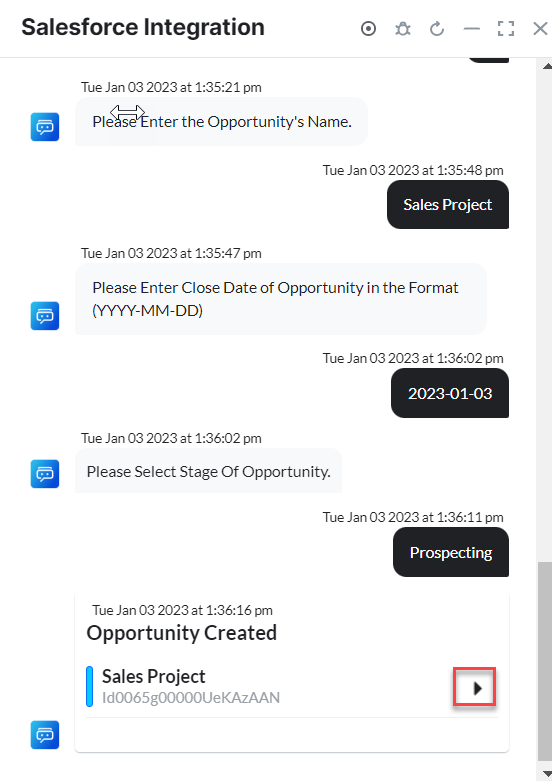

5. Click **View Opportunity** to see opportunity details in Salesforce CRM:

   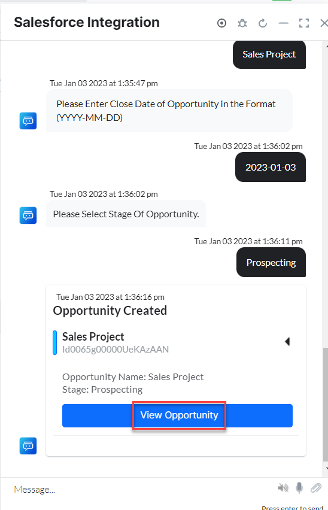
