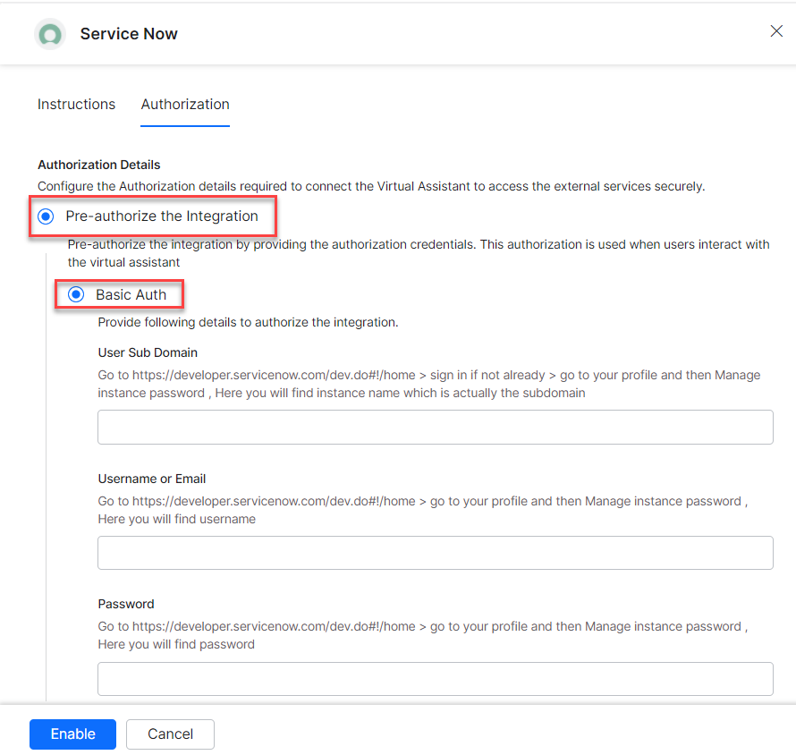
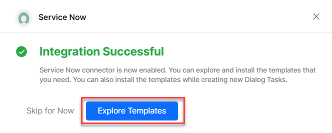
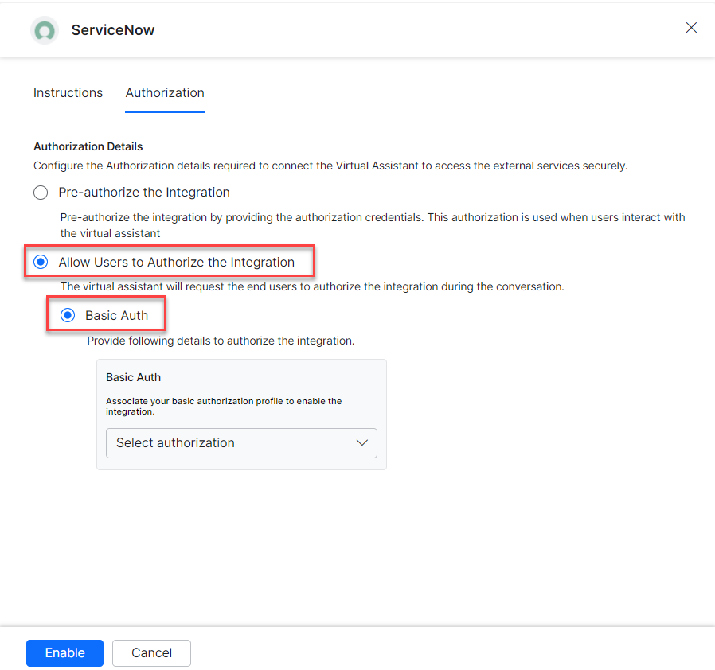
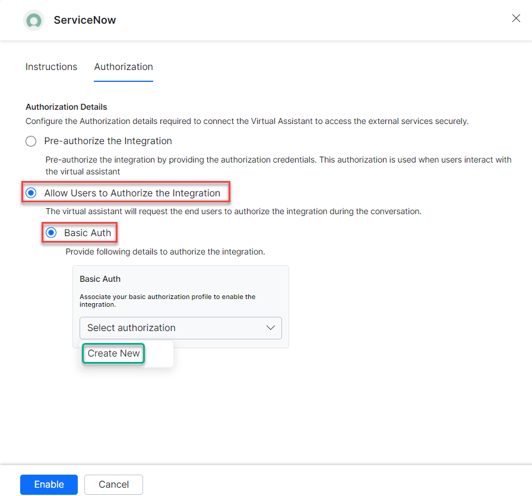
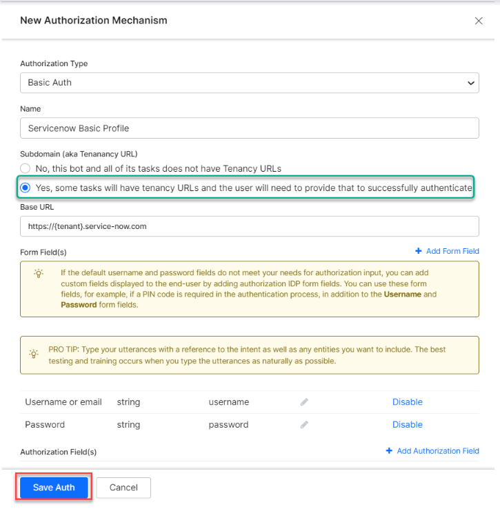
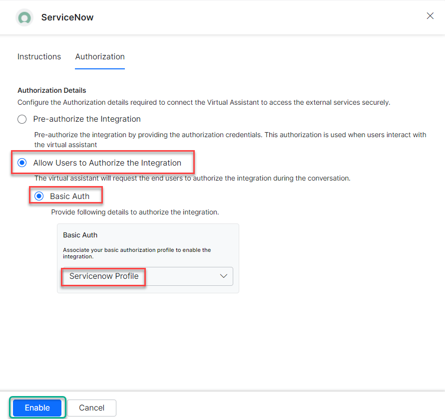
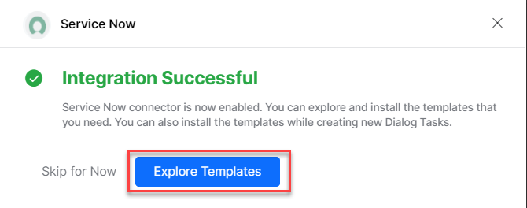
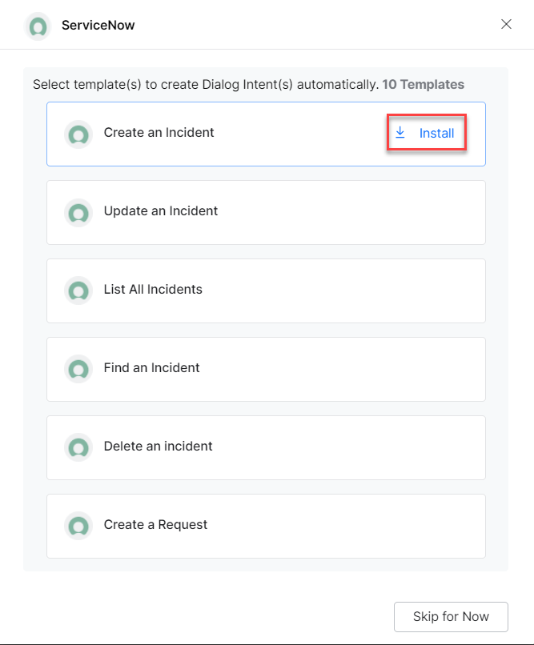
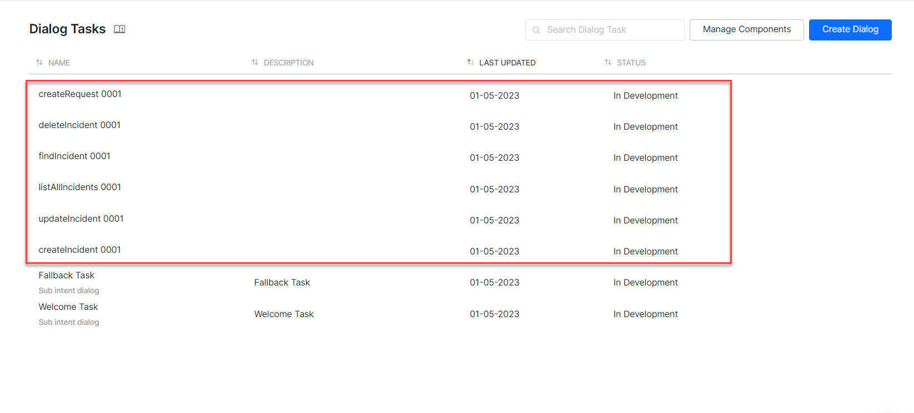
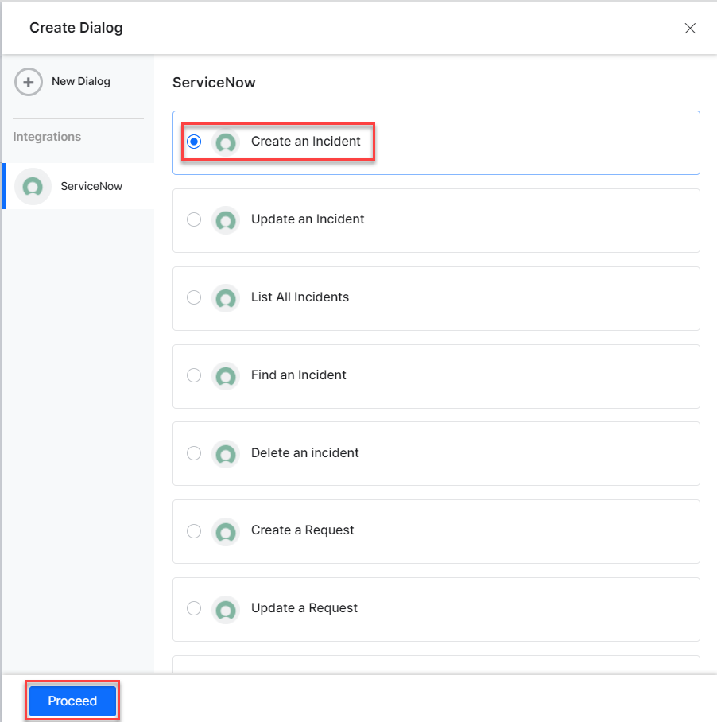

<Badge icon="arrow-left" color="gray">[Back to Actions Integrations](/ai-for-service/integrations/overview#actions)</Badge>

Connect ServiceNow to create, view, update, search, and delete incidents and requests. See [ServiceNow](https://www.servicenow.com/) for more information.

<Note>ServiceNow Actions Integration is supported for the ServiceNow cloud versions (Tokyo, Utah, and Vancouver) but not for on-premises instances.</Note>

---

## Authorizations Supported

The XO Platform supports basic authentication for ServiceNow. See [App Authorization Overview](/ai-for-service/app-settings#authorization-profiles) for details.

| Authorization Type | Basic OAuth |
|---|---|
| Pre-authorize the Integration | Yes |
| Allow Users to Authorize the Integration | Yes |

---

## Step 1: Enable the ServiceNow Action

**Prerequisites:**

- If you don't have ServiceNow credentials, create a developer account. See [ServiceNow Developer Instance Documentation](https://developer.servicenow.com/dev.do#!/learn/learning-plans/rome/new_to_servicenow/app_store_learnv2_buildmyfirstapp_rome_personal_developer_instances).
- Copy the User sub domain, username/email, and password of your ServiceNow account.

**Steps:**

1. Go to **App Settings** > **Integrations** > **Actions**.
2. Select **ServiceNow**.

### Pre-authorize the Integration

**Basic OAuth**

1. Go to **App Settings** > **Integrations** > **Actions** and select **ServiceNow**.
2. In **Configurations**, select the **Authorization** tab.
3. Set **Authorization Type** to **Pre-authorize the Integration** > **Basic Auth**.

   

4. Enter the following details:
   - **User Sub Domain** - The instance name of the ServiceNow account.
   - **Username or Email** - The username or email of the ServiceNow account.
   - **Password** - The password of the ServiceNow account.

5. Click **Enable**. The **Integration Successful** pop-up is displayed.

   

### Allow End User to Authorize

1. Go to **App Settings** > **Integrations** > **Actions** and select **ServiceNow**.
2. In **Configurations**, select the **Authorization** tab.
3. Select **Basic Auth**. See [App Authorization Overview](/ai-for-service/app-settings#authorization-profiles).

   

4. Click **Select Authorization** > **Create New**.

   

5. Set **Authorization Type** to **Allow Users to Authorize the Integration** > **Basic Auth**, then enter the following credentials:
   - **Name** - Name for the Basic Auth profile.
   - **Base URL** - Base tenant URL for ServiceNow instance.
   - **Authorization Check URL** - Authorization check URL for your ServiceNow instance.
   - **Description** - Description of the profile.

   

6. Click **Save Auth**.

7. Select the new **Authorization Profile**.

   

8. Click **Enable**.

---

## Step 2: Install the ServiceNow Action Templates

1. On the **Integration Successful** dialog, click **Explore Templates**.

   

2. Click **Install** to begin installation.

   

3. Once installed, click **Go to Dialog**. A dialog task for each template is auto-created.

   

4. Select the desired dialog task and click **Proceed**.

   

5. The dialog task is auto-created and the canvas opens with all required entity nodes, service nodes, and message scripts.
