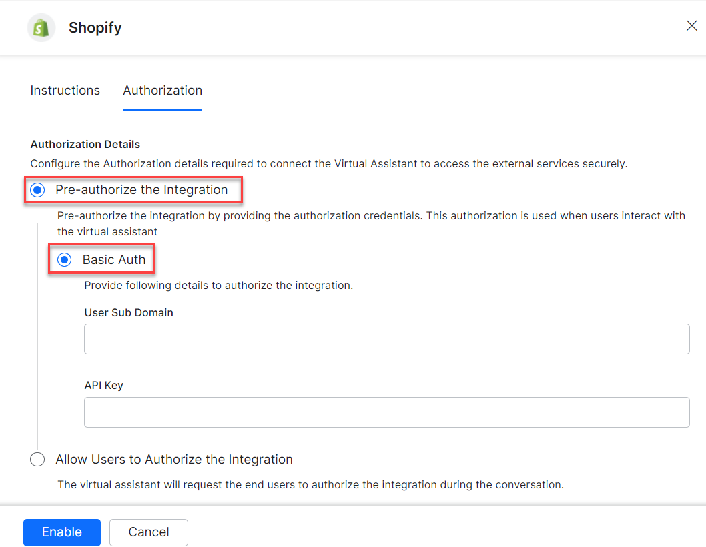
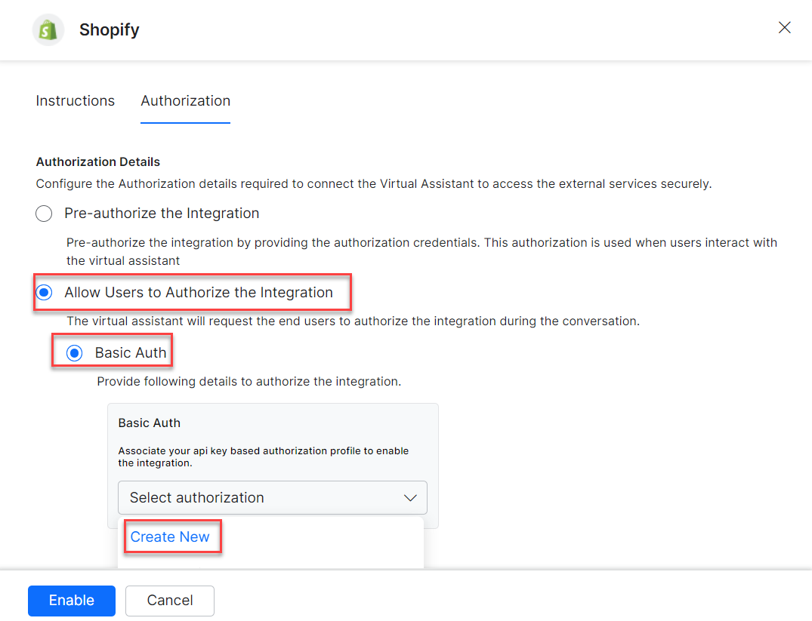
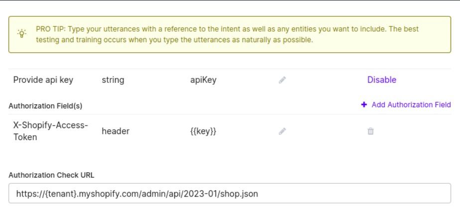
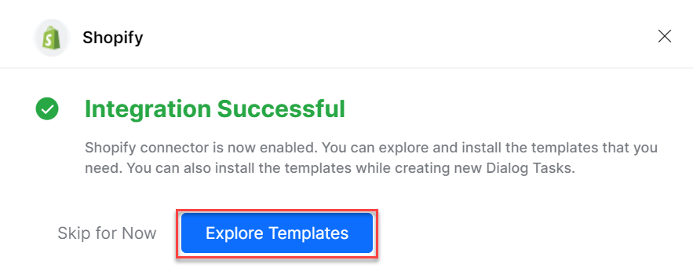
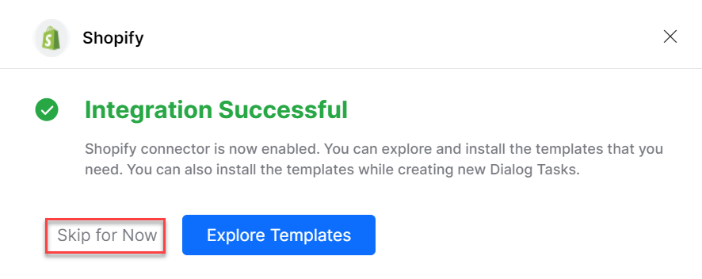
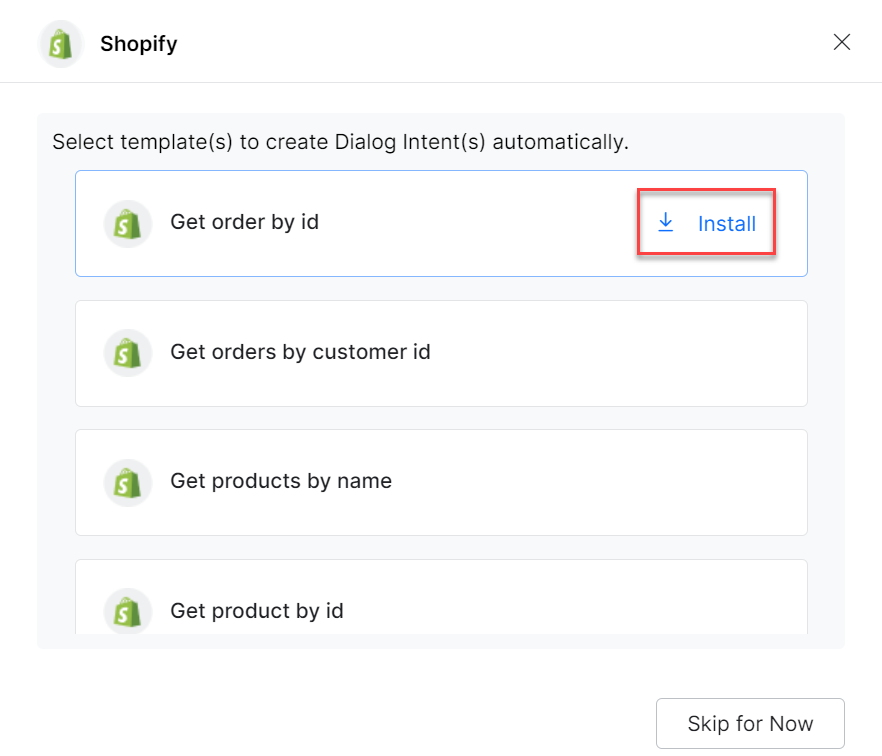
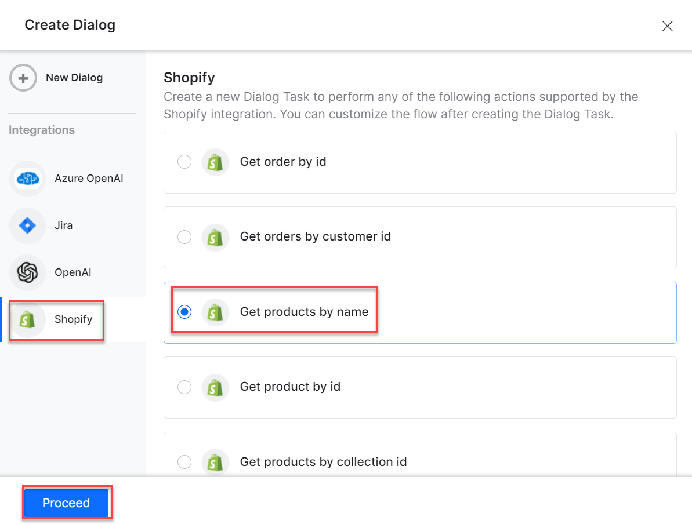
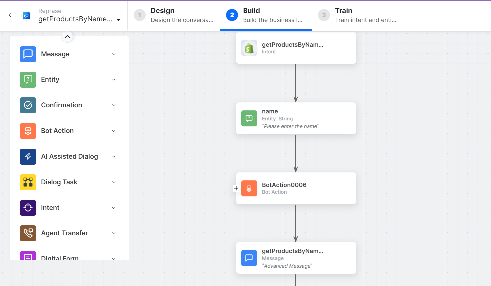

Connect Shopify to find information about customers, products, and orders. See [Shopify Documentation](https://www.shopify.com/in/blog/topics/guides) for more information.

---

## Authorizations Supported

The XO Platform supports basic authentication for Shopify. See [App Authorization Overview](../../../dev-tools/bot-authorization/bot-authentication.md) for details.

| Authorization Type | Basic Auth |
|---|---|
| Pre-authorize the Integration | Yes |
| Allow Users to Authorize the Integration | Yes |

---

## Step 1: Enable the Shopify Action

**Prerequisites:**

- Create a custom app in the Shopify admin page.
- Authenticate the custom app by installing it.
- Generate API credentials and access tokens. See [Shopify custom apps](https://help.shopify.com/en/manual/apps/app-types/custom-apps).
- Configure the app with the following scopes:
  - `read_orders`
  - `read_products`
  - `read_customers`
- Copy the **Admin API access token** and **Domain** from Shopify.

**Steps:**

1. Go to **App Settings** > **Integrations** > **Actions**.
2. Select **Shopify**.

### Pre-authorize the Integration

**Basic Auth**

1. Go to **App Settings** > **Integrations** > **Actions** and select **Shopify**.
2. In **Configurations**, select the **Authorization** tab.
3. Set **Authorization Type** to **Pre-authorize the Integration** > **Basic Auth**.

   

4. Enter the following details:
   - **User Sub Domain** – The domain name of the Shopify account.
   - **API Key** – The secret API key of your Shopify account.

5. Click **Enable**. The **Integration Successful** pop-up is displayed.

   

<Note>The Shopify action moves from _Available_ to _Configured_ after enabling.</Note>

### Allow End User to Authorize

1. Go to **App Settings** > **Integrations** > **Actions** and select **Shopify**.
2. In **Configurations**, select the **Authorization** tab.
3. Set **Authorization Type** to **Allow Users to Authorize the Integration** > **Basic Auth**.
4. Click **Select Authorization** > **Create New**.

   

5. Select **API Key** as the authorization mechanism. See [App Authorization Overview](../../../dev-tools/bot-authorization/bot-authentication.md).
6. Enter the following credentials:
   - **Name** – Name for the Basic Auth profile.
   - **Base URL** – Base tenant URL for the Shopify instance.
   - **Authorization Check URL** – Authorization check URL for your Shopify instance.
   - **Description** – Description of the profile.
   - Click **Save Auth** to save the profile.

   

7. Select the new **Authorization Profile**.
8. Click **Enable**.

---

## Step 2: Install the Shopify Action Templates

1. On the **Integration Successful** dialog, click **Explore Templates**.

   

   You can also click **Skip for Now** to install templates later.

   

2. Click **Install** to begin installation.

   

3. Once installed, click **Go to Dialog**. A dialog task for each template is auto-created.
4. Select the desired dialog task and click **Proceed**.

   

5. The dialog task is auto-created and the canvas opens with all required entity nodes, service nodes, and message scripts.

   
