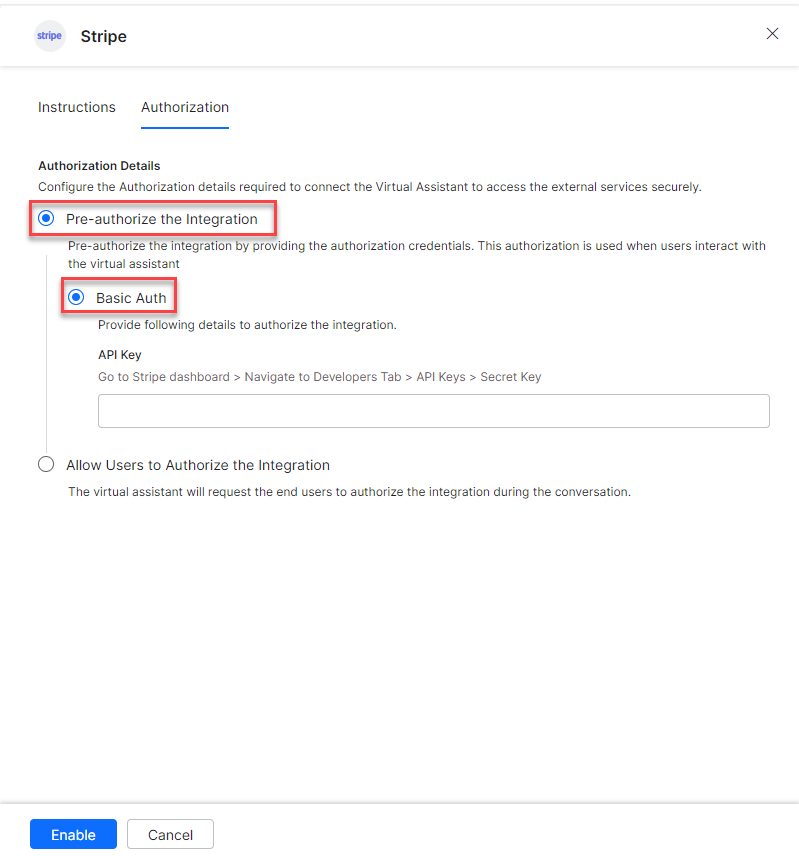
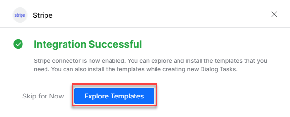
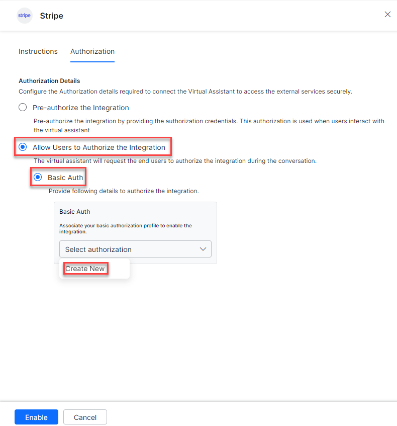
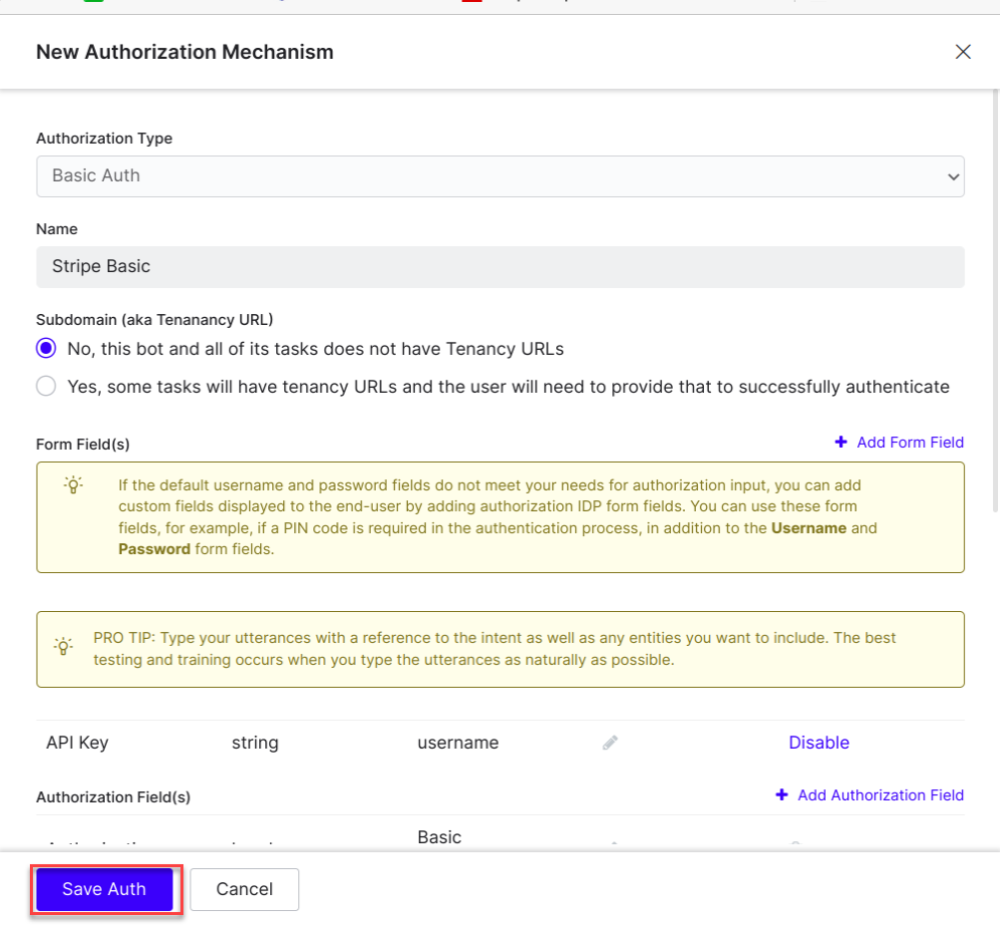
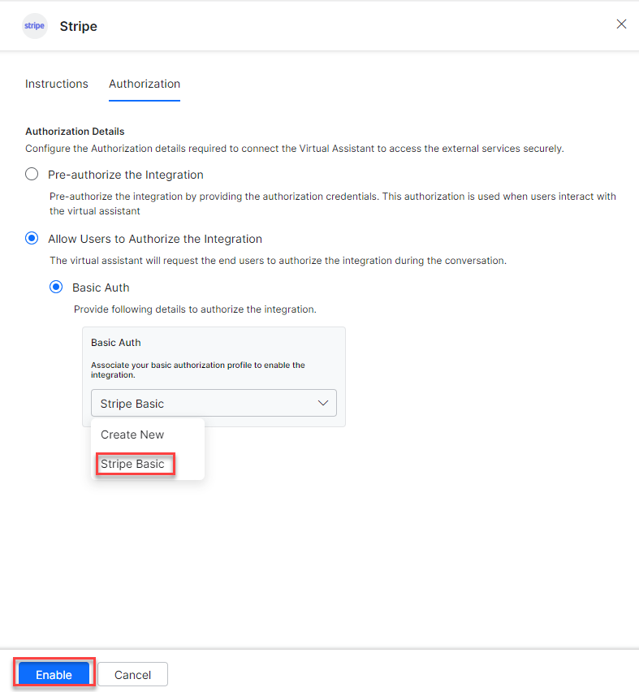
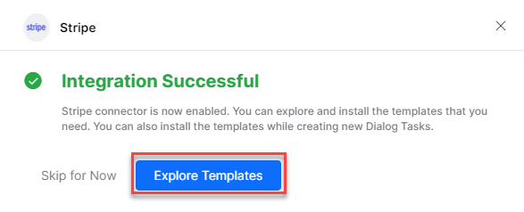
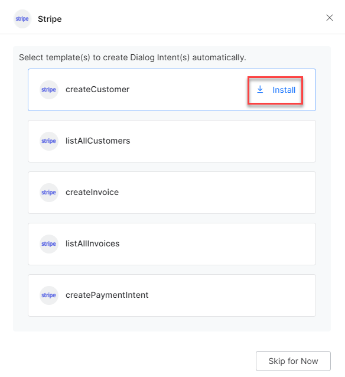
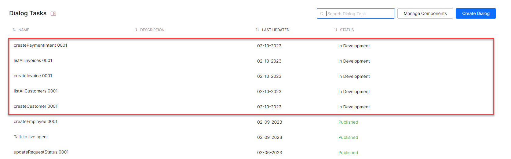

Connect Stripe to accept payments, send payouts, and manage payment-related tasks. See [Stripe Documentation](https://stripe.com/docs) for more information.

---

## Authorizations Supported

The XO Platform supports basic authentication for Stripe. See [App Authorization Overview](../../../dev-tools/bot-authorization/bot-authentication.md) for details.

| Authorization Type | Basic Auth |
|---|---|
| Pre-authorize the Integration | Yes |
| Allow Users to Authorize the Integration | Yes |

---

## Step 1: Enable the Stripe Action

**Prerequisites:**

- If you don't have Stripe credentials, create a developer account at [Stripe](https://stripe.com/docs).
- Copy the API Key of your Stripe account.

**Steps:**

1. Go to **App Settings** > **Integrations** > **Actions**.
2. Select **Stripe**.

### Pre-authorize the Integration

**Basic Auth**

1. Go to **App Settings** > **Integrations** > **Actions** and select **Stripe**.
2. In **Configurations**, select the **Authorization** tab.
3. Set **Authorization Type** to **Pre-authorize the Integration** > **Basic Auth**.

   

4. Enter your **API Key**.
5. Click **Enable**. The **Integration Successful** pop-up is displayed.

   

<Note>The Stripe action moves from _Available_ to _Configured_ after enabling.</Note>

### Allow End User to Authorize

1. Go to **App Settings** > **Integrations** > **Actions** and select **Stripe**.
2. In **Configurations**, select the **Authorization** tab.
3. Set **Authorization Type** to **Allow Users to Authorize the Integration** > **Basic Auth**.
4. Click **Select Authorization** > **Create New**.

   

5. Select **Basic Auth** as the authorization mechanism. See [App Authorization Overview](../../../dev-tools/bot-authorization/bot-authentication.md).
6. Enter the following credentials:
   - **Name** – Name for the Basic Auth profile.
   - **Base URL** – Base tenant URL for the Stripe instance.
   - **Authorization Check URL** – Authorization check URL for your Stripe instance.
   - **Description** – Description of the profile.

   

7. Click **Save Auth**.
8. Select the new **Authorization Profile**.

   

9. Click **Enable**.

---

## Step 2: Install the Stripe Action Templates

1. On the **Integration Successful** dialog, click **Explore Templates**.

   

2. Click **Install** to begin installation.

   

3. Once installed, click **Go to Dialog**. A dialog task for each template is auto-created.

   

4. Select the desired dialog task and click **Proceed**.

   

5. The dialog task is auto-created and the canvas opens with all required entity nodes, service nodes, and message scripts.

   
