<Badge icon="arrow-left" color="gray">[Back to Actions Integrations](/ai-for-service/integrations/overview#actions)</Badge>

Use prebuilt Stripe action templates to auto-create dialog tasks for managing customers, invoices, and payments.

**To access templates:**

1. Go to **Automation AI** > **Use Cases** > **Dialogs** and click **Create a Dialog Task**.
2. Under **Integration**, select **Stripe**.

   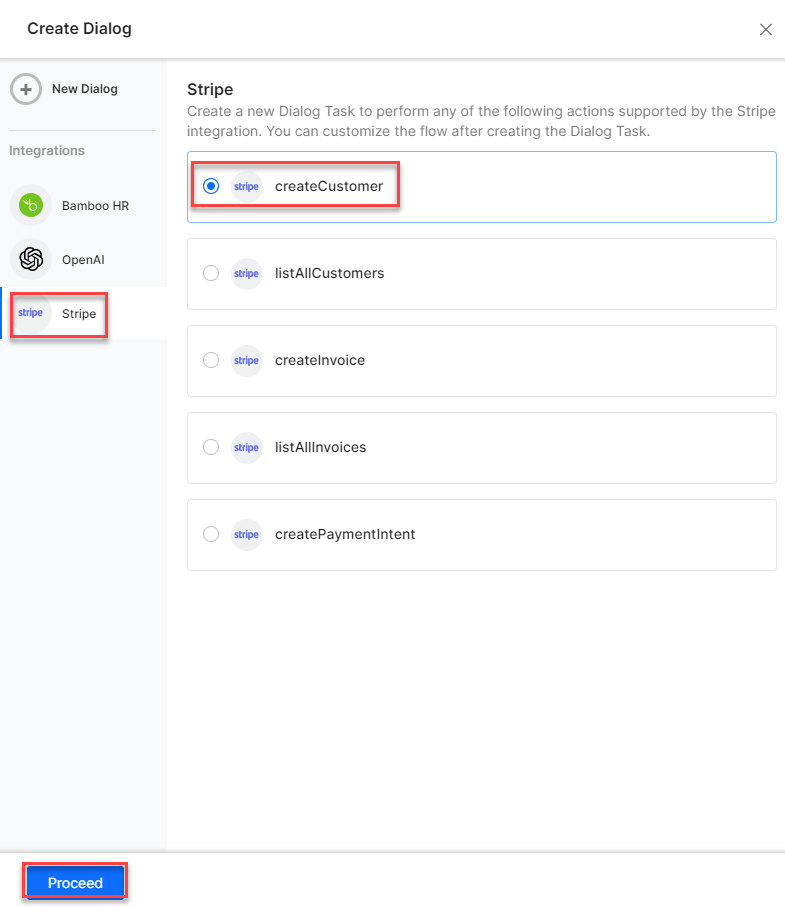

3. If no integration is configured, click **Explore Integrations** to set one up. See [Actions Overview](../actions.md).

   

---

## Supported Actions

| Task | Description | Method |
|---|---|---|
| Create a Customer | Creates a customer in the Stripe system. | POST |
| List All Customers | Retrieves all customers from the Stripe system. | GET |
| Create Invoice | Creates a new invoice in the system. | POST |
| List All Invoices | Retrieves all invoices in the Stripe system. | GET |
| Create a Payment Intent | Creates a payment intent in the Stripe system. | POST |

---

### Create a Customer

1. Install the template from [Stripe Action Templates](configuring-the-stripe-action.md#step-2-install-the-stripe-action-templates).
2. The _Create a Customer_ dialog task is added with the following components:

   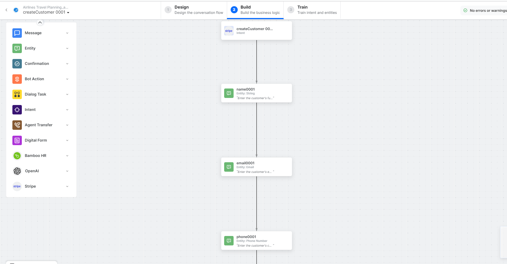

   - **createCustomer** - User intent to create a customer.
   - **name**, **email**, **phone** - Entity nodes for customer details.
   - **createCustomerService** - Bot action service to create a customer. Click **Edit Request**:

     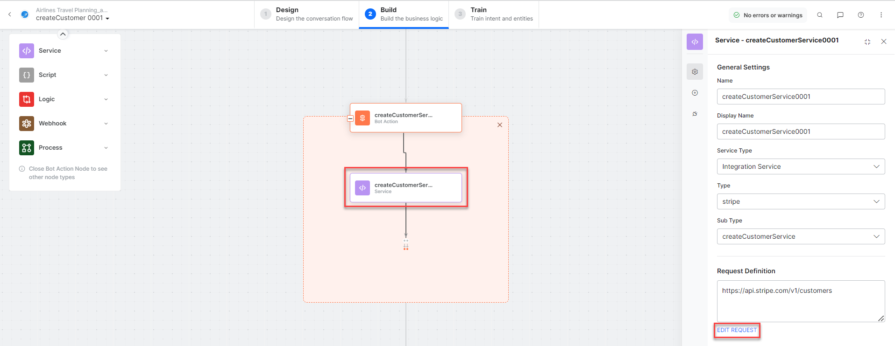

     **Sample Response:**
     ```json
     {
       "id": "cus_N42Fu5I7t3dDyu",
       "object": "customer",
       "email": "abc@xyz.com",
       "name": "Alan Walker",
       "phone": "7000028162",
       "livemode": false
     }
     ```

   - **createCustomerMessage** - Message node to display responses.

3. Click **Train**, then **Talk to Bot** to test:

   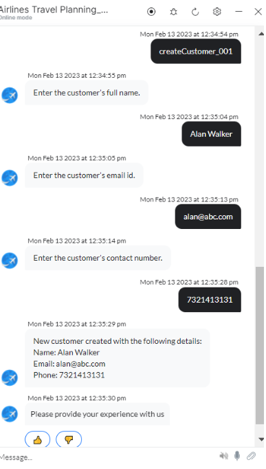

---

### List All Customers

1. Install the template from [Stripe Action Templates](configuring-the-stripe-action.md#step-2-install-the-stripe-action-templates).
2. The _List All Customers_ dialog task is added with the following components:

   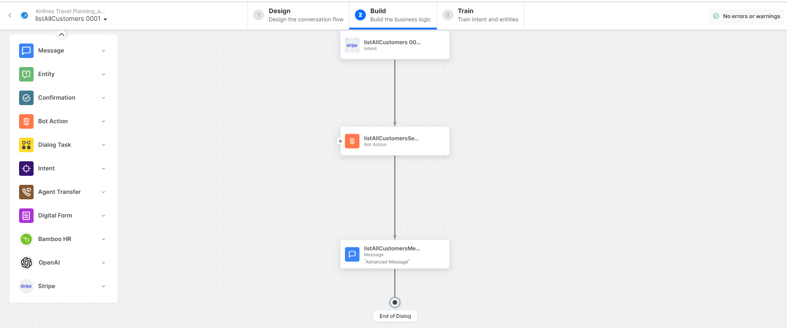

   - **listAllCustomers** - User intent to view all customers.
   - **listAllCustomersService** - Bot action service to fetch all customers. Click **Edit Request**:

     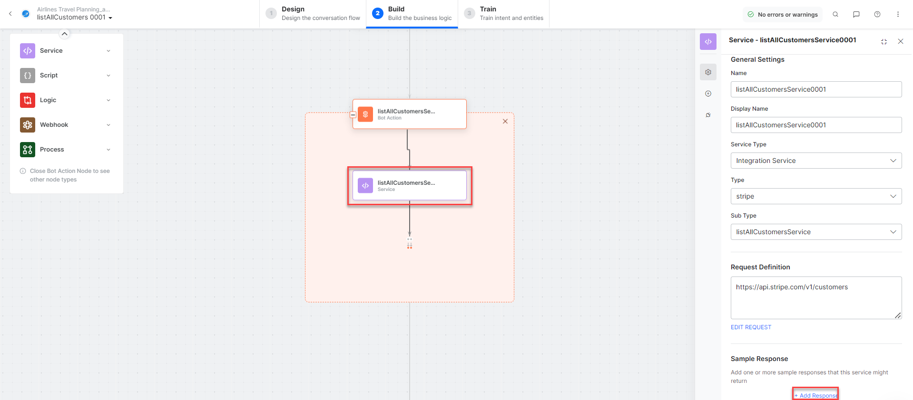

     Click **+Add Response** for sample responses.

   - **listAllCustomersMessage** - Message node to display responses.

3. Click **Train**, then **Talk to Bot** to test:

   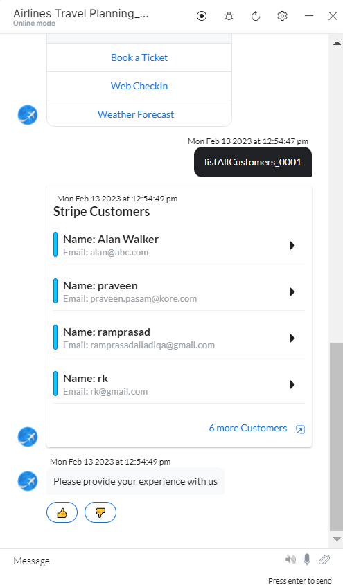

---

### Create an Invoice

1. Install the template from [Stripe Action Templates](configuring-the-stripe-action.md#step-2-install-the-stripe-action-templates).
2. The _Create an Invoice_ dialog task is added with the following components:

   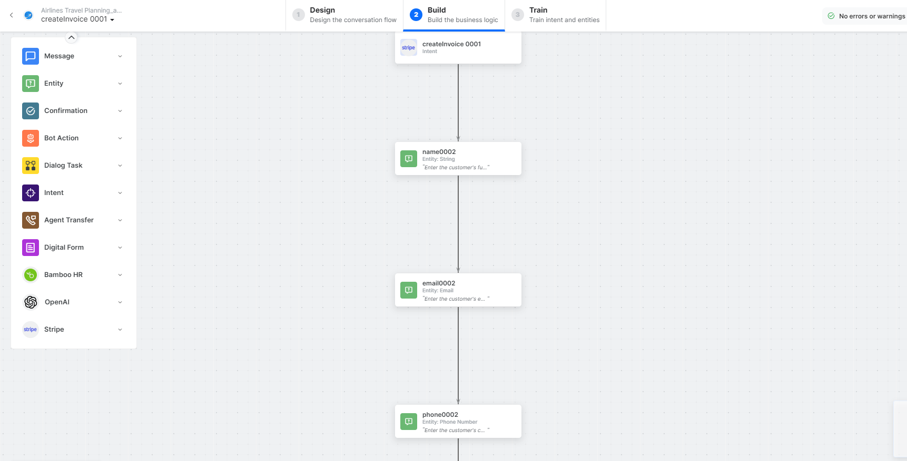

   - **createInvoice** - User intent to create an invoice.
   - **name**, **email**, **phone**, **dueDate**, **productName**, **productQuantity**, **unitAmount** - Entity nodes for invoice details.
   - **createInvoiceScript** - Bot action service to prepare invoice data.

     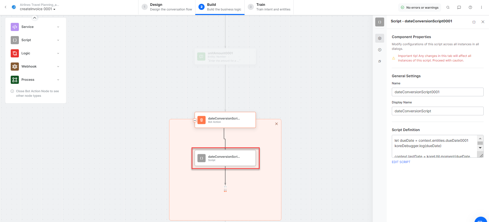

   - **createInvoiceService** - Bot action service to create an invoice. Click **Edit Request**:

     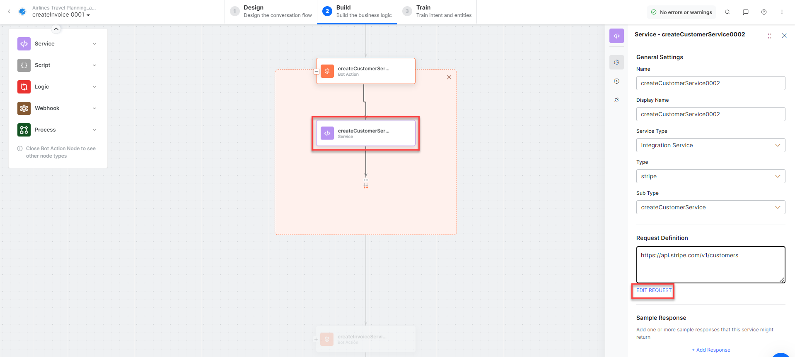

     **Sample Request:**
     ```
     customer: cus_N42Fu5I7t3dDyu
     collection_method: send_invoice
     due_date: 1704067199
     ```

   - **createInvoiceItemService** - Bot action service to create an invoice item.
   - **createInvoiceMessage** - Message node to display responses.

3. Click **Train**, then **Talk to Bot** to test:

   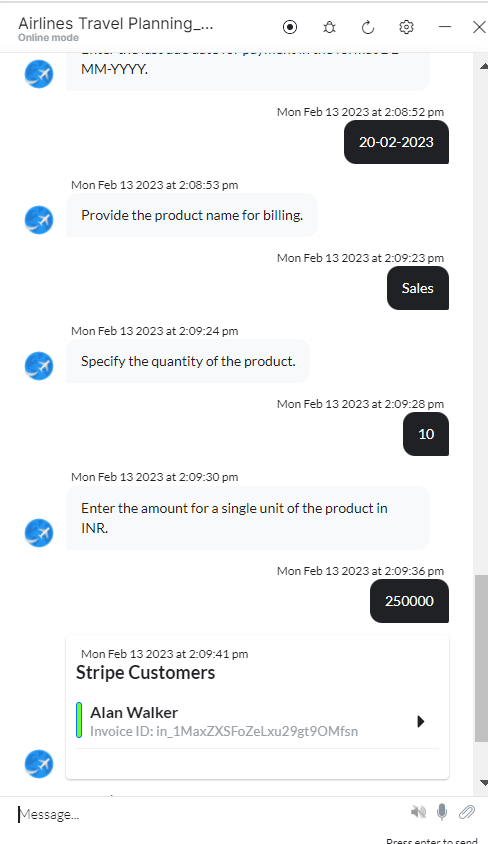

---

### List All Invoices

1. Install the template from [Stripe Action Templates](configuring-the-stripe-action.md#step-2-install-the-stripe-action-templates).
2. The _List All Invoices_ dialog task is added with the following components:

   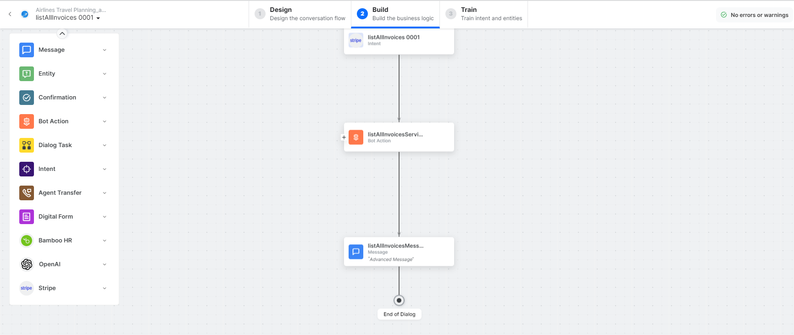

   - **listAllInvoices** - User intent to list all invoices.
   - **listAllInvoicesService** - Bot action service to fetch all invoices. Click **+Add Response**:

     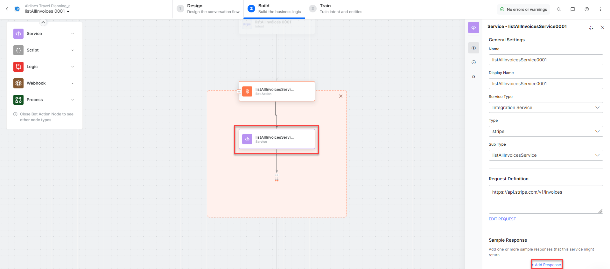

   - **listAllInvoicesMessage** - Message node to display responses.

3. Click **Train**, then **Talk to Bot** to test and follow prompts to view all invoices.

---

### Create a Payment Intent

1. Install the template from [Stripe Action Templates](configuring-the-stripe-action.md#step-2-install-the-stripe-action-templates).
2. The _Create a Payment Intent_ dialog task is added with the following components:

   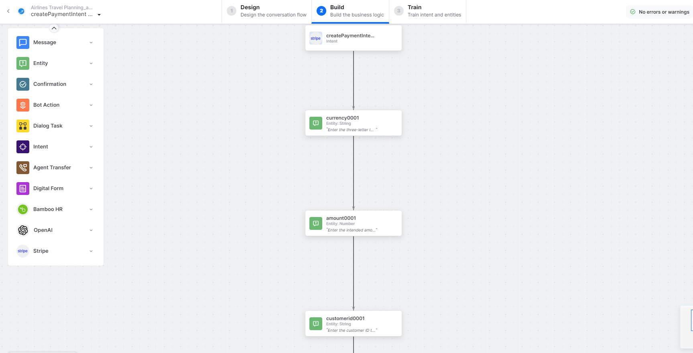

   - **createPaymentIntent** - User intent to make payments.
   - **currency**, **amount**, **customer** - Entity nodes for payment details.
   - **createPaymentIntentService** - Bot action service to create a payment intent. Click **Edit Request**:

     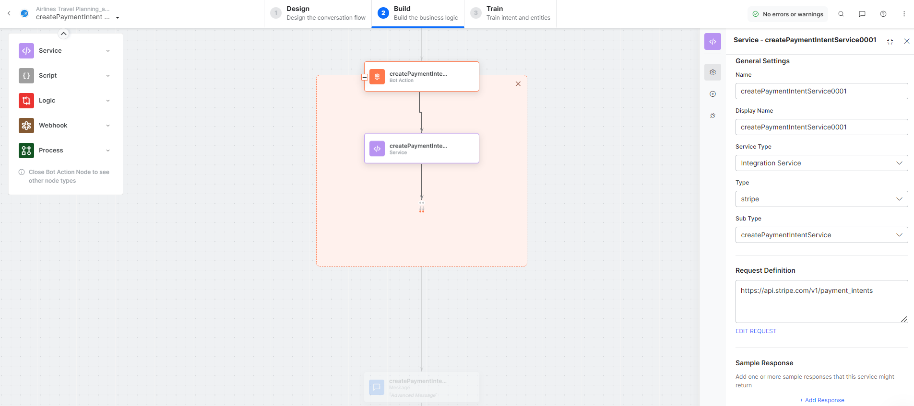

   - **createPaymentIntentMessage** - Message node to display responses.

3. Click **Train**, then **Talk to Bot** to test:

   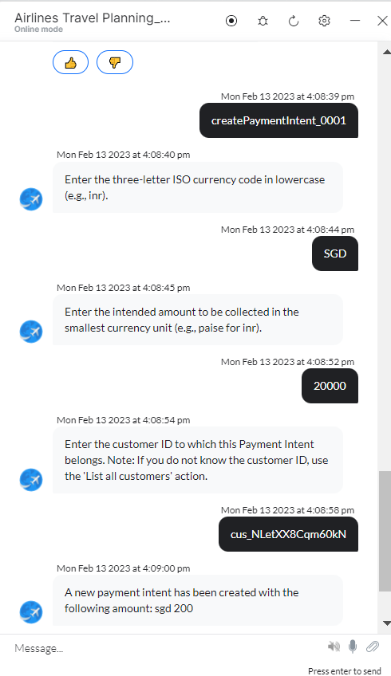
