<Badge icon="arrow-left" color="gray">[Back to Actions Integrations](/ai-for-service/integrations/overview#actions)</Badge>

Connect Twilio Verify to send SMS, start verification, and check verification. See [Twilio Verify](https://www.twilio.com/) for more information.

---

## Authorizations Supported

The XO Platform supports basic authentication for Twilio Verify. See [App Authorization Overview](../../../dev-tools/bot-authorization/bot-authentication.md) for details.

| Authorization Type | Basic Auth |
|---|---|
| Pre-authorize the Integration | Yes |
| Allow Users to Authorize the Integration | Yes |

---

## Step 1: Enable the Twilio Verify Action

**Prerequisites:**

- If you don't have Twilio Verify credentials, create a developer account. See [Twilio Verify Documentation](https://www.twilio.com/docs/sms).
- Copy the Account SID and Auth Token from your Twilio account.

**Steps:**

1. Go to **App Settings** > **Integrations** > **Actions**.
2. Select **Twilio Verify**.

### Pre-authorize the Integration

**Basic Auth**

1. Go to **App Settings** > **Integrations** > **Actions** and select **Twilio Verify**.
2. In **Configurations**, select the **Authorization** tab.
3. Set **Authorization Type** to **Pre-authorize the Integration** > **Basic Auth**.

   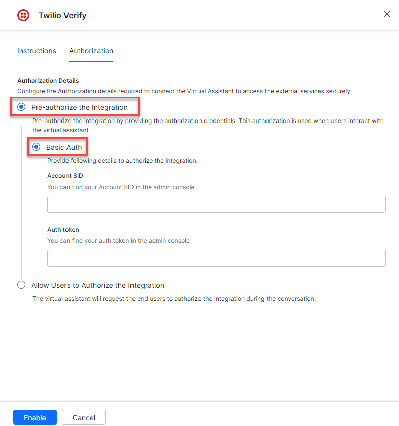

4. Enter the following details:
   - **Account SSID** - The account SID of your Twilio Verify account.
   - **Auth Token** - The authorization token of your Twilio Verify account.

   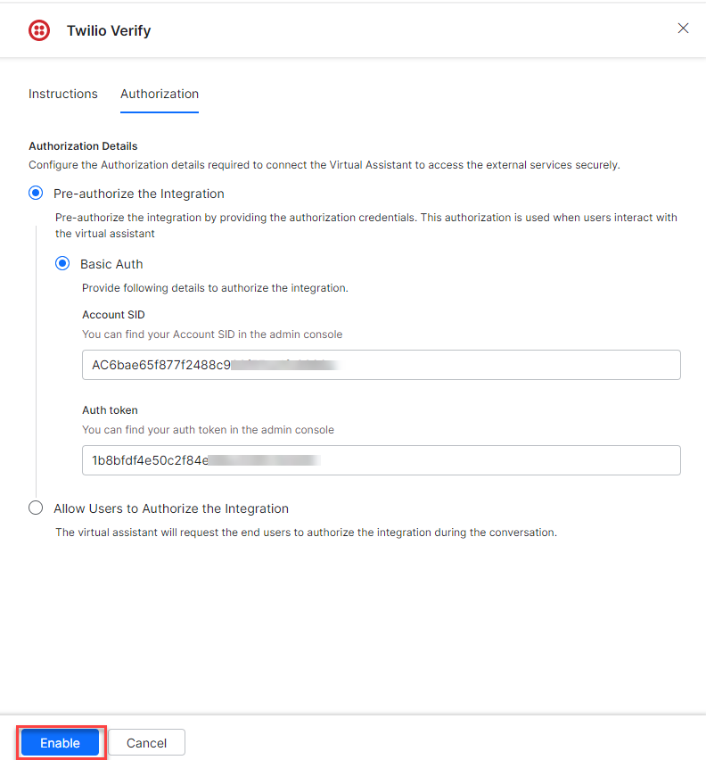

5. Click **Enable**. The **Integration Successful** pop-up is displayed.

   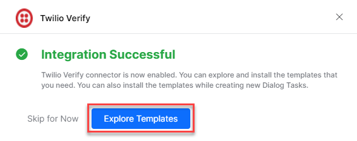

<Note>The Twilio Verify action moves from _Available_ to _Configured_ after enabling.</Note>

### Allow End User to Authorize

1. Go to **App Settings** > **Integrations** > **Actions** and select **Twilio Verify**.
2. In **Configurations**, select the **Authorization** tab.
3. Set **Authorization Type** to **Allow Users to Authorize the Integration** > **Basic Auth**.
4. Click **Select Authorization** > **Create New**.

   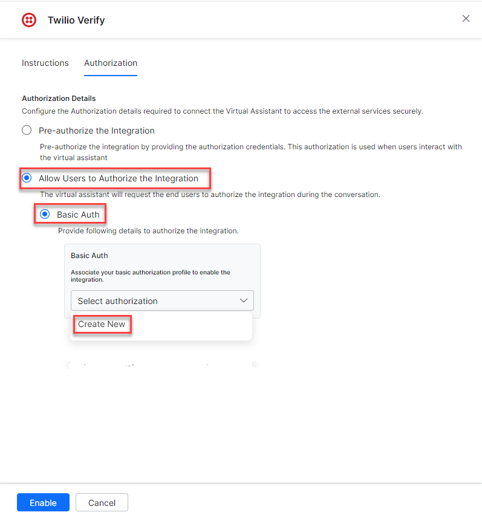

5. Select **Basic Auth** as the authorization mechanism. See [App Authorization Overview](../../../dev-tools/bot-authorization/bot-authentication.md).
6. Enter the following credentials:
   - **Name** - Name for the Basic Auth profile.
   - **Base URL** - Base tenant URL for the Twilio Verify instance.
   - **Authorization Check URL** - Authorization check URL for your Twilio Verify instance.
   - **Description** - Description of the profile.

7. Click **Save Auth**.

   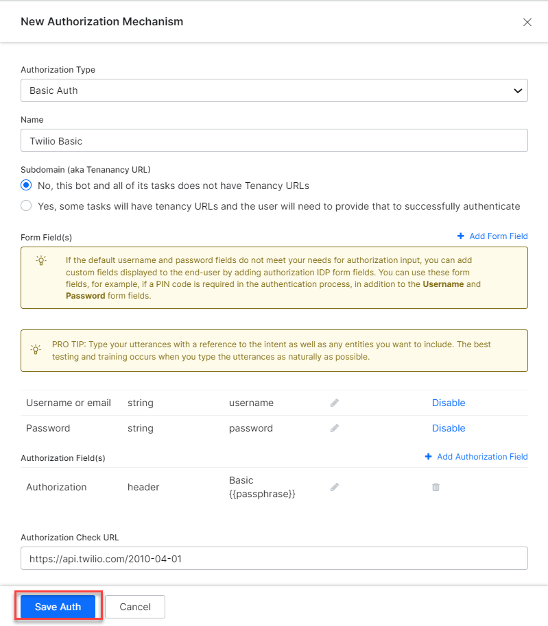

8. Select the new **Authorization Profile**.
9. Click **Enable**.

   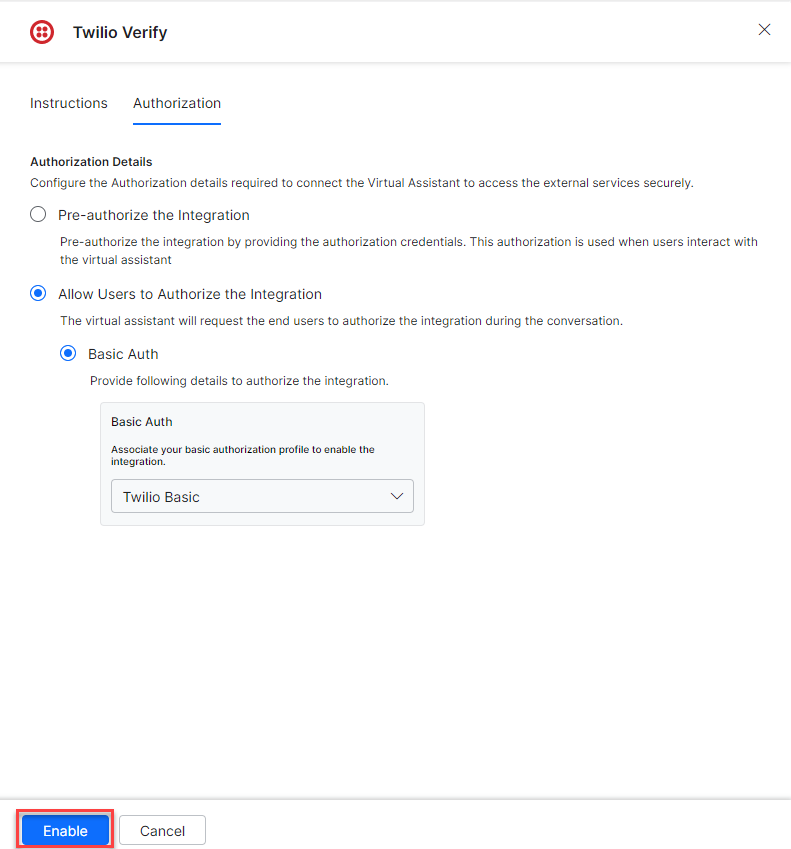

---

## Step 2: Install the Twilio Verify Action Templates

1. On the **Integration Successful** dialog, click **Explore Templates**.

   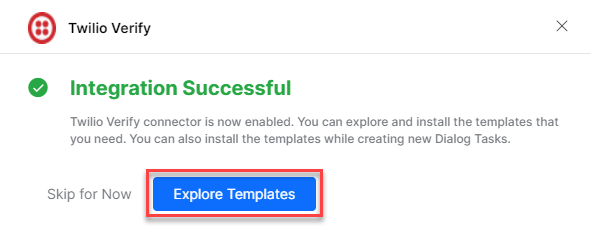

2. Click **Install** to begin installation.

   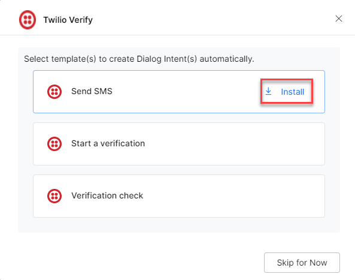

3. Once installed, click **Go to Dialog**. A dialog task for each template is auto-created.

   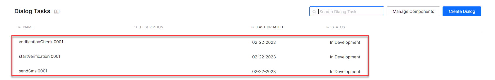

4. Select the desired dialog task and click **Proceed**.

   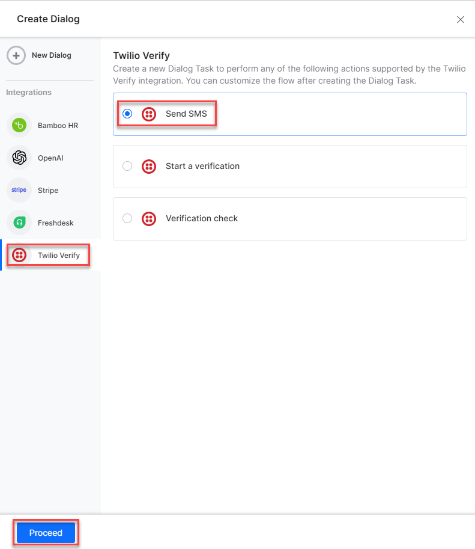

5. The dialog task is auto-created and the canvas opens with all required entity nodes, service nodes, and message scripts.

   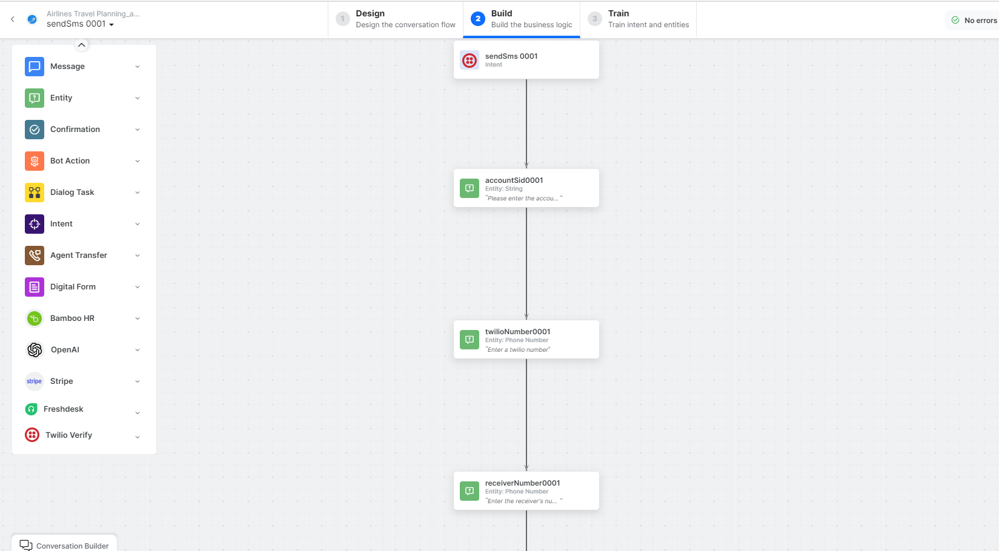
