This document provides information on the feature updates and enhancements introduced in **Contact Center AI** of AI for Service (XO) v11.x releases.

---

## v11.21.1 January 31, 2026

<u> Patch Release </u>

This update includes enhancements and bug fixes. The key enhancements included in this release are summarized below.

#### Console

**Enable Virtual Backgrounds for Agent Video Calls**

Agents can now apply, change, or remove virtual backgrounds during live video calls without interrupting the session. The feature supports predefined static and blur backgrounds, provides an in-call preview and selection UI, and works across all supported browsers and devices. Virtual backgrounds affect only the agent’s video stream, helping maintain brand consistency, protect privacy, and ensure a professional customer experience with no impact on call quality. [Learn more →](../../console/interacting-with-customers.md#apply-or-change-a-virtual-background-during-a-video-call)

**Agent-to-Customer Screen Sharing during Video Calls**

Agents can securely share a selected browser tab or application with customers during live audio or video calls to guide and resolve issues faster. The feature supports in-session start/stop controls, enforces encryption and audit logging, and automatically ends sharing when the call ends. The system controls access through a new Agent Screen Share permission and supports all compatible browsers without impacting call quality. [Learn more →](../../console/interacting-with-customers.md#agent-to-customer-screen-sharing)

#### Configuration

**Editable System Agent Status Labels**

Administrators can rename system-provided statuses such as Available, Away, and Busy to match internal terminology without affecting system behavior. Custom labels are supported in English, Korean, Chinese, Japanese, and German, with fallback to default names when translations are missing. Updated labels appear consistently across the Console, dashboards, and reports. [Learn more →](../../contactcenter/agent-and-supervisors/agent-management/agent-management.md#edit-an-agent-status)

**Priority-Based Queue Routing**

Contact Center AI supports an optional priority-based queue routing model that allows administrators to assign priority levels to queues. When enabled, agents assigned to multiple queues receive conversations from the highest-priority queue first, while maintaining FIFO order within each queue. Controlled by a system-level setting, defaults to existing routing behavior when disabled, and applies changes immediately without impacting active assignments or routing eligibility rules. [Learn more →](../../contactcenter/configurations/settings/queue-level-settings.md)

**Route Queued Conversations to Out of Business Hours Flow**

An optional system setting now routes queued conversations to the Out of Business Hours (OOBH) flow when OOBH is triggered. When enabled, queued interactions are routed to the configured OOBH flow, while agent-waiting interactions honor the existing wait time. The default behavior remains unchanged when disabled. [Learn more →](../../contactcenter/configurations/settings/queue-level-settings.md)

**Agent Utils Support for Dynamic Waiting Experience**

Flows now support a new Agent Utils function (`setWaitingExperience`) that lets developers to override the waiting experience at runtime dynamically. The most recently applied waiting experience takes precedence, enabling flows to override skill-based or earlier configurations without duplicating queues or logic. If an invalid waiting experience is provided, the system gracefully falls back to the default behavior without affecting the interaction. [Learn more →](../../flows/node-types/utils.md#set-waiting-experience)

#### Campaigns

**API Integration: Contact List Schema Change Handling**

When an API Integration contact list schema change affects linked campaigns, the system replaces existing columns and displays a warning listing the affected campaigns. Campaign filters are now read-only while a campaign is active, preventing changes during execution. [Learn more →](../../contactcenter/campaigns/list-management/list-management.md#api-integration)

**Campaign Dispositions: Map Positive Outcomes**

Campaign creation now lets users to mark specific dispositions as Positive Final Outcomes from the Dispositions tab. These selections persist and used in campaign scoring to produce more accurate, meaningful conversion metrics in analytics. [Learn more →](../../contactcenter/campaigns/campaign-management/voice-campaigns.md#dispositions)

**Redirect Agents to Console for Preview and Progressive Voice Campaigns**

For Preview and Progressive Voice Campaigns, when a call initiates while the allocated agent isn't logged in to the console, the system displays a notification dialog. It automatically redirects the agent to the console after 5 seconds. [Learn more →](../../contactcenter/campaigns/campaign-management/voice-campaigns.md#redirect-agents-to-console)

---

## v11.21.0 January 17, 2026

<u> Minor Release </u>

This update includes enhancements and bug fixes. The key enhancements included in this release are summarized below.

#### Console

**Agent Status Time Insights in the Console**

The Agent Console now provides Status Insights under Agent Status to display aggregated time spent across system and custom statuses, including conversational status. Agents can view day-level insights in a pop-up and access detailed breakdowns in My Dashboard. This improves visibility into work patterns without impacting the current agent status. [Learn more →](../../console/manage-layout.md#agent-status)

**Standard Response Widget: Replace and Append Support**

The Standard Response Widget supports Replace and Append actions to align with shortcut-based insertion. Agents can overwrite existing content or append multiple standard responses while preserving formatting and variables. For email, agents can optionally include or ignore the subject when replacing or appending, with subject options shown only when supported. When the editor is empty, only the Copy option appears, and focus returns to the editor after each action. [Learn more →](../../console/interacting-with-customers.md#emails)

**Queue-Level Consult Without Mandatory Agent Selection**

Agents can now initiate a consult by selecting only a queue, without choosing a specific agent. The system routes the consult to an available agent using existing routing logic, improving speed and usability. Direct agent selection remains supported with no impact to current routing, reporting, or monitoring behavior. [Learn more →](../../console/interacting-with-customers.md#queue-level-consult-without-selecting-an-agent)

**Courtesy Callback Redial Updates**

Courtesy callback redial now displays clear guidance for agents and supervisors. When the maximum number of redial attempts is reached, a Close Conversation option appears, directing the agent to the disposition screen. Supervisors attempting to assign such calls see a message: _“Maximum redial attempts reached for this number.”_ After the first or second failed attempt, the text updates to indicate the attempt failure while still allowing the agent to redial or return the call to the queue.

#### Configuration

**Agent Status Grouping by Queues and Operations**

Agents can now belong to multiple agent groups, and each group can be associated with a relevant set of custom agent statuses. Status visibility dynamically adjusts based on group membership, reducing clutter and improving operational clarity. All updates are applied in real-time across agent profiles and consoles, without impacting existing workflows. [Learn more →](../../contactcenter/agent-and-supervisors/agent-management/agent-management.md#create-an-agent-group)

**Named-Agent Transfer Wait Before Queue Fallback**

The system can hold a named-agent transfer for a configurable duration before routing it to the queue. If any named agent becomes available and accepts within the wait period, the conversation is assigned to that agent; otherwise, it falls back to existing queue routing. [Learn more →](../../flows/node-types/utils.md#set-named-agents)

**Parent–Child Permission Dependency Management**

This update enforces parent–child permission dependencies across the Agent Console and Monitor Tab, automatically disabling child permissions when the parent is set to No/View and restoring them when re-enabled.

It also resolves an earlier issue with Transfer/Close Multiple Conversations by splitting it into three granular permissions: Assign Conversations, Change Queue, and Force Close Conversations (individual or multiple). These permissions inherit their values from the parent setting, and administrators can review and update them to Yes or No as needed. [Learn more →](../../user-management/role-management.md#permissions)

**Alerts for Extended After Call Work**

This feature enables SLA-based alerts for After Call Work (ACW) by allowing admins to configure threshold conditions at the queue and channel level. When an agent’s ACW duration meets the configured condition, the system triggers a General Alert and notifies configured recipients via in-app notifications and/or email, including relevant details. The alert setup is fully configurable and doesn't affect existing ACW behavior when disabled. [Learn more →](../../contactcenter/performance-management/slas-and-alerts.md#create-a-general-alert)

#### Campaigns

**Power Dialer for Voice Campaigns**

The new Power Dialer mode dynamically selects and dials contacts based on agent availability and pacing ratios to reduce call abandonment. The feature intelligently prioritizes contacts and reserves agents during dialing to ensure an immediate connection. New global settings permit configurable control over agent linking and idle time, improving campaign efficiency. [Learn more →](../../contactcenter/campaigns/campaign-management/voice-campaigns.md#power-dialer)

**Per-campaign Dispositions vs Attempts Dashboard Table**

Provides a campaign-level view that correlates outbound attempts with their final dispositions. This enables campaign managers to assess how attempts progress and where outcomes converge as campaigns near completion. [Learn more →](../../contactcenter/campaigns/dashboard/campaign-dashboard.md#disposition)

**Disposition-based Retry Configuration for Campaigns**

Added a disposition-level retry configuration for Preview, Progressive, and Power Dialer campaigns, allowing campaign managers to define retry eligibility, retry count, and retry intervals per disposition. Campaign dashboards also display current disposition counts to provide visibility into retry outcomes during or after execution. [Learn more →](../../contactcenter/campaigns/campaign-management/voice-campaigns.md#dispositions)

**Automatic Enrollment of Unreachable Contacts into Global DNC**

An app-level control automatically enrolls phone numbers into the Global DNC list when repeated call attempts fail. The capability supports configurable attempt thresholds and retention periods, ensuring cleaner contact lists and reduced unnecessary dialing while preserving existing behavior by default. [Learn more →](../../contactcenter/campaigns/settings/global-settings.md#unanswered-call-attempts)

#### Analytics

**CSAT Feedback Visibility in Conversations Details**

Displays customer CSAT feedback directly within the Conversations details view, enabling quick visibility of submitted comments. The feedback appears contextually alongside CSAT information for improved review and insights. [Learn more →](../../analytics/overview/conversations.md#insights-to-logs)

**Error Event Visibility for Real-time Voice APIs in Agentic Apps**

Error events from real-time voice APIs are now captured and displayed in Interaction Details when a response generation failure occurs. The transcript timeline shows a clear LLM error indicator with a timestamp, along with the full provider error message for improved troubleshooting and audit visibility. [Learn more →](../../analytics/overview/conversations.md#insights-to-logs)

**Voice Interaction Latency Metrics**

The Conversations → Insights to Logs → Transcriptions tab now displays latency metrics for Voice interactions to help evaluate responsiveness. Customer messages show ASR latency, while bot messages show Bot, TTS, and End-to-End latency (only when a bot message follows a customer message). Unavailable values display as NA, and the entire latency block appears only for the Voice channel. [Learn more →](../../analytics/overview/conversations.md#insights-to-logs)

#### API

**Schedule Campaign API for Voice and SMS**

A new ScheduleCampaign API enables scheduling for Voice and SMS campaigns. The API permits enabling or disabling scheduling for a campaign and overrides any existing schedule when enabled. It supports UTC-based start and end times with Daily or Weekly recurrence options, while returning a standard status and message response. [Learn more →](../../apis/contact-center/enable-voice-or-sms-campaign-schedule-daily.md)

**Contact Management APIs: Create, Update, and Delete**

The platform now supports a complete set of Contact Management APIs, including Create (existing), Update, and Delete operations. These APIs enable external systems to keep contact data synchronized, support partial updates, and permit safe deletion without impacting historical interactions. All operations enforce validation, permissions, and auditing, and remain backward compatible. [Learn more →](../../apis/contact-center/get-all-contacts.md)

---

## v11.20.0 December 07, 2025

<u> Minor Release </u>

This update includes enhancements and bug fixes. The key enhancements included in this release are summarized below.

#### Console

**Session Transfer and Access Control Enhancements**

The Console enforces controlled session transfers across multiple tabs, windows, or browsers to maintain consistent and secure access. A new event log entry captures session transfer confirmations for improved auditing and compliance. [Learn more →](../../contactcenter/configurations/settings/active-console-configuration.md)

**Email Send Confirmation for Predefined Responses**

The Agent Console now includes a confirmation step before sending predefined email responses, preventing accidental or incorrect outbound messages. Agents receive a prompt when selecting Send, allowing them to either send the email immediately or review and edit the content first. [Learn more →](../../console/interacting-with-customers.md#emails)

**Default post-contact Survey Trigger**

The post-contact survey trigger now appears enabled by default for agents when survey triggering is configured. This change supports higher survey participation and ensures consistent handling across conversations. Agents can turn it off when needed, and existing applications retain their current behavior. [Learn more →](../../console/interacting-with-customers.md#csat-survey) 

**Call History Tab Personalization**

The Call History tab now displays only the outbound calls made by the logged-in agent, providing a focused and personalized view of their call activity. [Learn more →](../../console/conversation-tray.md#call-history)

#### Configuration

**Enhanced OnConnect Message Controls**

OnConnect messages now support Queue, Skill, and Queue + Skill mappings for more targeted communication. The system applies the most specific match while preserving existing queue-based setups. A new toggle lets email OnConnect messages to act as one-time acknowledgment mails, triggering only on the first agent connection when enabled. [Learn more →](../../contactcenter/agent-and-supervisors/agent-management/agent-management.md#conversation-statuses-by-channel-live-chat-messaging-and-voice)

**Download Restrictions for Interaction Data**

A new permission now controls the ability to download transcripts, recordings, events, and latency reports from the Interactions tab. The Download Interaction Data permission determines who can export sensitive interaction information. [Learn more →](../../user-management/role-management.md#permissions)

**Enhanced Snooze Controls and Logout Flexibility**

Snooze settings now support custom date-and-time durations alongside quick options, enabling precise follow-ups and improved conversation handling. Agents can log out even when snoozed items remain in the tray, and administrators can configure channel-specific rules, mandatory notes, and message behaviors to support compliance and operational needs. [Learn more →](../../contactcenter/agent-and-supervisors/agent-management/agent-management.md#snooze)

**Queue-level Phone Number and Email Mapping**

Phone numbers and email addresses can now be configured at the queue level to give agents a focused, relevant selection during outbound actions. This enhancement improves efficiency by showing only queue-mapped options while still supporting access to the full list when permitted. [Learn more →](../../contactcenter/configurations/settings/queue-level-settings.md)

#### Flows

**Improved Asynchronous Error Handling in Connect to API Node**

The Connect to API node now supports handling client (4xx) and server (5xx) errors or failure responses in Asynchronous mode. A new ‘Handle API Failure Responses’ option lets flows detect these errors immediately and route execution to the configured onFailure path, preventing hung sessions. 

[Learn more →](../../flows/node-types/connect-to-api.md#general-settings)

#### Campaigns

**Campaign Suppression Behavior**

The system now reevaluates suppressed campaigns as soon as the suppression condition expires. Campaigns become eligible again when cool downs end, active chats close, or conflicting campaign templates no longer apply. Because this is an event-driven process, the system reconsiders a suppressed campaign for display only when a new event triggers evaluation. [Learn more →](../../contactcenter/campaigns/campaign-management/proactive-web-campaigns.md#campaign-suppression-and-re-evaluation)

**Global and Campaign-Specific DNCs Now Mandatory**

The platform now enforces the use of both Global and Campaign-specific Do Not Call (DNC) lists to ensure compliance and consistent campaign management. A default Global DNC list is automatically created for new accounts or when Campaigns are enabled. Only one Global DNC can exist at a time, and selecting a DNC list is now mandatory during Voice Campaign creation. [Learn more →](../../contactcenter/campaigns/list-management/list-management.md#dnc-lists)

**Handling of DNCs - Global and Non-Global**

Global DNC (GDL) lists automatically apply to all Voice Campaigns, followed by Campaign DNC (CDL) lists. Voice Campaigns use both GDL and CDL for contact filtering, while SMS and Proactive campaigns rely only on their respective DNC lists. Changes to Global DNCs don't impact active or paused campaigns, ensuring campaign stability. [Learn more →](../../contactcenter/campaigns/list-management/list-management.md#handling-of-dncs-global-and-non-global)

**Disable Answering Machine Detection (AMD) for Preview and Progressive Modes**

Answering Machine Detection (AMD) is now disabled for Preview and Progressive dialing modes to provide consistent call behavior. For Agentless campaigns, AMD remains available with configurable detection options, offering improved accuracy and reliability in call outcomes. 

**Latest Execution List View**

The Latest Execution List View now displays all calls from the most recent or active campaign run, with key call details. Users can view call information, identify calls excluded by filters or DNC lists, and access conversation details to better understand campaign outcomes. [Learn more →](../../contactcenter/campaigns/dashboard/campaign-dashboard.md#latest-execution)

**Inform Agent Info and Availability**

Campaigns now maintain accurate, real-time information on agent queues, skills, and availability. This enhancement ensures that campaigns always have up-to-date agent data, enabling efficient workload management and appropriate call assignment.

**DNCs - List View UI Changes**

The DNC list view now displays all numbers in a selected DNC list, along with their validity details. Only one list per application can be marked as Global, and marking a new list as Global automatically removes the previous Global status. [Learn more →](../../contactcenter/campaigns/list-management/list-management.md#mark-as-global)

**Contact Center AI and Agent Desktop Updates**

Disposition codes now include a Type field for improved categorization. When agents select “Call-Me-Later” or “Agent-Call-Me-Later,” they must specify a callback time, ensuring better scheduling and follow-up accuracy. [Learn more →](../../console/interacting-with-customers.md#disposition-handling-for-campaigns)

**Contact Lists - Support for Agent-Customer Relationships**

Contact lists can now include Agent IDs to establish direct agent-customer relationships. This enhancement lets campaigns to prioritize high-value customers and use relationship-based dialing to improve engagement efficiency. [Learn more →](../../contactcenter/campaigns/list-management/list-management.md#agent-mapping)

**Dynamic Contact Filters**

Campaigns now support dynamic filters, enabling campaign managers to define precise contact subsets based on specific conditions. This feature ensures targeted outreach, improved segmentation, and better campaign performance through automated filtering and updates. [Learn more →](../../contactcenter/campaigns/campaign-management/voice-campaigns.md#create-voice-campaigns)

#### Analytics

**Interactions Dashboard - Email Channel Details**

The dashboard now includes key email fields—Subject, From, To, CC, and BCC—within the transcript for clearer visibility of email interactions. The EmailSubject field is available as an optional column, and all email fields are searchable, helping users  locate relevant conversations. [Learn more →](../../analytics/overview/conversations.md#insights-to-logs)

**Interactions Dashboard - SmartStatus Filter**

The dashboard now supports filtering by SmartStatus, a new, fine-grained, business-relevant version of the conversation status. The Details tab displays both the original Status and the new SmartStatus for the conversations. [Learn more →](../../analytics/overview/conversations.md#smartstatus)

---

## v11.19.1 November 19, 2025

<u> Patch Release </u>

This update includes enhancements and bug fixes. The key enhancements included in this release are summarized below.

#### Campaigns

**Export and Import Web Campaigns**

The platform now supports exporting and importing artifacts for Proactive Web Campaigns. This feature lets users to replicate and reuse entire campaign configurations across different apps, workspaces, or environments, ensuring consistency and significantly reducing setup time. [Learn more →](../../contactcenter/campaigns/campaign-management/proactive-web-campaigns.md#export-and-import-web-campaigns)

**Proactive Web Campaign Logs**

A new Logs section offers enhanced visibility into web campaign activity. Users can review recent campaign events, apply date-based filters, and export logs for analysis, ensuring better visibility into campaign performance. [Learn more →](../../contactcenter/campaigns/campaign-management/logs.md)  

#### API

**Call Details API (v1) - Enhanced with Disconnect Event Fields**

The Call Details API (v1) now includes disconnect event fields, providing better visibility into conversation termination details. This enhancement maintains backward compatibility while improving reporting and analytics. [Learn more →](../../apis/contact-center/get-all-conversations-data-call-details-v1.md) 

---

## v11.19.0 October 25, 2025

<u> Minor Release </u>

This update includes enhancements and bug fixes. The key enhancements included in this release are summarized below.

#### Console

**Email Inline Suggestions and Contact Management**

Agents now receive inline email suggestions as they type in the To, CC, and BCC fields, pulled from a company-wide address book. Administrators can manage the contact list using a CSV upload, including names, emails, and tags. The system prevents duplicate or invalid addresses while allowing multiple contact selection. [Learn more →](../../console/interacting-with-customers.md#emails)

**Email Threading Support**

Contact Center AI now supports email conversation threading using standard email headers. Previously, emails sent to external clients appeared as separate messages even within the same thread. To resolve this, threading logic has been implemented using Message-ID and Reference headers, ensuring replies are correctly linked to their original email chains. This enhancement enables seamless conversation continuity, so both internal users and external recipients view related messages as part of the same thread. Existing console threading remains available for backward compatibility. [Learn more →](../../console/interacting-with-customers.md#emails)

**Email Forwarding**

Agents can forward email conversations to internal or external recipients, preserving the full thread. Forwards include "Fwd:" prefix, maintain all formatting, images, links, and attachments (with per-file selection), and allow adding custom text before sending.  
[Learn more →](../../console/interacting-with-customers.md#emails)

**Editable TO, CC, and BCC Fields in Email Replies and Forward**

Agents can now edit TO, CC, and BCC fields when replying, replying all, or forwarding emails, with support for multiple recipients and validation. Replies preserve threading using Message-ID and Reply-To. Forward opens with empty fields. Administrators can enable or disable this feature account-wide; it's enabled by default. [Learn more →](../../console/interacting-with-customers.md#emails)

#### Configuration

**Queue-Level OnConnect Message Configuration for All Channels**

Administrators can now configure queue-specific OnConnect messages for all channels, including Email, with the default message acting as a fallback. Queue-level messages override the global message, providing context-aware greetings for customers while maintaining existing Voice and Chat behavior. [Learn more →](../../contactcenter/agent-and-supervisors/agent-management/agent-management.md#conversation-statuses-by-channel-live-chat-messaging-and-voice)

**End-of-Conversation Event Triggers on User Chat Termination**

Administrators can configure a custom command that contains at least 6 characters, including one special character. When a user types this command, it automatically triggers the End-of-Conversation Event on the Agent AI Widget. [Learn more →](../../contactcenter/agent-and-supervisors/agent-management/agent-management.md#conversation-statuses-by-channel-live-chat-messaging-and-voice)

**Extend Email Session Timers**

Email sessions can now remain active until manually closed, with configurable timers extending up to 30 days. Administrators can adjust queue wait time, overdue, inactivity, and auto expiry settings to prevent premature session closure. Default settings remain unchanged for backward compatibility. [Learn more →](../../contactcenter/agent-and-supervisors/agent-management/agent-management.md#additional-routing-configuration)

#### Analytics

**Bulk Transfer of Chats, Calls and Emails to a Human Agent**

Supervisors can transfer multiple chats, calls, and emails simultaneously from the Agents or Queue tabs to specific agents or queues. Transfers respect agent capacity, channel eligibility, and status restrictions, and automatically notifies of failures or overload situations. Role-based permissions control access, and blended accounts are required for multi-channel transfers. [Learn more →](../../console/monitor-queues-agents-and-interactions.md#transfer-all-callschatsemails-to-a-human-agent)

#### API

**Call Details API: Callback and External Transfer Tracking**

The Call Details API now captures callback and external transfer events with new tracking fields. QueueEntry includes CallbackOpted, CallbackOptedTime, and CallbackInitiatedTime for both caller and system-initiated callbacks. AgentTransfer objects add ExternalTransferTime and ExternalTransferDestination fields for transfers to external parties, improving call-handling metrics and reporting accuracy. [Learn more →](../../apis/contact-center/get-all-conversations-data-call-details-v2.md)

---

## v11.18.0 September 27, 2025

<u> Minor Release </u>

This update includes enhancements and bug fixes. The key enhancements included in this release are summarized below.

#### Console

**Extend Sentiment Analysis to Voice and Email Channels**

Sentiment analysis is extended to voice and email interactions for a unified experience. Voice sentiment is derived from transcribed text, and email sentiment comes from the message body. Results follow the same visualization as chat and are available in the Agent Desktop, Monitor tab, and Dashboards. The enhancement reuses the existing Sentiment Analysis setting in Advanced Settings, with no new configuration required. When disabled, no data is captured; when enabled, sentiment is consistently available for chat, voice, and email. [Learn more →](../../console/interacting-with-customers.md#real-time-sentiment-capture)

**Maximize External Widgets**

Contact Center agents can maximize external widgets in the Console to view and interact with their full content. A Maximize button opens the widget in a resizable, draggable overlay within the interface, while the original layout remains unchanged. Only one widget can be expanded at a time, and it stays on top while switching conversations, automatically updating content for the active conversation. Minimizing or closing the widget returns it to its original size and position, improving accessibility and efficiency without altering supervisor-configured layouts. [Learn more →](../../console/manage-layout.md#maximize-external-widgets)

**Email Resend Capability**

Agents and supervisors can resend emails directly from the Console. The “Resend” button opens the email composer with the original content and recipient prefilled, allowing edits to the message body or attachments before sending. Resent emails retain formatting and references, are sent as new interactions, and are linked to the original email in the timeline for audit and traceability, improving efficiency and communication accuracy. [Learn more →](../../console/interacting-with-customers.md#emails)

#### Configuration

**Conditional Group Routing (CGR)**

Conditional Group Routing (CGR) dynamically expands the pool of agents across queues to optimize utilization and reduce customer wait times. Administrators can configure rule-based sharing of agents between queues within the same division, using KPIs such as Estimated Wait Time (EWT) and Average Handle Time (AHT), combined with real-time agent availability. The system evaluates rules sequentially and in real-time, incrementally adjusting the agent pool, enforcing wait periods, and optimizing assignments to maintain service levels. [Learn more →](../../contactcenter/routing/queues/queue-management.md#queue-routing-modes)

**Honor Agent Wait Time Before Queue Timeout**

A new toggle in **Agent Settings** → **Answer Mode** ensures conversations honor the full agent wait timeout before applying the queue wait timeout. When enabled, the queue timeout pauses while the conversation waits for agent acceptance, preventing premature closures. By default, the toggle is disabled for backward compatibility. [Learn more →](../../contactcenter/agent-and-supervisors/agent-management/agent-management.md#honor-agent-wait-before-queue-timeout)

**Remove Chats When Disconnected in Queue and Control Interruption Messages**

Administrators can now configure separate timers for customer interruptions: one for chats in queue (default: 30 seconds) and another for after the agent accepts the call. Disconnected chats while in the queue are removed from the agent tray based on the configured queue timer. Disconnected chats after an agent has handled them remain in the agent tray for the duration set under Customer Interruption after agent transfer. Interruption messages for customers and agents can be enabled, disabled, or customized as needed. [Learn more →](../../contactcenter/agent-and-supervisors/agent-management/agent-management.md#conversation-statuses-by-channel-live-chat-messaging-and-voice)

**Application-Level System Settings for Call Recording and Other Agent Controls**

Key settings, including Call Recording Control and Answer Call on First AI Agent Response, are now moved to System Settings, enabling cross-product access for customers. LLM Streaming flag removed from Advanced Settings. [Learn more →](../../app-settings/advanced-settings/system-settings.md)

**SLA Configuration UI Revamp**

The SLA configuration screen now opens as an inline overlay for consistency with other configuration screens, allowing users to add, edit, and delete SLAs while retaining all existing functionality and validations. [Learn more →](../../contactcenter/performance-management/slas-and-alerts.md)

**Removal of Inbound Option from User Attributes**

The Inbound option in **User Attributes** → **Enable Voice** has been removed as inbound voice calls are always enabled for all users. Its removal simplifies the configuration experience, with no impact on existing functionality. [Learn more →](../../user-management/manage-users.md#chat-voice)

#### Campaigns

**Voice Campaigns: Support for Experience Flows Without Phone Numbers**

Voice campaigns can now be associated with experience flows that don't include phone numbers, extending support to agentless, progressive, and preview campaigns. The Caller ID dropdown lists all eligible outbound-only and inbound-outbound numbers, regardless of flow association. For active, scheduled, or paused campaigns, linked numbers and flows can't be deleted. [Learn more →](../../contactcenter/campaigns/campaign-management/voice-campaigns.md)

#### Analytics

**Change Logs for Contact Center AI**

The Contact Center AI logs are now integrated into the Change Logs under **App Settings** → **App Profile**. All CCAI log entries generated after the cutoff date are stored in this new repository and displayed in the proper format, including the app name. The Admin Console’s Audit Log will no longer capture CCAI activity after the cutoff date; older entries remain accessible there for reference. This ensures a clear separation between Admin Console operations and Contact Center AI change tracking. [Learn more →](../../app-settings/change-logs.md)

**Latency Report (Beta)**

The Latency Report provides visibility into ASR, Bot, TTS, and end-to-end delays at node and call levels. Users can generate latency data for specific calls by enabling the relevant call control parameters, and only these calls will offer the option to download the Latency Report. Administrators can apply threshold-based filters to identify calls that exceed defined latency values. The report is available in CSV format, with key fields including Session ID, Agent, Queue, CSAT, and latency metrics. A new option in the Interactions page allows downloading a component-wise latency report for detailed analysis of delays. [Learn more →](../../analytics/contact-center/reports/latency-report.md)

**Debug Log for Flows**

Contact Center AI nodes now support debug logging within the Flow Builder, extending the existing debug log functionality. Users can view detailed, real-time logs for each step in a flow, including timestamps, step names, input/output data, error messages, and context variables, similar to those found in automation nodes. Logs cover triggers, node execution, task assignments, notifications, digital forms, human tasks, actions taken, and flow completion. [Learn more →](../../contactcenter/flows-and-routing/debugging-and-troubleshooting.md)

**Bulk Transfer and End of Calls, Chats, and Emails in Agent Queues**

App Owner, Administrators, Supervisors, and App Developers can bulk transfer or end multiple conversations across chat, email, and voice channels directly from the Monitor tab. Users can select a queue, view active conversations, and perform multi-selection to transfer conversations to another queue or end them with a confirmation. This update streamlines workload management, improves operational flexibility, and reduces manual effort in handling agent queues. [Learn more →](../../console/monitor-queues-agents-and-interactions.md#transfer-conversations-to-a-queue)

#### API

**Secure Forms and PII Data Access Using GetMessagesV2 API**

The GetMessagesV2 API has been enhanced to support secure access to form data. In the GET method, a new query parameter `includeSecureForm` is included, and in the POST method, a new field `includeSecureForm` is included in the request body. When enabled, both options include the form inputs submitted by users in the response, extending access to secure form and PII data. [Learn more →](../../apis/automation/conversation-history.md)

**Campaign Creation API: Support for SIP Numbers as Caller ID**

The Campaign Creation API now supports using pre-registered SIP numbers as Caller ID across all dialing modes. This enhancement expands flexibility in configuring Caller ID for campaigns, allowing SIP phone numbers to be set in addition to existing options.

---

## v11.17.1 September 15, 2025

<u> Patch Release </u>

This update includes enhancements and bug fixes. The key enhancements included in this release are summarized below.

#### Analytics

**Obscuring Customer Information in Interactions Dashboard, Export, and Details Slider**

New advanced settings enable customers to control how end-user information appears in the Interactions dashboard. Three configuration options are available:  

* **Replace Customer Column with User ID on main page** - displays the User ID instead of email or phone in the dashboard.  
* **Disable Userinfo tab in Details slider** - hides the Userinfo tab from the Details slider.  
* **Replace Customer Column with User ID in export file** – shows User ID instead of email or phone in exported reports.  
All options are disabled by default, and customers who don't enable them will see no change in behavior. [Learn more →](../../contactcenter/configurations/settings/obscure-customer-info-in-analytics-interactions.md)  
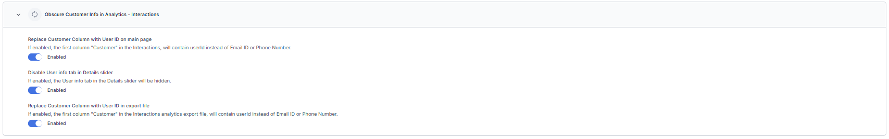

---

## v11.17.0 August 23, 2025

<u> Minor Release </u>

This update includes enhancements and bug fixes. The key enhancements included in this release are summarized below.

#### Console

**Translation Support for Historical Digital Conversations**

The Chat History Tab now supports translation for past digital interactions, using the same controls and settings as the Live Agent Console. This update enables agents, supervisors, and auditors to review multilingual conversations without the need for external tools, ensures consistent UI behavior, and prevents redundant translation calls. [Learn more →](../../console/additional-tools.md#translate-historical-digital-conversations)

**Email Arrival Summarization, AI Content Disclaimer, and Fallback Message**

Email interactions now include arrival summaries with intent, sentiment, queue details, and wait time, bringing feature parity with other channels. All LLM-generated summaries display the disclaimer “_AI-generated content - verify before using_” to ensure transparency. When summarization is disabled or fails, the system shows the fallback message “_Summarization is disabled_.” Existing summarization workflows in other channels remain unaffected. This enhancement improves agent context, supports compliance, and provides clear user feedback. [Learn more →](../../console/interacting-with-customers.md#emails)

**Improved New Message Handling in Agent Console**

The agent console no longer auto scrolls when new user messages arrive, preventing disruption during conversation review. Instead, a floating “New Messages” option appears if the agent has scrolled up. Selecting the option scrolls to the latest message, after which the option disappears. This update enhances usability, preserves reading context, and grants agents complete control over when to view new messages. [Learn more →](../../console/interacting-with-customers.md#viewing-new-messages-in-the-console)

**GenAI-Based Disposition Prediction for Agent Wrap-Up**

Contact Center Agents now receive AI-generated disposition code suggestions at the end of conversations. Using LLM analysis of the full transcript and disposition set metadata, the system recommends the most relevant wrap-up code, which displays in the disposition bar with options to accept it with one click or override it manually. This improves accuracy and reduces wrap-up time. [Learn more →](../../console/interacting-with-customers.md#intelligent-disposition-code-suggestions)  
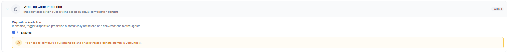

#### Configuration

**Automatic Away Status for Agent Inactivity**

Administrators can configure the system to automatically set an agent’s status to Away when the _Agent Inactivity Wait Time_ is breached after a conversation becomes overdue. When enabled, the system updates the agent’s status to 'Away', prevents the agent from receiving new interactions, displays the updated status in the Supervisor dashboard, and applies existing routing rules for the 'Away' status. [Learn more →](../../contactcenter/configurations/settings/automatic-away-status-for-agent-inactivity.md)  
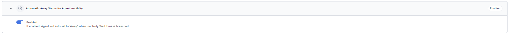

**Configurable CSAT Survey Trigger for Agent-Closed Conversations**

A new toggle, _Trigger CSAT only for agent-closed conversations_, is now available in CSAT survey settings. When enabled, surveys are sent only when a conversation is manually closed by an agent, excluding closures due to inactivity, queue timeouts, or user disconnections. This update improves CSAT accuracy by reducing unnecessary survey triggers. [Learn more →](../../contactcenter/configurations/surveys/configure-surveys.md#chat-call-and-email-experience) 

**Support for Special Characters in Agent customId**

The customId field now supports all special characters except spaces and backslashes, resolving previous errors during creation or updates. The character limit is 64, with validation applied consistently across the Admin Console, APIs, and backend services. This enhancement improves routing flexibility and operational mapping without affecting existing records, metrics, permissions, APIs, or Dynamic Routing. [Learn more →](../../user-management/manage-users.md#general-settings)

**Revised Channel Attachment Rules for Default Welcome Flows**

Administrators can no longer attach channels to the Default Welcome Voice flow or Default Welcome Chat flow. Channels already attached to these flows will continue to function as configured. However, if a channel is reattached to a different flow, it can't be reattached to a Default Welcome Voice flow or Default Welcome Chat flow. [Learn more →](../../channels/voice-gateway/configure-voice-gateway.md#attach-a-flow) 

**HTML/CSS Email Templates for Response Templates and Surveys**

A Code View option is now available in the email message editor for Response Templates and Survey Forms. Users can paste or write HTML/CSS code, switch between rich text and source views without losing content, and preview the final design before sending. This enhancement enables the creation of structured, branded, and reusable email templates, ensuring consistent formatting across senders and recipients. [Learn more →](../../contactcenter/configurations/response-templates/manage-response-templates.md#create-a-response) 

#### Web SDK

**Click-to-Call Capability for Web SDK Using Experience Flow Configuration**

The Web SDK now supports a Click-to-Call option, enabling website visitors to start voice calls directly from the UI. Calls route through configured flows, share assistant transcripts with human agents, and support recording, transcription, and ACW. The button is disabled by default and can be configured using the theme editor. Sessions log separately in the dashboard and can be initiated before, during, or after bot/chat interactions. In live chat, the agent receives a closure notice and is redirected to ACW. Multiple SDK configurations and flexible deployment methods (npm, script tag, source modification) are supported. [Learn more →](../../console/interacting-with-customers.md#inbound-click-to-call-interaction) 

#### Analytics

**Transcripts Log Updates for Maximum Retry Handling**

The transcripts log now displays timeline messages when maximum retries are exceeded and the configured fallback action is triggered. Instead of appearing as user transcription messages, the log indicates the scenario. For example, when a No Input timeout is exceeded and a fallback action is triggered, the message “Max no-input attempts reached” is shown. This update helps app users easily understand the reason behind the triggered action. [Learn more →](../../analytics/overview/conversations.md#insights-to-logs) 

#### API

**Fetch Conversation Details by Session ID**

A new Public API is available to fetch conversation details using the Parent App Session ID. The API returns conversation details only when a successful agent handoff has occurred in the session. If no handoff exists, it returns the error: “Conversation not found for the given session id.” [Learn more →](../../apis/contact-center/get-conversation-details.md) 

---

## v11.16.1 August 11, 2025

<u> Patch Release </u>

This update includes enhancements and bug fixes. The key enhancements included in this release are summarized below.

#### Configuration

**Support for Google and Custom Translation Engines**

The system now supports Google Translate and Custom Translation Engines, alongside the existing Microsoft Translator. Administrators can configure their preferred translation providers under ‘Language Management’ → ‘Translation Engine Configuration’, utilizing secure access keys. The selected translation engine is uniformly applied across all translated views, including the Agent Console, Dashboard, Monitor, and ACW Summary. Access to manage these engine settings is restricted to authorized users. This support offers increased flexibility, improved compatibility, and enterprise-level control over multilingual interactions. [Learn more →](../../contactcenter/configurations/settings/translation-configurations.md) 

#### Campaigns

**Cooldown Time for Proactive Web Campaigns**

Proactive Web Campaigns now support a configurable Cooldown Time, allowing users to control how often widgets display to a visitor within a single session. The setting defaults to 0 minutes and caps at 30000 minutes. During cooldown, no other widget appears, even if rules are met, though visitor activity continues to be tracked. The update also adds a "Greater Than or Equal To" operator for the Page Visit Count rule. Only one widget displays at a time, ensuring a clean user experience. [Learn more →](../../contactcenter/campaigns/settings/global-settings.md#proactive-cooldown-time)  
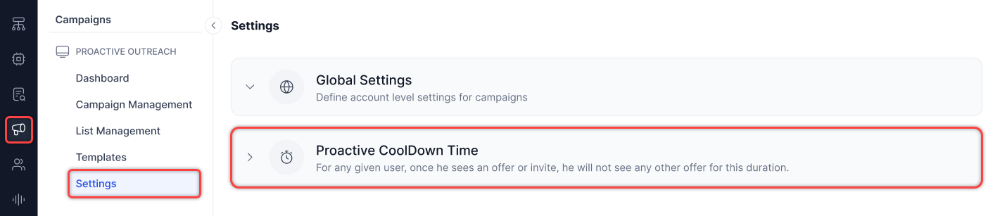

**SIP Number Support for Preview and Progressive Dialers**

Voice Campaigns now support SIP numbers for both Preview and Progressive dialing modes, extending functionality beyond Agentless campaigns. This enables customers, such as those with SIP-only infrastructure, to use SIP numbers consistently across all campaign types.

---

## v11.16.0 July 26, 2025

<u> Minor Release </u>

This update includes enhancements and bug fixes. The key enhancements included in this release are summarized below.

#### BotKit

**BotKit Events for Key Contact Center Actions**  

BotKit now emits key contact center events (agent acceptance, transfers, session closure, disposition submission, and join/leave actions) with structured JSON payloads, enabling real-time CRM sync via customer-defined logic. Admins can configure event types from the BotKit settings panel, with support for retry mechanisms, custom headers, and full traceability logging. [Learn more →](../../sdk/sdk-events.md#onevent)

#### Console

**Improved Channel Identification with Distinct Interaction Icons**

Introduced distinct icons for each interaction type—including inbound voice calls, callback requests, voicemails, emails, and chats—to enhance visual clarity and reduce agent confusion. Tooltips with localized labels appear on hover to support quick identification. These icons now appear consistently across the conversation tray, monitor tabs, and dashboard views. This update enables agents to prioritize real-time interactions, enhances supervisor visibility into queues, and aligns the visual design with enterprise workflows. [Learn more →](../../console/conversation-tray.md#incoming-conversation-types)

**Auto-Prefill Country Code for External Consult Calls**

The external consult call dialer now pre-fills the country code based on the agent’s last completed consult call, reducing manual input and speeding up outbound call setup. If no previous call exists, the field defaults to system settings or remains editable. Agents can override the pre-filled value before dialing, ensuring flexibility and minimizing call errors due to manual entry.

**Reply All Functionality Added to Email Channel**

The email interaction panel now includes the "Reply All" option alongside the existing "Reply" option. Agents can review and modify recipients before sending the message. [Learn more →](../../console/interacting-with-customers.md#emails)

#### Configuration

**Control Supervisor Join/Exit Notifications**

Added a new system setting that allows administrators to disable supervisor join and exit notifications shown to end users during live conversations. This functionality is enabled by default, displaying messages when a supervisor joins or exits a chat. To disable the notifications, administrators can turn off the toggle. The setting takes effect in real time, persists across sessions, and is recorded in the audit logs for traceability. This update supports silent supervision and helps meet compliance or customer-specific requirements. [Learn more →](../../contactcenter/configurations/settings/supervisor-join-exit-notification-to-user.md)

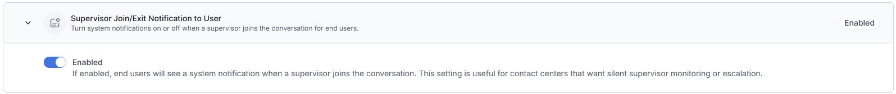

**Queue-Based Filtering for Response Templates**

Added a new "Queue Match" toggle to the response group configuration settings, allowing administrators to control the visibility of standard responses based on the interaction queue. When enabled, responses in the group are shown only to agents handling conversations from selected queues. This setting works in combination with existing Skill Match and Agent Group Match filters, ensuring response templates appear only when all configured conditions are met. The feature enhances contextual relevance, improves agent efficiency, and helps enforce queue-specific communication standards. All updates take effect immediately and are recorded in audit logs. [Learn more →](../../contactcenter/configurations/response-templates/manage-response-templates.md#create-a-response-group)

**Voicemail Notification in General Alerts**

The General Alerts system now includes voicemail-specific alerts to notify supervisors when unattended voicemail counts exceed defined thresholds or remain unresolved beyond a set duration. Admins can configure alerts per queue, define count and time thresholds, and select notification types such as toaster or email. Supervisors receive timely notifications to manage backlogs and uphold SLAs. All voicemail alerts are logged, auditable, and scalable for future expansion. [Learn more →](../../contactcenter/performance-management/slas-and-alerts.md#create-a-general-alert)

#### Campaigns

**Support for Custom Object Fields in Proactive Web Campaign Rules**

Proactive Web Campaigns now support rule evaluation using fields from a nested Visitor Object (custom object). This enhancement enables customers to:
Push key-value pairs dynamically from the Visitor’s Object into the campaign rule engine.
Evaluate these fields in real-time as part of campaign trigger conditions.
Drive personalized campaigns based on visitor activity and custom attributes.
This provides greater flexibility in targeting and responding to visitor behavior on web properties. [Learn more →](../../contactcenter/campaigns/campaign-management/proactive-web-campaigns.md#chat)

**New Built-in Fields for Proactive Web Campaign Rules**

The Proactive Web Campaigns feature now supports four additional built-in fields for enhanced targeting:

* **Device** (dropdown with a list of values): Supports operators – IS, CONTAINS, TEXT_BEFORE, TEXT_AFTER, STARTS_WITH, BEGINS_WITH.
* **URL** (string): Supports the operators ‘IS’ and ‘CONTAINS’.
* **PageName** (string): Supports the operators ‘IS’ and ‘CONTAINS’.
These fields expand campaign rule flexibility based on user context and page metadata. [Learn more →](../../contactcenter/campaigns/campaign-management/proactive-web-campaigns.md#chat)

#### Analytics

**Supervisor Disposition Editing via Dashboard – Interaction Tab**

Supervisors can now edit disposition codes for completed conversations directly from the Dashboard → Interaction Tab.

* Editing is restricted to post-conversation only; agents retain control during live sessions.
* Supervisor updates override previously submitted dispositions.
* Alerts linked to updated disposition codes trigger as configured.
* All edits are captured in logs and analytics. [Learn more →](../../analytics/overview/conversations.md#edit-dispositions-from-the-conversations-tab)

Access is controlled via a new role-based permission: “Edit Disposition from Dashboard.”  [Learn more →](../../user-management/role-management.md#permissions)

#### Integration

**Voice Automation and Agent AI Integration with Genesys Cloud CX via SIP Invite**

The Voice Automation and Agent AI integration with Genesys Cloud CX via SIP Invite enables the following:

* Transferring Voice calls that start in Contact Center AI to Genesys Cloud CX via SIP INVITE.
* Passing session-specific metadata (such as Session ID) through SIP headers.
* Automatically loading the Agent AI widget in the Genesys desktop with full bot context, using the existing voice stream from Kore to Agent AI—without needing Audiohook.

---

## v11.15.1 July 12, 2025

<u> Patch Release </u>

This update includes enhancements and bug fixes. The key enhancements included in this release are summarized below.

#### User Management

**Refined Queue Visibility Permissions**

The Queue Visibility permission has been restructured to enhance clarity, minimize configuration issues, and provide a more consistent experience for supervisors.

* Queue Visibility now exclusively controls visibility of queues in the Monitor tab.
* The “None” option has been removed from the permission settings. [Learn more →](../../user-management/role-management.md#permissions)

#### Configuration

**Skill Reassignment in "Default No Agents Available Chat Flow"**

The issue is resolved where previously assigned skills remained visible even after applying a new skill during the "Default No Agents Available Chat Flow." Skills are now properly removed when using `agentUtils.deleteSkills()` with Skill IDs.  

For example, `agentUtils.deleteSkills(["skillAId", "skillBId"]);`

[Learn more →](../../contactcenter/routing/skills/skill-management.md#add-a-skill-using-a-script)

---

## v11.15.0 June 30, 2025

<u> Minor Release </u>

This update includes enhancements and bug fixes. The key enhancements included in this release are summarized below.

#### Agent Console

**Real-Time Translation in Agent Console**

Real-time translation is now natively integrated into the Agent Console, eliminating the need for BotKit. This enhancement provides seamless multilingual support across the contact center.  
[Learn more →](../../console/interacting-with-customers.md#translate-conversations-in-real-time)

**Queue-Based Consult Call for Voice Channel**

Agents can now initiate consult calls to a specific queue, allowing them to engage with available internal agents before taking further call-handling actions. This enhancement improves flexibility and maintains continuity in voice interactions. [Learn more →](../../console/interacting-with-customers.md#consult-call-to-a-queue-voice-channel-only)

**Play Incoming Alerts Through Speaker**

A new setting enables agents to route incoming interaction alerts (calls, consults, chats) through the computer speaker, even when headphones are connected, preventing missed alerts by allowing sound to play through external speakers when needed. [Learn more →](../../console/manage-layout.md#incoming-call-notification-from-speaker-when-headphones-are-connected)

**User Diagnostics: Connectivity and Server Reachability Testing**

A Connectivity, Bandwidth, and Server Reachability Test is added under the *User Diagnostics → Connectivity* tab. This enhanced diagnostic test enhances visibility into media connectivity and voice quality by performing STUN/TURN checks and a loopback test call to the Voice Gateway server.  
[Learn more →](../../console/manage-layout.md#agent-diagnostics)

**Fixed Issues With External Agent Consult Call Handling**

Resolved multiple issues impacting External Agent Consult calls:

* Swap button disabled during dialing: The 'Swap' button is now disabled while the external consult call is connecting. It becomes active only after the external agent answers.
* Proper disconnect handling: If the internal agent ends the consult call before the external agent picks up, the external leg disconnects immediately, stopping the ringing.
* Ghost call prevention: Fixed a race condition that caused conversations to remain stuck in the Monitor tab after call transfers. Now, sessions are correctly cleaned up when any party disconnects.

#### Agent Management

**Configurable Omission of Language in ACD Routing**

A new configuration option is included to support flexible routing logic by allowing language to be excluded from ACD (Automatic Call Distribution) routing decisions.

* The Agent Settings tab now includes a new toggle, Omit Language in Routing, under Additional Routing Configurations.
* Default state (Disabled) — language remains part of the routing criteria.
* When enabled, the routing engine excludes language from its decision-making process.

Key benefits:

* Administrators and Supervisors can simplify routing when language is not required.
* Supports use cases with external translation services.
* Applies across all channels in real time.  
[Learn more →](../../contactcenter/agent-and-supervisors/agent-management/agent-management.md#additional-routing-configuration)

#### Migration

**Translation Capabilities of SmartAssist Migrated to Contact Center AI (CCAI)**

All translation-related features from SmartAssist are now available in CCAI, ensuring consistent functionality and a unified experience.

Translation capabilities

* **Dashboard Transcript Translation**: Translate button with language selector to view original and translated messages.
* **Monitor Tab**: Translate button in conversation view.
* **Disposition Summary**: Post-call summary data translation support.
* **Internal Chat Translation**: The Translate button in supervisor-agent chat displays original and translated content.
* **Translation Configuration**: Centralized settings for Microsoft Translator; enable/disable translation for Live Agent Desktop, Dashboard, Monitor, ACW Summary, and Internal Chat.

#### Campaigns

**Status Tracking for Campaign Outbound Calls**

New status and reason values (for example, No Answer, Busy, Network Failure, Answer Machine Detected, Hang-ups) are extended to Campaign Outbound calls. These updates apply across the Interactions dashboard (list, detail, export), Reports (Detail and Segment), and APIs (Conversation List, Details, and Export). This ensures consistent reporting and visibility across all outbound call types. 

#### API

**Start and Stop Campaigns**

This API enables users to programmatically start or stop campaigns using `either CampaignName` or `CampaignID`, with either the `Run` or `Stop` action. The API requires `AccountID` and `AppID` in the URL and returns the execution instance ID on success. Enables automation of campaign execution via backend scripts. [Learn more →](../../apis/contact-center/api-list.md#campaign-management-apis)

**Campaign Status and Results**

This API enables users to retrieve the execution status (`active`, `paused`, `stopped`, or `completed`) or detailed result data for completed or stopped campaigns using account, app, campaign, and execution IDs. The results include per-contact data such as `phoneNumber`, `DialerOutcome`, `BotOutboundStatus`, and agent disposition codes. Supports automated campaign lifecycle tracking via background scripts. [Learn more →](../../apis/contact-center/api-list.md#campaign-status)

**Add and Retrieve Contacts in Contact Lists**

These APIs enable the management of contacts in Contact Lists programmatically.

* The `POST` API allows adding up to 100 contacts per call using `ContactListID`, supporting mapped and unmapped fields.
* The `GET` API retrieves all contacts with pagination support (`skip`, `offset`, `hasMore`). Duplicate handling follows the list’s append-and-duplicate configuration, which is fixed at creation.  
[Learn more →](../../apis/contact-center/api-list.md#contact-list-management)

**Create, Retrieve, and Delete Campaigns**

Introduced APIs for complete Campaign lifecycle management. These APIs can be used to:

* Create campaigns by specifying configuration such as channel, flow name, contact list, DNC list, priority, caller ID, and retry logic.
* Retrieve all stored properties of a campaign using its Campaign ID.
* Remove a campaign using its Campaign ID. [Learn more →](../../apis/contact-center/api-list.md#campaign-management-apis)

These APIs support both Agentless Voice and SMS (Simple/Advanced) campaign types. Campaigns created via API remain fully accessible and manageable through the UI.

**Contact List Management with "API-Passive" Type**

Added support for managing Contact Lists via public APIs, including a new type: `"API-Passive"`. These APIs can be used to:

* Create a contact list by specifying `Contact List Name`, `Type`, and `DuplicateCheck`.
* Retrieve all metadata for contact lists (excluding contact data).
* Delete a contact list along with all its contacts. [Learn more →](../../apis/contact-center/api-list.md#contact-list-management)

These APIs enable users to automate contact list creation and management without requiring the use of the UI.

**Outbound Calling API Enhancements – AMD Parameters and Notify URL Headers**

The Outbound Calling API has been enhanced to improve AMD handling and support custom headers for external integrations.

* AMD Parameter Support: All AMD detection variables (`amd_human_detected`, `amd_machine_detected`, `amd_tone_detected`, etc.) are now available in both the context object and notify URL payload for use in Bot Builder.
* Greeting Message in Context: The detected greeting message is now passed in the context for use in bot flows.
* `greetingCompletionTimeoutMs` Handling: The timeout now functions correctly, preventing message cutoffs after `amd_machine_detected`.
* Custom Notify URL Headers: The Dialout API now supports custom headers in the notify URL, enabling customers to receive enriched event data.  
[Learn more →](../../apis/contact-center/outbound-calling-vg.md)

---

## v11.14.1 June 14, 2025

<u> Patch Release </u>

This update includes enhancements and bug fixes. The key enhancement included in this release is summarized below.

#### Configuration

**Disabling Contact Center Permissions**

Supervisors and admins with full user management access can now disable contact center permissions for users without deleting their accounts. This action:

* Prevents users from handling interactions or changing their status.
* Keeps all account data intact.
* Marks users with a "disabled" tag in user management and search results.
* Excludes users from active lists and assignments.

When supervisors attempt to add disabled users to a list, the system displays the "disabled" tag. Analytics data remains unchanged, but excludes information from users who are disabled. Once a user is disabled or deleted, they are removed from the agent node and all related configurations.  
[Learn more →](../../user-management/manage-users.md#add-a-user)

---

## v11.14.0 May 31, 2025

<u> Minor Release </u>

This update includes enhancements and bug fixes. The key enhancements included in this release are summarized below.

#### Agent Console

**Manual PII Redaction**

Agents can quickly redact or mask sensitive data, minimizing the risk of storing or exposing PII and aiding compliance with data privacy regulations. Role-based permissions enable supervisors to control access to redaction, ensuring that only authorized users can perform these actions. [Learn more →](../../console/interacting-with-customers.md#manual-pii-redaction)

**Supervisor Support Request**

Agents can now directly request supervisor support from their console during a conversation, providing context and clarity. These requests can be sent to specific supervisors or groups (all or skill-based). Only logged-in and available supervisors will be notified and see the support message in their internal chat. Permissions govern agents' ability to send requests and supervisors' ability to receive notifications, enabling adaptable support management. [Learn more →](../../console/interacting-with-customers.md#request-supervisor-support)

**Disable ‘Assign’ Button for Supervisors During Call Connection Stage**

The ‘Assign’ button is now disabled for supervisors when a call is in the connecting stage between the agent and the customer. If a supervisor attempts to click ‘Assign’ during this stage or when the connection fails due to negative scenarios, an error message appears, preventing reassignment. This update ensures that supervisors cannot prematurely reassign calls, thereby avoiding issues such as a blank console for the already connected agent.

#### Configuration

**Identification of Returning Customers Within 24 Hours**

A new context variable, `isReturn24h`, is now available. This variable is automatically set to ‘true’ if a user contacts the center within 24 hours of their previous interaction. Accessible from the beginning of the call flow, the variable allows for customized greetings, routing, and escalation strategies for repeat callers. Administrators can leverage this variable in Split Nodes, Start Flows, Conditional Flows, Exit Flows, and Dialogs to streamline workflows, minimize user frustration, and accelerate issue resolution. To provide a better understanding of repeat interactions, a new **'Returning Users'** column has been added to the Queue Performance dashboard and the Queue Metrics Summary Report (CSV). [Learn more →](../../flows/node-types/utils.md#context-identify-returning-contact-center-ai-ccai-customers-within-24-hours)

**Translation Support for Internal Chats**

Internal chat translation between supervisors and agents is now available to support multilingual contact centers. This feature automatically translates conversations, allowing agents and supervisors to view both original and translated messages. Supervisors and Agents can apply their preferred language settings configured in the dashboard or monitor. Administrators can control this functionality by enabling or disabling internal chat translation within the translation engine settings. This update extends the existing translation capabilities to internal communications, ensuring effective multilingual interactions and consistency. [Learn more →](../../console/additional-tools.md#translate-internal-chats)

#### Analytics

**Expanded Alert Configuration: From Service Levels to General System Events**

The alert system now supports general system events, including exporting the Interaction Details Report, dashboard data, or segment-based reports. This update expands the service level configuration into a flexible alerting framework that covers operational metrics and system events. Admins and supervisors can monitor user activities to ensure compliance, while contact center operations teams gain improved visibility and quicker response to critical or unusual events. [Learn more →](../../contactcenter/performance-management/slas-and-alerts.md#general-alerts)

**Display Industry Standard MOS and Jitter Values in Diagnostics Page**

The Diagnostics page now displays industry-standard values for MOS and Jitter with the average, minimum, and maximum scores. An ‘Industry Standard’ tooltip is included beside each  MOS and Jitter metrics set, providing agents and supervisors with a clear benchmark for evaluating call quality. This enhancement enables users to more effectively assess call performance by comparing actual values against established standards. [Learn more →](../../analytics/overview/conversations.md#agents)

**Default FLAC Format for Downloaded Call Recordings Across All OS Platforms**

Voice call recordings downloaded from the Interactions page will now be in the .flac format by default on all operating systems, including macOS, regardless of whether they are single merged files or individual segments. This change ensures that downloaded files have the correct extension and are compatible with internal audio players, allowing agents and supervisors to play recordings directly without needing to convert them or manually use external tools. [Learn more →](../../analytics/overview/conversations.md#call-recording)

**Interactions Dashboard: Customer Column Data Replaced with User ID**

A new boolean property—“Replace Customer Email/Phone in Interactions Dashboard with User ID”—is now available in the Advanced Settings. When enabled, the “Customer” column in the Interactions Dashboard displays the User ID instead of the customer’s email address or phone number. This change only applies to customers who activate the setting; others will see no change in the dashboard display. This enhancement supports organizations that prefer anonymized identifiers for improved privacy or system alignment. [Learn more →](../../analytics/overview/conversations.md)

**Skills Filter Added to Wallboards**

A new Skills filter is now available in the wallboards. Positioned immediately after the Queues filter, this multi-select field allows supervisors to select one or more skills to refine the data shown. When skills are selected, the wallboard displays conversations associated with the chosen skills, in combination with other active filters. If no skills are selected, the wallboard presents data without applying a skills-based filter, maintaining existing behavior. [Learn more →](../../contactcenter/configurations/wallboards/configure-wallboards.md#create-a-wallboard)

#### Campaigns

**Validation Checks for Campaign-Linked Phone Numbers in SMS and Voice Channels**

Improved validation prevents deletion of phone numbers or flows linked to active, paused, scheduled, or existing SMS and Voice campaigns. Deletion of phone numbers or queues used by campaigns is restricted, with error messages guiding users to remove links first. SMS channels now support both Simple and Advanced messaging in Inbound-Outbound mode. Additionally, deleting voice flows or queues tied to campaigns is blocked, ensuring campaigns cannot run without the required phone numbers or queues. [Learn more →](../../channels/add-sms-channel.md#configure-sms-channel)

**Pagination and Sorting in Campaigns, Contacts, DNC Lists, and Templates**

List views for Campaigns, Contacts, DNC lists, and Templates now support pagination and sorting, improving navigation and data management. Campaign Managers see the total number of items, the current range displayed on each page (for example, 1–50 of 250), and can easily navigate using next, previous, or direct page number selection. The interface allows filtering and sorting by Last Updated date to quickly access recent changes, while campaigns support sorting by priority to focus on high- or low-priority items. Each page displays up to 50 items for easier browsing. After applying filters or making updates, users remain on the current page to maintain context. These enhancements streamline the management of large data sets across the platform. [Learn more →](../../contactcenter/campaigns/campaign-management/voice-campaigns.md#voice-campaigns)

---

## v11.13.1 May 17, 2025

<u> Patch Release </u>

This update includes only bug fixes.

---

## v11.13.0 May 03, 2025

<u> Minor Release </u>

This update includes enhancements and bug fixes. The key enhancements included in this release are summarized below.

#### Agent Console

**Real-time Sentiment Capture and Visualization**

The Agent Console now displays real-time sentiment updates and a clickable graph visualizing emotional shifts over time, enabling agents to respond more quickly and empathetically during live conversations, enhancing the customer experience with actionable insights into sentiment trends as they occur. [Learn more →](../../contactcenter/configurations/settings/real-time-sentiment-analysis.md)

**Voice Issue Reporting Enhancement**

The Console and Monitor tabs now include an enhanced 'Help' menu with a 'Report Voice Issue for Current Call' function. This allows agents and supervisors to report voice problems easily via a standardized form. The system collects issue details and logs upon submission, sends internal notifications, and confirms the report. [Learn more →](../../console/manage-layout.md#reporting-issues-for-voice-calls)

**Improved Global Dialing Using Outbound Dialer**

The outbound dialer widget now displays "Enter your phone number with country code" when the Global option is selected. It guides agents to include the country code and prevent failed call attempts due to missing country codes. [Learn more →](../../console/interacting-with-customers.md#outbound-dialer)

**Show 'Unavailable' in Arrival Summary When Sentiment Is Missing**

When sentiment analysis is configured but no utterances are available to analyze, the Sentiment field in the arrival summary will now display "Unavailable" instead of remaining blank. This ensures users are informed that sentiment is intentionally missing due to a lack of conversational data, not an error. [Learn more →](../../console/interacting-with-customers.md#arrival-summary)

#### Configuration

**Bulk Export for Standard Responses**

Admins and supervisors can now export all standard responses as a single CSV file using the new Export option available on the Standard Response configuration page. This enhancement simplifies compliance and validation processes by removing the need for manual effort and retaining essential metadata, such as user ID, category, last modified date, auto-expire status, description, skill match, and agent group match. The file downloads automatically through the browser and remains accessible only to authorized users, ensuring secure and controlled access. [Learn more →](../../contactcenter/configurations/response-templates/manage-response-templates.md)

**Email CSAT Configuration**

The Email CSAT Configuration now allows administrators to enable or disable surveys for email conversations. Administrators can configure the Request & Gratitude message and Survey Frequency. The “Advanced Survey Conditions” section allows administrators to toggle survey triggers for no agent availability and outside business hours. These updates offer greater flexibility in configuring CSAT surveys for email communications. [Learn more →](../../contactcenter/configurations/surveys/configure-surveys.md#chat-call-and-email-experience)

#### Analytics

**Interactions Page: Call Status Update for AMD Detected Calls**

Supervisors can now view updated call statuses for calls disconnected after being identified as a machine through AMD detection.

* Interactions Page: The following information will be displayed
    * Status: Completed,
    * Mode: Machine Detected. 
* Insights to Logs tab:  
    * Status: Completed (Closed),
    * Mode: Machine Detected, 
    * Reason: Machine Detected, 
    * Disconnecting Event: System,
    * Smart Status: Closed.  
This enhancement provides a clearer understanding of why calls are disconnected after machine detection. [Learn more →](../../flows/create-flows.md#answering-machine-detection)

**Monitor: Queue Filters and Agent Name Display**

Supervisors can now use quick filters in the Queue tab to easily segment conversations by state, such as those waiting in a queue or with the agent, for faster action. Waiting for Agents is now a quick filter option. Two predefined quick filters will be enabled by default and displayed as tags. Users can edit, delete, or add up to four custom quick filters (five total, including the default). This functionality extends to Agents and Interactions tabs, without predefined templates. Additionally, agent names now appear for conversations pending acceptance, ensuring consistent information display and improving visibility for quicker decision-making. [Learn more →](../../console/monitor-queues-agents-and-interactions.md#queues)

**Reports: Support for Multiple Schedule-and-Frequency Combinations**

Contact Center supervisors can now configure multiple schedule-and-frequency combinations for a single report. The platform supports a maximum of six combinations per report.

When you create or modify a report schedule, the interface displays the option to add multiple schedule and frequency entries—up to the allowed limit. This enhancement improves flexibility in scheduling report deliveries based on your specific requirements. [Learn more →](../../analytics/contact-center/reports/reports-list.md)

#### Campaigns

**Create and Apply Filters in Voice, SMS, and Proactive Web Campaigns**

Campaign Managers can create, duplicate, mark as default, delete and edit filters for Voice, SMS, and Proactive Web Campaigns. [Learn more →](../../contactcenter/campaigns/campaign-management/voice-campaigns.md)

**API Integrated Contacts for Voice Campaigns**

Campaign Managers can now configure voice campaigns using API-based contacts for any of the supported dialing modes—Agentless, Progressive, or Preview—enabling streamlined integration with external systems. Additionally, attaching a contact list to a campaign using an API sync configuration establishes a real-time connection with a third-party database, ensuring the campaign accesses up-to-date contact information directly from the external source. [Learn more →](../../contactcenter/campaigns/list-management/list-management.md#api-integration)

#### API

**Updated API Endpoint Naming for Export/Import**

The public Export and Import APIs now use corrected endpoint names that follow proper naming conventions. This change ensures clarity, consistency, and easier integration for developers using these APIs. Existing functionality remains unchanged; only endpoint paths have been updated for accuracy and clarity. [Learn more →](../../apis/contact-center/api-list.md#importexport-data-apis)

---

## v11.12.1 April 19, 2025

<u> Patch Release </u>

This update includes enhancements and bug fixes. The key enhancement included in this release is summarized below.

#### Configuration

**Deflection Flow Node Added**

The voice channel now supports a new Deflection Flow node, allowing for the seamless continuation of existing Deflect to Chat configurations within SmartAssist experience flows. This new node, found in Start and Conditional Voice flows, supports both default and custom flows while preserving original chat deflection behaviors. To utilize this deflection flow, users must upgrade from SmartAssist to XO v11, which includes Automation AI. [Learn more →](../../flows/node-types/deflection-flow.md)

---

## v11.12.0 April 05, 2025

<u> Minor Release </u>

This update includes enhancements and bug fixes. The key enhancements included in this release are summarized below.

#### Agent Console

**Agent Console Search Functionality**

The Agent Console's search functionality allows agents to quickly find active customer conversations using phone numbers, emails, or names. Located in the conversation tray, it shows results as agents type and lets them click to open conversations. Enabled by default for all agents, this enhancement reduces handling time and improves efficiency with no setup required. [Learn more →](../../console/conversation-tray.md#search-conversations)

**Disposition Alerts for Supervisor Attention**

Supervisors will receive real-time alerts when disposition codes requiring supervision or unresolved issues are tagged in a conversation. This feature ensures prompt action and user follow-up. When Disposition Alerts are enabled, supervisors receive:

* Proactive in-platform notifications for flagged dispositions.
* Automated email alerts are sent to their registered UXO platform email.
* Multi-language support, with emails and notifications translated based on the conversation language.

[Learn more →](../../contactcenter/agent-and-supervisors/dispositions/manage-dispositions.md#disposition-codes)

**Independent Widget Loading**

Custom widgets can now load independent of conversation selection, enabling agents to access and interact with widgets. This enhancement allows:

* Automatic widget availability upon console load, even without an active conversation.
* A persistent widget until explicitly closed or refreshed.
* Dynamic updates for widgets are dependent on conversation context, ensuring seamless transitions when a conversation is selected.
* Support for proactive workflows, allowing agents to initiate actions or access data before engaging with customers.

[Learn more →](../../contactcenter/configurations/widgets/configure-widgets.md#load-widgets-without-conversations)

**Call History for Inbound and Outbound Calls**

Agents can view past call details for both Inbound and Outbound calls in the Call History section of the Agent Console. This enhancement provides:

* A comprehensive view of previous interactions, helps agents understand customer context.
* Voice call conversation volleys are displayed through the conversation transcript, ensuring quick access to past discussions.

[Learn more →](../../console/additional-tools.md#history)

#### Configuration

**Total Digital Conversation Limit**

The Total Digital Conversation Limit improves agent workload management across all digital channels. When enabled, this unified limit automatically marks agents as "system busy" once they reach their combined conversation threshold, regardless of channel type. [Learn more →](../../contactcenter/agent-and-supervisors/agent-management/agent-management.md#total-digital-conversation-limit)

**AgentUtils: Transcript and Voice Call Recording Controls for Agent Desktop**

App developers can control transcript visibility and voice call recording generation on the Agent Desktop through script nodes before agent transfers.

Using `agentUtils.setAgentTranscribe({transcribe:false})`, transcripts can be hidden from agents with appropriate notifications displayed.

Using `agentUtils.setAgentRecordingControl({record: "stop"})` prevents voice call recording generation with corresponding notices. These functions can be used individually or together for complete control over agent interaction documentation.  

[Learn more →](../../flows/node-types/utils.md)

#### Campaigns

**Emergency SMS Campaigns**

Campaign Managers can run or rerun SMS campaigns as ‘Emergency’ for urgent communication. Users can choose Run to execute campaigns based on priority or Run as Emergency to bypass schedules and process immediately at full capacity. [Learn more →](../../contactcenter/campaigns/campaign-management/sms-campaigns.md#run-as-emergency)

**Enhanced API Call Tracking and Contact Data Storage in Logs**

Campaign managers can view detailed API call logs for contact lists, including Date and Time, Contact List Name, Campaign Name, Status, and Description, ensuring better tracking of API activity. Additionally, all contacts fetched via API calls are stored and made available as downloadable files, enabling users to debug potential issues efficiently. [Learn more →](../../contactcenter/campaigns/list-management/list-management.md#logs)

**Dynamic API Key Handling for Contact Import in List Management**

Campaign managers can now get the API key value from environment variables (plain or encrypted) when adding contacts through API integration in List Management. [Learn more →](../../contactcenter/campaigns/list-management/list-management.md#api-integration)

#### Analytics

**Skill Metrics Daily Report**

The Skill Metrics Daily Report provides a daily summary of performance based on conversation skills. This report groups data by Skill and Day, with no grouping by channel or direction. [Learn more →](../../analytics/contact-center/reports/skill-metrics-daily-report.md)

**Enhanced Sorting for Queues, Agents, and Interactions**

Supervisors and agents can sort Queues, Agents, and Interaction tabs to manage workloads efficiently. This enhancement provides:

* Sort in ascending and descending order for key columns.
* Persistent sorting across periodic 5-second data refreshes.
* Sort within active filters, ensuring relevance.
* Automatic reordering when multiple items share the same sorting metric, prioritizing by arrival time.

[Learn more →](../../console/monitor-queues-agents-and-interactions.md#queues)

---

## v11.11.1 March 15, 2025

<u> Patch Release </u>

This update include only bug fixes.

---

## v11.11.0 March 04, 2025

<u> Minor Release </u>

This update include enhancement and bug fixes. The key enhancement included in this release is summarized below.

#### Agent Console

**Agent Channel Selection Control**

Added new permission that enables you to configure custom roles to select the interaction type for upcoming interactions from the following options:

* Voice & Digital
* Voice
* Digital  
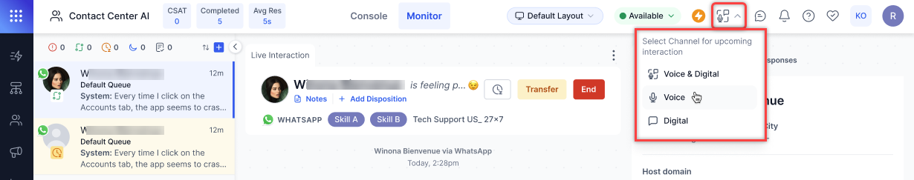

Key Benefits:

* Workload Control: Ability to focus on preferred interaction types.
* Reduced Context Switching: Focus on a single channel at a time.
* Improved Efficiency: Better management of interaction flow.
* Clear Status: Visual indication of current channel selection.

[Learn more →](../../console/managing-incoming-interactions.md#channel-selection)

#### Configuration

**Summarization with External Models in Contact Center AI**

Contact center admins can configure and integrate custom AI models, supporting additional languages and tailored summarization prompts.

Key benefits

* Contact Center Admins
    * Configure external Gen AI models and define custom summarization prompts.
    * Manage summarization across additional languages via custom models.
    * Extend summarization capabilities beyond native Contact Center AI support.
* Agents
    * Leverage external AI models for more flexible and accurate conversation summaries.
    * Ensure consistent summarization across multiple languages and use cases.

**Enable/Disable Conversations to Wait Till Queue Timeout**

This configurable setting allows supervisors and admins to enable or disable the waitTillQTimeout property. This enhancement provides better control over how long conversations wait in the queue before transitioning to the no-agent-available flow.

Key benefits

* Provides greater flexibility in handling agent unavailability scenarios.
* Ensures better visibility into waiting conversations, allowing supervisors to intervene.
* Reduces missed interactions by notifying agents of potential SIP registration issues.

[Learn more →](../../contactcenter/agent-and-supervisors/agent-management/agent-management.md#additional-routing-configuration)

#### Campaigns

**Full Access to Mapped and Unmapped Contact Fields in Campaigns**

All mapped and unmapped fields from Contact List records are now accessible in Dialog Tasks and Experience Flows via the `UserSession` context object. Developers can retrieve `metaInfo` data through the context object for seamless integration.

Advanced SMS and Agentless Dialer Campaigns can use mapped and unmapped contact fields, enabling dynamic customer interactions. Campaign managers can utilize contact record fields in the `UserSession` context object to build more personalized SMS campaigns. [Learn more →](../../contactcenter/campaigns/list-management/list-management.md#accessing-the-contact-list-fields-through-their-labels)

#### Analytics

**Center-Wide Wallboards**

A new wallboard is introduced for comprehensive center-wide data visualization.

Key features

* New Tab Display: Dedicated browser tab view for wallboard display
* Full-Screen Capability: Optimized for HDTV displays
* Resolution: 4K support (3840 × 2160 pixels)
* Aspect Ratio: 16:9
* Live Data Updates: 60-second refresh cycle with real-time field updates
* Fixed Layout Design: Standardized, non-customizable widget arrangement

[Learn more →](../../analytics/contact-center/wallboards.md)

**Interaction Details by Segment Report**

The Interaction Details by Segment Report is a comprehensive report that covers how all interactions were processed for each segment. [Learn more →](../../analytics/contact-center/reports/interaction-details-by-segment.md)

**“Today” Added to Service Level Time-Period Filter**

Monitor > Service Levels

The "Today" option is added to the time-period filter dropdown. Selecting "Today" displays all values based on conversations retrieved from the user's current day, starting from 12:00:00 AM midnight, according to the user's system time zone. [Learn more →](../../console/monitor-queues-agents-and-interactions.md)

---

## v11.10.0 February 12, 2025

<u> Minor Release </u>

This update include enhancement and bug fixes. The key enhancement included in this release is summarized below.

#### Supervisor Console

**Monitor and Intervene in Bot-led Interactions**

This update includes new permissions, filtering options, and intervention capabilities to help supervisors monitor and manage bot-led conversations effectively.

Key benefits

* Greater visibility into bot-handled conversations.
* Improved control over conversation routing.
* Enhanced ability to maintain conversation quality.
* Flexible filtering options for better workflow management.

[Learn more →](../../console/monitor-queues-agents-and-interactions.md#manually-assign-a-bot-led-conversation-to-an-agent-or-queue)

**Quick Agent Information Pop-up on Monitor Tab**

Hovering over an agent’s name in the agents' tab shows key details about the agent, reducing the need to navigate multiple screens. [Learn more →](../../console/monitor-queues-agents-and-interactions.md#agents)

#### Configuration

**Support for Queue Name in `agentUtils.setQueue`**

The `agentUtils.setQueue` function is enhanced with queue identification capabilities and improved error handling.

* The function now accepts Queue IDs and Queue Names.
* Direct ‘Queue ID’ resolution without additional API calls.
* Added validation for queue names in numeric format.
* A new error message for unsupported queue name formats.  
[Learn more →](../../flows/node-types/utils.md#set-queue)

#### API

**Fetch Real-Time Agent Status Distribution**

Introduced a new API endpoint to fetch real-time agent status distribution. [Learn more →](../../apis/contact-center/check-agent-availability-status.md)

**Fetch Agent ID Using Custom ID (Extension Number)**

Custom IDs can effectively retrieve agent IDs if mapped one-to-one. However, in scenarios where the organization has multiple agent IDs for the same custom ID, it will return an array of agent IDs. [Learn more →](../../apis/contact-center/get-the-agent-id-using-custom-id.md)

#### Analytics

**Interaction Details Enhancement**

The 'Copy All' functionality in the Interaction Details tab now includes additional information fields: Timezone and Caller and Callee Numbers. [Learn more →](../../analytics/overview/conversations.md#insights-to-logs)

---

## v11.9.1 January 25, 2025

<u> Patch Release </u>

This update include enhancement and bug fixes. The key enhancement included in this release is summarized below.

#### Agent Console

**Connection Status Alerts**

A new status indicator at the top of the Agent Console shows the connection state and automatically updates when:

* The connection is lost (offline),
* Reconnection is in progress, or
* The connection is restored (online).  

[Learn more →](../../console/manage-layout.md#connection-handling)

**Improved Monitoring of Listen and Whisper Functionality**

When a supervisor shifts focus away from the current conversation, a Listen Banner appears in the Monitor Tab. This ensures supervisors can monitor other conversations without being tied to one conversation.

A restriction message ensures supervisors confirm before leaving the monitor tab during an active Listen or Whisper session, preventing unintentional interruptions.
The feature enhances supervisor flexibility while maintaining oversight during live conversations. [Learn more →](../../console/monitor-queues-agents-and-interactions.md#listen-and-whisper-voice-calls)

#### Configuration

**Enhanced IVR channel Flow**

Multiple prompts in the IVR voice channel flow are combined into a single message before being handed over to the Virtual Assistant using the Automation Node. A "Prompt: True" flag indicates the system awaits user input, ensuring smooth and uninterrupted communication.

Key benefits:

* Ensures effective user input capture.
* Prevents call disconnections.
* Maintains seamless transitions between the IVR Welcome Voice Flow and the Automation Node.
[Learn more →](../../channels/IVR-integration.md#managing-multiple-prompts-in-ivr-voice-channel)

#### Voice Gateway (v0.9.3-rc4)

**Deepgram TTS Support**

This update includes Deepgram TTS support to complement their existing ASR integration. Deepgram is now available as a TTS option when configuring [Start Flows](../../flows/create-flows.md#create-a-start-flow) and [Voice Preferences](../../channels/voice-gateway/configure-voice-gateway.md#voice-preferences).

All Deepgram voices can be selected, and Deepgram TTS can be set using call control parameters. This enables the use of Deepgram TTS across the XO platform, with existing flows working successfully using Deepgram voices.

---

## v11.9.0 January 05, 2025

<u> Minor Release </u>

This update include enhancement and bug fixes. The key enhancement included in this release is summarized below.

#### Agent Console

**Enhanced Contact Recognition for Better Customer Service**

This enhancement improves how saved contact information is displayed during customer interactions to help agents deliver more personalized service.

Key updates:

* Automatic contact name display for inbound/outbound interactions.
* For the saved contact entries, phone numbers now show associated contact names instead of "Anonymous".
* Updates are visible in the chat history and interaction pane.

Key benefits:

* Instant recognition of known contacts for personalized customer interactions.
* Reduced time spent identifying callers.
* Consistent contact display across all interaction points.

#### Supervisor Console

**Improved Supervisor Monitoring with Callback and Voicemail Filters**

Supervisors can now improve their monitoring efficiency using specific filters for callback and voicemail interactions in the Monitor tab, with a new callback icon for better visibility. Filters can be combined with existing agent, queue, and status filters. [Learn more →](../../console/monitor-queues-agents-and-interactions.md)

#### Configuration

**Configurable Repeat Notification Alerts for Improved Response Time**

The enhanced notification system ensures agents never miss an incoming interaction.

Key updates:

* Configurable notification intervals (5s, 10s, 30s, 1min).
* Unified sound alerts for transfers and incoming interactions.
* Visual loop notification icon in settings; disabled by default for all accounts.

Key benefits:

* Fewer missed interactions.
* Customizable alerts based on team needs.
* Automatic alert management based on agent actions.
* Simplified notification system with combined transfer alerts.

Notification alerts automatically stop when an agent takes action - either accepting/rejecting the interaction, sending their first message, or when a supervisor reassigns the interaction, or it times out in the system. [Learn more →](../../console/manage-layout.md#enable-repeat-notifications)

**Blended Mode for Voice and Digital Interactions**

Blended Mode allows agents to handle both voice and digital interactions simultaneously.

Key updates:

* Blended Agents toggle to enable/disable it at the organization level.
* System Busy activates only when all slots (voice and digital) are full. The existing channel-specific system busy logic applies when blended mode is disabled.

Key benefits:

* Efficient handling of mixed interaction types.
* Better resource utilization.
* Clearer agent availability status.

[Learn more →](../../contactcenter/agent-and-supervisors/agent-management/agent-management.md#blended-agents)

**Real-time LLM Streaming for Enhanced Voice Interactions**

Contact Center supervisors can enable real-time streaming of LLM responses to significantly reduce latency to create more responsive and engaging voice interactions.

Key updates:

* Real-time streaming of rephrased responses.
* Bot delay response behavior controls.
* Role-based access controls (Full Access for Admins/Supervisors). [Learn more →](../../user-management/role-management.md#permissions)

#### Campaigns

**Decoupling Flows and Numbers for SMS Campaigns**

This update decouples flows and numbers in Advanced SMS Campaigns to offer more flexible flow and number selection.

Key updates:

* Independent flow and number selection.
* Access to all published start flows.
* Comprehensive caller ID options from available numbers.

Key benefits:

* Greater campaign configuration flexibility.
* Simplified flow selection process.
* More efficient campaign setup.
* Better control over outbound messaging.

[Learn more →](../../contactcenter/campaigns/campaign-management/sms-campaigns.md#create-sms-campaigns)

**Outbound SMS API Integration**

This update introduces a new public API to send outbound SMS messages via the Generic SMS Channel, enabling seamless integration of SMS communication into applications and services. [Learn more →](../../apis/contact-center/send-outbound-sms.md)

#### Analytics

**External Transfer Status Tracking**

This update adds detailed transfer status visibility across the Interaction Dashboard, Reports, and API.

Key updates:

* Success/failure status tracking.
* Transfer mode and reason reporting.
* Consistent status display in the dashboard, reports, and API.
* Detailed failure reason reporting ("No Answer," "Busy," "Declined").

Key benefits:

* Better transfer outcome monitoring.
* Improved transparency for external transfers.
* Standardized status tracking across platforms.
* Clear visibility into transfer failures.

**Updated Queue Load Calculation for Blended Conversations**

DASHBOARD > Queues & Agents

The modified queue load formula accurately reflects the blended conversation handling. It represents how agents manage multiple conversation types simultaneously across voice, chat, messaging, and email channels.

**Queue Load** = (Voice + Chat/3 + Messaging/8 + Email/10) x 100 / Available Agents

Where

Voice = Voice Count; Ongoing or waiting in queue (including Voicemails or Callbacks before turning Outbound).  
Chat = Chat Count; Live chat conversations ongoing or waiting in a queue.  
Messaging = MessagingCount; Messaging conversations ongoing or waiting in a queue.  
Email = Email Count; Email conversations ongoing or waiting in a queue.

#### API

**Call Termination Tracking Added to Call Details API (v2)**

The Call Details API (v2) has been updated to include the `disconnectingEvent` parameter to provide clearer visibility into call termination reasons. [Learn more →](../../apis/contact-center/get-all-conversations-data-call-details-v2.md)

#### Voice Gateway (v0.9.3-rc4)

**Fetch Again Option for Failed Recordings**

This update provides clear visibility of the call recording status for failed interactions, including predefined failure scenarios and reprocessing capabilities using a "Fetch Again" button. This allows agents and supervisors to take appropriate action when call recordings fail to be retrieved or processed. [Learn more →](../../analytics/overview/conversations.md#call-recording)

**Enhanced SIP Trunk Options**

To enhance the flexibility and compatibility of the SIP Trunk configuration, two new fields have been added to the 'SIP Trunk' configuration. These fields give more control over how DID numbers are handled and DTMF signals are transmitted.

Key updates:

* E.164 Syntax Checkbox: Adds '+' prefix to DID numbers during origination attempts to comply with E.164 formatting standards.
* DTMF Types Dropdown: Choose from the following DTMF signaling methods for SIP Trunk - RFC 2833 (Default option) or Tones. [Learn more →](../../channels/voice-gateway/configure-voice-gateway.md#sip-trunk-setup)

**Microsoft Teams Integration for Inbound and Outbound Calls**

In the SIP Trunk configuration page, the MS Teams option is added under the Network field to support SIP trunk directly to Microsoft Teams for both inbound and outbound calls. [Learn more →](../../channels/voice-gateway/configure-voice-gateway.md#sip-trunk-setup)

---

## v11.8.1 December 19, 2024

<u> Patch Release </u>

This update include enhancement and bug fixes. The key enhancement included in this release is summarized below.

#### Campaigns

**Configure SIP Transfer Voice Numbers for SMS Campaigns**

This update allows supervisors to set up Twilio voice numbers in the generic SMS channel, enabling a single number to be used for both voice and SMS flows.

Key Updates:

* Twilio numbers purchased for voice can be configured in the generic SMS channel.
* The number can be attached to both a voice flow and an SMS flow.
* Voice flow is triggered when a customer calls the number.
* SMS flow is triggered when a customer texts the number.
* Currently, it only supports Twilio numbers in the generic SMS channel.

#### Flows

**Configuring Bot Delay – Transfer to External Agent**

A new option is added to transfer calls to external agents if the bot fails to respond in time.

When enabled, the following options are available:

* BotNoInputTimeout: Timeout in seconds (default is 2 sec).
* BotNoInputSpeech/URL: Allows text or audio URL input (default is text).
* BotNoInputRetries: Number of retries (default is 2).
* BotNoInputGiveUpTimeout: Timeout in seconds (default if not provided).

Two options are available if the bot does not respond within Give Up Timeout:

* End the Call (default): Option to add a custom message.
* Transfer the Call: Option to add a custom message for external agent transfer.

---

## v11.8.0 December 11, 2024

<u> Minor Release </u>

#### Agent Console

**Keypad for IVR Navigation During Conference Calls**

Agents can now access a keypad during active conferences with DTMF (Dual-Tone Multi-Frequency) input in the conference call interface. The keypad allows agents to navigate through IVR menus and make IVR number calls without disrupting the main conference call. [Learn more →](../../console/interacting-with-customers.md#external-consult-and-conference-during-an-ongoing-interaction)

**Depleting Timer Post Caller Disconnection**

A depleting timer is introduced on the call disconnected screen, prompting agents to either **Call Back** or **End** the call within a specified timeframe.

This feature prevents agents from occupying slots indefinitely by enforcing timely action and enhancing productivity and slot availability.

Administrators can enable this functionality through Agent Settings. By default, the timer is disabled for existing users. [Learn more →](../../console/interacting-with-customers.md#timer-after-caller-disconnects-a-voice-call)

**Enhanced Call Connection**

Calls now connect within 3 seconds when agents click the **Accept** button on their console. The default message, **“Thank you for waiting…”**, will only play after an agent successfully connects to the call. [Learn more →](../../contactcenter/agent-and-supervisors/agent-management/agent-management.md)

#### Configuration

**Custom Email Domain Configuration**

The enhanced email configuration options allow platform users to set up and manage Kore and custom domain email addresses. The options significantly expand email capabilities, allowing businesses to maintain brand consistency in their communications while leveraging the full features of Contact Center AI.

Key Updates:

* Kore Domain Email Management:
    * Configure multiple Kore domain email addresses.
    * Easy addition of new addresses via the “Add Email Address” button.
    * Attach experience flows to specific email addresses. [Learn more →](../../channels/add-email-channel.md)
* Custom Domain Setup:
    * “Add Domain” button for custom email domain configuration.
    * Domain ownership verification through email login test.
    * Tabular display of custom domains with associated email addresses.
* Improved User Interface: Clear organization of Kore and custom domain settings.

[Learn more →](../../channels/add-email-channel.md)

**Email Address Blocklisting**

This update introduces Email Address Blocklisting functionality for Contact Center AI administrators. By proactively managing potentially problematic email addresses, contact centers can maintain a clear communication channel, improve efficiency, and protect their email reputation.

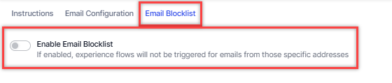

Key Updates:

* **Blocklist Management**: Administrators can specify blocklisted email addresses.
* **Verification Process**: The system checks incoming email addresses against the blocklist.
* **Automated Response**: Disables pre-configured automations for blocklisted addresses and prevents automated agent transfers for blocklisted interactions.
* **Normal Processing**: Non-blocklisted emails proceed through the usual automation and transfer processes.

#### Analytics

**Enhanced Call Recording Download**

On the **Dashboard** > **Interactions** tab, supervisors now have two options to download call recordings:

* Download as a single file,
* Download as separate files.

[Learn more →](../../analytics/overview/conversations.md#call-recording)

**Enhanced Diagnostics for Voice Interactions**

Diagnostics functionality is enhanced by adding the **Flow** and **Quality of Service (QoS)** tabs.

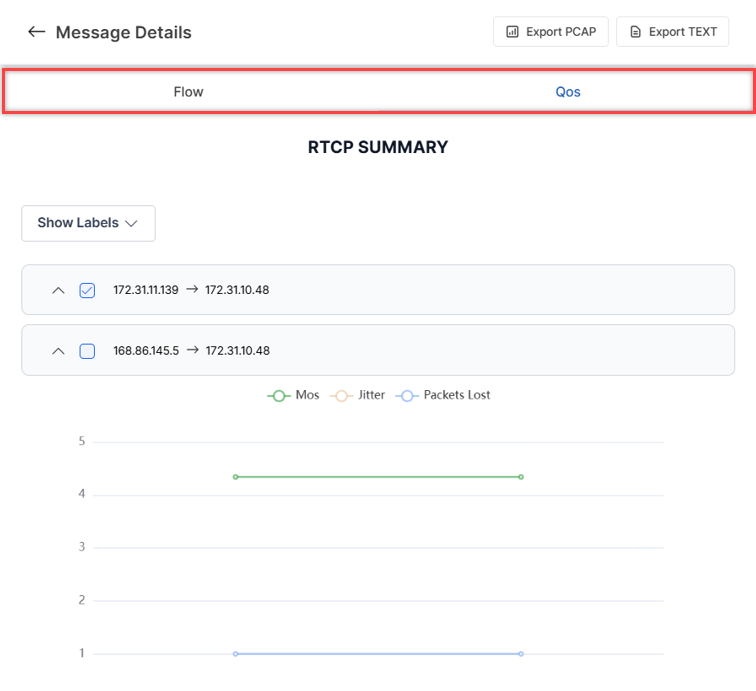

The diagnostics reports can be exported in the following formats:

* Export PCAP
* Export TEXT

[Learn more →](../../analytics/overview/conversations.md#diagnostics)

**Call Recording Status Messaging Enhancements**

On the Dashboard > Interactions tab, a message, **“No audio is available for this interaction as call recording is disabled,”** will be displayed in the following scenarios:

* Transcript Tab: When call recording is disabled in Agent Settings, no audio is available.
* Transcript Tab: When call recording is disabled, and media generation is in progress.
* Interactions Page: When call recording is disabled and users attempt to download the recording from the Actions menu, the “Media generation is in progress” message will also appear. [Learn more →](../../analytics/overview/conversations.md#call-recording)

**Copy All Identifiers**

Supervisors can copy all details from the **Identifiers** tab by clicking Copy All.

The copied details include:

* Call Start and Call End timestamps.
* All other identifier information.

[Learn more →](../../analytics/overview/conversations.md#insights-to-logs)

**Agent Activity Summary Report CSV Format: Added Count for Each Status**

Each Status Duration field now includes a corresponding **“Status - Count”** field (for example, **“Busy:Busy-Count”**).  The field displays the number of times an agent was in each status, with a count of 0 if the agent was never in that status.

**Agent Chat Metrics Report Merged with Agent Metrics Daily Report**

The Agent Chat Metrics Report is deprecated, and its fields have been moved to the CSV version of the Agent Metrics Daily Report. The “Sessions” field is changed to “Answered” in the PDF version of the Agent Metrics Daily Report.

**Conversation Lifecycle Tracking**

The system now captures all significant events throughout the conversation lifecycle, providing visibility into key actions and transitions.

Each tracked detail includes the following:

* Precise Timestamp
* Event Type
* Involved Agents/Supervisors
* Detailed Event Description

#### Voice Gateway (v0.9.3-rc4)

**Wait Time for IP Whitelisting While Configuring SIP Transfer**

Users must wait for at least 10 minutes after saving their IPs to be whitelisted while configuring SIP Transfer. [Learn more →](../../channels/voice-gateway/configure-voice-gateway.md)

**Session and Node Level Call Control Parameters**

Developers can now apply Call Control Parameters at the **Session** or **Node** level, offering more flexibility in managing call behavior.

* **Session-Level Parameters**: Add the prefix “`session.`" to apply parameters throughout the session (for example, “`session.ttsprovider`”).
* **Node-Level Parameters**: Add the prefix “`node.`" to apply parameters only at a specific node (for example, “`node.ttsprovider`”).
* **Default Behavior**: Parameters without a prefix are considered session-level by default.
* Node-level parameters take precedence over session-level parameters. If no node-level parameters are defined, session-level properties will be applied. [Learn more →](../../channels/voice-gateway/speech-customization.md)

**SIP REFER Handling and Transcript Enhancements**

When an external system sends a SIP REFER to Contact Center AI:

* **Matching Numbers**: If the referred number matches a configured experience flow, Contact Center AI will trigger the corresponding flow.

* **Non-Matching Numbers**: Calls will be returned to the source (default behavior).

The Transcripts now show key conversation stages, including:

* User transferred to Agent (When the Automation transfers the voice call to Agent)
* User transferred to Automation (When the Agent transfers the voice call back to Automation)

[Learn more →](../../analytics/overview/conversations.md#insights-to-logs)

**Mean Opinion Score (MOS) Display in Call Controls**

The Mean Opinion Score (MOS), indicating signal connectivity strength, is now displayed as a bar chart within the call controls widget.

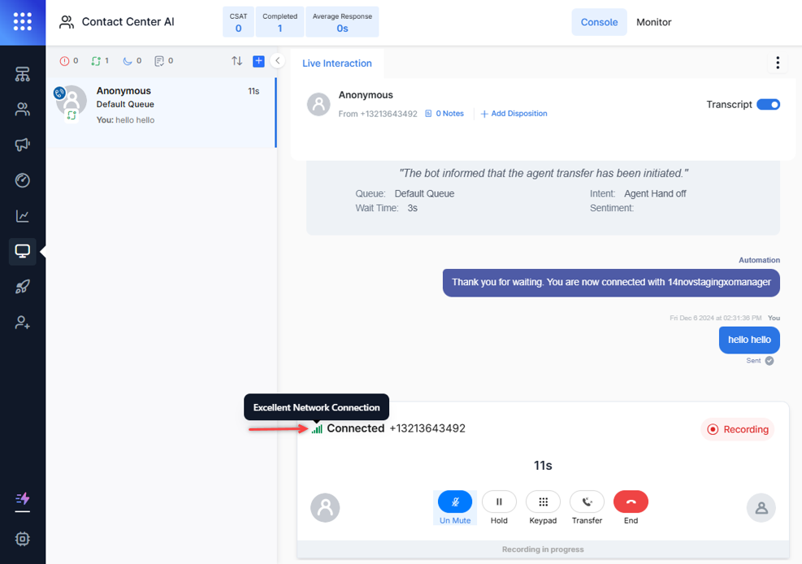

Color Coding:

* 4-5 (Excellent): Green
* 3-4 (Moderate): Orange
* 2-3 (Poor): Orange
* 1-2 (Very Poor): Red

Hovering over the bars displays tooltips providing details on network connection status.

---

## v11.7.1 November 18, 2024

<u> Patch Release </u>

This update includes bug fixes.

---

## v11.7.0 November 03, 2024

<u> Patch Release </u>

This update includes enhancements and bug fixes. Key enhancements included in this release are summarized below.

#### Agent Console

**Preserve Agent’s Last Status**

To improve agent experience and maintain consistent availability, the agent’s last manually set status is now preserved across sessions. A chosen status (Available, Away, or Busy) is automatically restored when the agent:

* Return from breaks,
* Complete outbound calls, or
* Switch from system-assigned states.

[Learn more →](../../contactcenter/agent-and-supervisors/agent-management/agent-management.md).

**Real-Time Disposition Updates**

The enhanced disposition management allows agents to select dispositions during active conversations, improving categorization and data accuracy.

Key benefits:

* Agent Productivity and Data Accuracy: Agents can tag interactions as they happen, reducing the risk of oversight.
* Enhanced Filtering: Dispositions are integrated in real-time with dashboard filters, allowing users to track conversations with instant dashboard updates. [Learn more →](../../console/interacting-with-customers.md#dispositions)

**Improved Visibility of Auto-Accepted Conversation**

Tracking auto-accepted conversations is now more effective with real-time agent assignment visibility:

* See assigned agents immediately in the queue and agent tabs.
* Monitor conversations before the agent's first response.
* View synchronized assignment updates across all tabs.

Key benefits:

* Better workload monitoring.
* Improved resource allocation.
* Real-time conversation tracking.

#### Campaigns

**SMS Campaigns - Advanced Message Option**

SMS Campaigns now support the Advanced Message format in addition to the Simple message format. With the Advanced message format, businesses can establish two-way communication with their end customers. Within the Advanced message format, you can associate an SMS Flow that can take the end customers through an automation journey, run dialog tasks, and connect to live agents if required. [Learn more →](../../contactcenter/campaigns/campaign-management/sms-campaigns.md#create-sms-campaigns)

#### Voice Gateway

**External Agent Transcription Control using SIP INVITE**

The new `agentUtils.setExternalAgentTranscribe` utility method helps manage transcription settings for external agents integrated via SIP INVITE. It allows transcription enablement or disablement during active calls on the Agent Assist platform.

Utility details:

* Function: `agentUtils.setExternalAgentTranscribe(param)`
* Supported in:
    * Experience Flow script nodes
    * Bot Builder Dialog Flows
    * Voice Gateway integrations

Key usage:

* Enable/disable transcription during live calls.
* Adjust settings based on agent requirements.
* Configure language and provider preferences.
* Control transcription in temporary scenarios.

**Handling Concurrent Outbound Calls**

This update allows agents to make concurrent outbound calls to the same customer seamlessly while maintaining separate conversation contexts for each agent.

Each call remains independent with the following:

* Isolated conversation records.
* Separate call controls.
* Independent agent sessions.

**Call Trace Enhancement**

This update extends the display of SIP stack traces to all Voice Gateway calls regardless of automation status or agent transfers. This improved visibility helps administrators monitor connections, diagnose issues, and troubleshoot more effectively.

**Text-to-Speech Customization**

New voice controls for PlayHT, Eleven Labs, and Deepgram enable users to customize parameters like speaking speed, pitch, and emotion to improve overall quality of speech output. Bot developers using AWS Polly, Microsoft Azure, and Google Cloud can use SSML tags for advanced customization.

#### Analytics

**Queue Tracking Improvement**

Queue metrics now focus on live customer interactions, showing only active cases in the dashboards. Voicemails and callbacks are excluded from counts until an agent accepts them. Also, "Waiting" and "In Queue" queue labels are standardized across views to reflect this change for clearer monitoring.

**Revised Average Speed to Answer Calculation**

The Average Speed to Answer (ASA) calculation is refined to focus on initial customer wait times:

* Only counts first queue entry.
* Excludes voicemails, callbacks, and outbound calls.
* Measures time until first agent response.

By excluding repeat entries and non-standard conversation types, ASA now better represents the average answer speed, positively impacting service-level evaluations.

---

## v11.6.1 October 21, 2024

<u> Patch Release </u>

This update includes enhancements and bug fixes. Key enhancements included in this release are summarized below.

#### Voice Gateway

**Automatic IP Address Resolution for Fully Qualified Domain Names (FQDNs)**

Voice Gateway now automatically resolves IP addresses for specific Fully Qualified Domain Names (FQDNs), simplifying network configuration and secure domain access management.

Key benefits:

* Ease of use: Add FQDNs directly without manually entering multiple IP addresses for whitelisting.
* Efficiency: Reduces the need for ongoing manual updates as IP addresses change or expand for the associated domain.

**Improved Welcome Event Handling**

The “Reject calls with a delayed first response” setting allows admins to configure call handling for smoother user experiences. When enabled, the welcome event triggers only after the Conversation Server successfully sends the first message, eliminating dead air during call connections. This ensures more reliable call handling and improves customer interactions with the platform. [Learn more →](../../contactcenter/configurations/settings/reject-calls-with-delayed-first-response.md)

**Nuance ASR and TTS No Longer Supported**

Contact Center AI no longer supports Nuance Automatic Speech Recognition (ASR) and Text-to-Speech (TTS).

---

## v11.6.0 September 28, 2024

<u> Minor Release </u>

This update includes enhancements and bug fixes. Key enhancements included in this release are summarized below.

#### Agent Console

**Enhanced Live Interaction Pane**

This update improves clarity and efficiency by visually distinguishing different types of incoming conversations and system messages, allowing agents to identify the nature of the request quickly.

* New conversations, agent transfers, and supervisor transfers are differentiated on the conversation tray.
* System messages sent to the user are visually differentiated using a different color from those sent to an agent.

    [Learn more →](../../console/managing-incoming-interactions.md#manual-answer-mode)

**Notification for Completed Agent Forms**

Agents will receive an alert on the console whenever a customer submits an agent form. This enhancement improves agent responsiveness by providing real-time alerts, ensuring faster follow-up and more efficient customer service.

The notification includes the following key information:

* Customer’s Name
* Time of submission
* View Form link

[Learn more →](../../console/interacting-with-customers.md#agent-forms-for-handling-sensitive-information)

#### Analytics

**Display Active Callback Requests on the Interactions Tab**

The Interactions tab now displays active call-back requests and ongoing interactions, ensuring supervisors can track and monitor these requests in real time.

**Supervisor Actions**:

* **Assigning Call-Backs to Agents**: Supervisors can manually assign call-back requests to available agents, streamlining the process and reducing wait times.
* **Queue Management**: Supervisors can change the queue for a call-back request, optimizing resource allocation and prioritizing customer interactions. [Learn more →](../../console/monitor-queues-agents-and-interactions.md#interactions)

---

## v11.5.1 September 14, 2024

<u> Patch Release </u>

This update includes enhancements and bug fixes. Key enhancements included in this release are summarized below.

#### Agent Console

**Call Forwarding Source Selection**

The Agent Console now offers Call Forwarding Source Selection, allowing agents to choose the call source when forwarding calls. This feature integrates call history into the dialer tab, improving compatibility with outgoing targets and streamlining the call management workflow.

[Learn more →](../../console/interacting-with-customers.md#external-consult-and-conference-during-an-ongoing-interaction)

---

## v11.5.0 September 01, 2024

<u> Patch Release </u>

This update includes enhancements and bug fixes. Key enhancements included in this release are summarized below.

#### Agent Console

**Outbound Calling - Revised Dialpad Behavior**

Agents now have more flexibility and validation options when dialing outbound calls. It streamlines the outbound calling process, giving agents more control and reducing potential mistakes when dialing international numbers.

**Key updates**:

* Automatic country code recognition:
    * Displays country flag when number includes country code.
* Enhanced number entry options:
    * Direct dialing without country code.
    * Option to change country code to "unknown".
    * Automatic country selection for pasted numbers with codes.
* Improved validation:
    * Error messages for invalid number formats.
    * The call button is disabled for non-compliant numbers.
* Flexible country code handling:
    * It supports dialing with or without country codes.
    * Allows manual country code changes.

[Learn more →](../../console/interacting-with-customers.md#outbound-dialer)

#### Configuration

**New Permission for Sentiment Visibility Control**

The new permission to manage the visibility of captured customer sentiment in the Agent Console. It allows administrators to fine-tune sentiment visibility, balancing between providing agents with valuable customer insights and maintaining data privacy standards.

Key updates:

* Permission Details:
    * Name: Visibility of Captured Sentiment
    * Subtext: Manage the visibility of customer's sentiment in the agent console
    * Access Level: Yes/No
* Default Settings:
    * Administrator, Supervisor, Agent: Set to "Yes"
    * Custom Role: Default "Yes"
* Functionality:
    * When enabled, it displays real-time sentiment changes in the header pane.
    * Ensures agents have current information on customer sentiment.

[Learn more →](../../user-management/role-management.md#permissions)

**Enhanced Conferencing Functionality**

This update significantly enhances the conferencing capabilities, enabling more effective team collaboration and improved customer service in complex call scenarios.

Key updates:

* Expanded Participation:
    * Up to 5 contact center participants (1 agent + 4 supervisors).
* Improved Network Resilience:
    * In case of network disruption, only the affected participants are disconnected.
    * Rejoin option for disconnected users.
* Comprehensive Recording:
    * The recording status is updated in the database for compliance.
* Advanced Conference Management:
    * Transfer and exit options for all participants.
    * 5-second window to rejoin or close conversation after exit.
* Enhanced Accountability:
    * CSAT linked to the last handling agent.
    * The primary agent is responsible for After-Call Work (ACW).
* Improved Visibility:
    * Joined participants are highlighted in the chat transcript.
    * Clear conference indicators on the Monitor tab and Agent Console. [Learn more →](../../console/interacting-with-customers.md#consult-call-conference-call-and-warm-transfer-for-voice-calls)

#### Analytics

**“Yesterday” Filter Added to Reports**

The "Yesterday" date filter is now available in all reports that previously did not have this option. Users can quickly view and analyze data from the previous day without manually setting the date range.

When the "Yesterday" filter is selected in any report, it automatically includes all data from the previous day, from 12:00.00 AM to 11:59:59.999 PM.

**"Week to Date" and "Month to Date" Filters Added to Reports**

This update has introduced two new date filters for reports. The filters provide more flexible and standardized options for viewing recent data, facilitating easier trend analysis and performance tracking.

* "Week to Date" Filter (All Reports):
    * Covers from most recent Sunday 12:00 AM to Yesterday 11:59:59.999 PM
    * Available in all reports.
    * No data is returned if it runs on a Sunday.
* "Month to Date" Filter (Specific Reports):
    * Added to 11 key reports, including Agent Activity, Queue Metrics, and IVR Containment.
    * Covers from the first day of the current month 12:00 AM to Yesterday 11:59:59.999 PM.
    * No data will be returned if run on the first day of the month.

**Improved Analytics for Joining Agents**

The update has enhanced the system’s tracking and reporting capabilities for user involvement in conversations and interactions. The capabilities provide a more detailed and accurate picture of user participation in interactions, supporting better resource management and performance analysis.

Key updates:

* Interactions Dashboard:
    * The new "Joined Users" field is in the **Insights to Logs** > **Details** tab. [Learn more →](../../analytics/overview/conversations.md#insights-to-logs)
    * Displays a comma-separated list of users who joined the conversation.
* Interactions Details Report:
    * The "Joined Users" column has been added to the CSV version.
    * Shows a pipe-separated list of joined users.
* Call Details API v2:
    * A new mandatory "JoinedUsers" array is added. [Learn more →](../../apis/contact-center/get-all-conversations-data-call-details-v2.md)
* Agent Activity Summary Report:
    * Now includes interaction duration for all involved agents and supervisors.
    * The "Interacting" field counts time for primary agents, consultants, and joined users. [Learn more →](../../analytics/contact-center/reports/agent-activity-summary-report.md)

#### API

**Enhanced Conversation Transfer Functionality**

This update enhances the conversation transfer functionality through API, allowing for more flexible and efficient chat transfers.

Key updates:

* Flexible Transfer Options:
    * Transfer to specific agents using agent ID (aId).
    * Transfer to waiting queues using queue ID (queueID).
* API Alignment with Agent Console:
    * API now mirrors the transfer capabilities of the agent console.
* Improved Response Handling:
    * Clear success or error messages for transfer requests.

Key benefits:

* More versatile conversation routing.
* Consistent transfer capabilities across API and Agent Console.
* Enhanced chat management efficiency.
* Improved clarity in transfer status communication. [Learn more →](../../apis/contact-center/transfer-conversation-to-a-specific-agent-or-queue.md)

**Extended Debug Logs API to SmartAssist Channel**

The Debug Logs API has been updated to collect logs for Voice/DTMF barge-in events within the SmartAssist channel. [Learn more →](../../apis/automation/fetch-debug-logs.md)

---

## v11.4.1 August 11, 2024

<u> Patch Release </u>

This update includes only bug fixes.

---

## v11.4 July 27, 2024

<u> Patch Release </u>

This update includes feature enhancements and bug fixes. Key features and enhancements included in this release are summarized below.

#### Agent Console

**Improved Arrival Summary Placement**

When an agent accepts a conversation, the system now automatically generates an arrival summary and inserts it at the bottom of the Bot-User transcript. It helps agents quickly grasp the context of each interaction, thus improving their ability to assist users effectively.
A loading indicator is displayed for summaries that take time to generate. Additionally, a refresh button is available to retrieve any missing bot/user conversation data, ensuring agents have complete information. After an agent transfer, Agent 2 will see the entire summary of the prior conversation, displayed immediately after the last message from Agent 1. [Learn more →](../../console/interacting-with-customers.md#arrival-summary)

#### Configuration

**Load-Balanced Agent Routing**

Contact Center AI now offers Load-Balanced Agent Routing, an administrator-enabled functionality that improves task distribution among agents. It enhances operational efficiency by ensuring optimal utilization of available agents while preserving task quality and agent expertise.

Key aspects:

* Fair workload distribution: Tasks are matched based on skills, language proficiency, and last assignment time.  
* Prioritization of less busy agents: Agents who haven't received recent tasks are given priority for new assignments.  
* Skill-based allocation: Load balancing occurs within the pool of qualified agents, maintaining service quality.  

Key benefits:  

* Reduced wait times for tasks.  
* Improved overall system performance.  
* Balanced workload across qualified agents.  
* Maintained service quality through skill-based assignments.  

[Learn more →](../../contactcenter/agent-and-supervisors/agent-management/agent-management.md)

**Phone Number Label Display Enhancement**

Contact Center AI now shows labels for SIP-configured phone numbers in two places:

* Inbound flow attachment section: Labels appear next to phone numbers
* Phone number configuration page: New "Label" column in the table

Key benefits:

* Improved organization: Easier to manage multiple phone numbers.  
* Enhanced clarity: Easier identification of number purposes.  
* Better readability: Improved readability in configuration tables.  

This update streamlines phone number management, making it more efficient for agents and administrators to work with multiple SIP-configured numbers.

#### Voice Gateway

**ID R&D integration with Voice Gateway**

Voice Gateway can now be integrated with ID R&D.

#### Campaigns

**SMS Campaigns**

The Campaigns module now supports SMS campaigns, enabling businesses to engage audiences through text messages. SMS allows businesses to leverage impactful, concise communication, enhancing marketing, informational, and transactional messaging strategies.

Key capabilities:

* Campaign Management: Create, edit, clone, and delete campaigns. Also, run, pause, stop, and re-run campaigns.
* Templates: Pre-define message structure and content to ensure consistency and efficiency in messaging.
* Dashboard: Track campaign progress and monitor essential metrics.

Key benefits:

* Direct audience engagement via mobile phones.
* Versatile use for promotions, alerts, reminders, and more.
* Streamlined campaign creation and management.
* Improved efficiency through standardized templates.
* Real-time performance tracking.

[Learn more →](../../contactcenter/campaigns/campaign-management/sms-campaigns.md)

**Preview Dialer**

Agent Console now includes a Preview Dialer for outbound calling campaigns.  
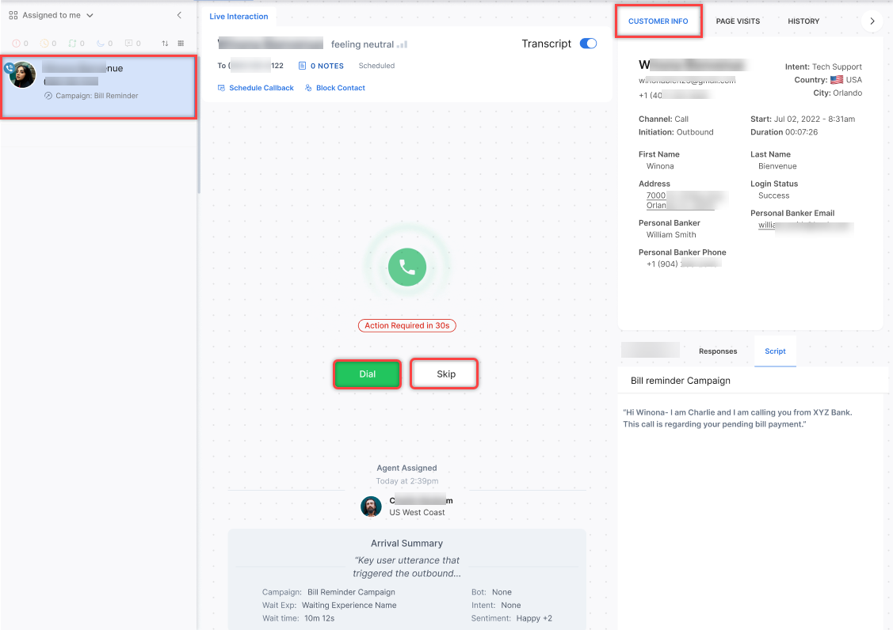

Key aspects:

* Call Information Preview: Agents see recipient details before calling, including name, account history, and other relevant data.
* Agent-Controlled Calls: Agents decide when to initiate each call. It allows preparation for more personalized interactions.
* Efficient Campaign Management: Assigns call records to available agents, helps optimize agent utilization, and adheres to dialing rules and compliance standards.

[Learn more →](../../contactcenter/campaigns/campaign-management/voice-campaigns.md#preview-dialer)

#### Analytics

**Add Alternate Text for JavaScript Messages**

By default, a “JavaScript Message” label in displayed in the chat/interactions history for messages written using JavaScript. Now, an Alternate Text can be added to these messages to explain their purpose more clearly. This Alternate Text will be shown in place of the JavaScript label in the interaction history across the application. The “Alternate text” for a JavaScript message can be added using the function `tags.addAlternateText(“value”)`.

**Improved Search Functionality with Filter Integration**

The search functionality has been enhanced to work seamlessly with applied filters.

Key improvements:

* Integrated search and filter: Search now considers active filter criteria. Results are limited to conversations matching both search and filter.
* Increased result relevance: Conversations matching search but not filter are excluded. Ensures consistent results with current filter settings.
The improvements result in a streamlined user experience, faster access to desired conversations, and reduced time spent on manual filtering of search results.

---

## v11.3.1 July 13, 2024

<u> Patch Release </u>

Key features and enhancements included in this release are summarized below.

#### Agent Console

**Enhanced Outbound Calling**

Agents can now make outbound calls from any status except "System Away" (Chat and Voice) and "System Busy" (Voice). This feature allows agents to contact customers at scheduled times or during emergencies without changing to "Available" status, preventing incoming calls.  

Key Points:  

* Outbound calls are possible while handling digital interactions.  

* No secondary outbound calls until the current voice call ends.  

* Agent status automatically changes to "System Busy" when initiating an outbound call.  
[Learn more →](../../console/interacting-with-customers.md#manual-outbound-call)

#### Administration

**Two-Factor Authentication (2FA) Support**

Contact Center AI now offers Two-Factor Authentication (2FA) for enhanced login security. When enabled in the Admin Console, 2FA becomes mandatory for all users of the account/workspace. If not enabled, the login process remains unchanged. [Learn more →](../../administration/security-and-control/two-factor-authentication-for-platform-access.md)

---

## v11.3.0 June 29, 2024

<u> Patch Release </u>

Key features and enhancements included in this release are summarized below.

#### Agent Console

**Enhanced Outbound Dialer**

The outbound dialer has been enhanced with the following functionalities:

* **Search Bar**: The search bar on the dialer interface allows agents to enter keywords or partial numbers to find configured contacts quickly.
* **International Subscriber Dialing (ISD) Code Update**: The dialer automatically adjusts the outbound phone number's ISD code based on the last country code used. This streamlines the process for agents making calls to different regions.
* **Phone Number Formatting**: The system displays the phone number in a standardized format when an agent enters it for dialing, regardless of whether the original number contains hyphens or brackets if the format is valid.
* **Validation and Error Handling**: An error message is displayed if an invalid number is entered (for example, incorrect length or characters). The call button is disabled until a valid number is entered, preventing accidental calls to inaccurate numbers. [Learn more →](../../console/interacting-with-customers.md#outbound-dialer)

**Improved Conversation Handling With an Explicit Reject Button**

Administrators can enable agents to explicitly reject an incoming interaction, allowing them to manage their workload efficiently. If Explicit Reject is enabled in the Answer Mode:

* Agents can Accept (✅) or Reject (❌) each interaction on the conversation tray.
* **Accept**: Displays the conversation panel for that interaction.
* **Reject**: Removes the interaction from the agent's queue and returns it to the queue for reassignment. [Learn more →](../../console/managing-incoming-interactions.md#manual-answer-mode)

The Monitor tab displays metrics relevant to rejection in the Agents and Interactions sub-tabs.

Monitor > Agents

* The Agents sub-tab now includes counts for rejected and unanswered interactions.
* Clicking an agent displays the count of Completed, Transferred, Rejected, and Unanswered interactions. [Learn more →](../../console/monitor-queues-agents-and-interactions.md#agents)

Monitor > Interactions

* Clicking an agent displays the count of Answered, Transferred, Rejected, and Unanswered interactions. [Learn more →](../../console/monitor-queues-agents-and-interactions.md#manually-assign-conversations-to-an-agent-and-change-queue)

#### Configuration

**Phone Number Labels for Outbound Dialer**

Administrators can now label outbound phone numbers (for example, Technical Support, Helpdesk). These labels appear next to phone numbers on the outbound dialer. Agents can search numbers by label, with results updating dynamically. The system logs all label-related activities, including creation, modification, and deletion.

#### Administration

**PII Redaction: Consistency Between Instance and Automation Bots**

To ensure consistency, the instance bot also redacts data that the Automation bot redacts and vice versa. This applies to all channels. This change affects new transcripts created from this release onwards. [Learn more →](../../app-settings/advanced-settings/pii-data-masking.md)

#### Analytics and Reporting

**Queue Metrics Interval Report**

This report provides queue performance metrics at sub-daily intervals (15 minutes to 4 hours). It includes service level data, highlighting both met and unmet targets. [Learn more →](../../analytics/contact-center/reports/queue-metrics-interval-report.md)

**Secure Form View Extended to 30 Days**

Administrators and Supervisors with access to Dashboard > Interactions can now view the data captured via the Secure Forms for up to 30 days from the conversation date.

**Auto Refresh of Monitor Tab Filters**

Automatic refresh for filters applied in the Monitor tabs at fixed intervals is implemented to ensure real-time data accuracy.

* Filtered data on Monitor tabs is updated at the specified interval, reflecting real-time changes.
* New interactions are not immediately added to filtered results but appear after the 5-second update interval.

#### Voice Gateway

**Changes to Bot Delay Handling**

These updates refine how delays are managed during bot interactions, enhancing the user experience by providing smoother transitions.

If a delay persists between two message nodes:

* In the case of a URL, the music stops immediately when the bot responds.
* In the case of a text message, the prompt plays completely, even after the bot responds.

Example: If a bot has the following nodes - Message → API → Message nodes.

* Waiting music starts playing when there is a delay from the API node.
* When the API node responds, the music stops gracefully, and the next message node begins playback without interruption.

#### API

**Task Name (tN) Field Added in the Response for Automation Bots**

The response of the Conversation History API is updated to show the “tN” field for all intents executed in Automation bots. This field accurately shows the task name associated with the executed intent. For example, “tN” = “Pay Bill”, “tN” = “Show Balance”. [Learn more →](../../apis/automation/conversation-history.md)

#### Campaigns

**Cloning Campaigns Without Schedule Configurations**

When a campaign is cloned, the new campaign will not include the schedule configurations of the parent campaign. [Learn more →](../../contactcenter/campaigns/campaign-management/voice-campaigns.md#clone-a-voice-campaign)

**Voice Campaigns: User Settings for Auto Dialers**

Administrators can enable voice support for inbound calls and outbound campaigns.

* Inbound: In the case of an Agentless Dialer, the agent can handle transferred calls.
* Outbound Campaigns: Agents can handle calls from Auto Dialers. [Learn more →](../../user-management/manage-users.md#)

**Progressive Dialer**

The Progressive Dialer is an outbound calling system that improves agent efficiency and productivity. It automatically dials the next number in a queue as agents complete their current calls, ensuring continuous activity. Calls are connected only when a human answers, filtering out voicemails and busy signals. Agents can review contextual information about the contact beforehand but have limited control over the timing or recipient of calls. The dialer optimizes lead allocation based on agent availability, tracks statuses to assign calls to the least busy agent, and provides comprehensive metrics and call statistics for monitoring and reporting purposes. [Learn more →](../../contactcenter/campaigns/campaign-management/voice-campaigns.md)

---

## v11.2.1 June 15, 2024

<u> Patch Release </u>

This update includes feature enhancements and bug fixes. Key features and enhancements included in this release are summarized below.

#### Configuration

**Revised Routing Logic When No Agents Available**

When no agents are logged in, conversations will now remain in the queue until the maximum wait time specified for that queue is reached. After the queue timeout occurs, the "no agents available" flow will be automatically triggered.

This enhanced routing logic is enabled by default at the account level for all new accounts and applies across all channels. It ensures that when agents are unavailable, conversations are handled smoothly by the fallback flow after the configured wait time, improving the customer experience.

Existing accounts will continue to use their current routing logic. To take advantage of this improved routing, please contact Support to modify your configuration. [Learn more →](../../console/interacting-with-customers.md#behavior-when-no-agents-are-available)

#### Voice Gateway

**Support for Additional Azure Voices**

Contact Center AI now supports additional Azure voices, providing a wider range of options for voice-based interactions. The following voices have been added:

* en-US: Ava
* en-UK: Sonia
* de-DE: Louisa
* en-AU: Freya
* es-ES: Elvira
* es-CO: Salome
* fr-FR: Denise
* it-IT: Isabella
* ko-KO: SoonBok
* Mandarin (China): XiaoXiao
* Cantonese (China): XiaoMin

Additionally, Ava Multilingual, a voice that supports a wide range of languages, has been introduced. Ava Multilingual supports the following languages:

* af-ZA, am-ET, ar-EG, ar-SA, az-AZ, bg-BG, bn-BD, bn-IN, bs-BA, ca-ES, cs-CZ, cy-GB, da-DK, de-AT, de-CH, de-DE, el-GR, en-AU, en-CA, en-GB, en-IE, en-IN, en-US, es-ES, es-MX, et-EE, eu-ES, fa-IR, fi-FI, fil-PH, fr-BE, fr-CA, fr-CH, fr-FR, ga-IE, gl-ES, he-IL, hi-IN, hr-HR, hu-HU, hy-AM, id-ID, is-IS, it-IT, ja-JP, jv-ID, ka-GE, kk-KZ, km-KH, kn-IN, ko-KR, lo-LA, lt-LT, lv-LV, mk-MK, ml-IN, mn-MN, ms-MY, mt-MT, my-MM, nb-NO, ne-NP, nl-BE, nl-NL, pl-PL, ps-AF, pt-BR, pt-PT, ro-RO, ru-RU, si-LK, sk-SK, sl-SI, so-SO, sq-AL, sr-RS, su-ID, sv-SE, sw-KE, ta-IN, te-IN, th-TH, tr-TR, uk-UA, ur-PK, uz-UZ, vi-VN, zh-CN, zh-HK, zh-TW, zu-ZA.

**AmiVoice Integration with Voice Gateway**

Voice Gateway now integrates with AmiVoice, a Japanese Automatic Speech Recognition (ASR) system, as part of an external application. By leveraging this integration, the Voice Gateway can now accurately process and understand Japanese voice inputs, leading to more efficient and effective voice-based interactions.

!!! note

    This integration is being validated post-deployment.
 
---

## v11.2.0 June 01, 2024

<u> Patch Release </u>

This update includes feature enhancements and bug fixes. Key features and enhancements included in this release are summarized below.

#### Agent Console

**HTML Elements Supported on the Agent Compose Bar**

Agents can now add hyperlinks to their typed text in the compose bar by highlighting the text and adding a hyperlink.

Using this feature, agents can do the following:

* Select a portion of their text and add a hyperlink to it.
* Remove the hyperlink if they change their mind.
* Add hyperlinks for HTTP and HTTPS URLs.
* Add hyperlink actions for email (`mailto:a@b.com`). Clicking the link opens the associated mail app.
* Customize the display text of the hyperlink.
* Display the full URL when an agent hovers over the hyperlink. [Learn more →](../../console/interacting-with-customers.md)

**Improved Sorting and Enhanced Auto Accept**

By default, new conversations will appear at the top of the conversation tray based on their order of acceptance. Agents can choose to revise the sorting order, placing the latest conversation at the top or bottom.

When a new auto-accepted conversation arrives in the agent's conversation tray, a **New** indicator is displayed beside it. When anyone applies a conversation filter that hides incoming auto-accepted conversations (for example, ongoing, idle), a preview of the auto-accepted conversations appears with a "View" button next to each hidden conversation to allow quick view and access. The indicator and the view option remain till the agent clicks the conversation and sends the first message. [Learn more →](../../console/managing-incoming-interactions.md#handling-incoming-interactions-based-on-answer-mode)

#### Voice Gateway

**User Diagnostics**

User diagnostics systematically assesses and analyzes network connectivity and device permissions to identify issues, optimize service delivery, and enhance user satisfaction. Using real-time monitoring, this tool helps resolve problems efficiently, improving agent performance and ensuring a seamless customer experience.

The User Diagnostics (♡) icon is at the top right corner of the Agent Console.  

**Agent Diagnostics**: Clicking the User Diagnostics (♡) icon displays the Agent Diagnostics page. Users can run diagnostics related to their:

* Audio Device,
* Video Device,
* Connectivity.

[Learn more →](../../console/manage-layout.md#user-diagnostics)

**Set Voice Chat on Voice Gateway Account**

Administrators can use a Utils method/script inside the script node to set up voice chat in accounts configured with Voice Gateway. [Learn more →](../../flows/node-types/utils.md#set-voice-chat-on-voice-gateway-account)

**Handling ASR Fallback Using Call Control Parameters**

The status column is updated if no fallback is configured or failover fails. If proper failover occurs, a timeline message is displayed.

#### Campaigns

**Schedule Proactive Web Campaigns**

The ability to schedule campaigns is extended to Proactive Web Campaigns. [Learn more →](../../contactcenter/campaigns/campaign-management/proactive-web-campaigns.md#schedule-proactive-web-campaigns)

**Dynamic Retrieval and Reflection of CSV Column Values**

Campaign managers can read, fetch, and display column/field values from a CSV file whenever required. This can be done within the message node in the start flow or by sending the necessary values to the Agent Console during an agent transfer, ensuring these values are reflected in the voice campaign call. [Learn more →](../../contactcenter/campaigns/list-management/list-management.md#dynamic-retrieval-and-reflection-of-csv-column-values)

#### Configuration

**Start Flows Table: Enhanced Visibility for Channels and Flow Types**

A Channels column is added to the Start Flows table. This column displays a list of all channels attached to each flow. Each row shows the flow type (call or chat) for each flow. [Learn more →](../../flows/introduction-to-flows.md#the-flows-live-board)

#### Analytics

**Bulk Download of ASR Transcripts**

Supervisors can select conversations and choose to Export Conversation Data or Export Transcripts.

* If Export Conversation Data is selected, the metadata of all selected conversations is exported.
* If Export Transcripts is selected, the exported transcript files retain the same naming convention currently used for all transcript exports. These files are compressed into a zip file named "transcripts-YYYY-MM-DD-HH24-mm-SS.zip.
* Up to 25 conversations can be selected for exporting transcripts.

**Display Agent and Disposition Notes in Search Results on the Interactions Tab**

Dashboard > Interactions

Agent notes and Disposition notes are now displayed in the search results on the Interactions tab.
[Learn more →](../../analytics/overview/conversations.md#search-conversations)

## v11.1.1 May 11, 2024

<u> Patch Release </u>

This update includes feature enhancements and bug fixes. Key features and enhancements included in this release are summarized below.

#### Voice Gateway

**Play HT Streaming Support**

Streaming for Play HT Text-to-Speech (TTS) is now supported. With streaming support, the voice gateway does not wait for the entire prompt audio to be generated before playback begins. This means reduced latency and a smoother user experience when playing prompts.

#### API

**Delete Call Recording API**

Applications with the relevant access can delete call recordings to manage storage and comply with privacy regulations.

A new scope called Delete Recordings is added under API Scopes. You can assign this scope to delete call recordings using a session ID. [Learn more →](../../apis/contact-center/delete-call-recording.md)

---

## v11.1.0 April 27, 2024

<u> Minor Release </u>

Key features and enhancements included in this release are summarized below.

#### Agent Console

**Outbound Emails**

Outbound email functionality is a key feature within Contact Center AI designed to streamline communication between agents and customers through email channels. Agents can now send outbound emails from the agent console. The outbound emails are independent of the ongoing conversations.  
[Learn more →](../../console/interacting-with-customers.md#outbound-email)

A new permission for Outbound Email is added in the Agent & Supervisor Experience section with the following details:

**Name**: Outbound Email

**Subtext**: Make outbound emails if enabled for the account

**Access Level**: Yes/No

* App Owner – Yes
* App Developer – Yes
* Supervisor – Yes
* App Tester – No
* Agent – No
* Custom Role – No (Default)  
[Learn more →](../../user-management/role-management.md#permissions)

#### Campaigns

**Schedule Voice Campaigns**

Scheduling allows precise control over when your messages will be delivered. You can now seamlessly plan campaigns to coincide with peak engagement times, ensuring maximum impact. [Learn more →](../../contactcenter/campaigns/campaign-management/voice-campaigns.md#schedule-voice-campaigns)

#### Agents & Supervisors

**System Busy and System Away Status Enabled by Default**

System Away and System Busy statuses are enabled by default for new accounts. For existing accounts, contact Support. [Learn more →](../../contactcenter/agent-and-supervisors/agent-management/agent-management.md)

**Enable/Disable Resolution Disposition Sets**

The **Resolution** Disposition Set comes prebuilt. App Owners can now enable/disable and edit the resolution disposition set. [Learn more →](../../contactcenter/agent-and-supervisors/dispositions/manage-dispositions.md#disposition-sets)

#### Analytics and Reporting

**Selected Hours Report**

The Selected Hours Report shows daily totals of every agent's productive hours. Productive hours are determined by built-in and custom statuses selected by users. [Learn more →](../../analytics/contact-center/reports/selected-hours-report.md)

---

## v11.0.0 March 30, 2024

<u> Major Release </u>

Key features and enhancements included in this release are summarized below.

#### Contact Center AI

Contact Center AI (previously SmartAssist) is now a part of AI for Service. You can now leverage Automation AI Use Cases and Search AI Answers to automate regular customer queries and seamlessly transfer them to a human agent as needed. The new Campaigns module helps streamline outbound voice and web campaigns. It provides templates and analytics to easily create targeted campaigns, reach audiences efficiently, track performance, and achieve goals more effectively.

The key features and experience changes are summarized below.

* **Experience Flows**:

    * **Improved Experience Flows**: To reduce confusion, the OnConnect/Welcome Events have now been merged into the new Experience Flows. With XO v11, the logic typically written in these events can now be easily managed via experience flows.

    * **Updated Flow Builder**: The Flow Builder interface has been revamped to provide a smoother, more intuitive user experience. The interface is similar to the Dialog Builder, making the transition seamless and effortless.  
    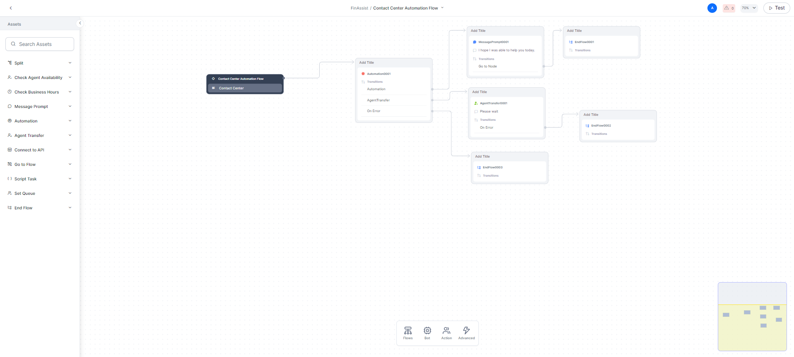

    * **Enhanced Automation**: Conversational Input and Run Automation Nodes Merged, Deflect to Chat Deprecated; the automation process is simplified by merging Conversational Input and Run Automation Nodes into a single entity: **Automation**. This consolidation streamlines bot invocation and aligns with usage patterns observed from existing customers and demo scenarios.  
    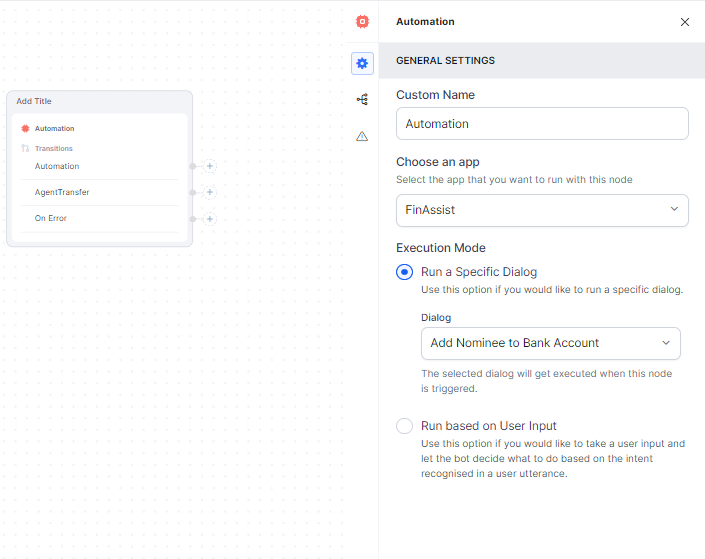

        Deflect to Chat is no longer supported. This change is driven by the limited usage observed among customers, but we remain committed to addressing relevant needs and exploring adding support based on internal use cases.

    * **Centralized Publish Module**: To ensure consistency, simplify workflow management, and centralize management tasks, we've introduced a centralized Publish Module. All flows can be published from this module.  
    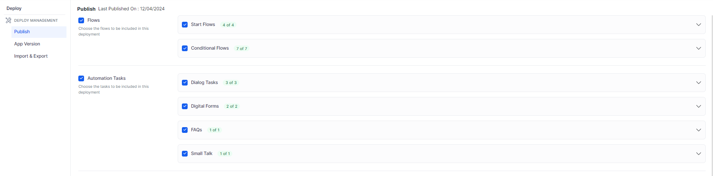

* **Channels**:

    * **Omni-channel Setup**: With Contact Center AI, you can seamlessly integrate various channels, including voice, chat, email, social media, and custom SDKs, to provide a unified experience for your customers and ensure effortless omnichannel communication.  
    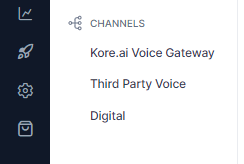

    * **Voice Gateway**: Expand your reach by enabling voice interactions through the Kore.ai Voice Gateway. It helps configure how Contact Center AI handles automation for inbound voice calls. Customers can engage with your contact center using natural language voice commands.

    * **Selective Routing**: One significant enhancement is the ability to selectively choose whether to direct customers to automation or human assistance. This feature empowers you to optimize customer journeys considering complexity, urgency, or preference.

    * **Support for Digital Channels**: Our platform is extended to support digital channels such as social media platforms, enterprise messaging apps, and custom SDKs. This allows you to engage with customers wherever they are, enhancing accessibility and convenience.

    * **Integration with 3rd Party IVR Systems**: Contact Center AI seamlessly integrates with third-party IVR systems, enabling you to leverage existing investments and infrastructure while benefiting from our advanced capabilities.

* **Role and User Management**:

    * **App Level User Definitions**: Users can be defined at the app level and assigned necessary roles, providing granular control over access and permissions.

    * **Contact Center Attributes**: Additional contact center attributes can now be added under the Contact Center section, enhancing customization and tailoring the application to your specific requirements.

    * **Administrator / Admin Role Deprecated**: The Administrator/Admin role is deprecated. Existing accounts will seamlessly transition to a new custom role with equivalent permissions on Contact Center AI, ensuring continuity and preserving access levels.

* **Updated Bot Architecture**: Instance and Automation bots are merged into a single bot. New accounts will require managing only one bot. However, existing accounts that will be migrated will continue to have separate instance and automation bots.

* **New Campaigns Module**: The new Campaigns module simplifies and enhances outbound efforts across voice and web channels. It offers tools for creating targeted voice campaigns and proactive web campaigns, supported by easy-to-use templates and comprehensive analytics. This allows businesses to efficiently reach their audience, monitor campaign performance, and achieve their objectives with greater precision and effectiveness.

    * **Voice Campaigns** :Use the power of voice technology to connect with your audience through personalized messages or interactive experiences. Setting up a new voice campaign is easy—begin with a targeted contact list to ensure your message resonates with the right audience.  
    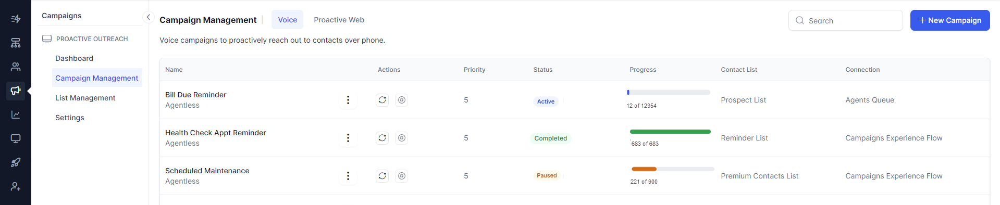

    * **Proactive Web Campaigns**: Elevate your online presence with proactive web campaigns to promote your products, services, or brand. Utilizing digital channels, these campaigns are crafted to increase visibility, generate leads, and build brand awareness, ensuring measurable success.  
    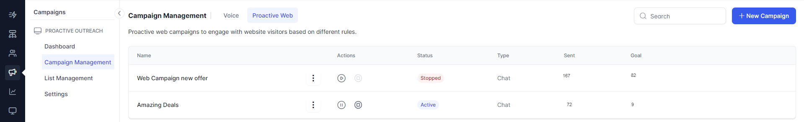

        You can create proactive web campaigns from scratch in various formats:  
        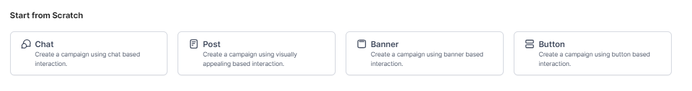

        You can also create proactive web campaigns using pre-defined templates. These templates save time and effort while ensuring consistency and brand identity. They are cost-effective, user-friendly, and offer flexibility for customization.  
        

    * **List Management**: List management involves organizing and maintaining targeted Contact Lists for efficient outreach while adhering to Do Not Contact (DNC) regulations.

        Managing Contact Lists:  
        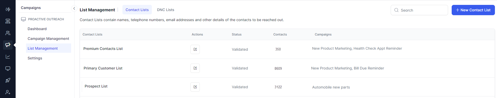

        Managing DNC Lists:  
        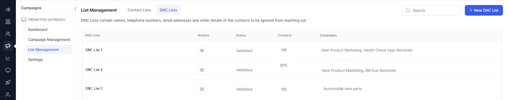

    * **Dashboard**: The campaign dashboard allows campaign managers to obtain an overview of all their campaigns, including their status—whether they're active, inactive, or completed. This centralized snapshot facilitates effortless monitoring and management.  
    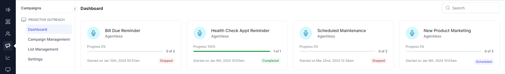

        You can drill down individual campaigns to get detailed insights.  
        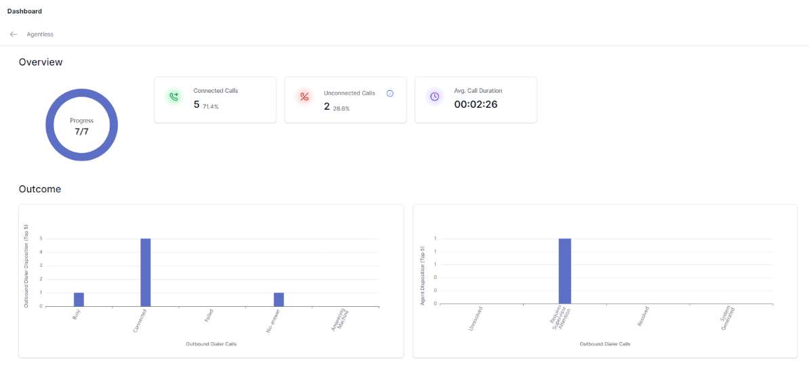

    * **Settings**: The settings allow campaign managers to decide the maximum number of concurrent calls that can be dialed.  
    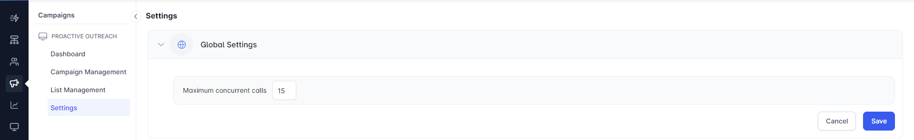

---

[Learn more about Contact Center AI features →](../../contactcenter/about-contact-center-ai.md)
