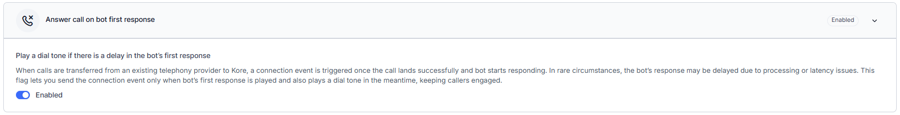

This document provides information on the feature updates and enhancements introduced in the **Voice Gateway** of AI for Service (XO) v11.x releases.

---

## v11.22.1 March 14, 2026

<u> Patch Release </u>

This update includes only bug fixes.

---

## v11.22.0 February 28, 2026

<u> Minor Release </u>

This update includes enhancements and bug fixes. The key enhancements included in this release are summarized below.

#### ASR and TTS

**Google Cloud TTS Streaming Support**

Google Cloud Text-to-Speech now supports both audio and text streaming. Audio streaming is enabled by default, while text streaming requires the TTS Streaming and Model Response Streaming flags. Streaming works across standard flows, Agent Node, and Agentic App use cases, with seamless playback, defined latency thresholds, fallback handling, and full backward compatibility. Support applies only to HD (Chirp) voices.

**Azure TTS Text Streaming Support in Voice Gateway**

Voice Gateway now supports Azure TTS text streaming, enabling progressive speech synthesis for real-time LLM responses. Streaming operates over WebSocket with seamless audio continuity, validation controls, and graceful fallback to non-streaming mode when needed.

**Deepgram ASR: Flux Model Integration**

Voice Gateway now supports the Deepgram Flux ASR model, delivering improved turn detection, lower latency, and better transcription quality. The ASR selection dropdown includes Deepgram ASR-Flux, supporting English across all accents.

#### Agentic Apps

**Remove Tool-Call Audio in Agentic App**

The system no longer plays default music when the Agentic App makes a tool call using real-time voice APIs. The platform remains silent during tool execution until the bot responds, preventing audio overlap—even if the response is delayed.

#### Configuration

**SIP Trunk Configuration: Same DID Handling**

If a SIP trunk uses the same DID with a different IP/FQDN, the system allows it across different accounts or apps, but prompts for confirmation within the same account and app. If both the DID and IP/FQDN match an existing entry, the system blocks creation and displays an error message. 

---

## v11.21.1 January 31, 2026

<u> Patch Release </u>

This update includes only bug fixes.

---

## v11.21.0 January 17, 2026

<u> Minor Release </u>

This update includes enhancements and bug fixes. The key enhancements included in this release are summarized below.

#### ASR and TTS

**TTS Streaming at Start Flow Level**

TTS Streaming can be configured at the start flow level to reduce voice response latency. The platform maintains a persistent streaming connection throughout the call and adapts playback based on the model's response streaming behavior.

**Continuous Gather at Start Flow Level**

Provided a Continuous Gather option at the start flow when TTS streaming is enabled. Caller input is captured continuously to reduce latency and support agentic voice interactions, without altering default behavior unless configured.

**Model Selection for ASR and TTS Providers**

The platform now permits model selection for ASR and TTS providers directly from the app-level and Start Flow-level UIs. The selected model is consistently applied across design-time and runtime voice scenarios, including interactions, transcriptions, and monitoring, without requiring call-control parameters.

**TTS Providers: Required Language Support**

The platform ensures that all natively supported TTS providers offer support for required languages wherever the vendor supports them. This applies to AWS Amazon Polly, Google, Microsoft Azure, ElevenLabs, OpenAI TTS, Deepgram, and similar integrations. The required languages include English, Japanese, Spanish, German, Arabic, French, Hindi, and Filipino.

---

## v11.20.0 December 07, 2025

<u> Minor Release </u>

This update includes enhancements and bug fixes. The key enhancements included in this release are summarized below.

#### Utils

**Call Transfer Utility**

A new utility function, voiceUtils.transfer enables seamless call transfers between experience flows within the platform or to external phone numbers, maintaining the same session ID and conversation continuity. Transcripts now reflect internal flow transfers for improved tracking and auditing. 

#### Call Transfer

**Support DTMF Input for Caller After External Call Transfer**

The platform now lets callers to provide DTMF input when an agent transfers a call to an external IVR or automated dialog system. This ensures that callers can continue interacting with the destination IVR or AI Agent, preserving the intended automated experience.

#### Inbound and Outbound Calls

**CSAT Survey Enhancements for Inbound and Outbound Voice Calls**

The Voice Gateway now delivers consistent CSAT survey behavior across all inbound and outbound call scenarios, honoring the last agent’s survey settings and callback rules.

#### ASR and TTS

**Global IVR Property Support for TTS Streaming**

TTS streaming now uses global IVR settings for barge-in, timeouts, prompts, and speech parameters. The update ensures consistent behavior across configuration levels.

**ASR, Bot, and TTS Latency Reporting (Beta)**

Latency reporting now captures ASR, Bot, and TTS delays at both node and call levels. The report includes end-to-end metrics, detailed call information, and highlights unsupported scenarios with clear notifications when data is unavailable.

#### API

**Outbound Dialing API - v2**

The updated API now sends Answering Machine Detection (AMD) configurations during call creation instead of after call connection. This lets AMD to start earlier, improving detection speed and reducing overall latency.

---

## v11.19.1 November 19, 2025

<u> Patch Release </u>

This update includes only bug fixes.

---

## v11.19.0 October 25, 2025

<u> Minor Release </u>

This update includes enhancements and bug fixes. The key enhancements included in this release are summarized below.

#### Call Recording

**Voice Call Recording - Failure Scenario Handling**

When fetching a voice call recording, the system displays context-specific messages. If the initial fetch or subsequent retries fail, users are prompted to retry, with unlimited attempts allowed, and a 15-minute wait message for repeated failures. If the 24-hour job fails, a final message advises contacting the administrator, with no action button displayed.

#### Text-to-Speech (TTS)

**Agent Platform – Text Streaming Support for Deepgram and ElevenLabs TTS**

Agent Platform now supports end-to-end streaming via the Voice Gateway for Deepgram and ElevenLabs TTS engines, delivering real-time AI Agent voice responses. A new ‘TTS Streaming’ flag in the Automation Node controls this feature. When enabled, it automatically disables the Real-time Voice Interactions flag to prevent conflicts. Streaming provides low-latency audio playback, gracefully falls back to standard TTS if interrupted, maintains full backward compatibility with existing configurations, and captures streaming latency metrics for monitoring performance.

#### Configuration

**Voice Call Recording Retention Configuration**

Administrators can now manage voice call recording retention settings directly in the UI. They can choose from various pre-approved retention durations, with default settings automatically applied based on the customer type. Additionally, administrators can enable optional reminder and acknowledgment emails for recordings that are at least one month old. Upon reaching the end of its retention period, a recording is automatically deleted, and customers receive notifications. All modifications to retention settings and notification preferences are recorded in the Admin Console.

---

## v11.18.0 September 27, 2025

<u> Minor Release </u>

This update includes enhancements and bug fixes. The key enhancements included in this release are summarized below.

#### Text-to-Speech (TTS)

**Custom Voices for Eleven Labs TTS**

When Eleven Labs TTS is selected in the Voice Name widget, a note now appears: “Want a custom voice? Submit a support ticket with your audio sample.” This provides a clear way for users to request a custom voice setup.

#### Call Control Parameters

**Enhanced Alternate Language Support in Call Control Parameters**

The node.alternate call control parameter supports additional parameters, including ttsLabel, in addition to the existing language and voiceName fields. This allows switching both ASR and TTS providers per language—for example, using ElevenLabs for English and Deepgram for Spanish—improving multilingual call control flexibility.

#### Configuration

**Play Dial Tone Until AI Agent First Response**

A new configuration option, Answer call on AI Agent first response, is available in  **Automation AI** → **App Settings** → **Advanced Settings** → **System Settings** → **Answer Call on First Bot Response**. When enabled, callers hear a dial tone if the AI Agent’s first response is delayed, preventing silence and reassuring them that the call is connected. The call remains active until the AI Agent responds, with duration controlled on the Session Border Controller (SBC) side. When disabled, the existing behavior continues, where callers hear silence until the AI Agent’s first response.  

#### API

**API to Start, Pause, Resume, and End/Stop Transcriptions and Call Recordings**

The enhanced version of the Control Transcription API (v2) now supports managing call recordings, in addition to transcriptions, for third-party agent desktops. This API provides enhanced flexibility and control during live interactions, allowing agent desktops outside of our ecosystem to manage transcriptions and recordings in accordance with business and regulatory requirements.

---

## v11.17.1 September 15, 2025

<u> Patch Release </u>

This update includes bug fixes.

---

## v11.17.0 August 23, 2025

<u> Minor Release </u>

This update includes enhancements and bug fixes. The key enhancements included in this release are summarized below.

#### Utils

**Support Call Control Parameters in Voiceutils**

The voicemail feature in `voiceutils.voicemail` now supports call control parameters, enabling dynamic language execution. This enhancement extends voicemail functionality beyond English to include additional languages, such as Spanish, to provide multilingual support.

#### Call Recording

**Voice Call Recordings Retention Configuration for On-Prem Customers**

On-prem customers can now configure a retention period for voice call recordings to meet compliance and storage needs. Recordings are permanently deleted after expiration, with email notifications sent 7 days before and upon deletion. Deleted recordings display the message: “Recording not available. It may have been deleted as per your data retention policy.” Customers who do not opt in remain unaffected. All configuration and deletion actions are logged in the admin console for audit purposes.

#### API

**Call Control Parameters in Outbound Calling API**

The Outbound Calling API now supports optional call control parameters, enabling third-party Contact Center platforms and external systems to dynamically configure ASR and TTS settings on a per-call basis. These parameters, passed alongside existing request parameters, are forwarded to the Speech and Voice Gateway (SAVG), allowing fine-tuned voice optimization without relying solely on app-level configurations. This enhancement improves voice quality and flexibility while maintaining full backward compatibility.

---

## v11.16.1 August 11, 2025

<u> Patch Release </u>

This update includes bug fixes.

---

## v11.16.0 July 26, 2025

<u> Minor Release </u>

This update includes enhancements and bug fixes. The key enhancements included in this release are summarized below.

#### Utils

**Support for 'ReferredBy' in VoiceUtils and AgentUtils**

Introduced support for the setReferredBy method in both VoiceUtils and AgentUtils functions. This enhancement enables developers to assign a referring number during call transfers, allowing the receiving party to identify the source of the referral. The addition improves call traceability and supports more transparent handoffs between agents or systems.

#### Flows

**Dynamic Feature and Default Settings Handling Based on Voice License and Configuration**

The platform now dynamically displays voice-related features and loads default settings based on the Voice selection, Voice Gateway presence, and Twilio configuration. During app creation and onboarding, only relevant components—such as SIP trunk setup, phone number purchase, test call, and voice flow elements—are shown based on license entitlements and environment setup. This enhancement streamlines the UI, improves performance by reducing unnecessary API calls, and prevents configuration errors by enforcing voice prerequisites. Logic also applies during bot import, ensuring real-time validation for consistent platform behavior.

#### ASR & TTS

**Deprecation of 'PlayHT' TTS from Voice Gateway Configuration**

Support for the 'PlayHT' TTS engine has been removed from all Voice Gateway configurations. All associated options, references, and API mappings have been eliminated to prevent configuration issues and ensure compatibility with currently supported TTS providers.

---

## v11.15.1 July 12, 2025

<u> Patch Release </u>

This update includes enhancements and bug fixes. The key enhancements included in this release are summarized below.

#### Phone Numbers

**Outbound Call App Selection for Agent AI**

Supervisors and administrators can now assign an app for Agent AI during outbound calls. This selection is configured per phone number, ensuring the correct app assists agents. The enhancement supports outbound calls that operate outside standard experience flows.

#### Text to Speech (TTS)

**Support for Additional ElevenLabs Voices**

Eight new Arabic-language ElevenLabs voices are now available in the Voice Gateway TTS configuration. Platform users can select region-specific voices like Raed (AR-SA-Male) and Hasan (AR-EG-Male) for more localized experiences.

---

## v11.15.0 June 30, 2025

<u> Minor Release </u>

This update includes enhancements and bug fixes. The key enhancements included in this release are summarized below.

#### Channels

**Video Call Support with Voice Gateway**

Agents can initiate video calls during Chat sessions, enabling richer, face-to-face interactions with users accessing the platform via the Web SDK. Video calls are not recorded or stored to ensure compliance with applicable regulations.

---

## v11.14.1 June 14, 2025

<u> Patch Release </u>

This update includes enhancements and bug fixes. The key enhancement included in this release is summarized below.

#### SIP Trunk

**Wildcard Pattern Matching for DID Assignment**

Wildcard pattern matching for DID assignment is now supported in SIP trunk configurations, streamlining large-scale deployments and reducing manual effort. Administrators can use patterns like `123*` to map multiple similar DIDs to SIP trunks and experience flows, eliminating the need to list each DID individually. Incoming calls are matched against these patterns, and the system triggers the associated experience flow. If multiple patterns match, the system selects the one with the most specific match (the highest number of matching digits). This enhancement improves routing accuracy and supports rapid, error-free configuration.

---

## v11.14.0 May 31, 2025

<u> Minor Release </u>

This update includes enhancements and bug fixes. The key enhancements included in this release are summarized below.

#### Channels

**Repeat User Identification for Voice Channel**

Repeat user identification is extended to the Voice Channel. This enhancement enables consistent recognition of returning users across all communication channels using predefined identifiers. It enhances routing accuracy and personalization in voice interactions while providing unified insights into user behavior for administrators, supervisors, and contact center operations teams.

#### Call Control Parameters

**Support for ‘Speed’ Parameter in Elevenlabs TTS**

The Elevenlabs Text to Speech (TTS) integration now supports the ‘speed’ parameter, allowing control over the speech playback rate. This enhancement enables adjusting the speaking speed for more natural and customized audio output.

#### Text to Speech (TTS)

**Added New Deepgram TTS Voices**

Four new English voices—Helena, Electra, Thalia, and Vesta (a slower, senior-friendly option)—are now available in the Deepgram TTS integration. Bot developers can select any of these voices to enhance the user experience and tailor voice interactions to specific audience needs. These additions offer greater flexibility in voice customization, enhancing caller engagement.

#### SIP Trunk Configuration

**Updated SIP Trunk Configuration for Agent AI with Third-Party Desktops**

The updated SIP Trunk Configuration for Agent AI now provides easier integration with third-party agent desktops, such as Genesys, NICE, and Talkdesk. It offers two methods for accessing real-time audio streaming:

* **SIPREC (SIP Recording)**: Agent AI acts as a SIPREC server, receiving duplicated audio streams directly from the contact center platform or Session Border Controller (SBC).  
* **WebSockets Audio Streaming**: For cloud-native platforms (for example, Genesys AudioHook), Agent AI uses secure WebSocket connections to subscribe to real-time audio feeds from the contact center's cloud environment. 

**Enable Call Recordings via SIPREC for Third-Party Agent Desktops**

You can now enable or disable call recordings for third-party Agent Desktop integrations in the “Configure SIP Trunk” page. These recorded calls can be accessed through a public API. To enable it, go to **Flows & Channels** > **Channels** > **Voice Gateway** > **SIP Numbers** > **Configure SIP Trunk** page.

#### Integration

**Voice Automation NiceCX (CX One) – SIP Integration with AI for Service**

The Voice Automation NiceCX (CX One) – SIP Integration is now supported in AI for Service.

---

## v11.13.1 May 17, 2025

<u> Patch Release </u>

This update includes only bug fixes.

---

## v11.13.0 May 03, 2025

<u> Minor Release </u>

This update includes enhancements and bug fixes. The key enhancements included in this release are summarized below.

#### SIP Trunk

**SIP Header Format Preservation in Voice Automation Transfers**

Voice Gateway now preserves the original format of SIP header names (specifically User-to-User headers—UUI) when sending them back to third-party contact centers during inbound call transfers to Voice Automation. The change applies to SIP Refer and SIP Invite methods in UUI Data Settings, agentutils/voiceutils functions in Automation AI, and channel override templates.

#### Text to Speech (TTS)

**Support for Emma Voice in IVR Channel**

The IVR channel now supports additional Emma voice options under the Microsoft Azure TTS provider. Users can select the following voices at the Start Flow, the first node of the Start Flow, and Voice Preferences settings:

* en-US-EmmaMultilingualNeural (Female)  
* en-US-EmmaNeural (Female)  
* en-US-Emma:DragonHDLatestNeural (Female)  
* en-US-Emma2:DragonHDLatestNeural (Female)  

This enhancement ensures greater flexibility and consistency in voice experience across IVR flows.

**LLM Streaming Support for Additional TTS Providers**

LLM Streaming is now supported for ElevenLabs and Deepgram TTS. This enhancement enables faster and more natural audio generation across a broader range of text-to-speech (TTS) engines, improving real-time responsiveness and user experience in voice interactions.

#### Phone Numbers

**Auto-Deletion of Inactive Twilio Phone Numbers**

Twilio phone numbers with no inbound or outbound activity, including test flows, that have been inactive for over 90 days will be automatically deleted and removed from the UI across the Phone Number Purchase screen, Experience Flows, and Outbound Dialer Widget. If a deleted number receives an inbound call, the bot will play the message: “Can’t place the call right now, please try later.” A notification on the Phone Numbers page (visible only to Administrators and App Owners/App Developers) informs users of this policy. The page also includes updated text about auto-deletion, and eligible users will receive email notifications 7 days before and on the day of deletion.

---

## v11.12.1 April 19, 2025

<u> Patch Release </u>

This update includes enhancements and bug fixes. The key enhancement included in this release is summarized below.

#### SIP Trunk

**Accurate Caller Number in SIP Headers**

When a call is transferred to an agent from a third-party desktop, the caller number set in the script node is passed through SIP headers instead of the DID number. This ensures accurate caller identification on external agent tools. This enhancement is currently applicable only for Experience Flow-based call transfers.

---

## v11.12.0 April 05, 2025

<u> Minor Release </u>

This update includes enhancements and bug fixes. The key enhancements included in this release are summarized below.

#### Call Control Parameters

**New Call Control Parameters to Support Deepgram**

New call control parameters have been added to improve transcription quality when Deepgram ASR is used. The parameters can be configured directly in the call control section of experience flows, allowing users greater control over transcription output.

* `smart_format`: Enables automatic formatting of numbers, dates, and punctuation for improved readability.
* `filler_words`: Controls the inclusion of filler words (um, uh, like) in transcriptions.
* `keyterm`: Boosts the Keyword Recall Rate (KRR) for important keyterms or phrases by up to 90%.

#### Flows

**Configurable Answering Machine Detection (AMD) for Inbound Calls**

The Experience Flows now include an Answering Machine Detection (AMD) option ('Start Flow' → 'Answering Machine Detection (AMD)'), which can be selectively enabled for inbound calls. The flag helps reduce latency by preventing unnecessary AMD processing. When enabled, the system will detect answering machines in incoming calls and store the results in context variables that can be used in Dialog/Experience flows. This feature is only available for Voice Start Flows and includes a checkbox that allows users to automatically disconnect calls upon machine detection, streamlining call handling based on specific business requirements.

#### Automatic Speech Recognition and Text-to-Speech

**Updated TTS Selection for OpenAI TTS**

The text-to-speech provider name has been updated from "Whisper" to "OpenAI TTS" to improve clarity and align with the OpenAI brand. This change can be seen in three key areas of the platform: Start Flow, Voice Preferences, and the general settings of the Start Node.

**Expanded Amazon Polly Voice Selection in TTS Dropdown**

When 'AWS Amazon Polly' is selected as the Text-to-Speech (TTS) engine, users can now access the full list of generative voices available for AWS Amazon Polly. These voices can be selected at the following locations:

* Flows & Channels → Start Flows,
* Start Node in a Start Flow,
* Voice Gateway → Voice Preferences → Manage

---