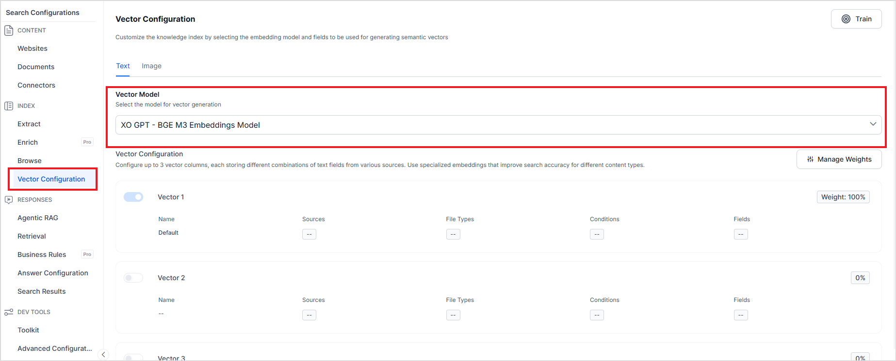
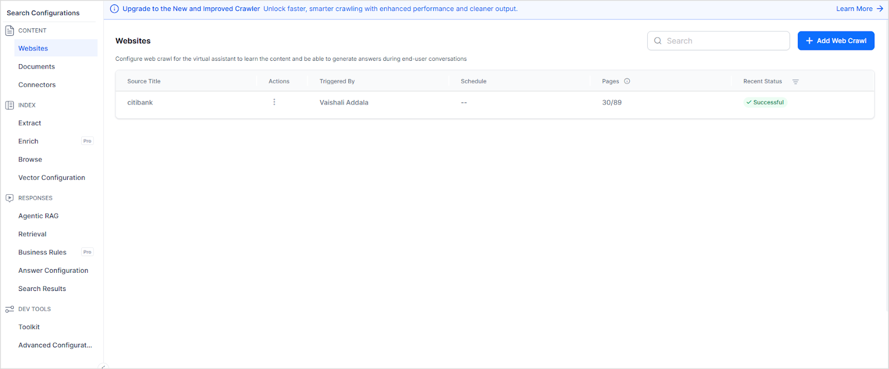
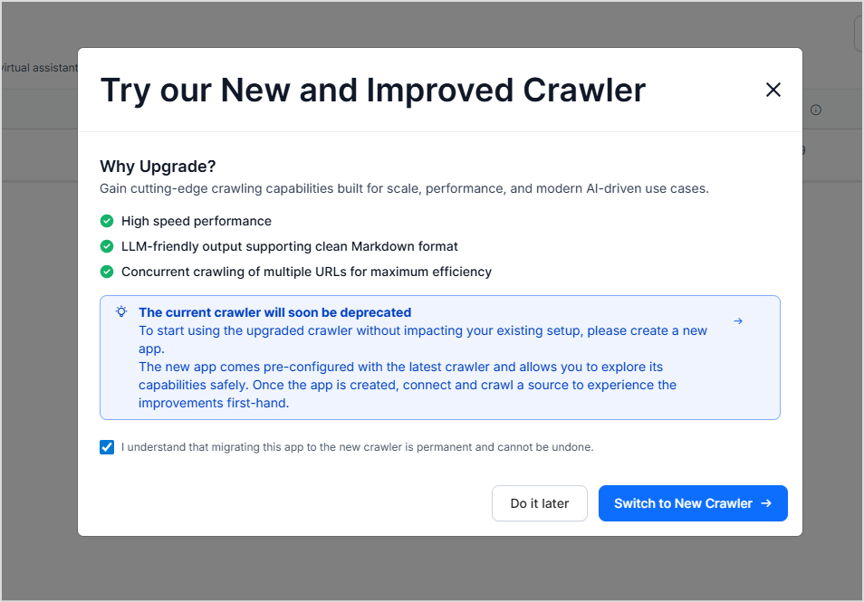
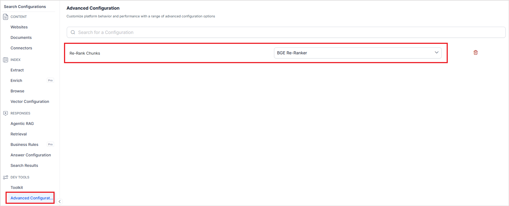

## Generative AI and LLM Updates

### Azure OpenAI

**Applies to:** Customers using Azure OpenAI via Custom Integration, or via System Integration with custom prompts.

Microsoft is retiring older versions of `gpt-4o` (`v2024-05-13` and `v2024-08-06`) and `gpt-4o-mini` on Azure Standard deployments (pay-as-you-go) on March 31, 2026. Use the table below to determine if you need to act.

**Do I Need to Act?**

| Your Situation                                     | Model Now Running          | Prompt Change Needed?          | Next Action                |
|----------------------------------------------------|----------------------------|--------------------------------|----------------------------|
| System Integration                                 | N/A                        | No                             | None                       |
| Provisioned / Global Standard / Data Zone Standard | Unchanged                  | No                             | Revisit before Oct 1, 2026 |
| Custom Integration — auto-upgraded                 | `gpt-5.1` / `gpt-5-mini` | **Yes** — replace `max_tokens` | Do it now                  |
| Custom Integration — pinned to `2024-11-20`        | `gpt-4o-2024-11-20`        | No                             | Revisit before Oct 1, 2026 |
| Custom Integration — no action taken               | `gpt-5.1` / `gpt-5-mini` | **Yes** — replace `max_tokens` | Do it now                  |

**No Action Required**

| Scenario                                                                                   | Reason                                                                                                                                                                         |
|--------------------------------------------------------------------------------------------|--------------------------------------------------------------------------------------------------------------------------------------------------------------------------------|
| You use **System Integration** with **System Prompts** for Azure OpenAI                    | Our platform manages your endpoint automatically. No changes needed.                                                                                                           |
| If your deployment type is **Global Standard**, **Provisioned**, or **Data Zone Standard** | The retirement date is October 1, 2026. Monitor [model retirement announcements](https://learn.microsoft.com/en-us/azure/foundry/openai/concepts/model-retirements?tabs=text). |

#### Action Required—Custom Integration or Custom Prompts

If you configured Azure OpenAI using Custom Integration, or used custom prompts via System Integration, act based on your current situation. First, check your model version in the [Microsoft AI Foundry Portal](https://ai.azure.com).

#### How to Check Your Model Version

1. Go to [https://ai.azure.com](https://ai.azure.com) and sign in with your Azure credentials.
2. From the left navigation pane, select **Deployments** under your project.
3. In the deployment list, click your deployment name (highlighted in blue) for `gpt-4o` or `gpt-4o-mini`.
4. In the Properties panel, go to the **Details** tab to see:
   - **Model version** — the version running on your deployment.
   - **Version update policy** — whether auto-update is on or off.

Use this to identify your scenario below.

#### Scenario A—Your deployment was auto-updated

Applies if your update policy is set to **Auto-update** in Microsoft AI Foundry, or if your older model version retired.

Your model is now running `gpt-5.1` instead of `gpt-4o` and `gpt-5-mini` instead of `gpt-4o-mini`.

Update all custom prompts that use the `max_tokens` parameter to replace `max_tokens` with `max_completion_tokens`. The `gpt-5` series of models don't support `max_tokens`. If you haven't updated, you see this error: `"Unsupported parameter: 'max_tokens' is not supported with this model. Use 'max_completion_tokens' instead."`

#### Scenario B—You manually pinned your deployment to `gpt-4o-2024-11-20`

Applies if you updated your model version to `2024-11-20` in Microsoft AI Foundry before the retirement deadline.

No action required immediately. This version supports both `max_tokens` and `max_completion_tokens` — no prompt changes needed. Update your deployment before **October 1, 2026**, when this version is also retired.

#### Scenario C—You took no action and auto-update was off

Microsoft updates your deployment after their model retirement. Your model runs on `gpt-5.1` or `gpt-5-mini` after the update. Follow the steps in [Scenario A](#scenario-ayour-deployment-was-auto-updated).

See [Microsoft AI Foundry Model Retirements](https://learn.microsoft.com/en-us/azure/foundry/openai/concepts/model-retirements?tabs=text).

## NLP Model Deprecation Notice

The Platform displays a notice for NLP-based apps  to inform users of the upcoming retirement of select network types and embedding models. Supported network types include Standard, Multi-lingual, Zero-shot, and Few-shot. Supported embeddings include Pre-trained MPNet and BGE M3.

## Search AI

The latest release of Search AI introduces important updates to improve the performance, stability, and flexibility of the platform. As part of this upgrade, some older components and models are being deprecated to make way for new and improved features.

### Deprecated Components and Timeline

**Automatic Migration Date: November 14, 2025**

| **Deprecated Components** | **Change** |
|---|---|
| Embedding Models: MPNet, LaBSE, E5, BGE-M3 V1 | Switch to BGE-M3 V2 or VDR |
| Old Crawler | Upgrade via banner prompt |
| Re-ranker models: MS Macro Cross Encoder, Mixbread Large | Switch to BGE Re-ranker |

**Key Points**

* After the Deprecation timelines, all the existing apps will be automatically updated to use newer components.

**Why This Upgrade?**

This deprecation is essential to:

* Support next-gen capabilities like adaptive re-ranking and advanced semantic search
* Deliver faster, more accurate answers
* Improve platform consistency and reduce legacy dependencies

### What's Changing and How to Upgrade

#### Embedding Models

**Deprecated Models**

* LaBSE, MPNet, E5, BGE V1

**New Defaults**

* **BGE V2** - For text embeddings (higher accuracy than all legacy models)
* **VDR** - For Image embeddings

**Impact on Existing Applications**

After November 14, your existing applications will automatically switch to BGE V2 and VDR.

**What will Change**

* Search results may rank differently due to improved semantic understanding.
* Higher accuracy in finding relevant content, especially for complex queries.
* Better handling of domain-specific terminology and context.

**Why This Change Benefits You**

* 25-40% improvement in search relevance across diverse domains.
* Better semantic understanding reduces the need for query optimization.
* The unified model approach ensures consistent performance across text types.

**How to Check Your Current Configuration**

* Go to your application > Search AI > Vector Configuration
* Check the embedding model listed.
* For applications already using BGE, to determine the version being used, refer to the application creation date. Apps created before the dates listed below use BGE-M3 V1, and apps created after these dates automatically use BGE V2, if BGE is selected.
    * US region: after July 15, 2025
    * Japan and Germany: after July 21, 2025
    * EU: after July 30, 2025
    * Australia and UAE: after July 31, 2025
    * India region: after August 7, 2025

Please note that if you have created an app after the date mentioned above, you don't need to create a new app to try out BGE V2.

**How to Test Before Migration**

1. Create a new application with the same source content as your existing app.
2. Your app will be automatically enabled with the BGE V2 model for embeddings.
3. Run identical searches and compare the results side by side. Specifically test the edge cases that are important to your use case.

**How to Upgrade**

Go to the Vector Configuration page of your Search AI app.

* If your app was created *after* the above-mentioned dates and is still using a deprecated model, select BGE M3 or VDR Vector Model from the dropdown, as appropriate.
* For older apps, created *before* the above-mentioned dates, the transition will occur automatically according to the [deprecation and migration timelines](#timelines).

#### Web Crawler

**Impact on Existing Applications**

If your application is still using the old crawler, we will automatically migrate it to the new crawler and initiate a re-crawl of the configured webpages. All the functionality stays the same between the two crawlers, so we will honor your existing configurations and re-crawl the content using the new crawler.

**What will Change**

* Crawl times reduced by 80%.
* Better extraction from JavaScript-heavy sites.
* Cleaner content with automatic filtering of navigation, ads, and boilerplate text.
* More successful crawls of complex websites.

**Why This Change Benefits You**

* Faster time-to-value with dramatically reduced crawl times
* Higher success rates on complex, modern websites
* Better content quality with intelligent filtering of irrelevant text
* Reduced resource usage means lower costs and better platform stability

*Note: The new crawler was released on May 31, 2025. New applications automatically use it, while existing applications can upgrade early via banner notification or will be automatically migrated by November 14.*

**How to Upgrade**

If your app is using the old crawler, you'll see an upgrade banner on the **Websites** page under Content.

Click on the banner to start the upgrade process.

Click on **Switch to New Crawler**. The crawler is automatically updated to the new crawler.

#### Re-ranker Models

**Deprecated Models**

* MS Macro Cross Encoder (sentence-transformers/all-MiniLM-L6-v2)
* Mixbread Large (mixedbread-ai/mxbai-rerank-large-v1)

**Supported Model (Default):**

* BGE (BAAI/bge-reranker-v2-m3) - Provides the highest accuracy among all re-ranker options

**Impact on Existing Applications**

If you're currently using re-ranker models, your applications will automatically switch to BGE:

**What will change:**

* Applications using MS Macro Cross Encoder or Mixbread Large will automatically use BGE-M3.
* Improved re-ranking accuracy, especially for complex queries requiring nuanced understanding.
* Consistent performance across different content types and languages.

If you're not using re-ranker models, there is no impact.

**How to Update**

If you are using a re-ranker, to update the re-ranker model, follow the instructions.

1. Go to your application > Search AI > Advanced Configuration
2. **Set up BGE-M3 re-ranker** in Advanced Configuration → Re-Rank Chunks

### Impact on Your Applications

**Existing Applications**

* No action is required after the automatic migration timelines have been met. All migrations will happen automatically.
* Applications will continue functioning without interruption.
* You may notice improved search accuracy and faster crawling after migration.

**New Applications**

* Automatically use BGE V2, VDR, and the new crawler.
* No configuration needed - best practices are applied by default.
* Access to the most accurate and fastest-performing models immediately.

### Testing the New Features

**Before Migration (Recommended):**

1. Create a new application to test the new models and the crawler.
2. Compare search results and performance with your existing application
3. Familiarize yourself with the improved capabilities

**What to Test:**

* Search accuracy with BGE V2 embeddings.
* Crawling speed and reliability with the new crawler.
* Overall application performance.

### Timelines

The existing applications will be automatically migrated in batches by November 14, 2025. Upon completion of the migration, you will receive a pop-up notification confirming the upgrade.

| **Date** | **Action** |
|---|---|
| **Now** | Test new features by creating new applications. |
| **November 14, 2025** | Automatic migration of all existing applications. |
| **After November 14, 2025** | Legacy models and old crawlers will no longer be available. |

### Frequently Asked Questions

**Can I opt out of this migration?**

No, this is a platform-wide upgrade that will apply to all applications to ensure consistent performance and enable new features.

**Will my search results change?**

You may notice improvements in search accuracy due to the superior BGE V2 model. Some specific result rankings may change, but overall relevance will improve.

**Can I still use the old crawler?**

No, after November 14, 2025, only the new crawler will be available. However, the new crawler provides significant performance and reliability improvements.

**What if my application breaks after migration?**

While we expect the migration to be seamless, our support team will be available to assist with any issues that may arise. We recommend testing with a new application beforehand to identify any potential concerns.

**Will I be charged differently for the new models?**

Pricing remains the same. You're getting improved performance and accuracy at no additional cost.

### Support

If you have questions or concerns about this migration:

* Create a new application to test the new features
* Contact our support team for technical assistance
* Review this documentation for detailed information about changes

We're excited to provide you with these improvements and look forward to the enhanced performance and capabilities they'll bring to your applications.
