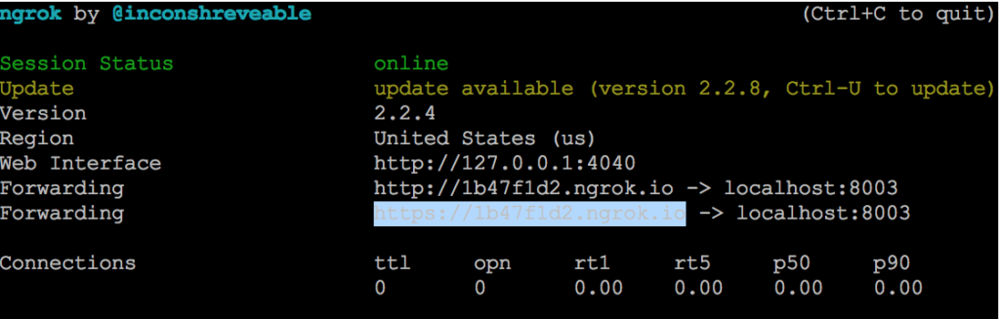

This tutorial walks through setting up the BotKit SDK with the _Flight Search_ sample assistant to handle webhook events. You will configure ngrok as a test callback server, register your app, and test the full flow.

---

## Prerequisites

| Prerequisite | Notes |
|-------------|-------|
| **ngrok** | Simulates your callback server on localhost |
| **Node.js** | Version 10 or above |

### Install and Run ngrok

1. Download from [ngrok.com/download](https://ngrok.com/download).
2. Start ngrok on port 8003:

   ```bash
   ngrok http 8003
   ```

   

3. Copy the HTTPS **Forwarding URL** (for example, `https://1b47f1d2.ngrok.io`). Leave ngrok running.

### Install Node.js

1. Download from [nodejs.org/en/download](https://nodejs.org/en/download/).
2. Verify the installation:

   ```bash
   node -v
   ```

   

---

## Configure the Assistant

### Install the Flight Search Assistant

1. Log into XO Platform and click **New Bot > Start from the Store**.
2. Find **Flight Search** and install it.

### Register Your App and Generate Credentials

1. Go to **Deploy > Integrations > BotKit**, click **Add** next to the **App name** dropdown.
2. Enter a name and click **Next**. Copy the **Client ID** and **Client Secret**. Click **Done**.
3. In **Callback URL**, paste the ngrok Forwarding URL.

   <Note>Each ngrok session generates a new URL. Update the Callback URL whenever you restart ngrok.</Note>

4. In **Events**, select **OnHookNode** — triggered when a Webhook node is reached in the dialog.
5. Click **Save**. The _Successfully subscribed_ message appears.

---

## Publish the Assistant

Publishing is required to share the assistant with other users. For testing only, skip to [Configure the BotKit SDK](#configure-the-botkit-sdk).

For publishing steps, see [Publishing your App](/ai-for-service/deployment/publishing-app).

**After publishing, deploy in the Admin Console:**

- **Enterprise Users** — Go to **Bots Management > Enterprise Bots**, click **Ellipses > Manage bot tasks**, select all tasks, and assign via **Bot & task assignments**.
- **General Public** — Go to **Bots Management > Consumer Bots**, click **Ellipses > Manage bot tasks**, and select all tasks.

---

## Configure the BotKit SDK

1. Download and extract the BotKit SDK from [github.com/Koredotcom/BotKit](https://github.com/Koredotcom/BotKit).

2. Edit `config.json`:

   ```json
   {
     "server": { "port": 8003 },
     "app": {
       "apiPrefix": "",
       "url": "<ngrok Forwarding URL>"
     },
     "credentials": {
       "apikey": "<Client Secret from XO Platform>",
       "appId":  "<Client ID from XO Platform>"
     },
     "redis": { "options": { "host": "localhost", "port": 6379 }, "available": false },
     "examples": { "mockServicesHost": "https://localhost:8004" }
   }
   ```

3. In `FindAFlight.js`, update the following variables with your assistant's **Bot Name** and **Bot ID** (found in **Settings > Config Settings > General Settings**):

   ```javascript
   var botId   = "st-26cfae3a-XXXX-XXXX-991a-376b7fe579d5";
   var botName = "Flight Search Sample Tutorial";
   ```

---

## Start and Test

1. In a Terminal window, navigate to your BotKit SDK folder and run:

   ```bash
   node app.js
   ```

   Expected output: `app listening at https://:::8003`

2. **Testing checklist:**
   - ngrok running: `ngrok http 8003`
   - Node.js running: `node app.js`
   - XO Platform: click **Talk to Bot** (bottom-right corner of any page)

3. After the Flight Search dialog starts, webhook messages are exchanged between the third-party web service and the BotKit SDK.

---

## Next Steps

For production use, replace the ngrok Callback URL with your actual server URL. Have your Enterprise Admin publish and deploy the assistant to users.

---
