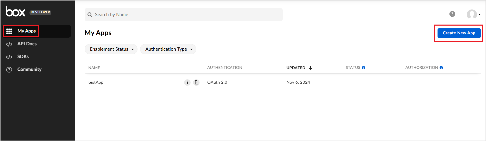
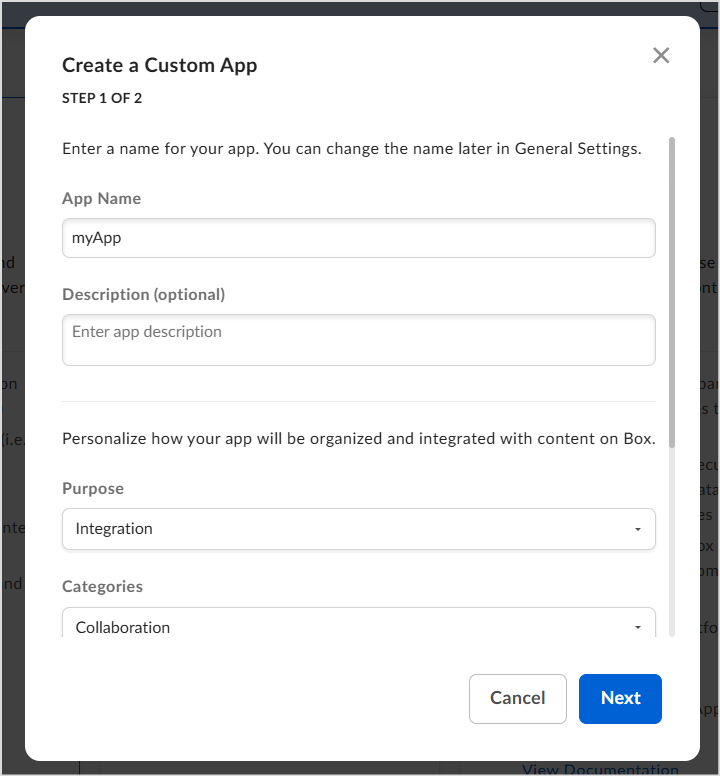
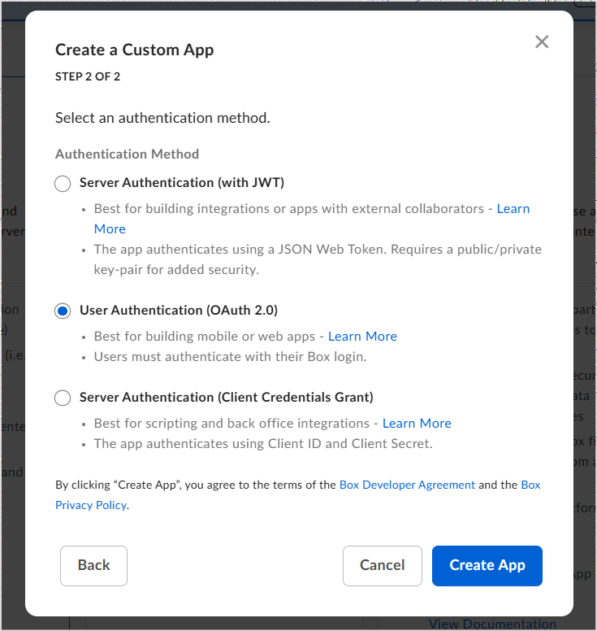
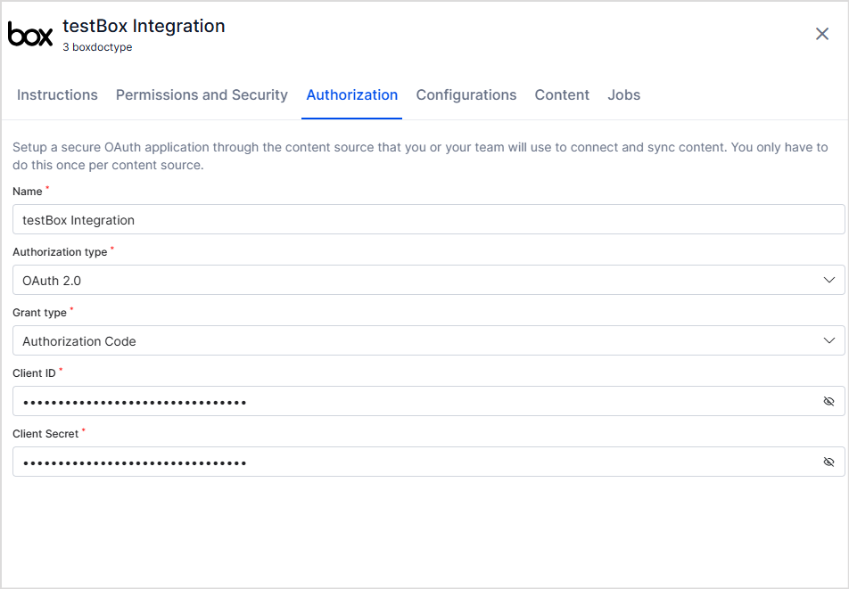

<Badge icon="arrow-left" color="gray">[Back to Search AI connectors list](/ai-for-service/searchai/content-sources#supported-connectors)</Badge>

The Box connector enables Search AI to ingest and search content stored in your Box account, including files and folders. Search AI uses OAuth 2.0 (authorization code grant) to access Box resources.

## Specifications

| Specification | Details |
|---------------|---------|
| Repository type | Cloud |
| Supported content | .pdf, .doc, .txt |
| RACL support | Yes |
| Content filtering | No |
| Automatic permission resolution | Yes |

## Prerequisites

Create an OAuth application in Box to obtain the client credentials needed for connector configuration.

## Create an OAuth Application in Box

1. Log in to the [Box developer console](https://app.box.com/developers/console).
2. Go to **My Apps** and click **Create New App**.

    

3. Create a **Custom App**:
   - Enter the app name, description, and purpose.

    

   - Select **User Authentication (OAuth 2.0)** and click **Create App**.

    

4. Go to the **Configuration** tab of the new app:
   - Note the auto-generated **Client ID** and **Client Secret** — these are used in Search AI.
   - Under **OAuth 2.0 Redirect URIs**, add the callback URL for your region or deployment.

    | Region | Callback URL |
    |--------|-------------|
    | JP | `https://jp-bots-idp.kore.ai/workflows/callback` |
    | DE | `https://de-bots-idp.kore.ai/workflows/callback` |
    | Prod | `https://idp.kore.com/workflows/callback` |

   - Under **Application Scopes**, enable:
     - **Read all files and folders stored in Box** — required to access content.
     - **Write all files and folders stored in Box** — required to download content.
   - Save the changes.

## Configure the Box Connector in Search AI

1. Go to the **Connectors** page in Search AI.
2. Select **Box Connector** and provide the following configuration details.

    

    | Field | Value |
    |-------|-------|
    | **Name** | Unique name for the connector |
    | **Authorization Type** | OAuth 2.0 |
    | **Grant Type** | Authorization Code |
    | **Client ID** | Client ID from the Box app |
    | **Client Secret** | Client Secret from the Box app |

3. Click **Connect**. You will be prompted to log in to Box and grant access.
4. After authentication, the Box connector shows as connected and is ready for use.

## Content Synchronization

Content synchronization ingests all files and folders accessible in the Box account into Search AI.

Go to the **Configuration** tab and:

- Click **Sync Now** to immediately sync content.
- Use **Schedule Sync** to set up automatic sync at a future time or regular interval.

## RACL Support

Search AI automatically resolves permission entities for Box content. It identifies all users with access to each file or folder in Box and associates them with the corresponding permission entities in Search AI.

When **Permission Aware** is enabled, access information is stored in the `sys_racl` field of each ingested item:

- The file owner is always included in `sys_racl`.
- All collaborators on the file are also added to `sys_racl`.
- Files or folders set to **Public Access** are available to all users, and `sys_racl` is set to `*`.
