<Badge icon="arrow-left" color="gray">[Back to Search AI connectors list](/ai-for-service/searchai/content-sources#supported-connectors)</Badge>

The Confluence Cloud Connector integrates Search AI with your Atlassian Confluence Cloud account, enabling intelligent search over your organization's knowledge articles using OAuth 2.0 authentication.

| Specification | Details |
|---------------|---------|
| Repository type | Cloud |
| Supported API version | REST API v1 |
| Supported content | Knowledge Articles |
| Access control support | Yes |

<Note>Only manually created Knowledge Articles are supported. Searching through other uploaded content types such as PDF files, attachments, docs, and images is not supported.</Note>

## Prerequisites

- An admin account in Atlassian Confluence Cloud
- A target domain
- Access to the [Atlassian Developer Portal](https://developer.atlassian.com/)

## Step 1: Configure an OAuth Application on Confluence Cloud

Sign in to your developer account at the [Atlassian Developer Portal](https://developer.atlassian.com/). Click your profile name at the top right and navigate to the **Developer Console**.

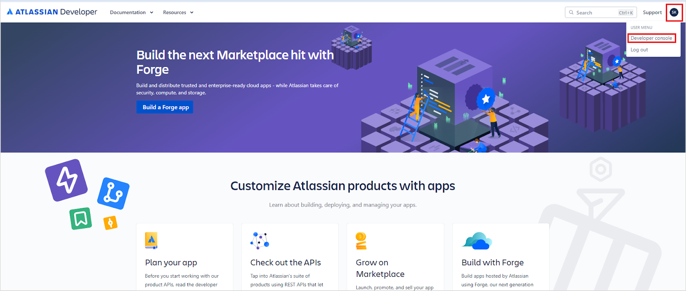

The Developer Console lists all your apps.

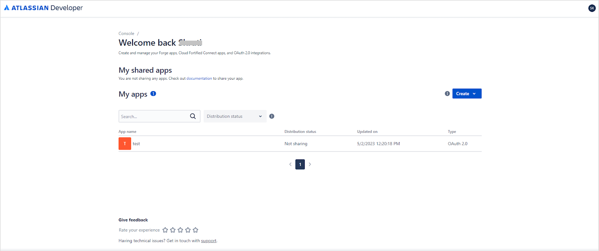

Click **Create** and select **OAuth 2.0 Integration**.

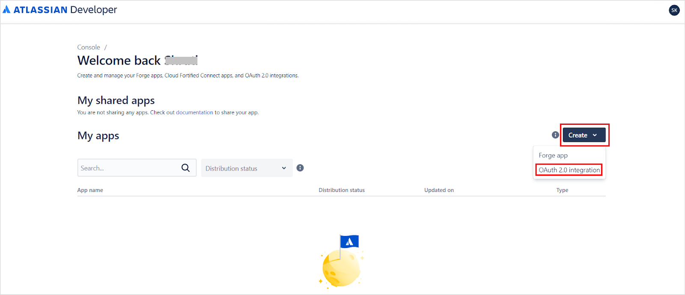

Provide a name for the application and click **Create**.

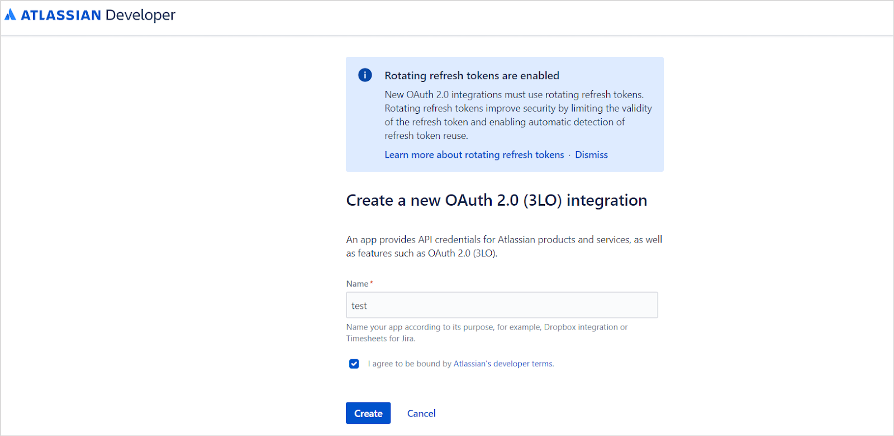

Update the application name and description from the **Settings** tab, optionally add an avatar, and click **Save changes**.

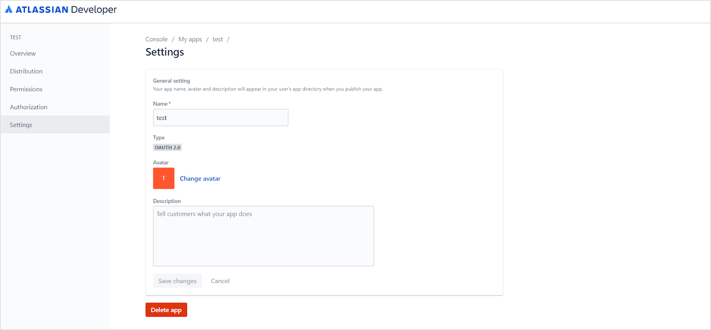

### Configure the Callback URL

Go to the **Authorization** tab and enter the Search AI callback URL for your region, then click **Save changes**.

| Region | Callback URL |
|--------|-------------|
| JP | `https://jp-bots-idp.kore.ai/workflows/callback` |
| DE | `https://de-bots-idp.kore.ai/workflows/callback` |
| Prod | `https://idp.kore.com/workflows/callback` |

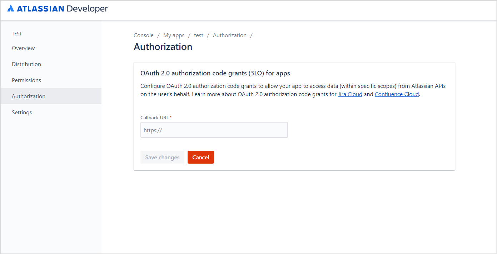

### Grant API Permissions

Go to the **Permissions** tab and add the following APIs:

- User Identity API
- Confluence API
- Jira API

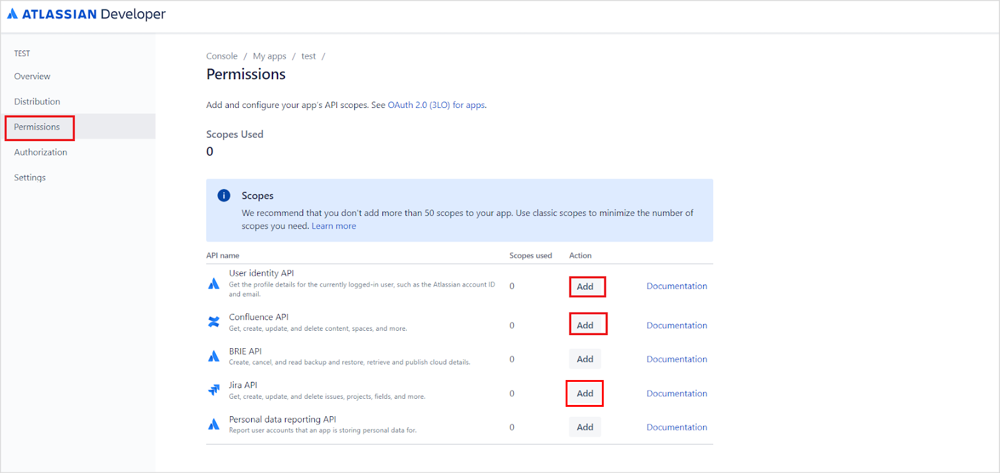

**User Identity API** — Click **config**, then **Edit Scopes**, grant the following permissions, and click **Save**:

- `read:me`
- `read:account`

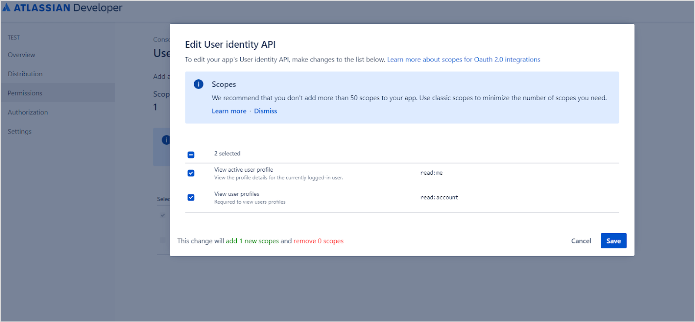

**Confluence API** — Go to **Granular Scopes**, select **Edit Scopes**, add the following permissions, and click **Save**:

- `read:analytics.content:confluence`
- `read:content-details:confluence`
- `read:content.permission:confluence`
- `read:content:confluence`
- `read:page:confluence`
- `read:space-details:confluence`
- `read:space.permission:confluence`
- `read:space:confluence`
- `read:user.property:confluence`

For **Classic Scopes**, add `read:confluence-groups` and click **Save**.

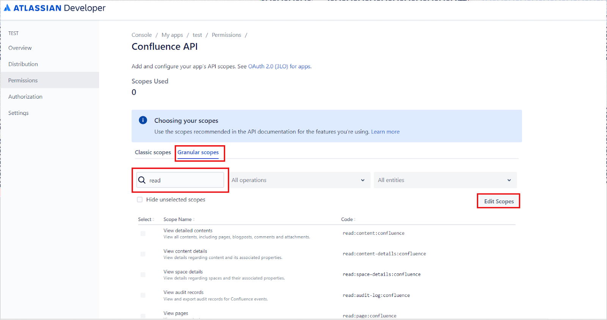

**Jira API** — Go to **Classic Scopes**, select **Edit Scopes**, add `read:jira-user`, and click **Save**.

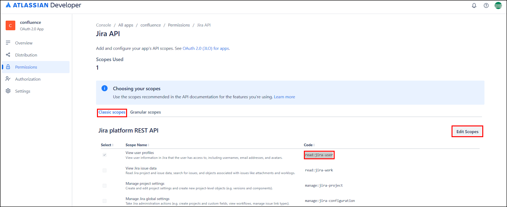

### Retrieve Client ID and Client Secret

Go to **Settings** and locate the **Client ID** and **Secret** at the bottom of the page. Save these for use in the next step.

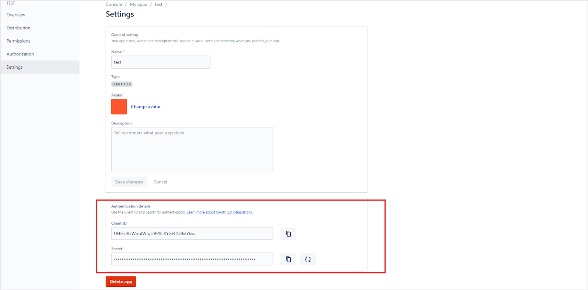

### Retrieve the Host URL

Go to the [Confluence home page](https://www.atlassian.com/software/confluence), click your **Profile**, and navigate to the **Products** tab. The host URL is displayed at the bottom of the page.

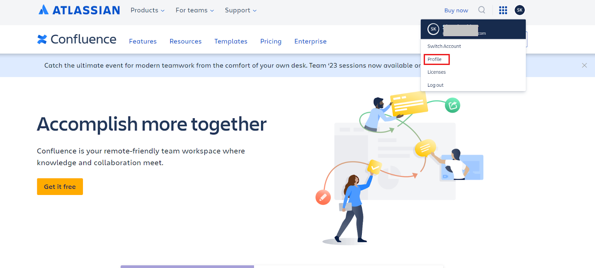

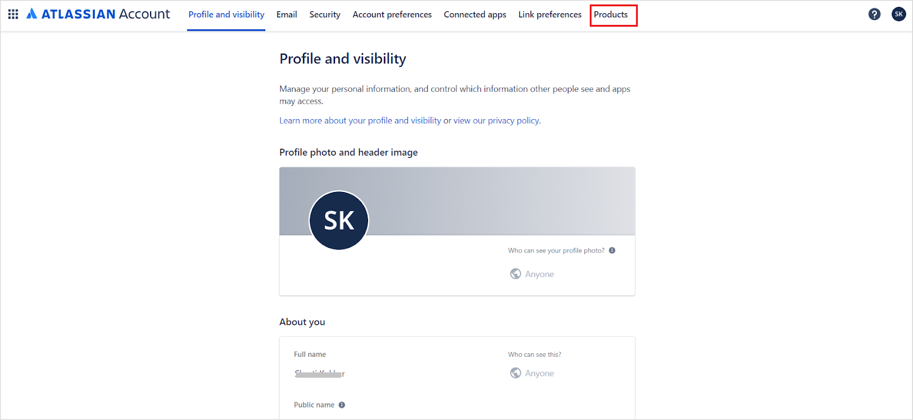

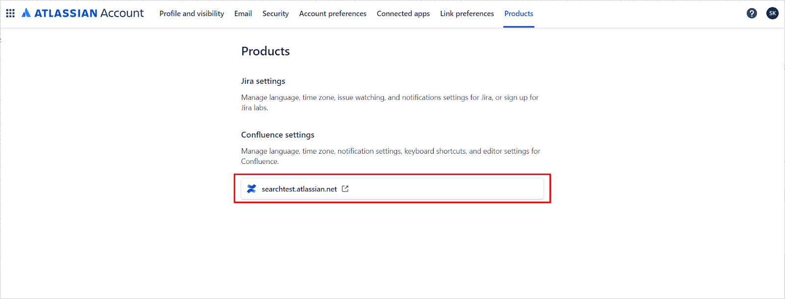

## Step 2: Configure the Search AI Connector

Go to **Content > Connectors** and select the **Confluence Cloud** connector. On the **Authorization** tab, enter the following fields:

| Field | Description |
|-------|-------------|
| **Name** | Unique name for the connector |
| **Authorization Type** | OAuth 2.0 |
| **Grant Type** | Authorization Code |
| **Client ID** | Client ID from the Confluence OAuth application |
| **Client Secret** | Client Secret from the Confluence OAuth application |
| **Host URL** | Confluence server base URL (without trailing slash) |

Click **Connect**. On successful authorization, the connector is marked as **Connected**. Authorization does not initiate content synchronization.

## Content Ingestion

Go to the **Configuration** tab and select the content to ingest. You can sync all content from the Confluence Cloud account or select specific content.

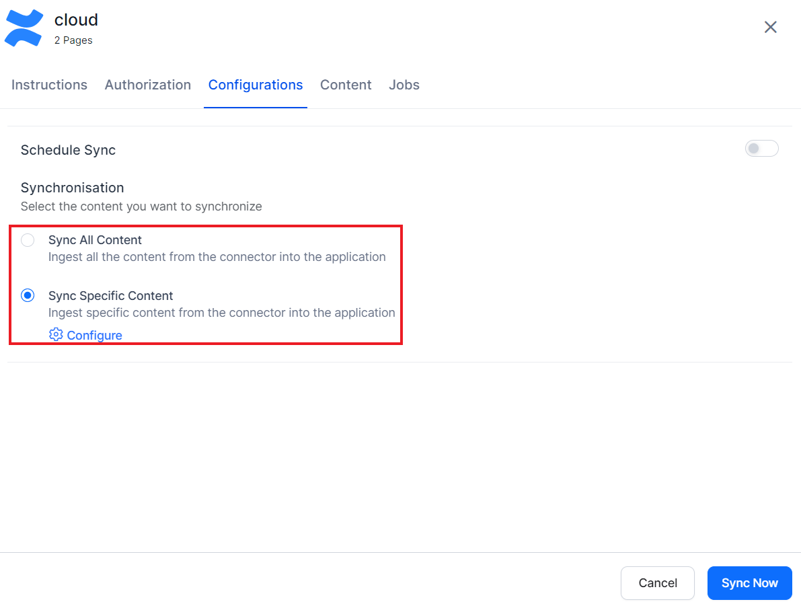

### Content Filters

To selectively ingest content, select **Sync Specific Content** and click **Configure**. Define rules using a parameter, operator, and value.

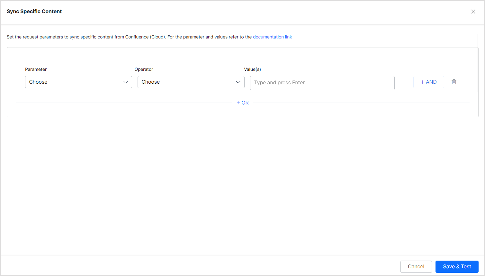

Supported filter parameters:

| Parameter | Description |
|-----------|-------------|
| **Ancestor** | Direct child pages and descendants of given content IDs |
| **Content** | Specific content by content ID |
| **Created** | Content by creation date (`yyyy/mm/dd hh:mm`, `yyyy-mm-dd hh:mm`, `yyyy/mm/dd`, `yyyy-MM-dd`) |
| **Creator** | Content created by specified user account IDs |
| **Label** | Content filtered by label |
| **Parent** | Content under a given parent |
| **ID** | Content by content ID |
| **Space** | Content in a specific space |
| **Title** | Content by page title |
| **User** | Content by user ID |

You can also add custom CQL fields. Refer to the [complete list of supported CQL fields](https://developer.atlassian.com/cloud/confluence/cql-fields/).

The Operator field accepts values such as equals, not equal, and contains, depending on the selected parameter.

**Example:** Ingest all pages and sub-pages under a given ancestor:

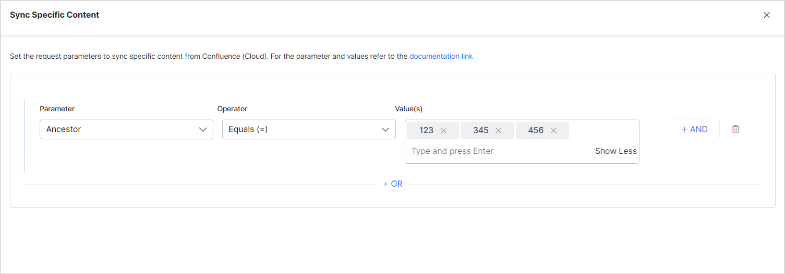

**Example:** Ingest only pages created or modified after January 1, 2024:

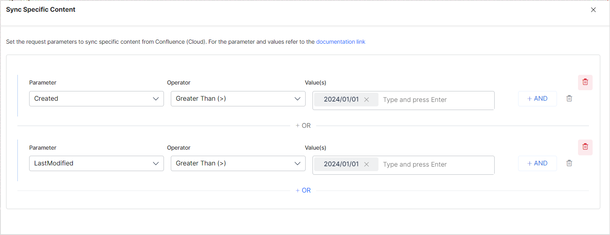

- Use the **OR** operator to combine multiple rules for different content types.
- Use the **AND** operator within a rule to apply multiple conditions. For example, to ingest content created after January 1, 2024 with "SearchAI" in the title:

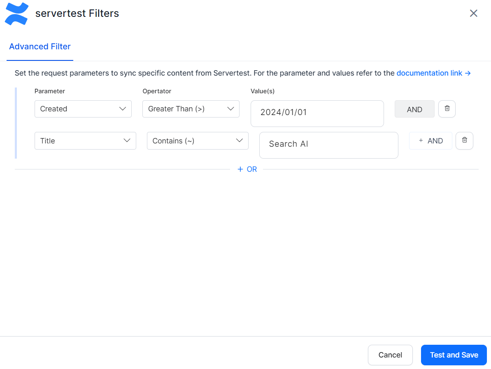

## Content Sync Schedule

**Manual sync** — Click **Sync Now** on the Configuration tab to immediately ingest all updates from Confluence Cloud.

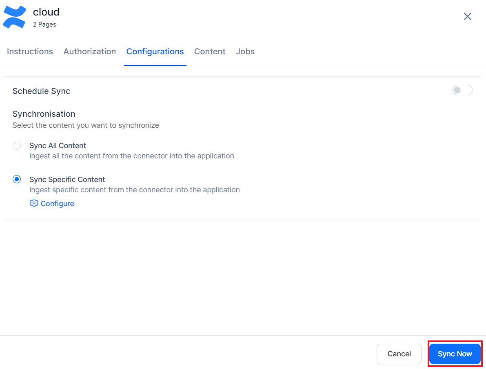

**Scheduled sync** — Enable **Schedule Sync** and set the date, time, and frequency to keep content automatically up to date.

## Access Control

Search AI supports access control for content ingested via the Confluence Cloud Connector. Go to the **Permissions and Security** tab and select the access mode:

- **Permission Aware** — Honors user permissions from Confluence Cloud. Users can only view search results for content they can access in Confluence.
- **Public Access** — Overrides Confluence permissions. All users can access all ingested content regardless of their Confluence permissions.

### Prerequisites

Access control relies on user email addresses as unique identifiers. The account used to configure the connector must be able to view user email addresses. Use an admin account or ensure users have enabled the required settings in their Confluence profiles.

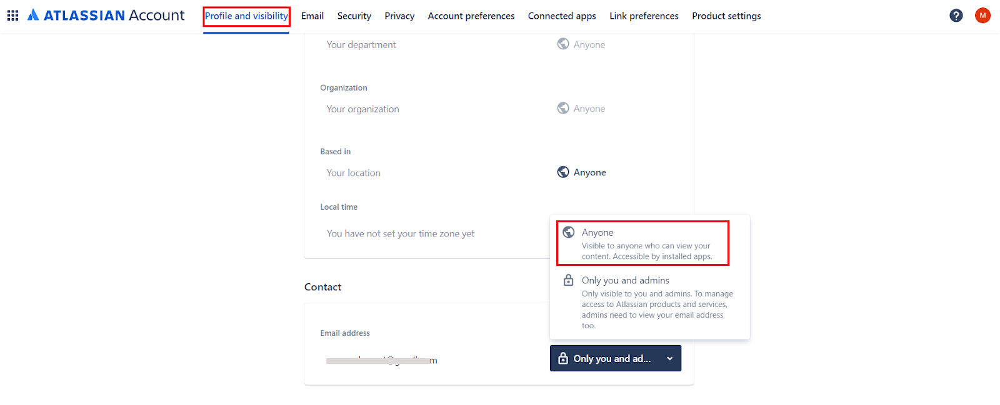

### Permission Sets in Confluence Cloud

**Space Permissions** — Each space has an independent set of permissions managed by space administrators. Search AI requires at minimum view permission to allow a user to access the content.

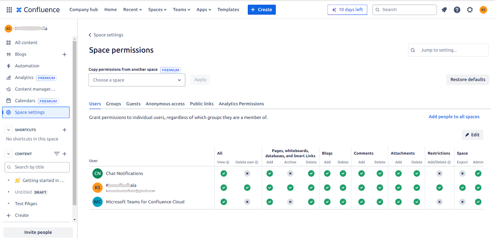

**Page Restrictions** — Pages inherit space permissions but can define their own restrictions. If a page is set to "Only specific people can view & edit," space permissions are not applied.

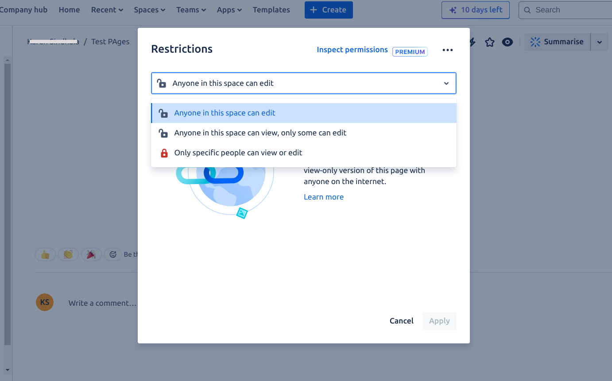

### How Permissions Are Handled in Search AI

Search AI uses the `sys_racl` field to control who can access ingested content. The value stored in `sys_racl` depends on whether the document is public or private:

- **Public documents** - The organization's domain name is included in the `sys_racl` field. This ensures that only internal employees belonging to that domain can access the content, rather than allowing unrestricted public access.

- **Private documents** - The space name is included in the `sys_racl` field. Access is scoped to users who have permissions within that specific Confluence space.

- **Individual access** — Users added directly to a space or page are listed in the `sys_racl` field of the indexed content by their email address. These users can directly access the content based on their permissions.

- **Group access** — When access is granted to user groups, Search AI creates a corresponding permission entity for the group. The `sys_racl` field stores the permission entity IDs. Add users to the permission entity using the Permission Entity APIs to grant access.

- **User Onboarding** - When onboarding users, all users must be registered with their associated domain name in Search AI. This ensures that domain-based access control for public documents functions correctly and that the right users are granted access to content scoped to their organization's domain. Use the Permission Entity APIs to associate users with their domain and the appropriate permission entities for group-based access.

### Limitation

Anonymous access is not supported. If a page allows anonymous access in Confluence Cloud, Search AI does not permit viewing that content.
