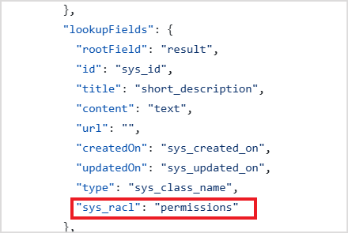

The Custom Content Connector enables Search AI to index content from applications that do not have a pre-built connector. It acts as a middleware between Search AI and a third-party application, retrieving content via REST APIs and converting it into an indexable format.

A reference implementation of the connector service is available for download and serves as a template for integration. The current implementation supports basic authentication.

## Setup

### 1. Download the Service

Obtain the skeleton custom connector service from the [SearchAssist Toolkit on GitHub](https://github.com/Koredotcom/SearchAssist-Toolkit/tree/master/Utilities/customConnectorService).

### 2. Configure the Service

- Modify `config.json` to include the application configuration details and content fields.
- Set the authorization password in the `.env` file in the root folder. Rename the existing `.env.sample` file to `.env` and add your auth value to the `Authorization` key.

### 3. Implement Changes (if needed)

Modify the service implementation as required. Refer to the [readme file](https://github.com/Koredotcom/SearchAssist-Toolkit/blob/master/Utilities/customConnectorService/readme.md) for details.

### 4. Host the Service

Host the configured service on your preferred platform.

## Configure the Custom Connector in Search AI

1. Go to **Content > Connectors** and select **Custom Connector**.
2. Configure the following fields:

   | Field | Description |
   |-------|-------------|
   | **Name** | Unique name for the connector |
   | **Endpoint** | URL and HTTP method of the hosted service. For the default implementation: `GET https://<serverip>/getContent` |
   | **Headers** | Key-value pairs sent as request headers |

3. Under **Headers**, add the authorization header required by the default service implementation:
   - **Key:** `Authorization`
   - **Value:** `<Your-Auth-Key>` (the value set in the service's `.env` file)

   > **Note:** The encoding format for a header can be set to `base64` (value is encoded before sending) or `none` (value is sent as plain text). The default for newly added headers is `base64`.

4. Click **Connect** to complete the setup.

## Content Synchronization

1. Go to the **Configurations** tab of the custom connector configuration page.
2. Click **Sync Now**.

The service retrieves batches of 30 documents from the third-party application and sends them to Search AI. Search AI processes each batch and indexes the content. Synchronization is complete when all batches are processed.

## Access Control

Search AI supports RACL on content ingested via the custom connector. The `sys_racl` field in the connector service `config.json` specifies which field in your source data holds permission information. The data fetched from that field is saved as a permission entity.

For example, if access information is stored in a `permissions` field in your content, set the `sys_racl` field in the connector service config accordingly:

A permission entity is created for every value fetched from the specified field. Use the **Permission Entity APIs** to add users to each permission entity. Only users added to a permission entity can access the content associated with it.

To enable RACL, go to the **Permissions and Security** tab and select **Permission Aware**. If **Public Access** is selected, all ingested content is available to all users.
