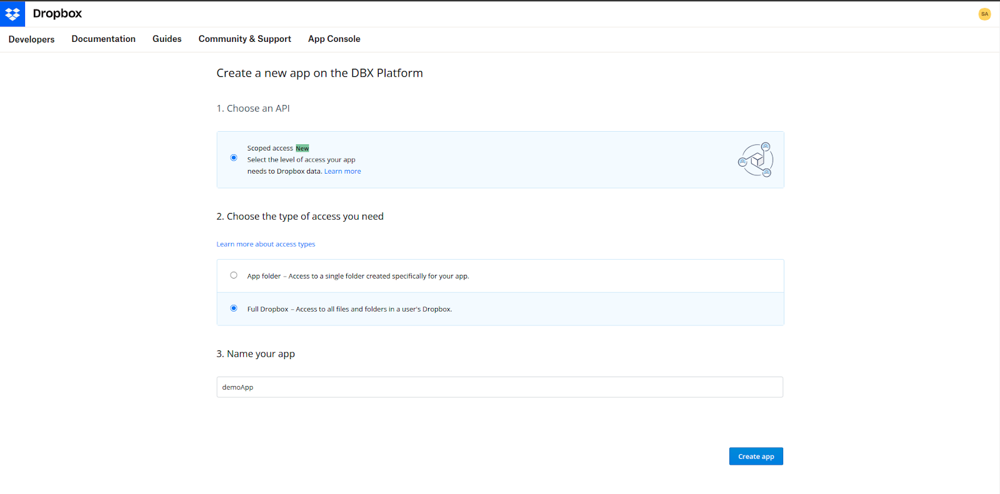
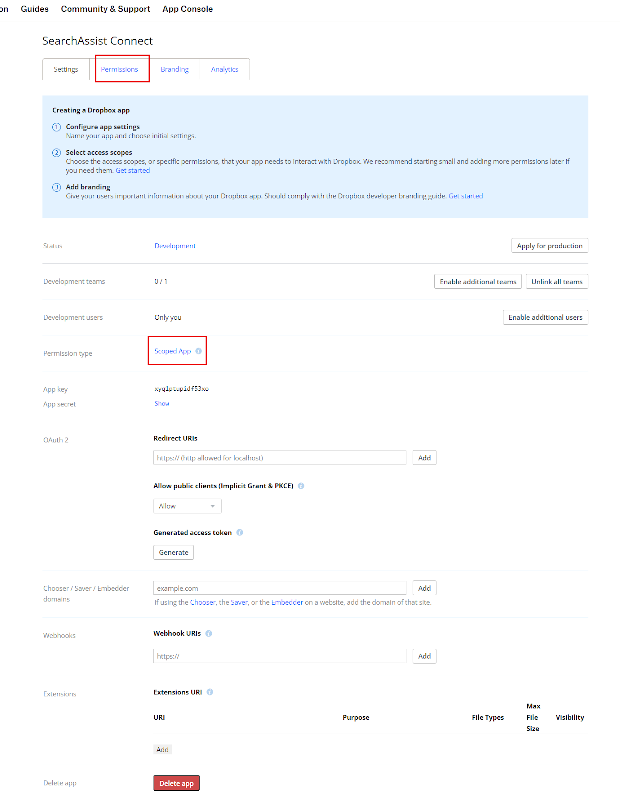
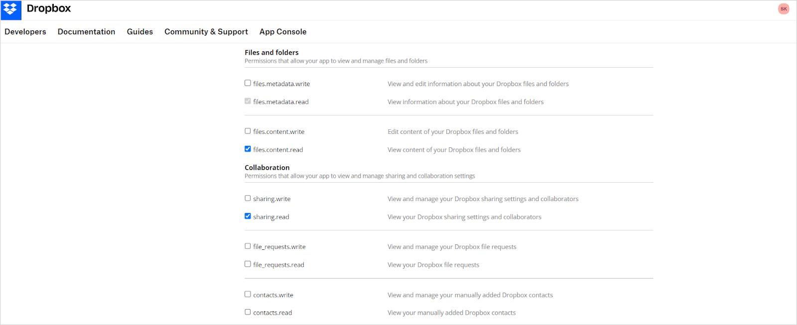
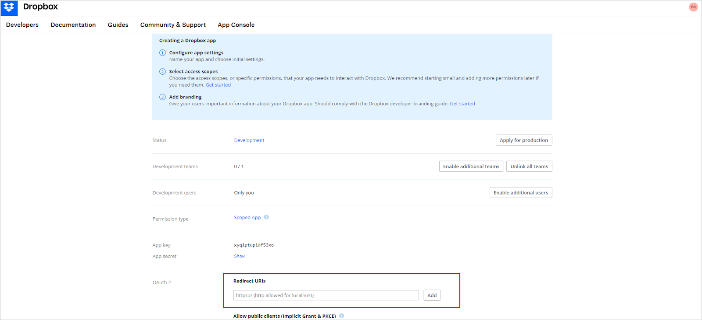
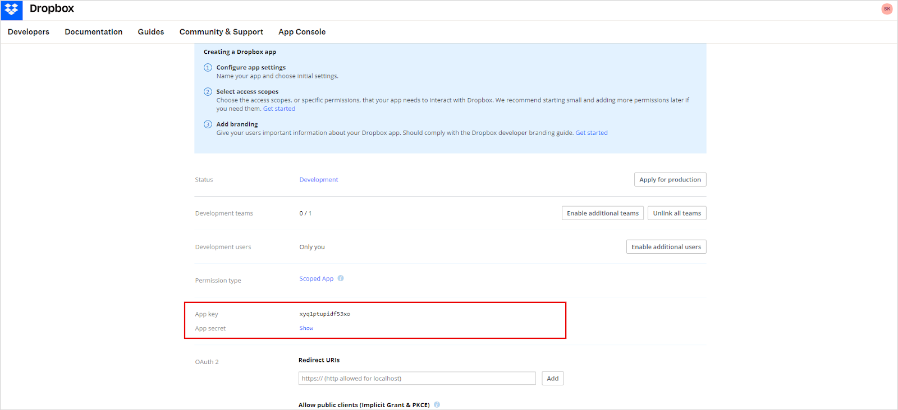

The Dropbox connector lets Search AI ingest and index files stored in your Dropbox account, enabling search across that content.

| Specification | Details |
|---------------|---------|
| Repository type | Cloud |
| Supported API version | Dropbox API v2 |
| Supported content | .doc, .docx, .ppt, .pptx, .pdf, .txt, .html (password-protected files are not supported) |

## Prerequisites

- A Dropbox account with permission to create developer applications
- Access to the Search AI application

## Step 1: Configure an Application in Dropbox

1. Sign in to the [Dropbox Developer Portal](https://www.dropbox.com/developers/apps).
2. Create a new app. Under **Choose an API**, select **Scoped access** and choose the appropriate access type.

   

3. Enter a name for the app, accept the terms and conditions, and click **Create app**.
4. Open the **Permissions** tab (or click **Scoped App**) and enable the following minimum permissions:
   - `files.content.read`
   - `sharing.read`

   

   

5. On the **Settings** tab, set the **Redirect URI** to the URL matching your deployment region:
   - JP Region: `https://jp-bots-idp.kore.ai/workflows/callback`
   - DE Region: `https://de-bots-idp.kore.ai/workflows/callback`
   - Prod: `https://idp.kore.com/workflows/callback`

   

6. Save the **App key** and **App secret** shown on the settings page. These are required in Step 2.

   

## Step 2: Configure the Dropbox Connector in Search AI

1. In Search AI, go to **Sources > Connectors** and select **Dropbox**.
2. On the **Authorization** tab, provide the following fields and click **Connect**:

   | Field | Value |
   |-------|-------|
   | Name | Unique name for the connector |
   | Authorization Type | OAuth 2.0 |
   | Grant Type | Authorization Code |
   | Client ID | App key from the Dropbox application settings |
   | Client Secret | App secret from the Dropbox application settings |

3. After a successful connection, go to the **Configuration** tab and click **Sync Now**.
