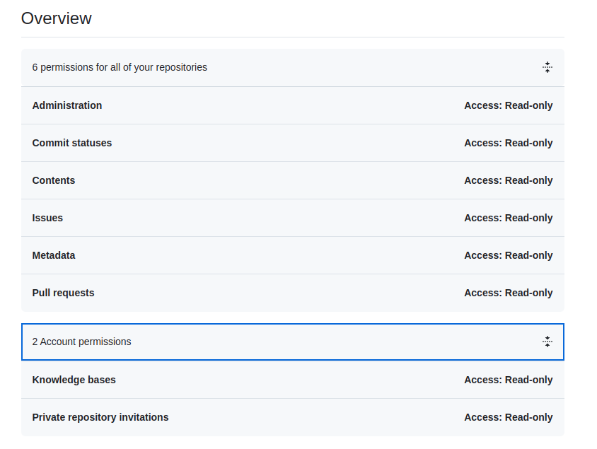

<Badge icon="arrow-left" color="gray">[Back to Search AI connectors list](/ai-for-service/searchai/content-sources#supported-connectors)</Badge>

GitHub is a widely used platform for version control and collaboration, enabling developers to host, manage, and track changes in code repositories. With the GitHub connector in Search AI, you can ingest and index issues, pull requests, and README files from GitHub repositories, making them easily searchable. The connector supports configuring and indexing content from one or multiple repositories simultaneously.

> **Note:** Searching through attachments is not supported.

## Specifications

| Specification | Details |
|---------------|---------|
| Repository type | Cloud |
| Supported content | Issues, Pull Requests, README files |
| RACL support | Yes |
| Content filtering | Yes |
| Auto permission resolution | Yes |

## Authorization Support

Search AI supports two authentication methods for GitHub:

1. Personal Access Token
2. OAuth 2.0

## Prerequisites

### Personal Access Token

1. In your GitHub account, go to [Developer Settings](https://github.com/settings/tokens) > **Personal Access Tokens**.
2. Under **Fine-grained tokens**, click **Generate new token** and enter the following:
   - **Resource owner**: Select your organization.
   - **Repository access**: Choose **All repositories**.
3. Assign the required permissions and save.

### OAuth 2.0

1. Register a new [OAuth application](https://github.com/settings/developers) in GitHub.
2. Enter the basic details of the app.
3. Use one of the following callback URLs based on your region:
   - JP Region: `https://jp-bots-idp.kore.ai/workflows/callback`
   - DE Region: `https://de-bots-idp.kore.ai/workflows/callback`
   - Prod: `https://idp.kore.com/workflows/callback`
4. Generate a Client ID and Client Secret.
5. Use the [device flow](https://docs.github.com/en/apps/oauth-apps/building-oauth-apps/authorizing-oauth-apps#device-flow) and the client credentials to manually create an access token using an API client tool such as Postman.

## Configure the GitHub Connector in Search AI

1. Navigate to the **Connectors** page and select **GitHub**.
2. Provide the following fields:

   | Field | Description |
   |-------|-------------|
   | **Name** | Unique identifier for the connector |
   | **Authorization Type** | Personal Access Token or OAuth 2.0 |
   | **Token / Client Credentials** | Provide the token (PAT) or client credentials (OAuth 2.0) |

3. Click **Connect** to authenticate.

## Content Ingestion

1. In **Manage Content**, select the object types to ingest: **Issues**, **Pull Requests**, or **README files**.
2. Choose an ingestion mode:
   - **Ingest All Content** — syncs all content from accessible repositories. Click **Sync**.
   - **Ingest Filtered Content** — configure standard filters to select specific repositories.

**Standard Filter**

Select the repositories to ingest from. All accessible repositories are listed. Select the required repositories and click **Add Selection**.

**Ingested Fields**

The content type is identified by `doc_source_type` in the ingested JSON. For all content types, `repository_id` and `repository_name` capture repository details, and the `url` field contains the link to the specific object. Creation and update timestamps are stored in their respective fields.

- **Issues**: Also captures status, comments, reporter, assignee, reactions, closure date, closed by, and labels.
- **Pull Requests**: Includes commit details in the `content` field, plus associated project, PR visibility, and assigned reviewers.

## RACL Support

Each piece of content (issue, pull request, or README) is linked to a repository through a unique repository ID. When ingested into Search AI, the repository ID is stored in the `sys_racl` field of the corresponding chunks. These repository IDs are the permission entities that control access.

Search AI automatically identifies users who have access to each repository in GitHub and associates them with the corresponding repository ID permission entity — no manual mapping required.
