The Google Drive connector for Search AI extends search capabilities to content stored in Google Drive cloud storage, providing a seamless search experience across your drive files.

## Specifications

| Specification | Details |
|---------------|---------|
| Repository type | Cloud |
| Supported API version | Google Drive API v3 |
| Supported file types | .doc, .docx, .ppt, .pptx, .pdf, .txt, .html (password-protected files not supported) |
| RACL support | Yes |
| Auto permission resolution | Yes |

Setting up the Google Drive connector involves two steps:

1. Set up and enable access to Google Drive cloud storage.
2. Configure the Google Drive connector in Search AI.

## Step 1: Set Up Google Drive Access

1. Sign in to the [Google Cloud Console](https://console.cloud.google.com/) and [create a Google Cloud project](https://developers.google.com/workspace/guides/create-project). Skip this step if using an existing project.
2. [Find the Google Drive API and enable it](https://developers.google.com/workspace/guides/enable-apis) in your Google Cloud project.
3. [Configure OAuth consent](https://developers.google.com/workspace/guides/configure-oauth-consent) to enable OAuth 2.0 authentication.
4. In the Google Cloud console, go to **Menu > Google Auth Platform > Branding**. Provide the application name, email address, app logo, and developer contact information.
5. Add the Search AI domain to **Authorized domains**.
6. Under **Data Access**, click **Add or remove scopes** and select the following Google Drive API scopes. Click **Update**.
   - `.../auth/drive.file`
   - `.../auth/drive.appdata`
   - `.../auth/drive`
7. Go to the **Audience** page and set the user type to **External**.
8. Set the publishing status. In **Testing** mode, only added test users can access the app. In **Production** mode, the app is available to all Google account users.

   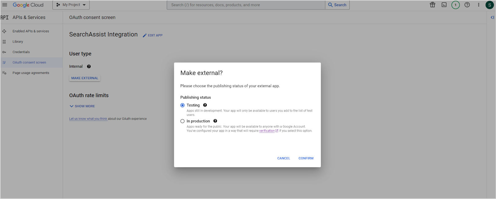

   To add test users in Testing mode, click **ADD USERS** on the same page.

   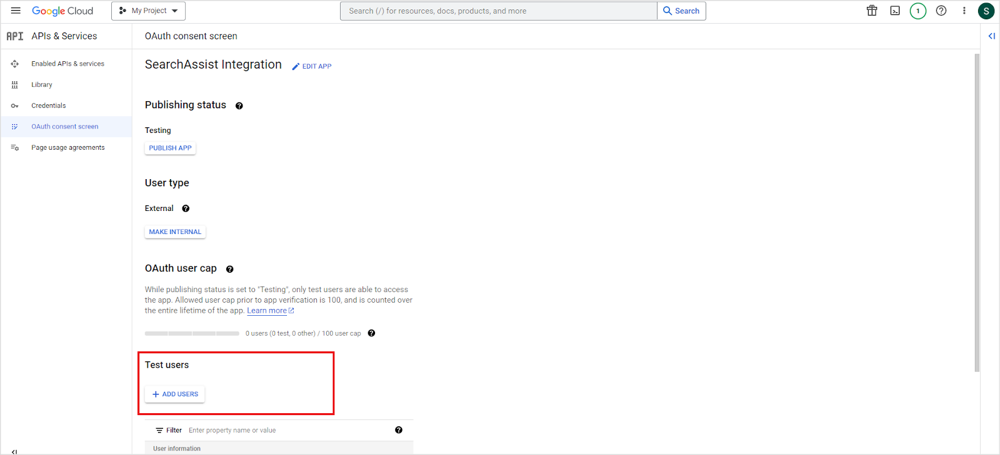

9. Navigate to the **Clients** page and create a new client. Set **Application type** to **Web Application**, give it a name, and add one of the following as the **Authorized redirect URI** based on your region:
   - JP Region: `https://jp-bots-idp.kore.ai/workflows/callback`
   - DE Region: `https://de-bots-idp.kore.ai/workflows/callback`
   - Prod: `https://idp.kore.com/workflows/callback`
10. Click **Create**. Download the generated credentials file (JSON format), which contains the client ID and client secret.

## Step 2: Configure the Google Drive Connector in Search AI

1. Go to **Content > Connectors** and select **Google Drive**.
2. Configure the authorization parameters:

   | Field | Description |
   |-------|-------------|
   | **Name** | Unique name for the connector |
   | **Authorization Type** | OAuth 2.0 |
   | **Grant Type** | Authorization Code (supported for Google Drive) |
   | **Client ID** | Client ID from the downloaded credentials file |
   | **Client Secret** | Client secret from the downloaded credentials file |

3. Click **Connect** to establish the connection.

Once connected, go to the **Configurations** tab and click **Sync Now** to synchronize content. View ingested content on the **Content** tab.

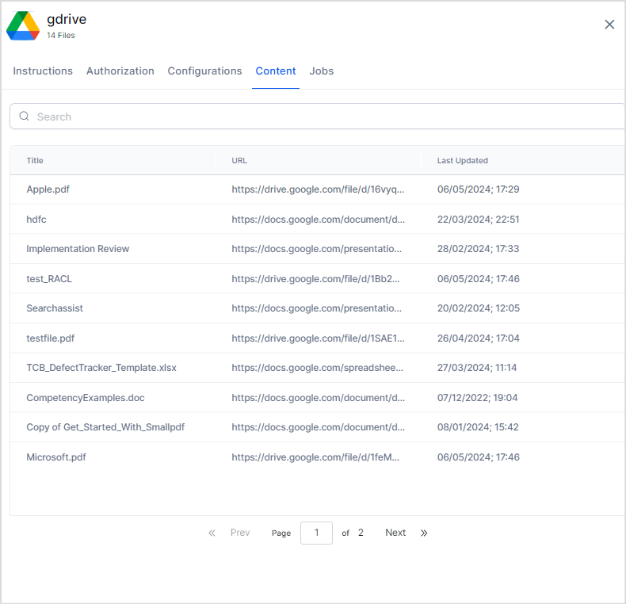

## Content Ingestion

On the **Configurations** tab, configure the following synchronization settings:

| Setting | Description |
|---------|-------------|
| **Schedule Sync** | Enable to automatically sync content at regular intervals. Set the time and frequency. |
| **Sync All Content** | Ingests all data from Google Drive. |
| **Sync Specific Content** | Ingests only content matching defined filter rules. Click **Configure** to set up rules, then click **Save and Test**. |

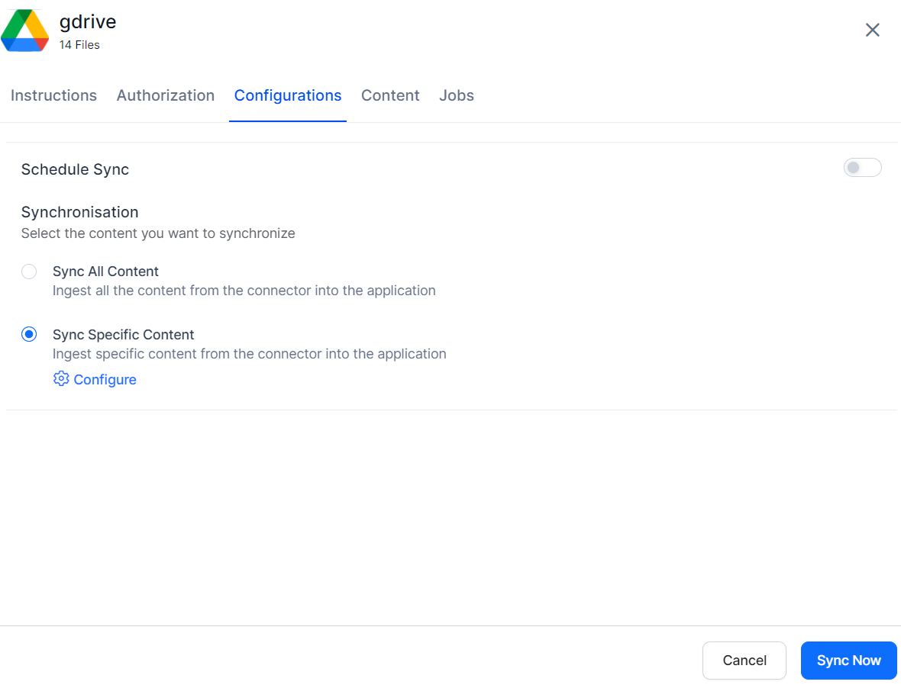

### Content Filtering Rules

Each filter rule specifies a drive location and one or more conditions.

**Drive Location**

| Option | Description |
|--------|-------------|
| **User Drive** | Only locations owned by the connected account |
| **Shared Drive** | Only locations shared with the connected account |
| **All Drives** | All locations from both User Drive and Shared Drive |
| **User Domain** | All locations within the user's domain |

**Conditions**

Define conditions using a parameter, operator, and value. Supported parameters:

| Parameter | Description |
|-----------|-------------|
| **Folder ID** | Ingest files from specific folders. Find the folder ID in the Google Drive URL after `folders/`. Example: for `https://drive.google.com/drive/folders/1dyUEebJaFnWa3Z4nXXXXAXQ7mfUH11g`, the ID is `1dyUEebJaFnWa3Z4nXXXXAXQ7mfUH11g`. |
| **Mime Type** | Ingest a specific file type (e.g., `application/pdf`). Supported: `application/msword`, `application/pdf`, `text/plain`, `application/vnd.google-apps.document`, `application/vnd.google-apps.presentation`. |
| **File Name** | Ingest files matching specific file names. |

You can also add custom query parameters. Refer to [Google Drive API search terms](https://developers.google.com/drive/api/guides/ref-search-terms) for the full list of supported parameters and values.

**Multiple rules and conditions**

- Add multiple rules to a filter. For example, include all files from a specific folder and all files containing a keyword in the filename.

  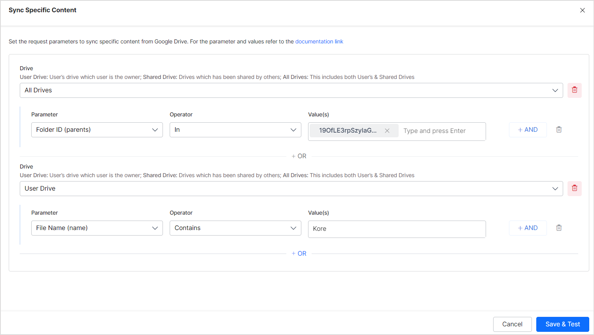

- Add multiple conditions to a single rule to narrow results. For example, ingest only PDF files from a specific folder.

  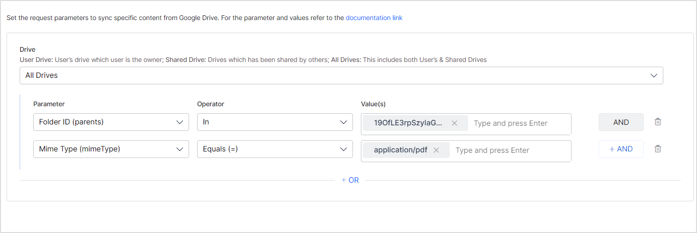

## Access Control

The Google Drive connector imports file permissions and access lists from Google Drive along with content, so Search AI returns answers only for files the requesting user can access.

### File Permission Types

Search AI supports file-level permissions. The following access types are handled:

**People with access**

Search AI reads user information from each file. Any user with view or read access can access answers generated from that file.

Example — two users with read access:

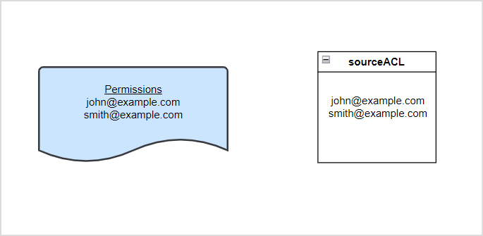

Example — a user and a user group with access (where `hr-team@example.com` is the permission entity for the group):

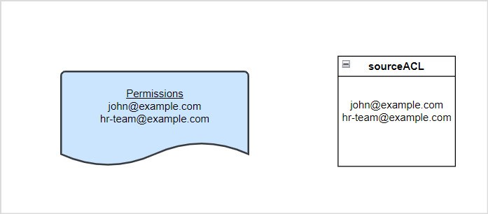

**Anyone with link**

Treated as public access. All users can access files with this permission type.

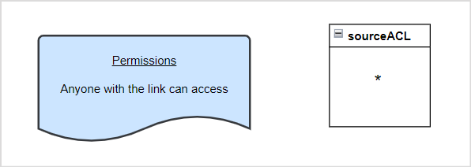

**Domain-specific access**

Search AI supports domain-scoped access and verifies user identity against the specified domain.

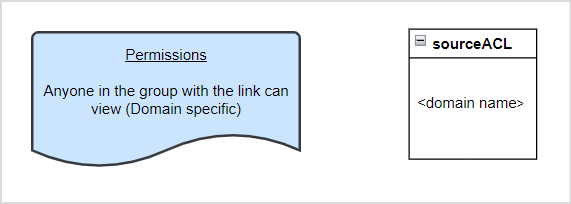

### User Groups and Domain-Level Access

When a file is shared with a user group or domain, the group or domain name is stored as a permission entity in Search AI. You must associate individual users with that permission entity to grant them access.

Use the [Permission Entity API](../../../apis/searchai/permission-entity-apis.mdx) to add user IDs to the corresponding permission entity.

**Example:** A file is shared with `hr-domain@example.com`. This group is stored as a permission entity. To give the five HR team members access, use the Permission Entity API to add their user IDs to this permission entity.

### Enabling or Disabling RACL

Configure access control on the **Permissions and Security** tab:

| Option | Behavior |
|--------|----------|
| **Permission Aware** | Maintains default permissions from Google Drive |
| **Public Access** | Overrides Google Drive permissions; all users can access the content |

You can configure this setting during initial connector setup or update it at any time on the **Permissions & Security** tab. Updated permissions apply to content ingested during the next sync.

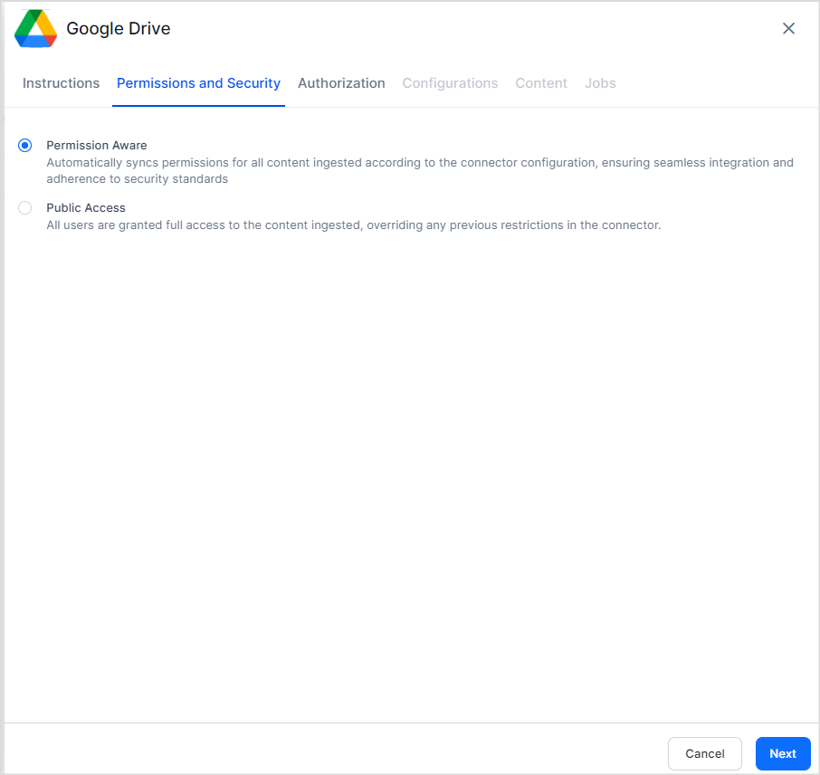
