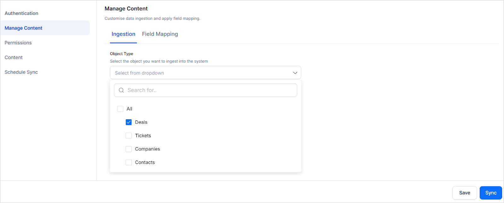
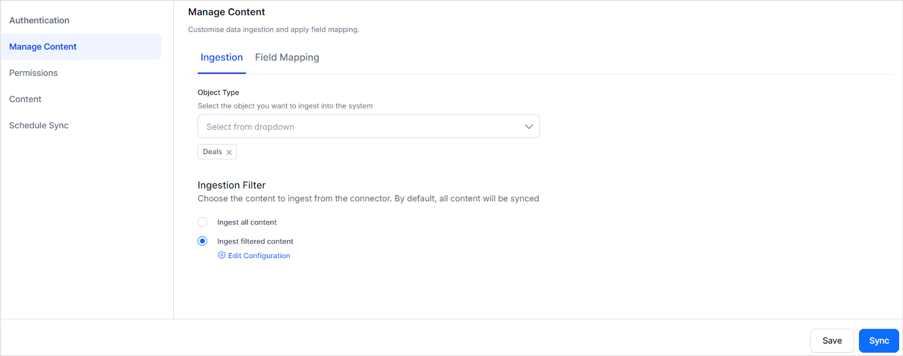

<Badge icon="arrow-left" color="gray">[Back to Search AI connectors list](/ai-for-service/searchai/content-sources#supported-connectors)</Badge>

HubSpot is a CRM platform with tools for customer service, operations, marketing, and sales. The HubSpot Connector ingests Tickets, Contacts, Companies, and Deals into Search AI for use in answering user queries.

| Specification | Details |
|---------------|---------|
| Repository type | Cloud |
| Supported content | Tickets, Contacts, Companies, Deals |
| RACL support | Yes |
| Content filtering | Yes |
| Auto permission resolution | Yes |

## Prerequisites

Authentication uses a HubSpot **Private App** access token. Refer to the [HubSpot documentation](https://developers.hubspot.com/docs/api/private-apps) to create a private app and generate an access token.

The following scopes are required when creating the app:

- `crm.objects.users.read`
- `tickets`
- `crm.objects.owners.read`
- `settings.users.teams.read`
- `crm.objects.companies.read`
- `crm.objects.deals.read`
- `crm.objects.contacts.read`

## Configure the HubSpot Connector

1. Navigate to **Content > Connectors** in Search AI and select **HubSpot**.
2. On the **Authentication** tab, enter the following details:

| Field | Description |
|-------|-------------|
| **Name** | Unique name for the connector |
| **Authentication** | Private App |
| **API Key** | Access Token from your HubSpot Private App |

3. Click **Connect**.

## Content Ingestion

After connecting, go to the **Manage Content** page and select one or more content types under **Object Type** to ingest.

> **Note:** At each sync, content from the past 90 days is ingested.

For each content type, the `content` field stores the main content, the `type` field identifies the content type, and other properties are stored in dedicated index fields or as metadata.

### Tickets

- Content, Priority, Creation Date, Owner Name, Last Activity Date, Associated Companies, Associated Contacts

### Deals

- Amount, Creation Date, Deal Stage, Owner Name, Last Activity Date, Associated Companies, Associated Contacts

### Contacts

- Email, Phone Number, Company Name, Total Revenue, Recent Deal Amount, Creation Date, Last Activity Date, Owner Name, Associated Companies

### Companies

- Description, Domain Name, Industry, City, Employee Count, Annual Revenue, Owner Name, Associated Contacts

## Content Filtering

To ingest a filtered subset of content:

1. Go to **Manage Content** and select the content types under **Object Type**.
2. Select **Ingest Filtered Content** and click **Edit Configuration**.

3. Under **Advanced Filters**, create filter rules based on content type properties. Use the **Parameter** list to select a default property, then specify an operator and value.
4. Combine conditions using **AND** or **OR** operators.
5. Click **Save**.

> **Note:**
> - Filters configured for a content type not selected under **Object Type** are ignored.
> - Each content type includes default parameters in the **Parameter** drop-down. Choose appropriate operators and values for accurate filtering.
> - To filter by a parameter not in the drop-down, select **Add** and enter the exact parameter name as it appears in your HubSpot account.

## RACL Support

For each ingested content item, Search AI populates the `sys_racl` field with the email address of the content owner, granting that user direct access. Search AI automatically creates permission entities for the owner's teams and associates team members with those entities. No manual configuration is required.
