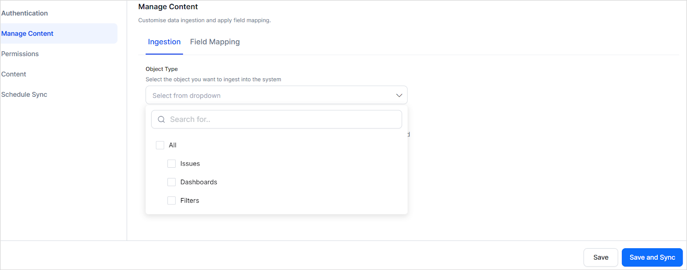
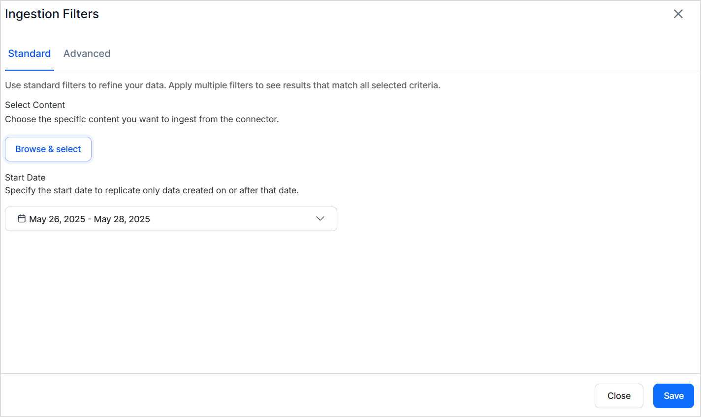
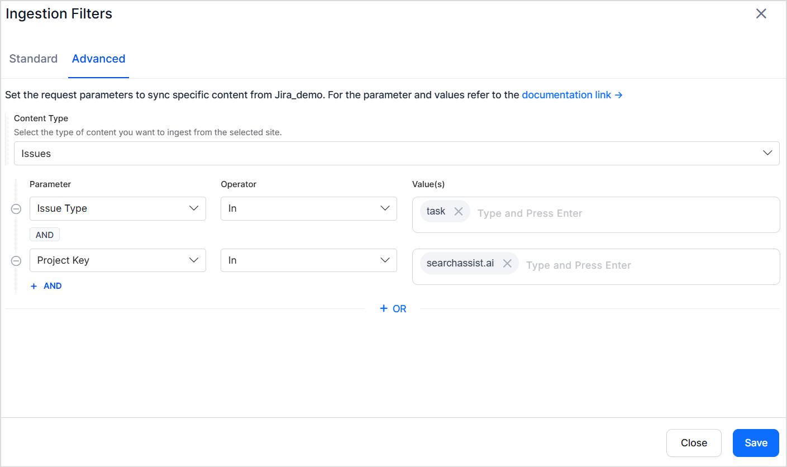

Jira is a project management and issue-tracking platform that enables teams to plan, track, and coordinate tasks through customizable workflows.

The Jira connector lets Search AI ingest, index, and search through **issues, dashboards, and filters**, improving accessibility to content from Jira Cloud.

## Connector Specifications

| Specification | Details |
|---------------|---------|
| Repository type | Cloud |
| Supported content | Issues, Dashboards, Filters |
| RACL support | Yes |
| Content filtering | Yes |
| Automatic permission resolution | Yes |

## Prerequisites

An Atlassian account with admin access. This account fetches content and resolves access permissions for indexed content.

## Connector Configuration

### Create an API Token in Atlassian

Search AI interacts with Jira through APIs. Create an **API token** in your Atlassian account following the [Atlassian documentation](https://support.atlassian.com/atlassian-account/docs/manage-api-tokens-for-your-atlassian-account/).

Enable the following scopes when generating the API token:

- `read:application-role:jira`
- `read:comment:jira`
- `read:comment.property:jira`
- `read:dashboard:jira`
- `read:filter:jira`
- `read:group:jira`
- `read:issue-details:jira`
- `read:issue-type-hierarchy:jira`
- `read:issue-type:jira`
- `read:jira-work`
- `read:jql:jira`
- `read:project-category:jira`
- `read:project-role:jira`
- `read:project-version:jira`
- `read:project.component:jira`
- `read:project.property:jira`
- `read:project:jira`
- `read:user:jira`

### Configure the Connector in Search AI

Go to the **Connectors** page and add the **Jira Connector**. Provide the following details:

| Field | Description |
|-------|-------------|
| **Name** | Unique name for the connector |
| **API Token** | API token generated from your Atlassian account |
| **Domain** | URL of your Jira instance |
| **Email** | Email address of the Atlassian account used for indexing |

## Content Ingestion

The connector ingests three object types from Jira. By default, content from the past 90 days is fetched.

### Issues

| Field | Description |
|-------|-------------|
| `title` | Summary or title of the issue |
| `content` | Full description of the issue |
| `url` | Direct link to the issue in Jira |
| `doc_created_by_name` | Name of the user who created the issue |
| `doc_created_on` | Timestamp when the issue was created (UTC) |
| `doc_updated_on` | Timestamp of the latest update (UTC) |
| `doc_source_type` | Content type (Issues, Dashboards, or Filter) |
| `priority` | Issue priority (High, Medium, Low, etc.) |
| `status` | Issue status (open, closed, etc.) |
| `assignee` | Username of the currently assigned person |
| `reporter_name` | Name of the user who reported the issue |
| `comments` | All comments concatenated, including commenter names |
| `issueType` | Type of issue (Bug, Task, Story) |
| `resource_type` | Type of issue |
| `project_name` | Name of the Jira project |

### Dashboards

| Field | Description |
|-------|-------------|
| `title` | Dashboard name |
| `content` | Dashboard description or notes |
| `URL` | Direct link to the dashboard in Jira |
| `doc_created_by_name` | Name of the user who created the dashboard |
| `doc_source_type` | Always `dashboard` for this object type |

### Filters

| Field | Description |
|-------|-------------|
| `title` | Filter name |
| `content` | JQL query or filter description |
| `URL` | Direct link to the filter in Jira |
| `doc_created_by_name` | Name of the user who created the filter |
| `doc_source_type` | Always `filter` for this object type |

> **Note:** All timestamps are stored in UTC. The `doc_source_type` field distinguishes content types. Issue comments are concatenated into a single field; individual comment metadata is not indexed.

## Content Filtering

The Jira connector supports standard and advanced filters to control which content is ingested.

Go to the **Manage Content** page and select the **Object Type** to define which content types to ingest. All filter settings apply only to the selected object type.

Select **Ingest filtered content** and click **Edit Configuration** to apply filters.

### Standard Filters

Use standard filters to ingest content from specific projects. Select one or more projects — all items of the selected object type within those projects are ingested. You can also define a **date range** using the calendar selector to limit ingestion to a specific time frame.

### Advanced Filters

Advanced filters provide granular control through **field-based rules**. For example, ingest only specific issue types from a particular project.

Choose from commonly used fields in the dropdown or enter any valid Jira field name. The field name must match the field name for the selected object in your Jira instance.

### Filter Precedence and Scope

- **Advanced filters override standard filters** when their criteria conflict. For example, if a standard filter selects Project A and an advanced filter specifies Project B by key, Project B takes precedence.
- **Filters apply only to the selected object type.** An advanced filter set for issues is ignored if only dashboards are selected on the Manage Content page.

## Access Control

### Issues

- Each issue is linked to a project via a unique **Project ID**.
- The Project ID is stored in the **RACL field** of the ingested chunks.
- Search AI automatically resolves permission entities for Jira issues — it identifies users with access to each project and associates them with the corresponding Project ID. Manual Permission Entity mapping is not required.

### Dashboards and Filters

When Jira dashboards or filters are shared, Search AI populates the RACL field to mirror those sharing settings:

| Sharing Option | RACL Field Entries |
|----------------|--------------------|
| **Project** | One or more Project IDs (for each shared project) |
| **My Organization** | The Organization ID |
| **Group** | One or more Group IDs (for each group granted access) |
| **Public** | `*` |
| **User** | Email addresses of all individual users with access |
| **Private** | Email address of the item's owner |

If multiple sharing options apply, all corresponding IDs and emails are included in the RACL field. Search AI automatically resolves permission entities — manual mapping through Permission Entity APIs is not required.
