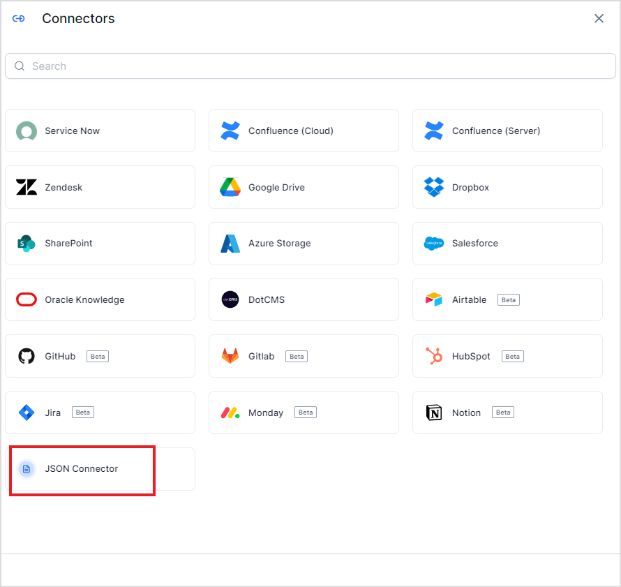
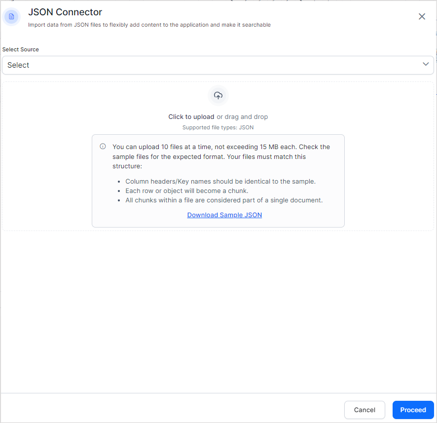
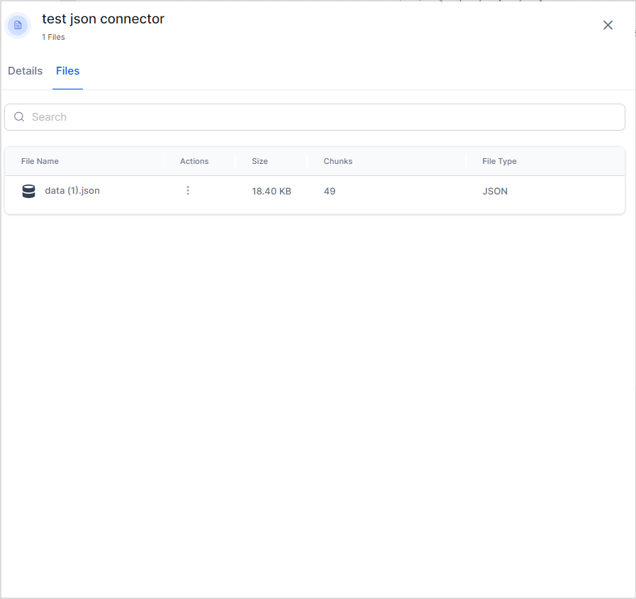
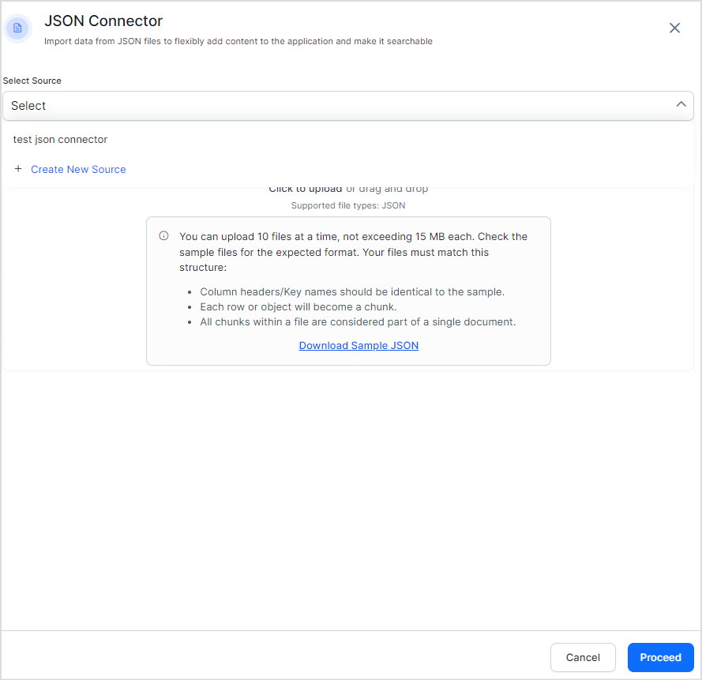

<Badge icon="arrow-left" color="gray">[Back to Search AI connectors list](/ai-for-service/searchai/content-sources#supported-connectors)</Badge>

The JSON connector lets you ingest pre-chunked content directly into Search AI. Content is immediately added to the index, enabling efficient data retrieval. This gives you the flexibility to bring any type of data into the application by structuring it in the required JSON format.

Content is uploaded as one or more JSON files, each containing an array of objects where every object represents a chunk. The keys of each object must exactly match the chunk fields defined below.

## File Format

Each JSON file must be an array of objects, where each object represents a single chunk. Key requirements:

- The file name is used as the `recordTitle`.
- The JSON structure must be an array of objects.
- Each object's keys must match the supported chunk fields listed in the table below.

| Field | Description | Mandatory |
|-------|-------------|-----------|
| `chunkText` | Content used to render the final answer for extractive responses and sent to the LLM for generative answers | Yes |
| `recordUrl` | URL used to generate user references — indicates where the content was originally sourced | Yes |
| `sourceACL` | List of user identities that have access to this chunk | No |
| `sourceUrl` | URL of the primary source (e.g., `www.example.org`). If empty, defaults to the value of `recordUrl` | No |
| `chunkMeta` | Metadata associated with the chunk, used for further processing or embedding generation | No |
| `chunkTitle` | Title used to render the final answer for extractive responses and sent to the LLM for generative answers | No |
| `cfa1` | Custom array field available for use based on your requirements | No |
| `cfa2` | Custom array field available for use based on your requirements | No |
| `cfa3` | Custom array field available for use based on your requirements | No |
| `cfa4` | Custom array field available for use based on your requirements | No |
| `cfa5` | Custom array field available for use based on your requirements | No |
| `cfs1` | Custom string field available for use based on your requirements | No |
| `cfs2` | Custom string field available for use based on your requirements | No |
| `cfs3` | Custom string field available for use based on your requirements | No |
| `cfs4` | Custom string field available for use based on your requirements | No |
| `cfs5` | Custom string field available for use based on your requirements | No |

Refer to the sample file for a reference implementation.

## Configuration Steps

1. Go to **Content** > **Connectors** and add the **JSON Connector**.

   

2. Select the source name to upload the JSON content to. If no source exists, create a new one. Upload the JSON file with your structured data.

   

3. Click **Proceed**. Search AI ingests the content from the uploaded files immediately.

4. Click the **Files** tab to view the contents of the connector at any time.

   

To add more content to an existing source, add the JSON connector again, **select the same source name**, and upload additional files.

**Upload limits:**

- Up to 10 files per upload
- Maximum 15 MB per file
- The file name is used as the `recordTitle`
