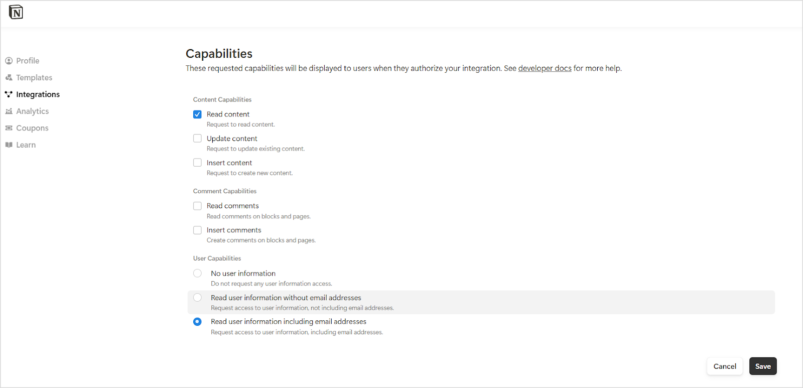

<Badge icon="arrow-left" color="gray">[Back to Search AI connectors list](/ai-for-service/searchai/content-sources#supported-connectors)</Badge>

Notion is a productivity and collaboration application combining note-taking, project management, task tracking, and knowledge sharing. Search AI ingests **pages** from Notion **workspaces**, indexing them for efficient retrieval and enabling users to quickly locate information.

## Connector Specifications

| Specification | Details |
|---------------|---------|
| Repository type | Cloud |
| Supported content | Pages |
| RACL support | Yes |
| Content filtering | No |

## Authorization Support

Search AI supports two authentication methods for Notion: **Internal Integration Token** and **OAuth 2.0**.

### Public Integration (OAuth 2.0)

Public integrations use the OAuth 2.0 protocol for secure authentication. For setup instructions, see the [Notion authorization guide](https://developers.notion.com/docs/authorization).

Use one of the following redirect URLs when configuring the public integration:

- JP Region: `https://jp-bots-idp.kore.ai/workflows/callback`
- DE Region: `https://de-bots-idp.kore.ai/workflows/callback`
- Prod: `https://idp.kore.com/workflows/callback`

Generate client credentials and an access token for this integration.

### Internal Integration (Token)

This method uses an internal integration token for direct authentication.

1. Create your integration on the [Notion integrations settings page](https://www.notion.so/profile/integrations).
2. Under the **Configuration** tab of the integration, enable the following capabilities:

   

3. Copy the integration token from this tab. Use it to authenticate API requests.

<Note>Ensure that Notion workspace pages are shared with the integration so that content can be ingested into Search AI. See [how to add connections to pages](https://www.notion.com/help/add-and-manage-connections-with-the-api#add-connections-to-pages) for details.</Note>

## Configure the Notion Connector in Search AI

Provide the following fields to configure the connector:

| Field | Description |
|-------|-------------|
| **Name** | Unique name for the connector |
| **Authorization Type** | **Personal Access Token** (Internal Integration) or **OAuth 2.0** (Public Integration) |
| **Token / Client Credentials** | Integration token or OAuth client credentials, depending on auth type |

Additional fields map Notion content to Search AI schema fields. Only standard fields are supported, and these mappings are pre-configured by default.

## RACL Support

Access control for the Notion Connector uses the **Page ID** as the permission entity. For each ingested page, the `sys_racl` field contains the page ID. For example, if the page ID is `a1b2c3`, the field appears as:

```json
"sys_racl": ["a1b2c3"]
```

Use the [Permission Entity APIs](../../../apis/searchai/permission-entity-apis.mdx) to associate users with this permission entity.
