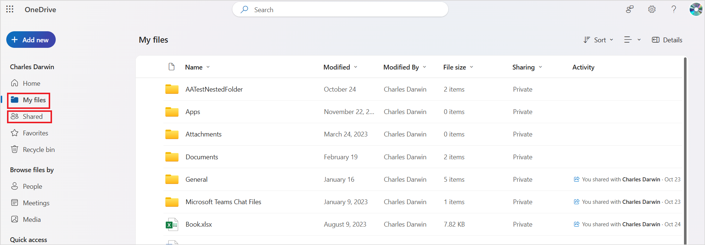
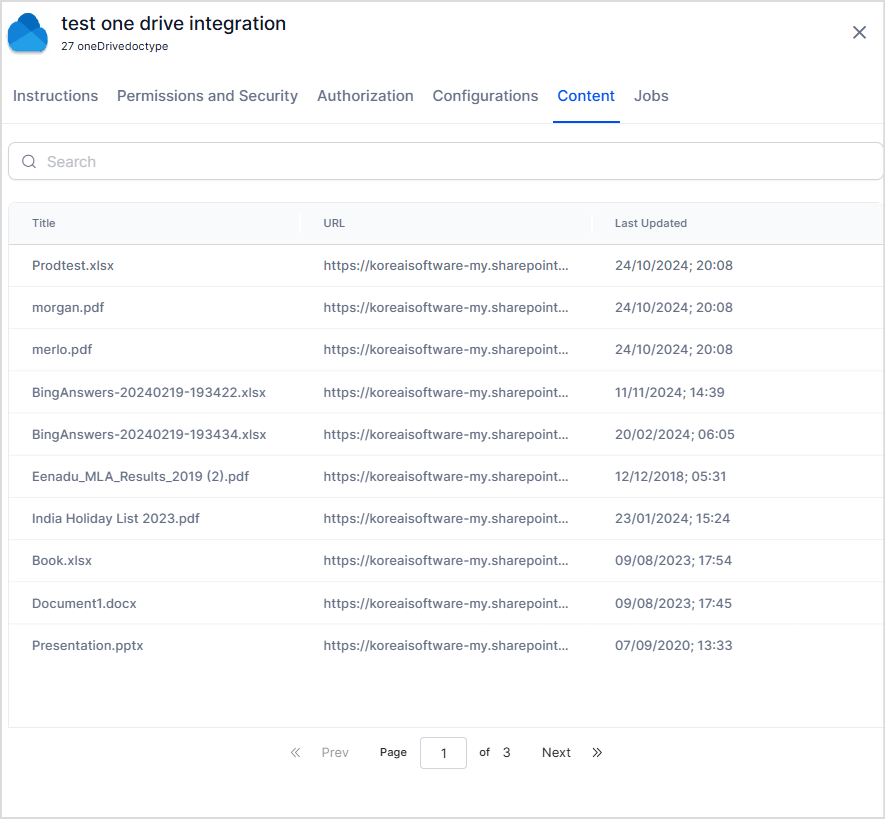
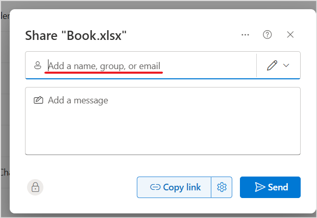
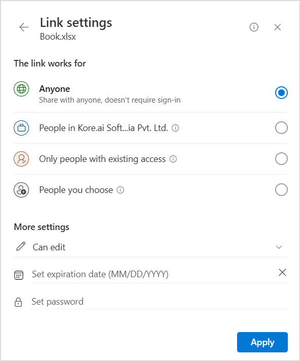

The OneDrive connector integrates Search AI with your OneDrive content, making files searchable through Search AI. Setup requires registering a multi-tenant app in Azure and configuring the connector in Search AI.

## Connector Specifications

| Specification | Details |
|---------------|---------|
| Repository type | Cloud |
| Supported content | Extractive answers: `.pdf`, pages/articles (`.aspx`), `.html`, `.xhtml`. Generative answers: pages/articles (`.aspx`), `.doc`, `.docx`, `.ppt`, `.pptx`, `.html`, `.xhtml`, `.txt`, `.pdf` |
| RACL support | Yes |
| Auto permission resolution | Yes |
| Extractive model support | Yes |
| Generative model support | Yes |

## Authorization Support

Search AI uses **OAuth 2.0 Authorization Code Grant Type** for OneDrive integration.

## Register a Multi-Tenant App in Azure

Registering an app in Azure establishes trust between Search AI and the Microsoft identity platform, enabling programmatic access to OneDrive resources.

### Register the App

1. Sign in to the [Azure Portal](https://portal.azure.com/#home) and go to **Azure Active Directory**.
2. Select **App Registrations** > **New Registration**.
3. Enter the app name.
4. Under **Supported account types**, select **Accounts in any organizational directory (multi-tenant)**.
5. Enter the Redirect URL for your region or deployment:
   - JP Region: `https://jp-bots-idp.kore.ai/workflows/callback`
   - DE Region: `https://de-bots-idp.kore.ai/workflows/callback`
   - Prod: `https://idp.kore.com/workflows/callback`
6. Select **Register**.

The registration generates a **Client ID** and **Tenant ID**. Save both values from the Overview page.

### Create a Client Secret

1. In the app, go to **Certificates & secrets**.
2. Select **New client secret**.
3. Enter a description, set the expiration to 24 months, and select **Add**.
4. Copy and save the client secret value immediately — it cannot be viewed again after leaving the page.

### Configure API Permissions

1. Go to **API permissions** > **Add a permission**.
2. Select **Microsoft Graph** > **Delegated permissions**.
3. Add the following permissions:
   - `Files.Read`
   - `Files.Read.All`
   - `Offline_access`
4. Select **Grant admin consent** to apply the permissions.

For more information, see [how to register an app in Entra](https://learn.microsoft.com/en-us/azure/active-directory/develop/quickstart-register-app).

## Configure the OneDrive Connector

1. Go to the **Connectors** page and add the **OneDrive connector**.
2. On the **Authorization** page, set the authentication mechanism to **OAuth 2.0** and the grant type to **Authorization Code**.
3. Enter the **Client ID**, **Tenant ID**, and **Client Secret** generated during Azure app registration.
4. Select **Connect**.

## Content Ingestion

After authentication is complete, configure content ingestion from the **Configuration** tab.

1. Go to the **Configuration** tab.
2. Select **Sync Now** to perform an immediate sync.
3. Optionally, **Schedule a sync** to run at a future time.

Sync behavior:

- **First sync**: All supported content is ingested.
- **Subsequent syncs**: Only updated content is ingested. Chunks for updated content are deleted and recreated.

All supported files under **My files** and **Shared files** are ingested, including content inside folders.



The following shows content ingested after a sync operation through the OneDrive connector:



## Access Control

Search AI supports access control for content ingested from OneDrive. To configure it, go to the **Permissions and Security** tab in the OneDrive Connector.

Search AI provides two options for managing access:

- **Permission Aware**: The connector retrieves access information from OneDrive during ingestion and stores it in the `sys_racl` field. Each entry in `sys_racl` represents a permission entity. Search AI automatically resolves these entities and associates the correct users with the corresponding files or folders.
- **Public Access**: The `sys_racl` field is set to `*`. All Search AI users can access the ingested content regardless of OneDrive permissions.

### How OneDrive Permissions Work

By default, files and folders created in OneDrive are private — only the owner can access them. Files and folders can be shared with internal or external users and user groups using the Share option in OneDrive.



Files can also be shared via link:



### How Search AI Handles Permissions

| Source | Handling in Search AI |
|--------|----------------------|
| File owner | Automatically added to `sys_racl` |
| Directly shared users | Added directly to `sys_racl` |
| Shared user groups | Added as permission entities in `sys_racl`; users in those groups must be added manually using the Permission Entity APIs |
| Link shared to a domain | Users of that domain are automatically identified using the domain name |

**Example**: If Charles owns a file and shared it with a user group `test@example.com` and external user `xyz@other-example.com`, the `sys_racl` field appears as:

```json
"sys_racl": [
    "E083437f-d330-4ad7-8a02-87018187be46",
    "charles@example.com",
    "xyz@other-example.com"
]
```

If Charles also grants access to all employees in his organization, the field includes the domain:

```json
"sys_racl": [
  "example.com",
  "e083437f-d330-4ad7-8a02-87018187be46",
  "charles@example.com",
  "xyz@other-example.com"
]
```
