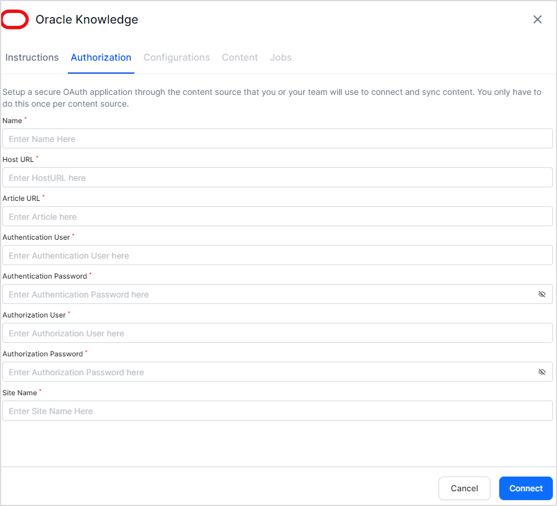

The Oracle Knowledge Connector enables Search AI to search across your Oracle Knowledge Base, making knowledge articles discoverable through a unified search experience.

| Specification | Details |
|---------------|---------|
| Repository type | Cloud |
| Supported content | Knowledge Articles |
| RACL support | No |

## Prerequisites

Search AI accesses the Oracle Knowledge Base using REST APIs. You need two types of user credentials:

- **API User** — Accesses the required REST API resources.
- **Console User** — Used for console-level authorization.

Collect the following from your Oracle Knowledge account:

- REST Server URL
- API User credentials (username and password)
- Console User credentials (username and password)

For details on creating API and Console users, see the [Oracle documentation](https://docs.oracle.com/en/cloud/saas/b2c-service/cxska/OKCS_Authenticate_and_Authorize.html).

## Configure the Oracle Knowledge Connector

Go to the **Connectors** page, select **Oracle Knowledge**, and enter the following details on the Configuration page. Click **Connect** when done.

| Field | Description |
|-------|-------------|
| **Name** | Unique name for the connector in Search AI |
| **Host URL** | URL of your Oracle B2C Service Knowledge Advanced server |
| **Article URL** | URL where knowledge articles are hosted (used for article links in search results) |
| **Authentication User** | Username for the API user |
| **Authentication Password** | Password for the API user |
| **Authorization User** | Username for the Console user |
| **Authorization Password** | Password for the Console user |
| **Site Name** | Name of the site from which you are accessing the APIs |
