<Badge icon="arrow-left" color="gray">[Back to Search AI connectors list](/ai-for-service/searchai/content-sources#supported-connectors)</Badge>

The Salesforce Connector enables Search AI to index and search content managed in Salesforce, including knowledge articles and custom objects.

| Specification | Details |
|---------------|---------|
| Repository type | Cloud |
| Supported API version | API v57.0 |
| Extractive model for answers | Not supported |
| Generative model for answers | Knowledge articles managed by Salesforce |
| RACL support | Yes |
| Auto permission resolution | Yes |
| Content filtering | Yes |

## Prerequisites

- A Salesforce Admin account, or an account with API access to all necessary Salesforce objects.

## Authentication

Search AI supports the following OAuth 2.0 methods to access Salesforce:

- OAuth 2.0 Authorization Code grant type
- OAuth 2.0 Password grant type

## Create an OAuth App in Salesforce

1. Log in to [Salesforce](https://login.salesforce.com/) and open **Setup** from the Setup icon.

   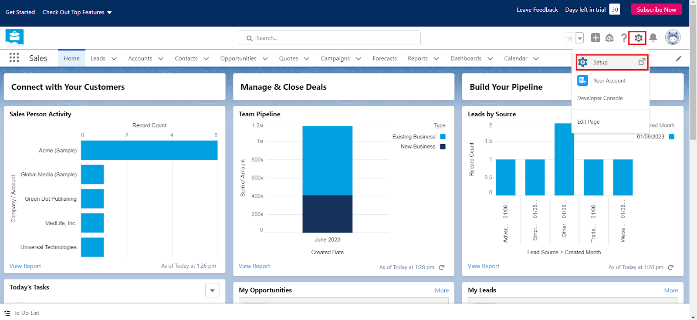

2. The **Object Manager** home page opens.

   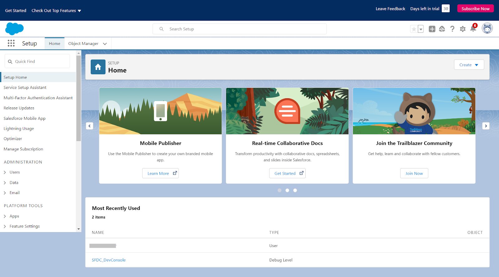

3. Go to **App Manager** and click **New Connected App**.

   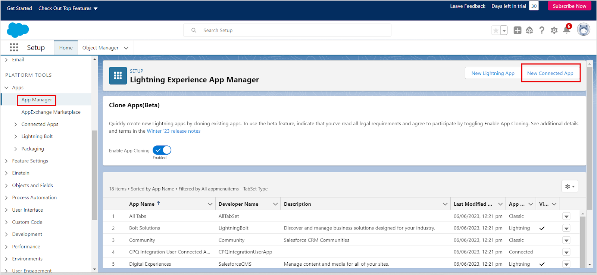

4. Fill in basic app details — name, email address, logo, and icon.

   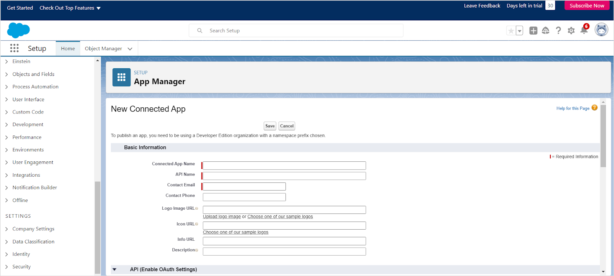

5. Under the **API** section, enable **OAuth Settings** for API integration and set the callback URL for your region:

   - JP Region: `https://jp-bots-idp.kore.ai/workflows/callback`
   - DE Region: `https://de-bots-idp.kore.ai/workflows/callback`
   - Prod Region: `https://idp.kore.com/workflows/callback`

6. Add the following **Selected OAuth Scopes**:
   - Full access (full)
   - Perform requests at any time (refresh_token, offline_access)

7. Disable **Require Proof Key for Code Exchange (PKCE)** — Search AI does not support this Salesforce feature.

8. Leave remaining settings as default and click **Save**, then **Continue**.

   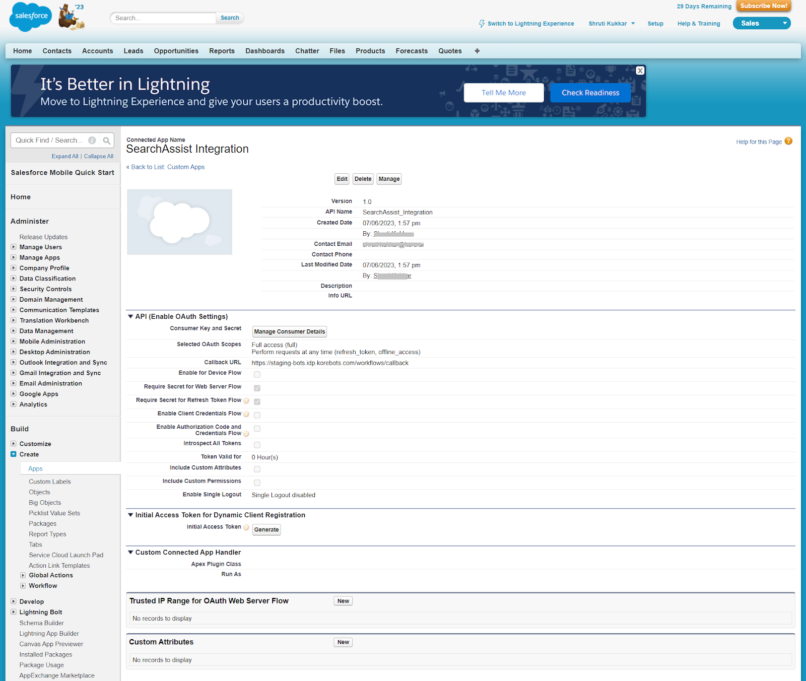

9. Click **Manage Consumer Details** to generate the Consumer ID and Secret. Save both values for the next step.

## Configure the Salesforce Connector in Search AI

Go to **Sources > Connectors** and select **Salesforce**. On the **Authorization** tab, enter the following and click **Connect**.

| Field | Description |
|-------|-------------|
| **Name** | Unique name for the connector |
| **Consumer ID** | Consumer ID generated from the Salesforce OAuth app |
| **Consumer Secret Key** | Consumer Secret generated from the Salesforce OAuth app |
| **Type** | **Cloud** (production) or **Sandbox** (test environment) |

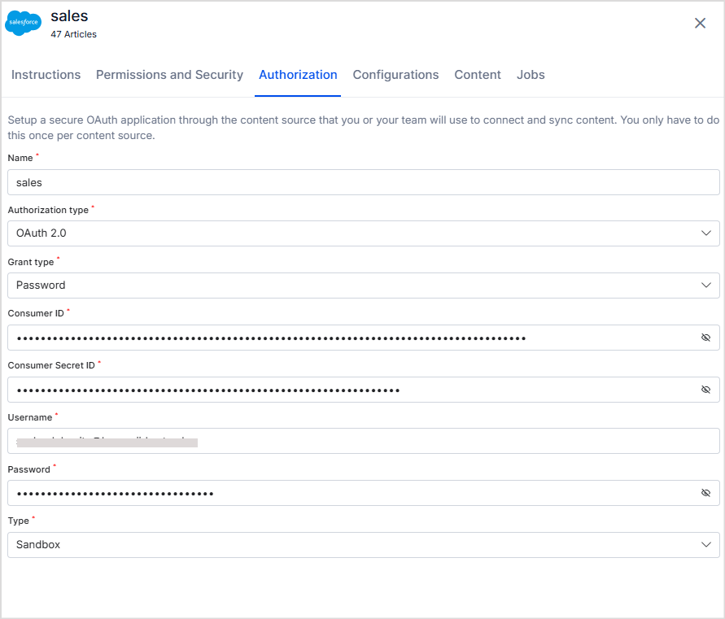

Once connected, the connector status changes to **Connected** and is ready for content ingestion.

By default, the connector ingests only published knowledge articles.

## Content Filters

The Salesforce Connector supports selective ingestion. To filter content, select **Sync Specific Content** and click **Configure**.

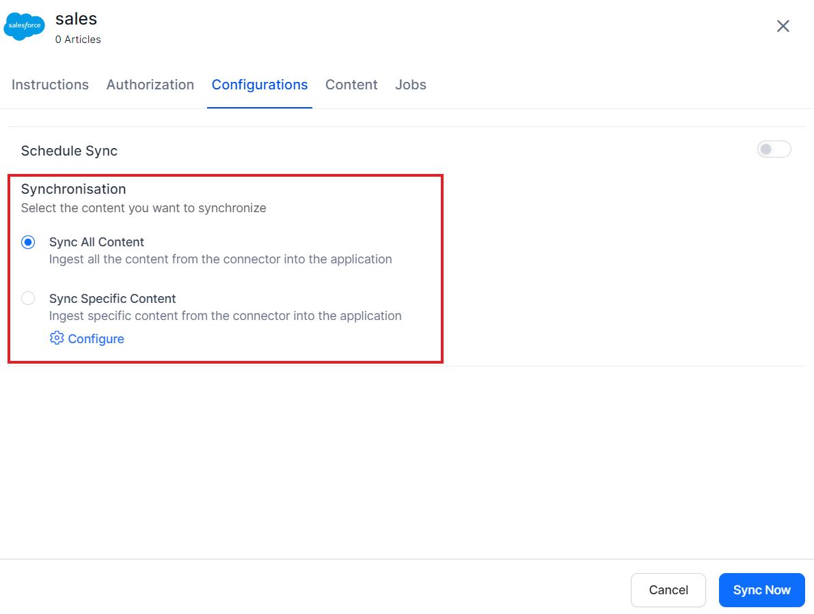

Define rules using a parameter, operator, and value:

| Component | Description |
|-----------|-------------|
| **Parameter** | Select from commonly used fields in the dropdown, or add a custom parameter using **+Add** |
| **Operator** | Varies by parameter — equals, not equals, contains, etc. |
| **Value** | Expected value for the filter condition |

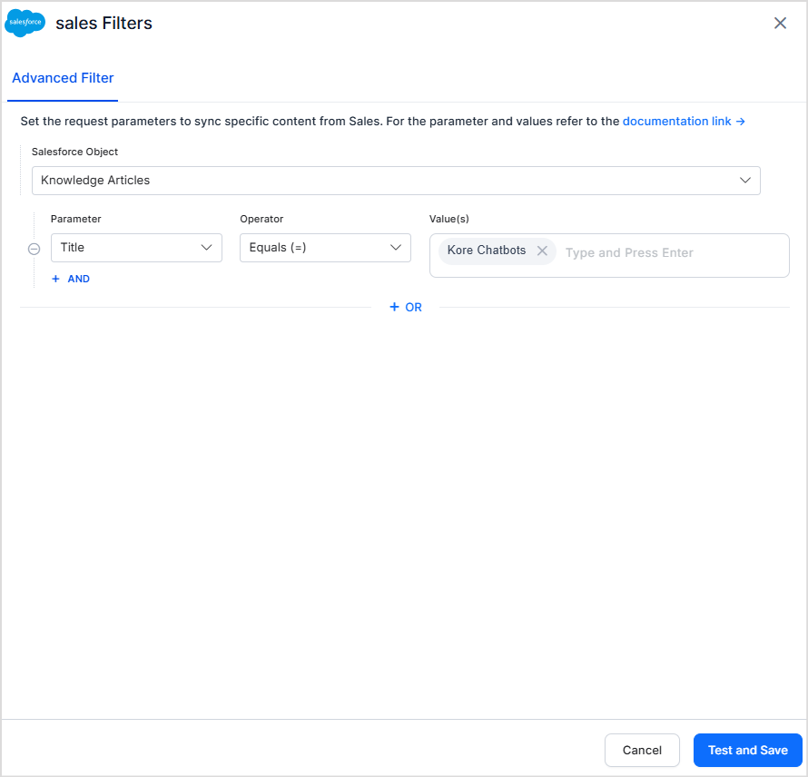

For the full list of supported fields, see the [Salesforce Knowledge Article Version API reference](https://developer.salesforce.com/docs/atlas.en-us.knowledge_dev.meta/knowledge_dev/sforce_api_objects_knowledgearticleversion.htm).

**Example:** Filter for articles published on a specific date.

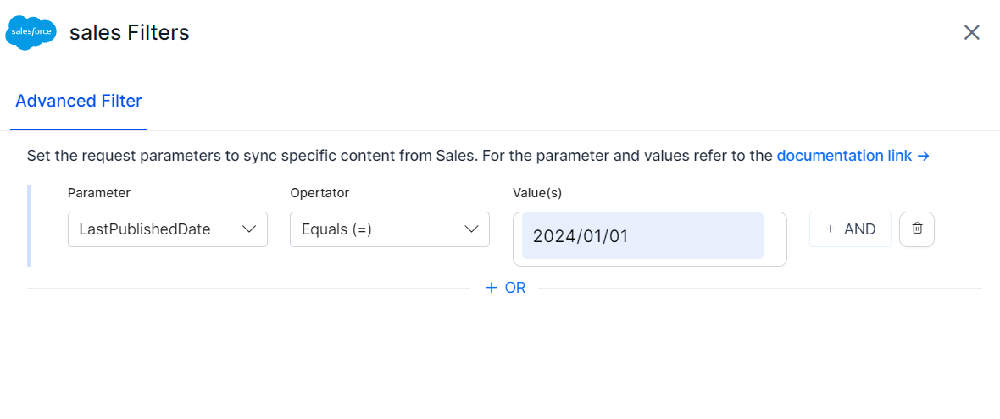

**Example:** Filter for articles with a specific title and author.

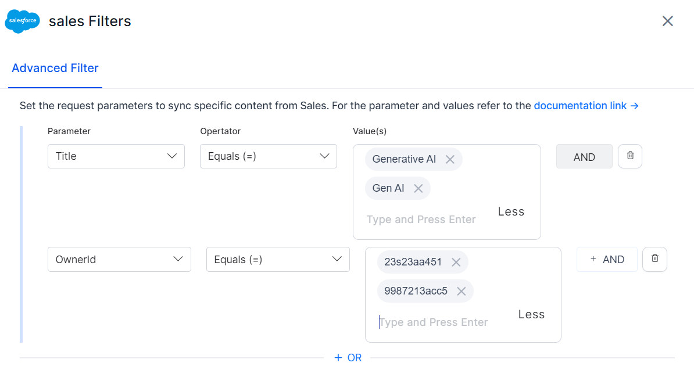

## Custom Object Ingestion

The Salesforce Connector can ingest Custom Objects from Salesforce. Configure custom object ingestion as follows:

1. In the Advanced Filter, select **Custom Object**.
2. Enter the exact **Object Name** as it appears in Salesforce to ensure accurate data retrieval.
3. By default, the connector fetches all available data for the specified object via Salesforce APIs.
4. Optionally, provide an **Endpoint for Fetching Custom Object field** if additional per-record data is needed. This endpoint is called for each record using its unique identifier to fetch additional metadata and content.
5. Optionally, define parameter-value filters to ingest only specific records. Parameter names must exactly match the field names in the Salesforce custom object.

**Example:** To ingest a custom object named `my_custom_object`:

- Enter `my_custom_object` in the **Object Name** field.
- Provide the API endpoint URL that returns metadata for this object.

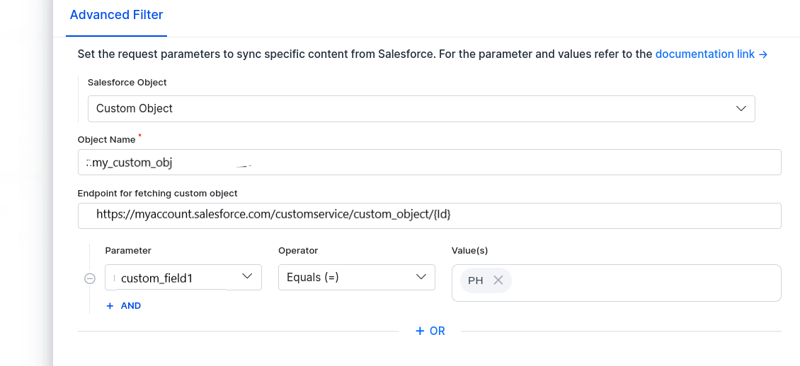

## RACL Support

Salesforce provides multi-level access control. The Search AI Connector supports the following access control mechanisms:

| Supported Mechanism | Description |
|---------------------|-------------|
| **User Profiles** | Baseline permissions based on role; control object-level and field-level access |
| **Permission Sets** | Additional permissions beyond the standard profile |
| **Permission Set Groups** | Combined permission sets for users with complex access requirements |

The following access control methods are not currently supported:

| Unsupported Mechanism | Description |
|-----------------------|-------------|
| **Direct User Permissions** | Custom access granted at the individual user level to override profile or permission-based restrictions |
| **Data Category-Based Access Control** | Restricts access based on predefined data categories (used in Salesforce Knowledge) |

For each Salesforce object, Search AI populates the `sys_racl` field with permission entities corresponding to the permission sets, permission set groups, and user profiles that have access. For objects such as Case, Opportunities, Tasks, Contacts, and Accounts, the owner's email ID is also included in `sys_racl`.

Use the **Permission Entity APIs** to associate users with permission entities.
