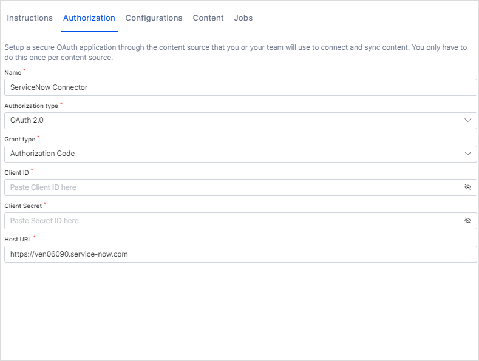
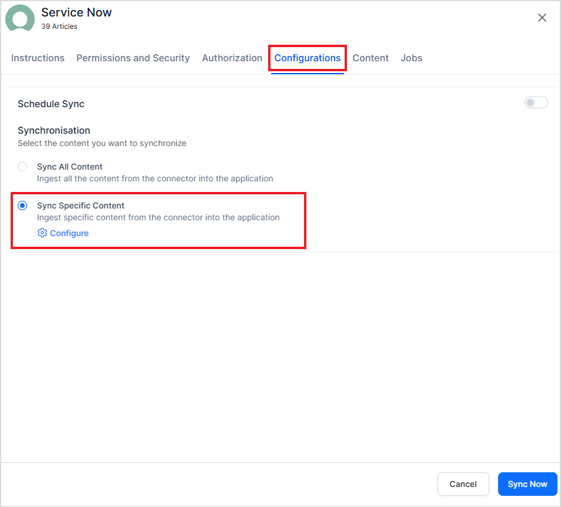
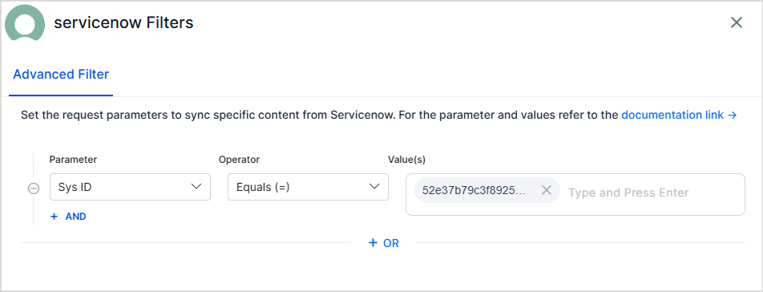
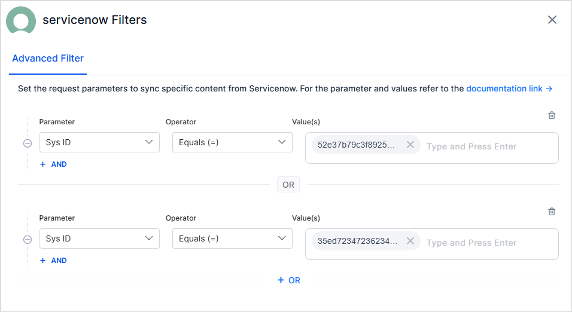
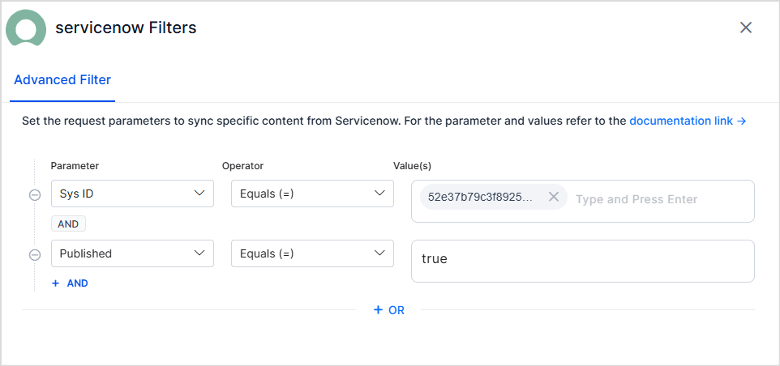
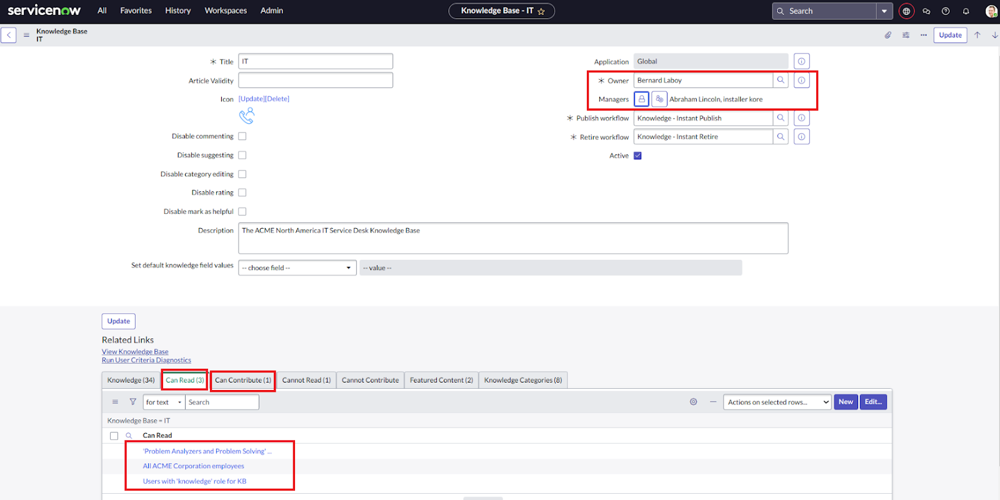
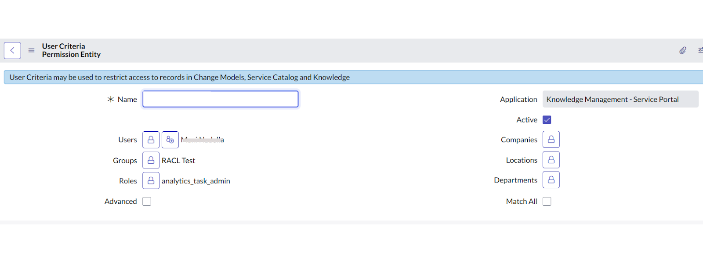
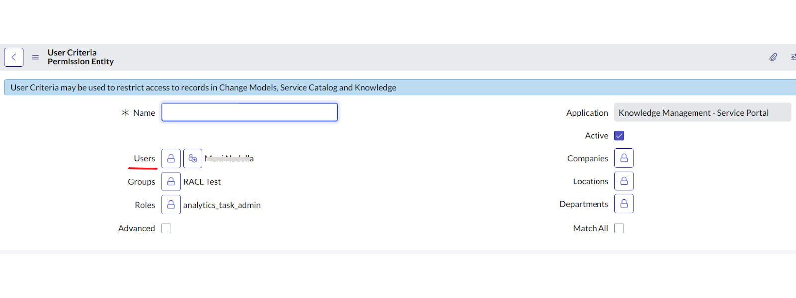

<Badge icon="arrow-left" color="gray">[Back to Search AI connectors list](/ai-for-service/searchai/content-sources#supported-connectors)</Badge>

Connect ServiceNow to Search AI to let users search knowledge articles, incidents, and catalog items managed in ServiceNow. The connector supports real-time synchronization through webhook integration, keeping the Search AI index current with changes in ServiceNow.

| Specification | Details |
|---------------|---------|
| Repository type | Cloud |
| Supported content | Published Knowledge Articles, Incidents, Catalog Items |
| RACL support | Yes |
| Content filtering | Yes |
| Webhook support | Yes |

<Note>Searching through attachments is not supported.</Note>

## Prerequisites

- Admin access to your ServiceNow instance.
- If using OAuth 2.0: an OAuth endpoint configured in ServiceNow (see Step 1).
- If using webhook integration: the Search AI connector must be configured and connected first.

## Step 1: Configure an OAuth Endpoint in ServiceNow

Skip this step if you are using Basic authentication.

To use OAuth 2.0, set up an OAuth endpoint in your ServiceNow instance. Follow the [ServiceNow documentation](https://docs.servicenow.com/bundle/washingtondc-platform-security/page/administer/security/task/t_CreateEndpointforExternalClients.html) for instructions. Use the redirect URL for your region:

- JP Region: `https://jp-bots-idp.kore.ai/workflows/callback`
- DE Region: `https://de-bots-idp.kore.ai/workflows/callback`
- Production: `https://idp.kore.com/workflows/callback`

## Step 2: Configure the ServiceNow Connector in Search AI

1. Select the ServiceNow connector from the list of available connectors.
2. Go to the **Authorization** tab and provide the following details.



| Field | Description |
|-------|-------------|
| **Name** | Unique name for the connector |
| **Authorization Type** | Basic or OAuth 2.0 |
| **Grant Type** | For OAuth 2.0: Authorization Code (requires Client ID and Client Secret) or Password Grant Type (requires user credentials, Client ID, and Client Secret) |
| **Host URL** | Host of your ServiceNow instance |
| **Real-Time Sync** | Toggle to enable or disable automatic real-time sync via webhooks |
| **Webhook Client Secret** | Auto-generated; can be regenerated |
| **Webhook URL** | Copy this URL for use in ServiceNow Business Rules |

3. Click **Connect** to authorize.
4. Go to the **Configurations** tab and click **Sync Now** to begin ingesting content.

By default, the connector ingests published knowledge articles, incidents, and catalog items.

<Note>Only articles within their validity date are ingested. Articles past their Valid To date are excluded.</Note>

## Webhook Integration for Real-Time Sync

Search AI supports webhook-based real-time sync with ServiceNow using Business Rules and a shared Script Include. Any create, update, or delete operation in ServiceNow is immediately reflected in the Search AI index.

### Architecture

The webhook integration uses two components:

1. **Script Include** — A reusable script (`SearchAIWebhookHandler`) that handles webhook POST requests to Search AI.
2. **Business Rules** — Per-table rules that trigger the Script Include on data changes.

### Benefits

- Changes in ServiceNow are immediately reflected in Search AI.
- Eliminates the need for frequent full syncs.
- Only changed records are processed, reducing system load.
- Users always see the most current information.

### Configure Webhook Integration in ServiceNow

**A. Create the Shared Script Include**

In **System Definition > Script Includes**, create a Script Include named `SearchAIWebhookHandler`. The script accepts a current record and operation type (insert, update, delete), then sends a POST request to the Search AI webhook endpoint with the authentication token.

Sample script:

```
var <<CommonWebhookSender>> = Class.create();
<<CommonWebhookSender>>.prototype = {
  initialize: function () {},

  send: function (record, action) {
    try {
      var endpoint = 'https://<domain>/api/1.1/webhook/<streamId>/connector-Id';

      var TOKEN = 'b59aebc4-xxx-xxx';

      var payload = {
        source: 'servicenow',
        object: record.getTableName(),
        action: action,
        sys_id: record.sys_id.toString(),
        number: record.number ? record.number.toString() : '',
        knowledge_base_name: record.kb_knowledge_base
          ? record.kb_knowledge_base.getDisplayValue()
          : ''
      };

      var r = new sn_ws.RESTMessageV2();
      r.setHttpMethod('POST');
      r.setEndpoint(endpoint);
      r.setRequestHeader('Content-Type', 'application/json');

      r.setRequestHeader('X-Webhook-Token', TOKEN);

      r.setRequestBody(JSON.stringify(payload));

      var response = r.execute();
      gs.info('Webhook sent. Status: ' + response.getStatusCode());

    } catch (e) {
      gs.error('Webhook error: ' + e.message);
    }
  },

  type: '<<CommonWebhookSender>>'
};
```

**B. Create Business Rules (Per Table)**

In **System Definition > Business Rules**, create separate Business Rules for each supported table. Configure each rule to run after the database operation (Advanced rule, executes After). The script calls the `SearchAIWebhookHandler` Script Include with the current record and operation type.

| Table | Trigger conditions |
|-------|-------------------|
| **Knowledge Articles** (`kb_knowledge`) | Insert, update, delete for published articles within validity period |
| **Incidents** (`incident`) | Insert, update, delete for all incidents |
| **Catalog Items** (`sc_cat_item`) | Insert, update, delete for active catalog items |

### How Webhook Sync Works

When Search AI receives a webhook POST from ServiceNow:

1. The payload is validated using the authentication token.
2. Existing ServiceNow connector credentials are used to fetch the latest version of the referenced entity.
3. The index is updated based on the operation:
   - **Insert/Update** — Document is created or updated in the index.
   - **Delete** — Corresponding content is removed from the index.
4. The sync is logged in the webhook sync records.

## Advanced Filters

Search AI supports advanced filters for content ingestion. Filtering is currently supported for Knowledge Articles only. Use article properties such as status, type, number, knowledge base, and source to selectively ingest content.

**Configure advanced filters:**

1. Go to the **Manage Content** tab and select **Ingest filtered content**.
2. Click **Edit configuration** to open the **Ingestion Filters** page.
3. Use the **Parameter**, **Operator**, and **Value** fields to define a filter. Commonly used parameters appear in the dropdown. For the complete list, refer to the [ServiceNow developer reference](https://developer.servicenow.com/dev.do#!/reference).



Example — ingest articles with a specific sys ID:



Select **Test and Save** to apply the filter. It takes effect on the next scheduled or manual sync.

**Filter rules:**

- **Multiple rules** — Define one or more rules. Content matching any rule is ingested (logical OR).

  Example — select articles matching any sys ID from a list:

  

- **Multiple conditions** — Each rule can have one or more conditions joined by logical AND. Content is selected only when all conditions are satisfied.

  Example — select published articles with a specific sys ID:

  

**Real-time sync behavior:**

- **Insert/Update** — Document is created or updated in the Search AI index.
- **Delete** — Corresponding content is removed from the index.

## RACL Support

### Knowledge Articles

Search AI enforces access control at the knowledge base level for content ingested from ServiceNow.

In ServiceNow, user access to knowledge base articles is defined by:

1. Owners of the knowledge base
2. Managers of the knowledge base
3. User Criteria with Can Read or Can Contribute permissions



User Criteria in ServiceNow groups users by conditions such as department or role, or by directly listing individual users.



**How Search AI handles these permissions:**

- **Owners** — Added directly to the `sys_racl` field.
- **Managers** — Added directly to the `sys_racl` field.
- **Individual users** listed under each User Criteria with Can Read or Can Contribute permissions.



Each User Criteria is retrieved as a Permission Entity. The Permission Entity ID is stored in the `sys_racl` field. Only users directly listed in the criteria are included automatically. Users added through other conditions (such as department or role) must be added manually using the [Permission Entity APIs](/ai-for-service/apis/searchai/permission-entity-apis).

Example `sys_racl` field for a knowledge article:

```json
"sourceAcl": [
     "25431493ff4221009b20ffffffffffe0",
     "John@example.com"
]
```

The alphanumeric value is the Permission Entity ID for the user criteria. Users directly listed in the criteria are automatically associated with this entity. To grant access to users added through other conditions, use the [Permission Entity APIs](/ai-for-service/apis/searchai/permission-entity-apis).

### Incidents

Search AI enforces access control on incidents based on four categories:

1. **Role-based access** — Users with Base System Roles such as `itil` or `itil_admin` have access to incidents. A Permission Entity is created per role; associate users using the Permission Entity APIs.
2. **ACL-based access** — Users with access to the Incident Table (`incident`) through ACL configuration. A Permission Entity is created per ACL rule.
3. **Assignment group-based access** — Members of the incident's assignment group automatically have access. A Permission Entity is created using the group ID.
4. **Incident field-based access** — Users linked to the incident through specific fields (Creator, Caller, Watch List) are added to `sys_racl` by email ID.

**`sys_racl` contents for an incident:**

| Access category | Stored as |
|-----------------|-----------|
| **Assigned User** | Email ID |
| **Caller (Requestor)** | Email ID |
| **Opened by User (Creator)** | Email ID |
| **Closed by User** | Email ID |
| **Resolved by User** | Email ID |
| **Watch List Users** | Email IDs of all watch list users |
| **Assignment Group** | Group ID (Permission Entity) |
| **System or Custom Roles with Incident Access** | Role ID (Permission Entity) |

### Catalog Items

Access to catalog items is controlled by:

1. **Role-based access** — Roles assigned to the catalog item determine access. A Permission Entity is created using the role ID.
2. **ACL-based access** — Users with access to the Catalog Items Table through ACL configuration. A Permission Entity is created per ACL rule.
3. **User Criteria** — User criteria defined for the catalog item specify access. A Permission Entity is created using the user criteria ID.

**`sys_racl` field for a catalog item:**

| Access category | Stored as |
|-----------------|-----------|
| **System or Custom Roles with Catalog Items Access** | Role ID (Permission Entity) |
| **User Criterion with Catalog Item Access** | User Criteria ID (Permission Entity) |

## Limitations

**Webhook user sync** — Search AI does not support user synchronization through webhooks. Document entities are updated in real time via webhook, but associated user permissions are not. User permission updates must be synchronized through the regular incremental or manual sync process.

## Related Topics

- [Access Control in Search AI](/ai-for-service/searchai/content-sources#role-based-access-control-racl)
- [Permission Entity APIs](/ai-for-service/apis/searchai/permission-entity-apis)
- [Content Sources](/ai-for-service/searchai/content-sources)
