Configure the SharePoint connector to make content managed in SharePoint searchable through Search AI.

| Specification | Details |
|---------------|---------|
| Repository type | Cloud |
| Supported content | Articles (.aspx), Pages, and files in .doc, .docx, .ppt, .pptx, .html, .xhtml, .txt, .pdf formats |
| RACL support | Yes |
| Content filtering | Yes |
| Auto permission resolution | Yes |

> **Note:** Searching through attachments is not supported.

## Prerequisites

- Access to the [Azure Portal](https://portal.azure.com/#home) with permissions to register applications.
- A multi-tenant app registered in Azure Active Directory (see below).

## Authorization Support

Search AI supports two OAuth 2.0 authentication mechanisms for SharePoint:

- **Authorization Code Grant Type** — The app acts on behalf of the user using Delegated Permissions. Requires explicit user consent.
- **Client Credentials Grant Type** — The app acts as itself using Application Permissions. No user interaction required.

## Register a Multi-Tenant App in SharePoint

App registration establishes trust between Search AI and the Microsoft identity platform.

1. Log in to the [Azure Portal](https://portal.azure.com/#home) and go to **Azure Active Directory**.

   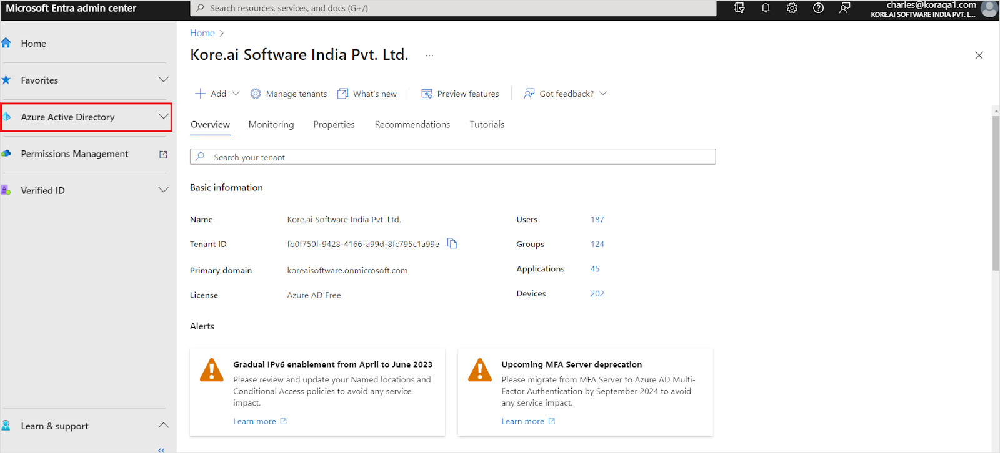

2. Go to **App Registrations** under **Applications** and click **New Registration**.

   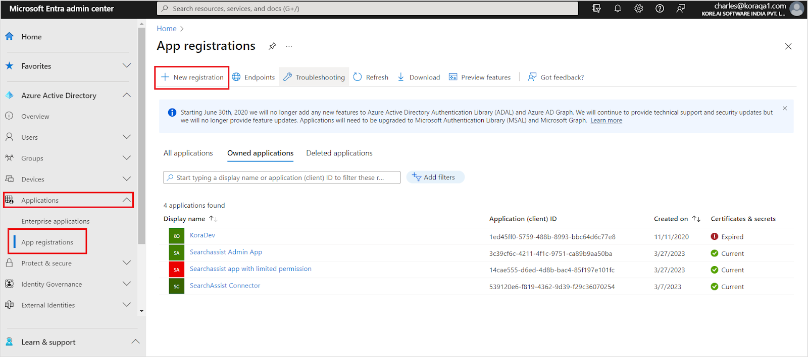

3. Enter the application name. Set the account type to **Accounts in any organization directory** (multi-tenant). Set the Redirect URL for your region and click **Register**.
   - JP Region: `https://jp-bots-idp.kore.ai/workflows/callback`
   - DE Region: `https://de-bots-idp.kore.ai/workflows/callback`
   - Production: `https://idp.kore.com/workflows/callback`

   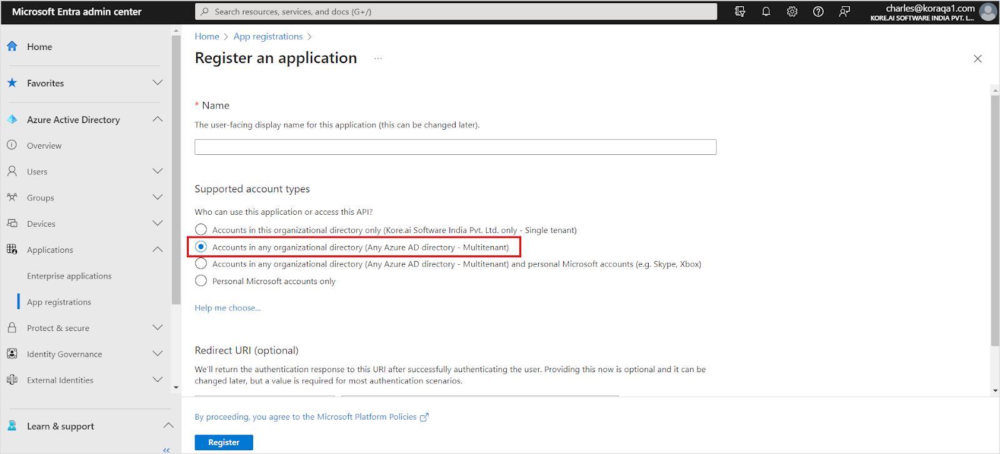

4. Save the **Client ID** and **Tenant ID** from the **Overview** section.

   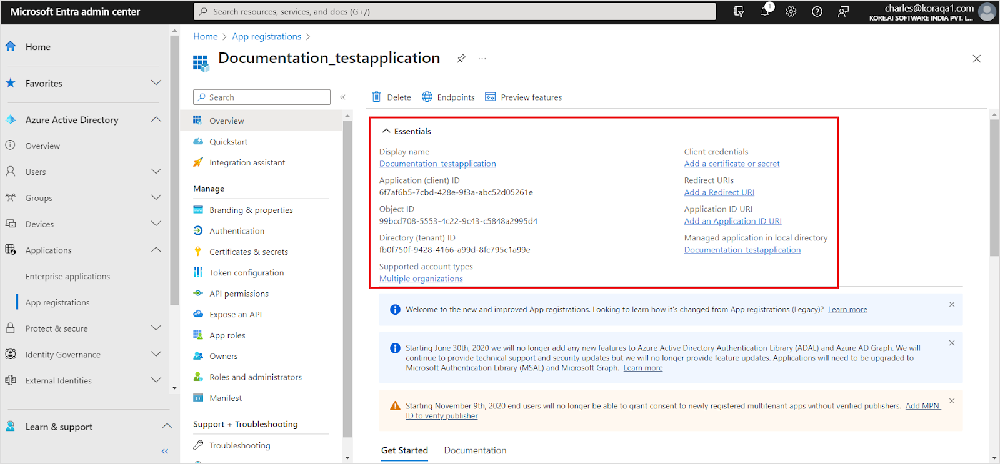

5. Go to **Certificates and Secrets** and [generate a client secret](https://learn.microsoft.com/en-us/azure/active-directory/develop/quickstart-register-app#add-a-client-secret).

   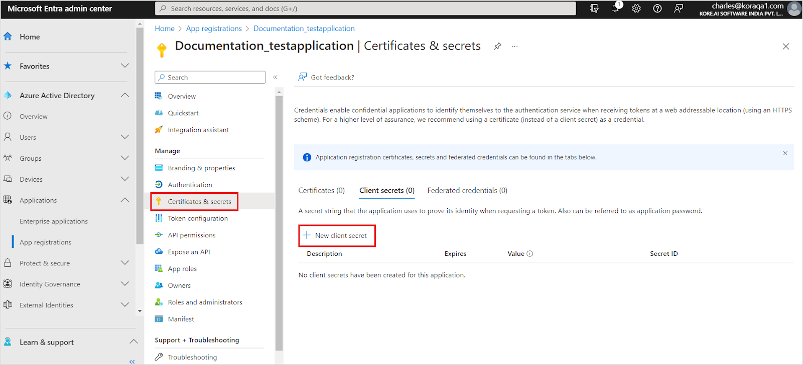

6. Enter a description, set the expiration to 24 months, and click **Add**.

   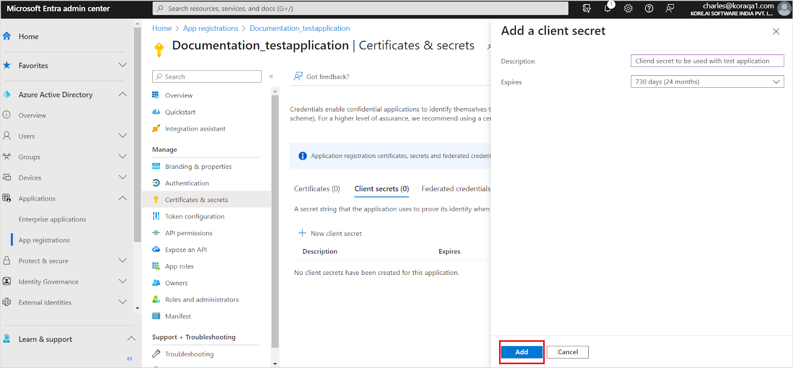

7. Save the client secret immediately — it cannot be viewed again after leaving the page.

   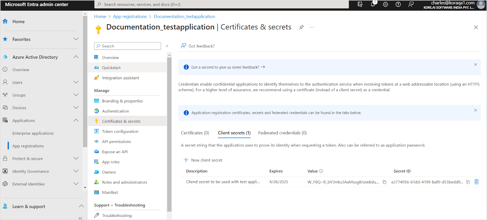

8. Go to **API Permissions** and click **Add a permission**.

   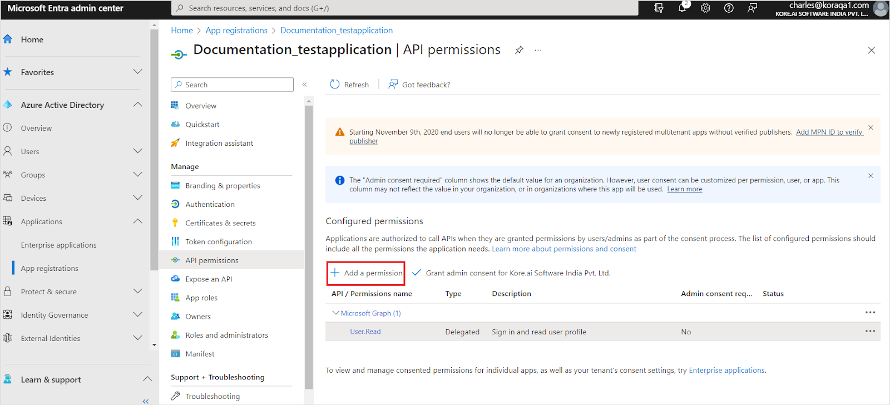

9. Add the following permissions under **Microsoft Graph**:

   **Delegated Permissions** (for Authorization Code Grant Type):
   - `User.ReadBasic.All`
   - `Group.Read.All`
   - `Directory.AccessAsUser.All`
   - `Files.Read`
   - `Files.Read.All`
   - `Sites.Read.All`
   - `Offline_access`
   - `GroupMember.Read.All` — required only if RACL is enabled
   - `Organization.Read.All` — required only if RACL is enabled

   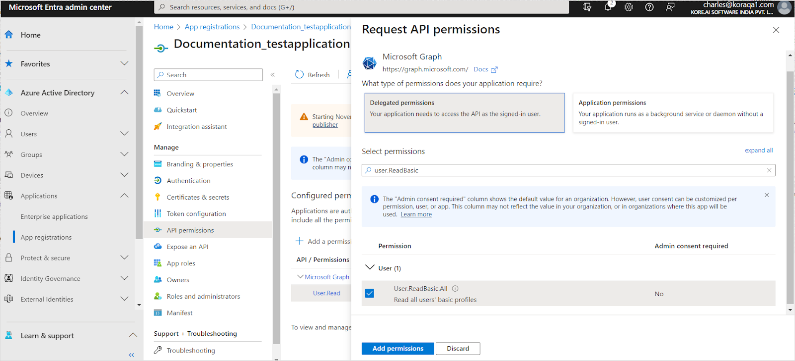

   **Application Permissions** (for Client Credentials Grant Type):
   - `Sites.Selected`
   - `GroupMember.Read.All` — required only if RACL is enabled
   - `Organization.Read.All` — required only if RACL is enabled

10. Click **Grant Admin Consent** to apply the permissions.

    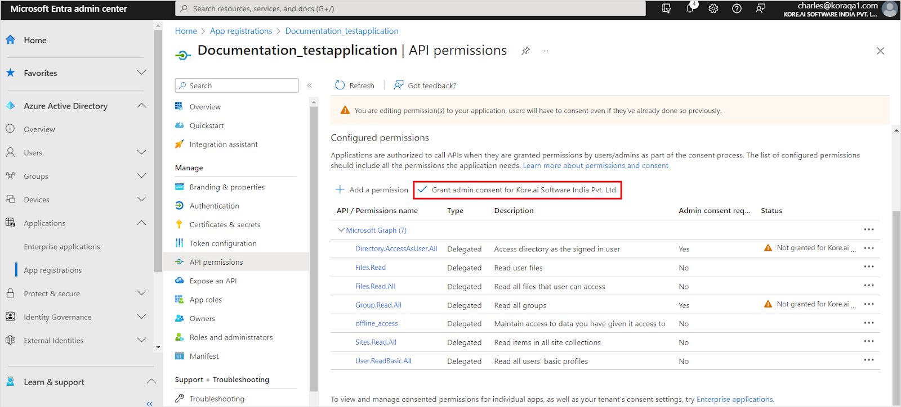

## Configure the SharePoint Connector in Search AI

1. Go to **Content > Connectors** and select **SharePoint**.
2. On the **Authorization** page, provide the following details:

| Field | Description |
|-------|-------------|
| **Name** | Unique name for the connector |
| **Authorization Type** | OAuth 2.0 |
| **Grant Type** | Authorization Code or Client Credentials |
| **Client ID** | Client ID from the Azure app registration |
| **Client Secret** | Client secret from the Azure app registration |
| **Tenant ID** | Directory (Tenant) ID from your Azure AD instance |
| **Content Type** | All, Articles, or Files |

3. Click **Connect** to authenticate.

## Content Ingestion

After authentication, select the SharePoint sites to ingest content from.

> **Note:** Configuration steps vary depending on the grant type selected.

### Authorization Code Grant Type

1. Go to the **Configuration** section.
2. Under **Sync Specific Content**, click **Select Content**.
3. Choose the SharePoint sites to ingest content from.
4. Click **Save**.

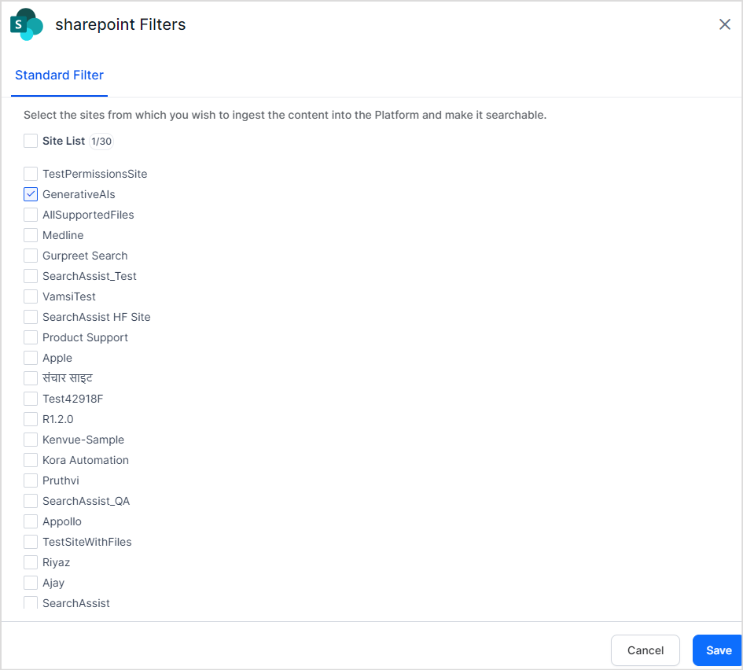

### Client Credentials Grant Type

1. Go to the **Configuration** section.
2. Under **Sync Specific Content**, click **Configure**.
3. Enter one or more Site IDs. The Azure AD app must have access to all sites listed here.
4. Select the content type: **Articles** or **Files**.
5. Optionally apply filters to narrow the content ingested.

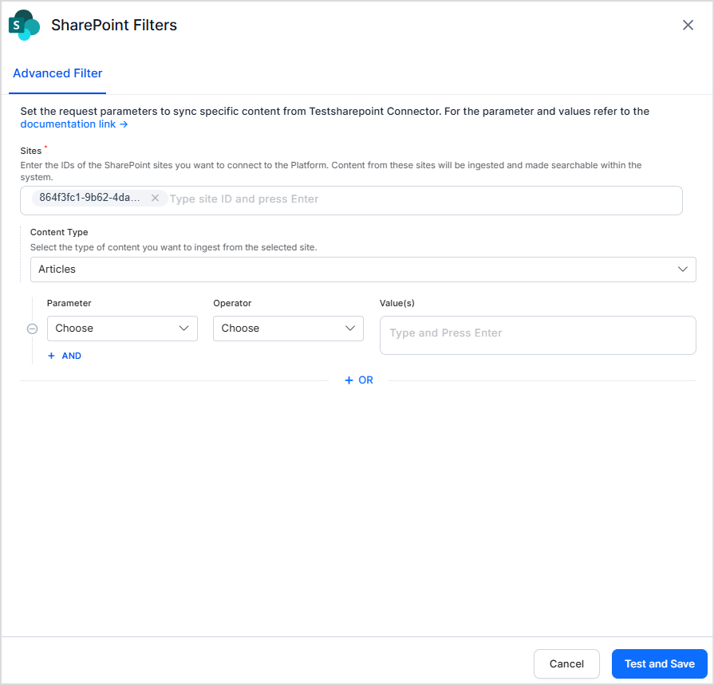

> **Note:** Only Articles or Files can be selected individually as content types. To ingest both, create a filter with two conditions joined by the OR operator:
> - Condition 1: Content Type = Articles
> - Condition 2: Content Type = Files

## Sync Content

Click **Sync Now** to start ingestion immediately, or configure **Schedule Sync** in the **Configuration** page for automatic ingestion.

## Advanced Content Filtering

Apply custom filtering rules to control which content is ingested from each site.

1. Go to the **Advanced Filter** tab.
2. Define filtering rules using the following fields:

| Field | Description |
|-------|-------------|
| **Site** | The SharePoint site to filter |
| **Content Type** | Articles or Files |
| **Parameter** | Attribute to filter on (select from dropdown or add custom). Must match SharePoint field names exactly. |
| **Operator** | Condition operator (Equals, Contains, Greater Than, etc.) |
| **Value** | Value the parameter must match |

Example — ingest articles with a specific ID from a specific site:

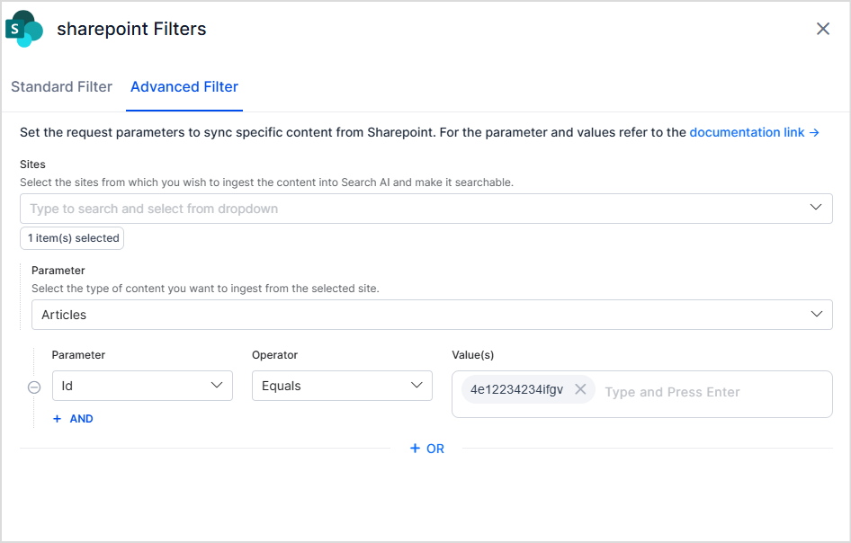

**Filter rule behavior:**

- **Multiple rules** — Content matching any rule is ingested (logical OR).

  Example — select articles matching a specific ID or a specific title:

  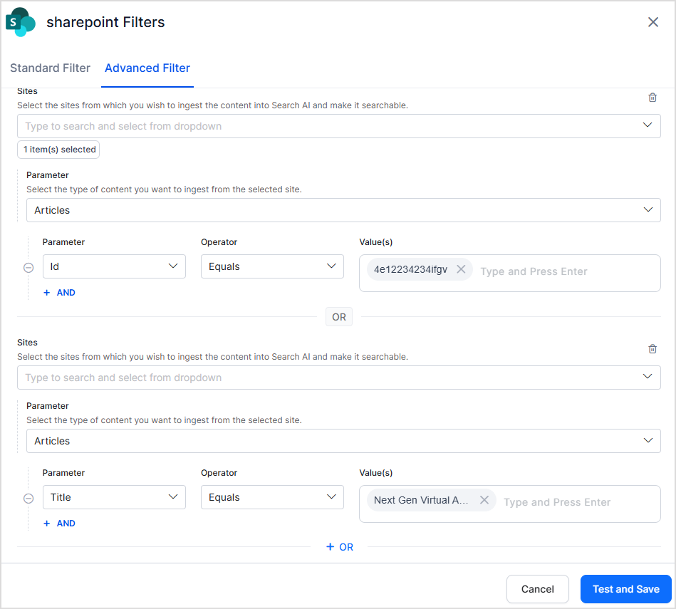

- **Multiple conditions** — All conditions within a single rule must be satisfied (logical AND).

  Example — select articles with a specific title and web URL:

  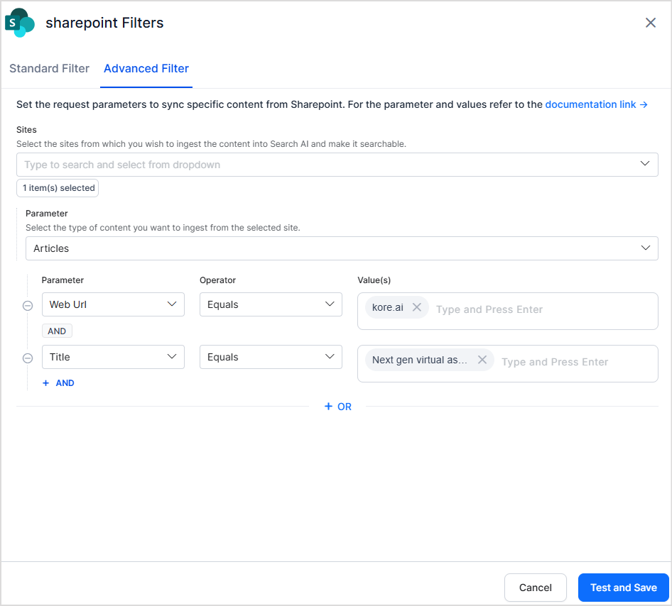

## Access Control

### Understanding Permissions in SharePoint

SharePoint permissions include site-level permissions and individual file permissions.

### Site-Level Permissions

SharePoint uses two membership group types:

- **Office 365 Groups** — Grant site access to members.
- **SharePoint Security Groups** — Control site access at three default permission levels: Site Visitors, Site Members, and Site Owners.

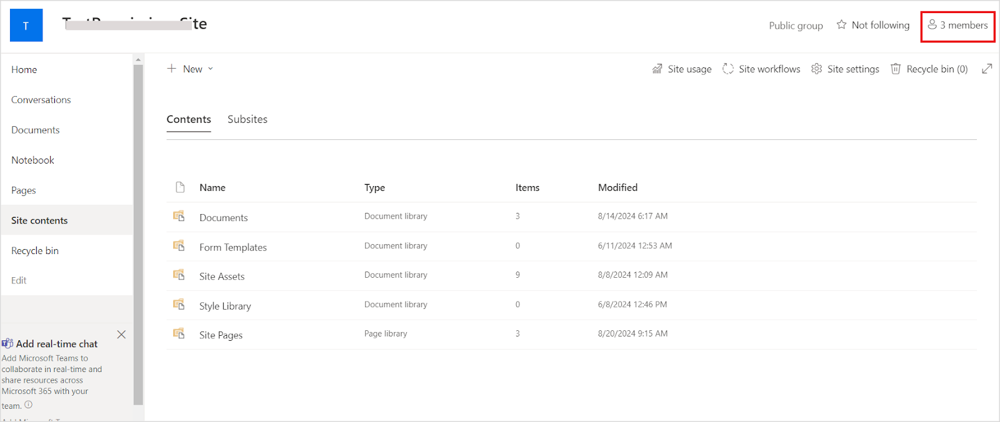

Click **Members** to view the list of members and their roles.

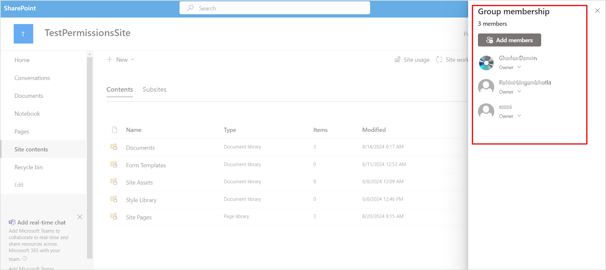

Go to **Settings > Site Permissions** to view SharePoint Security Groups.

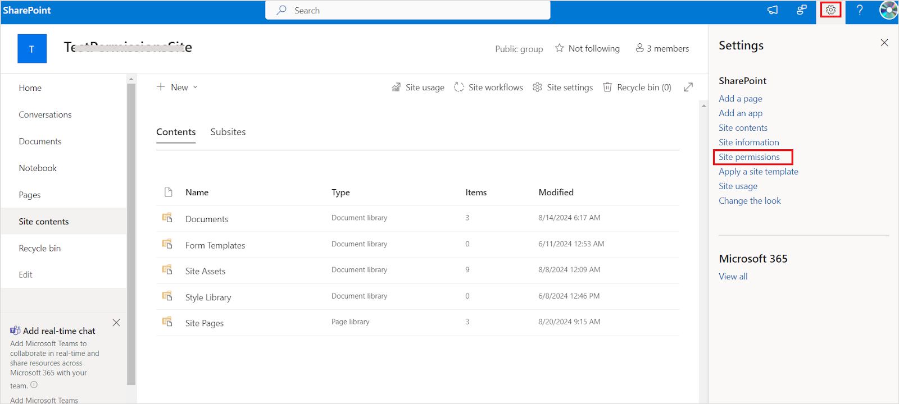

### How Search AI Handles Site Permissions

- **Office 365 Group** — A Permission Entity is created in Search AI. All users directly added to this group are automatically added to the Permission Entity. Email groups added here must be resolved manually using the [Permission Entity APIs](../../../apis/searchai/permission-entity-apis.mdx).
- **SharePoint Security Groups** — Three Permission Entities are created (one per default permission level). Users in these groups must be added manually to their corresponding Permission Entities using the [Permission Entity APIs](../../../apis/searchai/permission-entity-apis.mdx).

The `sourceACL` field contains four Permission Entities corresponding to the site permissions.

### File-Level Permissions

Site-level permissions apply to all files within that site. File owners can also share files with individual users, internally or externally, or with all domain or organization members.

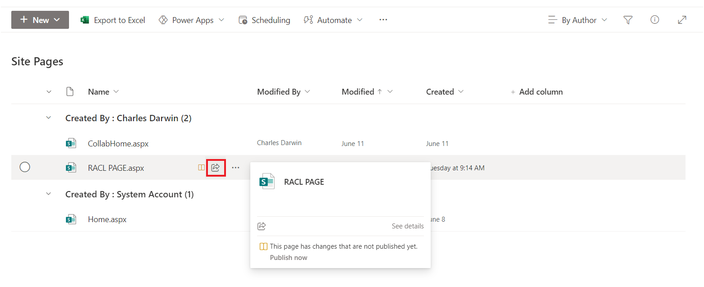

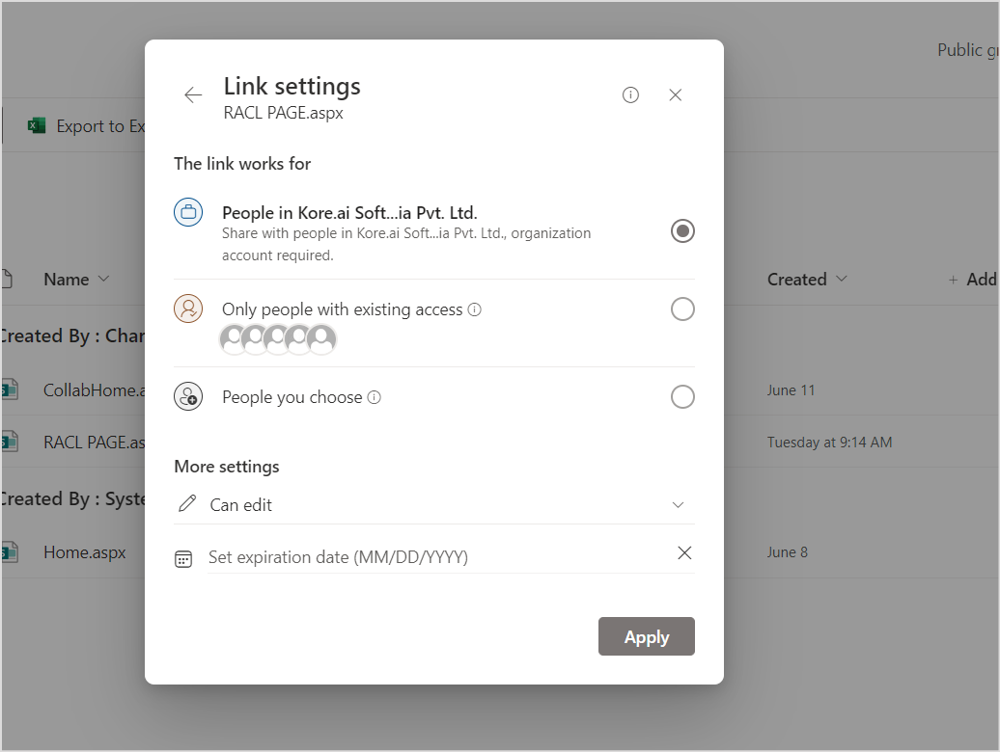

### How Search AI Handles File Permissions

- **Shared with a specific user** — The user is automatically added to the `sourceACL` field during ingestion.
- **Shared with a user group** — The group ID is used to create a Permission Entity that resolves individual users.
- **Shared with a specific domain** — The domain name is stored as a Permission Entity in `sourceACL`. Search AI compares user email domains during answer generation and grants access on a match.

## Related Topics

- [Access Control in Search AI](../racl-support.mdx)
- [Permission Entity APIs](../../../apis/searchai/permission-entity-apis.mdx)
- [Content Sources](../content-sources.mdx)
