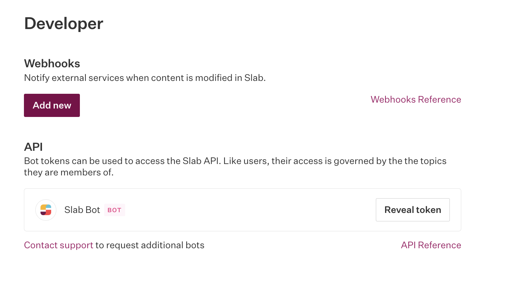

Slab is a knowledge management and team collaboration platform for creating, organizing, and sharing internal documentation. Use the Search AI connector for Slab to ingest and index content from your Slab account and enable search across it.

| Specification | Details |
|---------------|---------|
| Repository type | Cloud |
| Supported content | Posts |
| RACL support | Yes |
| Content filtering | No |

## Prerequisites

- Admin access to the Slab application.
- A Slab Bot API token (see below).

## Generate an Access Token in Slab

Search AI communicates with Slab using its APIs. Authentication requires an access token tied to a bot-type user associated with your organization. This token is private and must not be shared.

1. Go to the **Admin console** in the Slab application.
2. Click your profile name in the top right and go to **Settings**.
3. Select **Developer** from the left menu.
4. Click **Reveal API Token** to display the Slab bot token.

## Configure the Slab Connector in Search AI

1. Go to the **Authorization** page of the Slab connector.
2. Provide the following details and click **Connect**:

| Field | Description |
|-------|-------------|
| **Name** | Unique name for the connector |
| **Slab Bot Token** | API token generated in the Slab admin console |

## Content Ingestion

After connecting, go to the **Configuration** tab to set up synchronization:

- **Sync Now** — Immediately ingest content from Slab.
- **Schedule Sync** — Set a recurring schedule for future syncs.

On sync, Search AI ingests content from Slab **posts** into the Search AI index.

## Related Topics

- [Access Control in Search AI](../racl-support.mdx)
- [Permission Entity APIs](../../../apis/searchai/permission-entity-apis.mdx)
- [Content Sources](../content-sources.mdx)
