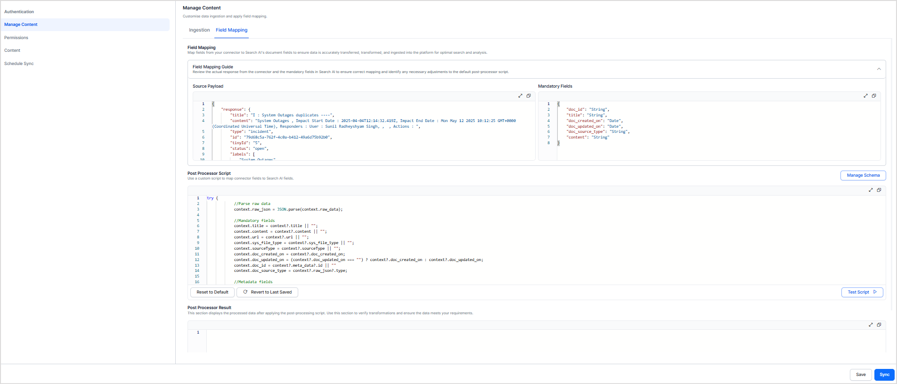

<Badge icon="arrow-left" color="gray">[Back to Search AI connectors list](/ai-for-service/searchai/content-sources#supported-connectors)</Badge>

Search AI uses a Unified Schema to standardize data ingestion from diverse content sources — enterprise applications, files, and webpages. This schema defines a consistent structure so that data from different formats and systems can be interpreted and searched uniformly.

When content is ingested via connectors, fields from the source application are automatically mapped to the most relevant fields in the unified schema. You can override default mappings using the **Field Mapping** option in the connector configuration, and extend the schema with custom fields to accommodate additional data.

## Default Schema Fields

The following are the default fields of the Unified Schema. Some fields are system fields and cannot be updated.

> **Note:** Some fields in the list are system fields and cannot be updated.

| Document Field | Description | Is System Field |
|----------------|-------------|-----------------|
| `access_level` | Visibility or permission level associated with the document | No |
| `archived_at` | Timestamp indicating when the document or record was archived | No |
| `assignee` | Identifier of the user or entity responsible for the document, task, or record | No |
| `assignee_email` | Email address of the user assigned to the document | No |
| `assignee_name` | Display name of the assignee | No |
| `blockedAcl` | List of users or groups explicitly restricted from accessing the document | No |
| `branch` | Branch, version, or division of content (for example, in code repositories or knowledge bases) | No |
| `category` | Classification label used to group similar documents or content types | No |
| `channel_id` | Unique identifier for the communication channel the document originates from | No |
| `checksum` | Unique hash value generated for the document content | No |
| `chunkType` | Type of chunk | Yes |
| `closedOn` | Timestamp indicating when the item (for example, issue, task, or conversation) was closed | No |
| `comment_count` | Total number of comments associated with the item | No |
| `comments` | List or collection of user comments related to the item | No |
| `commit_id` | Unique identifier of the commit associated with the item | No |
| `company_id` | Unique identifier for the company or organization | No |
| `company_name` | Name of the company associated with the record | No |
| `contact_id` | Unique identifier for the contact person | No |
| `contact_name` | Name of the contact person | No |
| `content` | Main textual or structured content of the record (for example, body of a document, note, or comment) | No |
| `contentId` | Unique identifier of the content entity | No |
| `conversation_id` | Unique identifier of the conversation or thread | No |
| `createdBy` | User ID or name of the person who created the item | No |
| `createdOn` | Timestamp when the item was created | No |
| `deleted_at` | Timestamp when the item was deleted (if soft-deleted) | No |
| `doc_created_by` | Identifier or name of the user who created the document | No |
| `doc_created_by_email` | Email address of the document creator | No |
| `doc_created_by_id` | Unique ID of the document creator | No |
| `doc_created_by_name` | Full name of the document creator | No |
| `doc_created_on` | Timestamp when the document was created | No |
| `doc_id` | Unique identifier of the document | No |
| `doc_path` | File path or storage path of the document | No |
| `doc_source_type` | Type of source from which the document was ingested | No |
| `doc_updated_by` | Identifier or name of the user who last updated the document | No |
| `doc_updated_by_email` | Email address of the user who updated the document | No |
| `doc_updated_by_id` | Unique ID of the user who last updated the document | No |
| `doc_updated_on` | Timestamp when the document was last updated | No |
| `downvote_count` | Number of downvotes received by the item (for example, post, comment, or answer) | No |
| `due_date` | Due date or deadline associated with the task or item | No |
| `extractionMethod` | Method used to extract data from the source | Yes |
| `extractionStrategy` | Strategy or approach followed for data extraction | Yes |
| `file_content` | Actual text or encoded content of the file | No |
| `file_image_url` | URL to the preview image of the file | No |
| `file_preview` | Short summary or visual preview of the file content | No |
| `file_title` | Title or display name of the file | No |
| `file_url` | Direct URL link to access or download the file | No |
| `html` | Raw HTML version of the document or page content | No |
| `issueType` | Type or category of issue | No |
| `keywords` | List of keywords or tags extracted or assigned to the content | No |
| `labels` | Labels or classifications applied to the item | No |
| `language` | Language in which the content is written | No |
| `lastSyncAt` | Timestamp of the most recent synchronization with the source system | No |
| `location` | Physical or virtual location associated with the record | No |
| `mentioned_users` | List of users mentioned or tagged within the content | No |
| `message_type` | Type of message | No |
| `mime_type` | MIME type of the file or document | No |
| `object_created_by_email` | Email address of the user who created the object | No |
| `object_created_by_id` | ID of the user who created the object | No |
| `object_created_by_name` | Name of the user who created the object | No |
| `object_created_on` | Timestamp when the object was created | No |
| `object_type` | Type of object | No |
| `organization_id` | Unique identifier for the organization | No |
| `organization_name` | Name of the organization associated with the record | No |
| `owner_email` | Email address of the item owner or assignee | No |
| `owner_id` | Unique ID of the item owner or assignee | No |
| `owner_name` | Full name of the item owner or assignee | No |
| `page_body` | Text content or body of an HTML page | No |
| `page_count` | Number of pages in the document from which the content is ingested | No |
| `page_html` | Page content in HTML format | No |
| `page_image_url` | URL for the page image or thumbnail | No |
| `page_number` | Page number of the content | No |
| `page_preview` | Short preview of the page content | No |
| `page_title` | Title of the page | No |
| `page_url` | URL of the page or web resource | No |
| `parent_name` | Name of the parent entity | No |
| `parent_url` | URL of the parent document or source from which this page is derived | No |
| `priority` | Priority level of the item | No |
| `project_description` | Description or summary of the project | No |
| `project_id` | Unique identifier for the project | No |
| `project_name` | Name of the project | No |
| `project_owner_email` | Email address of the project owner | No |
| `project_owner_id` | ID of the project owner | No |
| `project_owner_name` | Name of the project owner | No |
| `project_status` | Current status of the project | No |
| `projectName` | Name of the project | No |
| `published_at` | Timestamp when the item or content was published | No |
| `reporter` | Identifier or name of the person who reported the issue | No |
| `reporter_email` | Email address of the reporter | No |
| `reporter_name` | Full name of the reporter | No |
| `repository_id` | Unique ID of the code or content repository | No |
| `repository_name` | Name of the repository | No |
| `resource_type` | Type of resource | No |
| `share_count` | Number of times the item has been shared | No |
| `size` | File size or data volume | No |
| `sourceType` | Type of content source: web crawl, file upload, or connector | No |
| `sprint` | Sprint or iteration the item belongs to | No |
| `status` | Current status of the item | No |
| `sys_file_type` | System-defined file type classification | Yes |
| `sys_racl` | Role-based Access Control List defining permissions for the resource | No |
| `sys_source_name` | Name of the system or connector from which the item originated | Yes |
| `tags` | Tags associated with the record for categorization or search | No |
| `thread_id` | Unique identifier of the thread or discussion chain | No |
| `title` | Title or name of the item | No |
| `updatedBy` | Identifier or name of the user who last updated the record | No |
| `updatedOn` | Timestamp when the record was last updated | No |
| `upvote_count` | Number of upvotes received by the item | No |
| `url` | Link to access the resource or item | No |
| `view_count` | Number of times the item has been viewed | No |
| `visibility` | Access level of the item | No |
| `workspace_id` | Unique identifier for the workspace or environment | No |
| `workspace_name` | Name of the workspace associated with the item | No |

## Custom Fields in Schema

Search AI allows you to extend the Unified Schema with up to 50 custom fields, so you can include additional data from third-party applications as searchable content. Custom fields can also be used in the Workbench — for example, to store LLM-generated summaries of ingested content.

### Adding a New Field

1. Click **Manage Schema** on the **Manage Content** page in the connector.
2. Click **+New Field**.
3. Provide the following details:

| Field | Description |
|-------|-------------|
| **Display Name** | User-friendly name shown in the UI |
| **Data Type** | `string` or `array` |
| **Field Name** | Technical name used in scripts and field mapping. Use `cfa1`–`cfa5` for array fields and `cfs1`–`cfs45` for string fields |
| **Description** | Brief description of the field's intended use |

### Field Mapping

By default, fields ingested from a connector are automatically mapped to the most appropriate unified schema fields. You can customize this mapping for specific business requirements.

For example, a Google Drive connector maps the source field `createdTime` to the unified schema field `createdOn` by default. If you want to display last-modified-user information in search results, you can update the mapping to point `lastModifyingUser.displayName` to `updatedBy`.

**Implementing Field Mapping**

After an initial sync, view the connector's response payload and map fields using a post-processor script:

1. Go to the **Field Mapping** tab under **Manage Content**.
2. The source payload shows the actual response from the connector. Required Search AI fields are listed in the right pane.
3. Use the source payload and post-processor scripts to map source fields to unified schema fields. A default script is provided for each connector showing the default mappings.



**Example: Mapping a date field**

If the source payload contains a `createdAt` field that should map to `doc_created_on`, add this line to the script:

**Source Payload**

```json
{
    "incidents": {
        "title": "I : System Outages duplicates ----",
        "content": "System Outages , Impact Start Date : 2025-04-04T12:14:32.419Z, Impact End Date : Mon May 12 2025 10:12:25 GMT+0000 (Coordinated Universal Time), Responders : User : John Doe , Actions : ",
        "type": "incident",
        "id": "79d68c5a-762f-4c0a-b412-49a6d75b92b0",
        "tinyId": "5",
        "status": "open",
        "labels": [
            "System Outages"
        ],
        "createdAt": "2025-04-04T12:14:32.419Z",
        "updatedAt": "2025-04-04T12:14:49.526Z",
        "priority": "P3",
        "responders": "User: John Doe, ",
        "actions": [],
        "impactStartDate": "2025-04-04T12:14:32.419Z",
        "impactEndDate": "2025-05-12T10:12:25.985Z"
    }
}
```

**Script Update**

```json
context.doc_created_on  = context?.raw_json?.createdAt;
```

If a connector supports multiple object types, the source payload shows a combined set of fields for all objects. When mapping fields from two or more objects to custom fields, use separate custom fields for each object type:

```json
context.cfs1 = context?.raw_json?.incidentTitle;
Context.cfs2 = context?.raw_json?.alertTitle;
```
