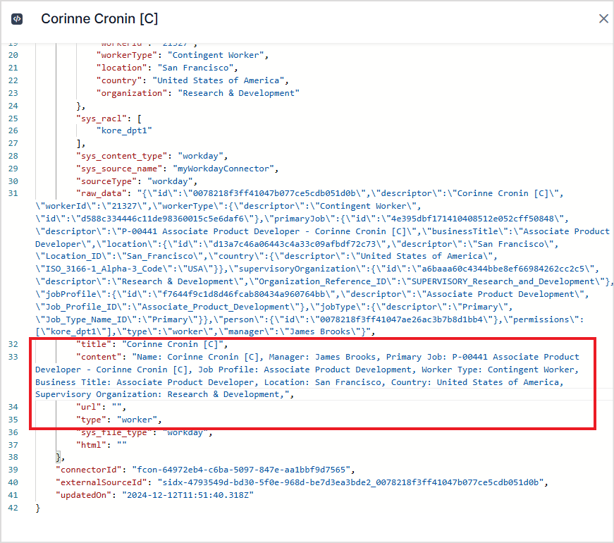

<Badge icon="arrow-left" color="gray">[Back to Search AI connectors list](/ai-for-service/searchai/content-sources#supported-connectors)</Badge>

Workday is a cloud-based enterprise suite for Human Capital Management (HCM), Financial Management, and Analytics. The Search AI Workday connector enables search across **jobs**, **positions**, and **organization charts**, helping users quickly locate job openings, match roles to candidates, and analyze position details.

| Specification | Details |
|---------------|---------|
| Repository type | Cloud |
| Supported content | Jobs, Positions, Organization Charts |
| RACL support | Yes |
| Content filtering | No |
| Auto permission resolution | Yes |

## Prerequisites

The Workday connector uses Workday REST APIs. Register Search AI as an API client in Workday before configuring the connector.

1. In the Workday Console, search for **Register API Client**.
2. Enter a name for the app.
3. Set **Grant Type** to **Authorization Code Grant**.
4. Set **Access Token Type** to **Bearer**.
5. Choose a **Redirection URI** based on your region or deployment:
   - JP Region: `https://jp-bots-idp.kore.ai/workflows/callback`
   - DE Region: `https://de-bots-idp.kore.ai/workflows/callback`
   - Prod: `https://idp.kore.com/workflows/callback`
6. Set the **Scope (Functional Areas)** to include:
   - Jobs & Positions (Custom Object)
   - Organizations and Roles (Workday REST API)
   - Staffing (Workday REST API)
7. Configure any other properties as needed. See the Workday documentation for details.
8. Click **OK**. Save the **Client ID**, **Client Secret**, **Authorization URL**, and **Token URL** — these are required for connector configuration.

## Configuring the Workday Connector in Search AI

Go to the **Authorization** page of the connector, enter the following fields, and click **Connect**.

| Field | Value |
|-------|-------|
| **Name** | Unique name for the connector |
| **Tenant Name** | Set to Token |
| **Authorization Type** | OAuth 2.0 |
| **Grant Type** | Authorization Code |
| **Client ID** | Client ID from Workday |
| **Client Secret** | Client Secret from Workday |
| **Authorization Base URL** | Authorization base URL from Workday |
| **Token Base URL** | Token URL from Workday |

## Ingesting Content

After connecting, go to the **Configuration** tab to set up synchronization. Use **Sync Now** for an immediate sync, or **Schedule Sync** to configure a recurring schedule.

Search AI ingests the following content types from Workday: Workers, Job Profiles, Job Families, and Supervisory Organization Charts.

The `type` field in each ingested document identifies the content type (worker, job profile, and so on). Relevant fields are populated in the `content` field of each document. For example, a worker record includes all worker details with the worker's name as the document title.

Go to the **Content** tab to view ingested content.

## RACL Support

Search AI uses the **tenant ID** to identify users with access to Workday content. The `sys_racl` field for all ingested content is set to the tenant ID, ensuring access is restricted to users assigned to that tenant.

The tenant ID appears in the Workday URL as the unique identifier following the first `/`. For example, in `https://impl.wd12.myworkday.com/domain_dpt1/`, the tenant ID is `domain_dpt1`.
