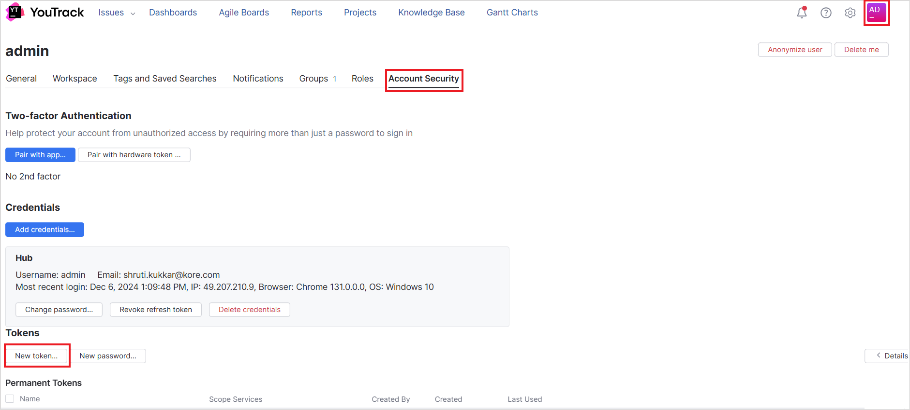
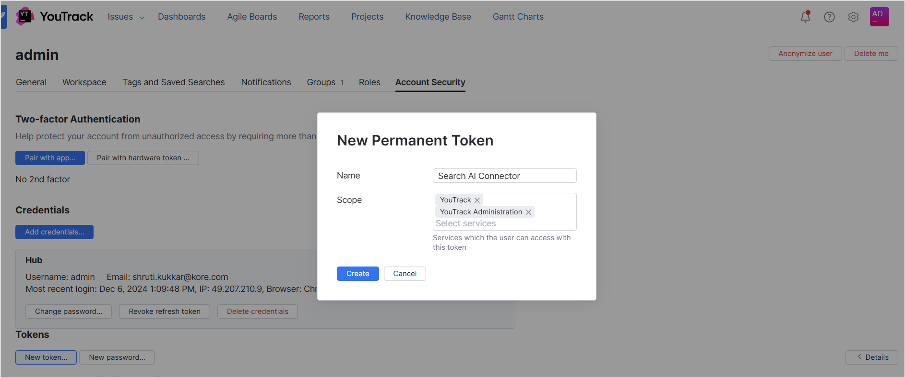

<Badge icon="arrow-left" color="gray">[Back to Search AI connectors list](/ai-for-service/searchai/content-sources#supported-connectors)</Badge>

YouTrack is a project management and issue tracking tool designed for software development and agile workflows. The Search AI YouTrack connector ingests projects, issues, and knowledge articles, enabling search across all of this content.

| Specification | Details |
|---------------|---------|
| Repository type | Cloud |
| Supported content | Projects, Issues, Knowledge Articles |
| RACL support | Yes |
| Content filtering | No |
| Auto permission resolution | Yes |

## Prerequisites

The YouTrack connector authenticates using a **Permanent Token**. Generate this token in YouTrack before configuring the connector.

## Generating a Permanent Access Token in YouTrack

1. Go to your YouTrack **Profile** page and select the **Account Security** tab.
2. Under **Tokens**, click **New Token**.

   

3. Enter a name for the token and save the generated value.

   

## Configuring the YouTrack Connector in Search AI

Go to the **Authorization** page of the connector, enter the following fields, and click **Connect**.

| Field | Description |
|-------|-------------|
| **Name** | Unique name for the connector |
| **Authorization Type** | Set to Token |
| **Permanent Token** | The API token generated in YouTrack |
| **Host URL** | Base URL of the YouTrack service |
| **Content Type** | Select **Issues**, **Knowledge Articles**, or both |

## Ingesting Content

After connecting, go to the **Configuration** tab. Use **Sync Now** for immediate ingestion, or **Schedule Sync** to configure recurring synchronization.

Search AI ingests **issues and knowledge articles from projects** in YouTrack.

The `type` field in each ingested document indicates whether the content is an issue or a knowledge article. For issues, all issue properties are ingested as metadata; the description and comments are added to the `content` field. For articles, properties are stored as metadata and the description and comments are added to the `content` field.

## Filtering Content

Search AI supports selective ingestion, allowing you to sync content from specific projects only.

1. Go to the **Configurations** tab in the connector interface.
2. Click **Sync Specific Content** and select the **Configure** link.
3. Select the projects to ingest content from.
4. Click **Save** to apply the changes.

<Note>Configured filters take effect during the next synchronization cycle. Trigger a sync or ensure one is scheduled to reflect the updates.</Note>

## RACL Support

Search AI controls access to YouTrack content at the **project level**.

- Each issue and article in YouTrack is linked to a project via a unique **Project ID**.
- When content is ingested, the Project ID is stored in the `sys_racl` field of the corresponding chunks and serves as the permission entity.
- Search AI automatically resolves permissions for YouTrack: it identifies which users have access to each project and associates them with the corresponding Project ID permission entity.
- Manual permission entity mapping via APIs is not required.
