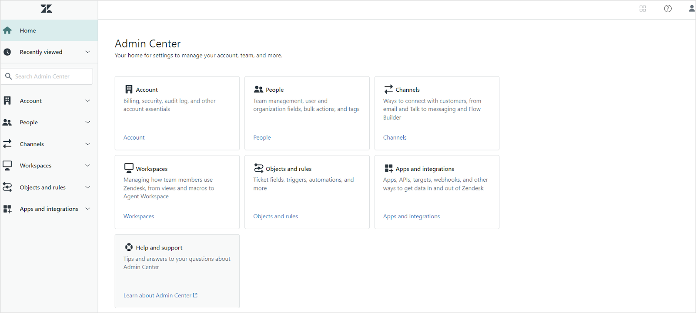

<Badge icon="arrow-left" color="gray">[Back to Search AI connectors list](/ai-for-service/searchai/content-sources#supported-connectors)</Badge>

The Zendesk connector lets Search AI ingest content from **Zendesk Knowledge Base articles and Tickets**, making that content searchable for users.

| Specification | Details |
|---------------|---------|
| Repository type | Cloud |
| Supported API version | REST API v2 |
| Supported content | Zendesk Knowledge Base Articles and Tickets |
| RACL support | Yes |
| Content filtering | No |
| Auto permission resolution | Yes |


## Authorization Support

Search AI uses **OAuth 2.0 Authorization Code Grant Type** to communicate with Zendesk.


## Integration Steps

1. Set up an OAuth client in Zendesk.
2. Configure the Zendesk connector in Search AI.


## Step 1: Set Up an OAuth Client in Zendesk

Set up an OAuth client in Zendesk and generate OAuth credentials for Search AI to authenticate requests.

1. Go to the **Admin Center** in your Zendesk application.


2. Under **Apps and Integrations**, go to the **Zendesk API** page.

3. On the **OAuth Client** tab, register Search AI as an OAuth client. See [Zendesk OAuth documentation](https://support.zendesk.com/hc/en-us/articles/4408845965210-Using-OAuth-authentication-with-your-application#topic_s21_lfs_qk) for field descriptions. Set the **Redirect URLs** field to one of the following based on your region or deployment:
   - JP Region: `https://jp-bots-idp.kore.ai/workflows/callback`
   - DE Region: `https://de-bots-idp.kore.ai/workflows/callback`
   - Production: `https://idp.kore.com/workflows/callback`

After saving, a pre-populated **Secret** field appears. Copy this value — it is the client secret needed for Step 2.


## Step 2: Configure the Zendesk Connector in Search AI

Go to **Sources > Connectors** and select **Zendesk**. On the **Authorization** tab, provide the following details and click **Connect**.

| Field | Description |
|-------|-------------|
| **Name** | Unique name for the connector |
| **Authorization Type** | OAuth 2.0 (only supported option) |
| **Grant Type** | Authorization Code — see [Grant Types](/ai-for-service/searchai/content-sources#connectors) for details |
| **Client ID** | Client ID generated during OAuth registration |
| **Client Secret** | Secret generated during OAuth registration |
| **Host URL** | URL of your Zendesk instance |
| **Content Type** | Select the content types to ingest |

After a successful connection, ingest content from the **Configuration** tab using **Sync Now**.


## Content Ingestion

On the **Configuration** tab, use **Sync Now** for an immediate sync or **Schedule Sync** to set up recurring ingestion.

Search AI ingests **Knowledge Base Articles and Tickets** from the connected Zendesk account. The `type` field in ingested content indicates whether a record is an article or a ticket.

**Tickets** — the following fields are ingested into the `content` field:

- Title
- Content
- Priority
- Status
- Type
- Assignee
- Requester
- Submitter
- Comments

**Articles** — the main text content and comments are captured in the `content` field. Additional fields are stored in their respective indexed or metadata fields.

**JSON view of ingested content for an article**

```json
{
    "_id": "fc-37479a31-bce2-53a7-a341-bd9dcf186282",
    "searchIndexId": "sidx-4793549d-bd30-5f0e-968d-be7d3ea3bde2",
    "streamId": "st-b3c3e04c-567d-5b8c-bee7-719d7fb669a3",
    "createdBy": "u-1e066081-f25d-5b7b-99d5-1b873ea50b09",
    "createdOn": "2025-01-09T08:45:25.000Z",
    "lMod": "2025-01-16T10:58:55.000Z",
    "extractionType": "zendesk",
    "extractionSourceId": "fs-90813a2b-a076-5064-825f-ecf2796132f2",
    "jobId": "fj-7515b09b-5539-5d39-8f0d-f214393389b3",
    "_meta": {
        "state": "approved",
        "isDeleted": false,
        "size": 1363,
        "updateAvailable": false
    },
    "_source": {
        "meta_data": {
            "authorId": 17812183850908,
            "createdOn": "2025-01-09T08:45:25Z",
            "updatedOn": "2025-01-09T08:45:25Z",
            "contentType": "articles"
        },
        "sys_racl": [
            "17831164808092"
        ],
        "sys_content_type": "zendesk",
        "sys_source_name": "myZendeskConnector",
        "sourceType": "zendesk",
        "raw_data": "{\"id\":17831134698268,\"url\":\"https://test3814.zendesk.com/api/v2/help_center/en-us/articles/17831134698268.json\",\"html_url\":\"https://test3814.zendesk.com/hc/en-us/articles/17831134698268-SAMPLE-ARTICLE-Flat-pack-for-faster-shipping\",\"author_id\":17812183850908,\"comments_disabled\":false,\"draft\":false,\"promoted\":false,\"position\":0,\"vote_sum\":0,\"vote_count\":0,\"section_id\":17831158842524,\"created_at\":\"2025-01-09T08:45:25Z\",\"updated_at\":\"2025-01-09T08:45:25Z\",\"name\":\"SAMPLE ARTICLE: Flat pack for faster shipping\",\"title\":\"SAMPLE ARTICLE: Flat pack for faster shipping\",\"source_locale\":\"en-us\",\"locale\":\"en-us\",\"outdated\":false,\"outdated_locales\":[],\"edited_at\":\"2025-01-09T08:45:25Z\",\"user_segment_id\":null,\"permission_group_id\":17831164808092,\"content_tag_ids\":[],\"label_names\":[],\"body\":\"ShipQuick, in line with our commitment to practicality and efficiency, offers Flat Pack Delivery.\",\"permissions\":[\"17831164808092\"],\"connectorBaseUrl\":\"https://test3814.zendesk.com\",\"sourceType\":\"zendesk\"}",
        "base_url": "https://test3814.zendesk.com",
        "title": "SAMPLE ARTICLE: Flat pack for faster shipping",
        "content": "ShipQuick, in line with our commitment to practicality and efficiency, offers Flat Pack Delivery. It's quick, efficient, and streamlined so your delivery can be made simple and fuss-free. Our Flat Pack Delivery means we ship your furniture disassembled in packages. This helps lower shipping costs since items are smaller, easier to manage, and can be loaded more efficiently during transit. Upon arrival, it's easy to put together as our proprietary assembly instructions are clearly written and easy-to-follow. All it requires is a little bit of time.",
        "url": "https://test3814.zendesk.com/hc/en-us/articles/17831134698268-SAMPLE-ARTICLE-Flat-pack-for-faster-shipping",
        "type": "articles",
        "sys_file_type": "articles"
    },
    "connectorId": "fcon-3fea53ce-9a30-5d20-a22a-7d4a1fbef523",
    "externalSourceId": "sidx-4793549d-bd30-5f0e-968d-be7d3ea3bde2_17831134698268",
    "updatedOn": "2025-01-09T08:45:25.000Z"
}
```

**JSON view of ingested content for a ticket**

```json
{
    "_id": "fc-ffcc7e33-b387-550a-b1f1-6e1f1a10bf21",
    "searchIndexId": "sidx-4793549d-bd30-5f0e-968d-be7d3ea3bde2",
    "streamId": "st-b3c3e04c-567d-5b8c-bee7-719d7fb669a3",
    "createdBy": "u-1e066081-f25d-5b7b-99d5-1b873ea50b09",
    "createdOn": "2025-01-09T08:45:27.000Z",
    "lMod": "2025-01-20T11:26:26.000Z",
    "extractionType": "zendesk",
    "extractionSourceId": "fs-90813a2b-a076-5064-825f-ecf2796132f2",
    "jobId": "fj-b172bff0-2adb-59e7-b1f0-840eb2b10ad9",
    "_meta": {
        "state": "approved",
        "isDeleted": false,
        "size": 1578,
        "updateAvailable": false
    },
    "_source": {
        "meta_data": {
            "authorId": 17812183850908,
            "createdOn": "2025-01-09T08:45:27Z",
            "updatedOn": "2025-01-20T11:23:14Z",
            "contentType": "articles",
            "comments": "Comment #1 by John Doe (2025-01-10T10:33:53.000Z): This article helps a lot",
            "authorName": "John Doe",
            "section": "Gift cards"
        },
        "sys_racl": [
            "18025455651868"
        ],
        "sys_content_type": "zendesk",
        "sys_source_name": "myZendeskConnector",
        "sourceType": "zendesk",
        "base_url": "https://test3814.zendesk.com",
        "title": "SAMPLE ARTICLE: Gift card expiration date",
        "content": "HomeBuy International Gift Cards have helped decorate many homes across the world. Gift cards are good for 2 years from the date they were sent to the recipient via the ShipQuick website or, if you directly emailed the gift card to the recipient, then from its initial date of purchase. This generous time frame provides enough to browse through collections, imagine new furnishings in a space, take measurements, and find the perfect items.\nComments: Comment #1 by John Doe (2025-01-10T10:33:53.000Z): This article helps a lot\nAuthor Name: John Doe\nSection: Gift cards",
        "url": "https://test3814.zendesk.com/hc/en-us/articles/17831134834076-SAMPLE-ARTICLE-Gift-card-expiration-date",
        "type": "articles",
        "sys_file_type": "articles"
    },
    "connectorId": "fcon-3fea53ce-9a30-5d20-a22a-7d4a1fbef523",
    "externalSourceId": "sidx-4793549d-bd30-5f0e-968d-be7d3ea3bde2_17831134834076",
    "updatedOn": "2025-01-20T11:23:14.000Z"
}
```


## RACL Support

Search AI enforces access control for ingested tickets and articles using the `sys_racl` field, which stores identifiers (email IDs, organization IDs, group IDs) that determine which users can view a given piece of content.

### Tickets

For ingested tickets, the `sys_racl` field includes:

- **Assignee** — email ID of the ticket assignee
- **Requester** — email ID of the ticket requester
- **Submitter** — email ID of the ticket submitter
- **Followers** — email IDs of all ticket followers
- **Collaborators** — email IDs of all ticket collaborators
- **Organization ID** — ID of the organization associated with the ticket
- **Group ID** — ID of the group the ticket is assigned to (if applicable)

Example:

```json
"sys_racl": [
    "peter.mark@example.com",      // assignee of the ticket
    "customer@example.com",         // submitter of the ticket
    "support.lead@example.com",     // collaborator on the ticket
    "17812171469852"                 // organization ID
]
```

### Articles

For ingested articles, `sys_racl` includes permission entities corresponding to the **management permissions** and **user segments** assigned to the article.

For example, if an article has management permissions set to "Admins" and visibility set to the "Agents" user segment, Search AI creates two permission entities — one for the management permission and one for the user segment.

```json
"sys_racl": [
    "17831164808092",    // Permission entity for Admin management permission
    "134355653233314"    // Permission entity for Agents user segment
]
```
