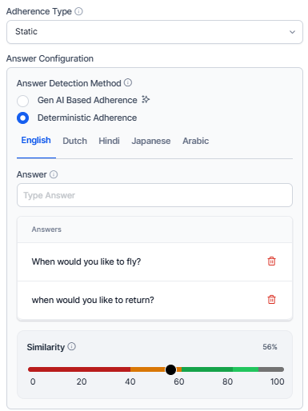

# By Question Metric

The By Question metric evaluates how well agents respond to specific questions during customer interactions. Supervisors can apply this metric to all conversations (Static) or trigger it only when specific conditions occur (Dynamic).

This metric helps teams measure response quality, enforce compliance, and provide targeted coaching.

## What It Offers for Supervisors

* Standardize quality evaluation across interactions.

* Identify response gaps and coaching opportunities.

* Support multi-language evaluation.

* Automated evaluation suggestions through AI.

## When to Use This Metric

Use the By Question metric for the following primary scenarios.

| Use Case                  | Description                                                                 |
|--------------------------|-----------------------------------------------------------------------------|
| **Quality Assurance**        | Evaluate whether agents follow required scripts, procedures, or expected responses. |
| **Training Assessment**      | Measure how well agents apply training guidelines during customer conversations.     |
| **Compliance Monitoring**    | Measure how well agents deliver critical information such as disclaimers, privacy policies, or regulatory statements. |
| **Performance Standardization** | Apply consistent evaluation criteria across agents and interactions.         |

## How the Metric Works

The metric operates through a question-driven evaluation process with two main adherence approaches.

| Adherence Types   | Description                                                                 |
|-------------------|-----------------------------------------------------------------------------|
| Static Adherence  | Evaluates responses across all conversations without trigger conditions. Best for universal standards such as greetings or standard procedures. No trigger conditions are needed. |
| Dynamic Adherence | Evaluates responses only when a configured trigger occurs. Uses trigger-based detection from customer or agent utterances. Ideal for conditional scenarios where specific responses are required only in certain contexts. |

## Configure by Question Metric

1. Navigate to **Quality AI** > **Configure** > **Evaluation Forms** > **Evaluation Metrics**.

1. Select **+ New Evaluation Metric**.

1. From the **Evaluation Metrics Measurement Type** dropdown, select **By Question**.  

Configure the following fields:

| Field          | Description                                                                                                     |
| -------------- | --------------------------------------------------------------------------------------------------------------- |
| **Name**           | Enter a descriptive name for the metric (for example, Agent Warm Greeting).                                     |
| **Language**       | Select the language used for evaluation.                                                                        |
| **Question**       | Enter the evaluation question used during audits (for example, Did the agent provide relevant flight details?). |
| **Adherence Type** | Select **Static** or **Dynamic**.                                                                                       |

!!! note

    For Static adherence, configure at least one agent answer utterance. For Dynamic adherence, configure at least one trigger and one agent answer utterance.
        
## Adherence Type Configuration

The metric supports two evaluation modes:

* **Static Adherence**: Evaluates agent responses across all interactions without requiring any trigger.

* **Dynamic Adherence**: Evaluates agent responses only when a configured trigger occurs during the conversation.

### Static Adherence

Static adherence evaluates responses across all interactions without trigger conditions.
Use this option when the same rule must apply to every conversation, such as mandatory greetings or policy statements.

**Key Characteristics**

* Define acceptable agent utterances for a queue.

* Configure a similarity threshold to compare the agent’s response with the predefined utterances.

* Require no triggers or contextual conditions for this adherence type.

* Configure at least one agent utterance template.

#### Answer Configuration

Answer configuration defines how the system evaluates the agent response. 

#### Answer Detection Method

Select how the system determines whether the agent followed the expected response.

##### Gen AI-Based Adherence

Uses generative AI (LLM) to evaluate the agent’s response based on intent and meaning. This method is flexible and understands variations in wording or phrasing. It doesn't require sample utterances or similarity thresholds.

##### Deterministic Adherence

Uses rule-based logic with predefined sample utterances.  

##### Description

Enter a prompt describing the expected agent response for the evaluation question. The system uses this description as a reference to evaluate adherence based on intent or predefined utterances. For example, the agent provides available flight details along with corresponding travel dates.

Configure the following fields:

| Field                | Description                                                                                                                                                                                                                                                                                                                                                                                                                                                                                                                       |
| -------------------- | --------------------------------------------------------------------------------------------------------------------------------------------------------------------------------------------------------------------------------------------------------------------------------------------------------------------------------------------------------------------------------------------------------------------------------------------------------------------------------------------------------------------------------- |
| Language             | Select the language for sample responses.                                                                                                                                                                                                                                                                                                                                                                                                                                                                                         |
| Utterance            | Enter acceptable response phrases.                                                                                                                                                                                                                                                                                                                                                                                                                                                                                                |
| Add Utterance        | Add multiple response variations.                                                                                                                                                                                                                                                                                                                                                                                                                                                                                                 |
| Similarity Threshold | Define how closely phrases must match to activate the trigger. Adjust the similarity threshold based on criticality:  **Lower Threshold (~60%, Yellow):** Appropriate for casual interactions and greetings.  **Middle Threshold (~80%, Amber):** Standard procedural responses where moderate deviation is acceptable.  **Higher Threshold (~100%, Green):** Required for critical topics such as legal disclaimers or privacy policies.  This similarity threshold appears only when you select Deterministic mode. |

 

#### Count Type

Choose a Count Type based on the selected Adherence Type to specify where in the conversation the metric is evaluated.

##### Entire Conversation

Evaluates adherence throughout the complete interaction. The system checks for adherence at any point in the conversation, regardless of when the agent's response occurs.

#### Time Bound

Evaluates adherence only within a specified section of the conversation. This is useful for evaluating opening or closing compliance.

#### Parameters

Define the portion of the conversation where evaluation occurs.

| Option                     | Description                                                                                                              |
| -------------------------- | ------------------------------------------------------------------------------------------------------------------------ |
| **First Part of Conversation** | Evaluates adherence at the beginning of the interaction. Use cases include Greeting validation and Issue identification. |
| **Last Part of Conversation**  | Evaluates adherence at the end of the interaction. Use cases include Resolution confirmation and Closing statements.     |

#### Voice

Enter the number of seconds from the start or end of the interaction to set the evaluation window. For example, entering 30 seconds checks adherence within the first or last 30 seconds of the conversation.

#### Chat

Enter the number of messages from the start or end of the interaction to set the evaluation window. For example, entering 3 messages checks adherence within the first or last 3 messages.   

### Dynamic Adherence 

**Key Characteristics**

* Requires at least one trigger condition (agent or customer utterance).

* Requires at least one acceptable agent response.

* Evaluates the response only after the trigger occurs.

* Determines a similarity threshold for how closely the agent's response must match the predefined answer.

Dynamic adherence includes two configuration sections:

* **Trigger Configuration**: Defines when the evaluation starts.

* **Answer Configuration**: Defines how the system evaluates the response.

### Trigger Configuration

The Trigger Configuration section defines which speaker initiates the evaluation and how the system detects the trigger utterance. Defines how the system detects the trigger for this question based on the selected speaker sub-detection method. 

You can configure multiple trigger utterances for conditional detection. 

#### Trigger Speaker

Select the Speaker who initiates the trigger. Select which utterance is used to detect where the question is triggered during the conversation.

##### Customer Utterance

The system initiates the adherence check when it detects a matching customer utterance. You can enter multiple utterances using Generative AI Assistants to cover similar phrasings with the same intent. For example, I need a refund. 

##### Agent Utterance

The system initiates the adherence check when it detects a matching agent utterance. For example, let me transfer this call to the support team. 

Enter utterances using Generative AI Assistants' suggestions. You can add multiple trigger utterances for conditional checks (AND/OR conditions) to refine when the trigger is activated.

#### Trigger Detection Method

Select a detection method based on the evaluation type required.

##### Gen AI-Based Adherence

The system evaluates the conversation context without requiring sample phrases. Enter a descriptive prompt to define intent. Allows contextual detection of whether the agent's response aligns with the intended goal without relying on predefined samples. Uses LLMs to understand context and intent; no sample utterances or thresholds are required.

##### Description

Enter a prompt describing the expected agent response after the trigger is detected. The system uses this prompt to evaluate whether the agent’s response achieves the intended outcome, informed by contextual understanding. For example, the agent acknowledges the customer’s refund request and explains the refund process.

##### Deterministic Adherence

Relies on predefined sample utterances and detects adherence based on semantic similarity. Enter sample training utterances (for example, Yes, it's resolved, Yes, it is) and define a similarity threshold accordingly.     

Configure the following fields:

| Option               | Description                                                                         |
| -------------------- | ----------------------------------------------------------------------------------- |
| Language             | Select the language for trigger phrases.                                            |
| Utterance            | Enter trigger phrases.                                                              |
| Add Utterance        | Add additional trigger variations.                                                  |
| Similarity Threshold | Define how closely phrases must match to activate the trigger based on criticality. |

#### Enablement of GenAI-Based Features (Pre-requisite)

Before using GenAI-based adherence, enable the required features.

1. Navigate to **Manage**> **Generative AI**> **GenAI Features**.

1. [Enable](../../../../generative-ai-tools/genai-features.md){:target="_blank"} and [Publish](../../../../deploy/publishing-bot.md#publishing-components){:target="_blank"} the following features:

    * **GenAI-based agent answer adherence**

    * **GenAI-based customer trigger detection**    

GenAI-based adherence uses Large Language Models (LLMs) to evaluate responses based on intent and context. It does not require example utterances or similarity thresholds, as adherence is evaluated using zero-shot prompts. 

For guidance on writing effective prompts, refer to the [AutoQA Prompting Guide](../metrics-measurement-types/autoqa-prompting-guide.md).

### Answer Configuration

The Answer Configuration section defines how the system evaluates the response to the detected trigger. It includes the Answer Detection Method and, when trigger scoring is enabled, the Speaker field for answer adherence.

#### Speaker Selection for Answer Adherence

Select the speaker who must provide the expected answer:

* **Customer Utterance**: The system evaluates the customer's response as the answer. 	

* **Agent Utterance**: The system evaluates the agent's response as the answer	(default behavior).

The Answer Configuration section includes a Speaker field that determines which speaker's utterance the system evaluates as the answer. This is a new configuration option that extends answer detection beyond agent utterances to also support customer responses.

This enables use cases such as:

* **Customer satisfaction verification** — the agent asks if the customer is satisfied; the customer's affirmative response is evaluated as the answer.
 		
* **Identity confirmation** — the agent asks a verification question; the customer's response is assessed for adherence.

* **Compliance acknowledgement** — the agent delivers a required statement; the customer's confirmation is captured as the answer outcome.

    !!! Note

        If the trigger speaker is set to Customer, you can’t select Customer as the answer speaker. You can’t answer both the trigger and the answer to the customer without any agent contribution. The system enforces this restriction automatically.

#### Gen AI-Based Adherence

Use Generative AI to automatically evaluate agent responses by understanding natural language, including intent and context, even when phrased differently.

* Select Gen AI-Based Adherence as the Answer Detection Method to evaluate whether agents respond according to the prompt’s intent.

* Use a probabilistic LLM-based method that requires no model training.

* Enter a prompt description that explains the metric’s intent. This applies to all selected languages.

#### Deterministic Adherence

Evaluates agent responses based on semantic similarity to predefined sample utterances or answers.

* Select Deterministic Adherence to assess responses based on similarity to sample answers. 
	
* Define an Answer as a set of acceptable utterances for each queue, using Generative AI to generate automated response variations (for example, How may I support you today).

* Set a similarity threshold to determine how closely the agent's input must match expected utterances.

* Add language-specific, prompt-based evaluation parameters.

* Delete AI-suggested answers that aren't required.

#### Score Agent Trigger (Optional)

Enabling this option displays the Sub Criteria Weightage configuration.

* Select Score Agent Trigger when Agent Utterance is selected as the trigger.

* Enable this option to evaluate whether the agent asks the configured trigger question. 

* When you enable this option, the system awards partial credit when the agent asks the trigger question, even if the expected response is not detected.   

After configuring the trigger conditions, define how the system evaluates the response in Answer Configuration.

### Sub-Criteria Weightage

Use the Sub-criteria Weightage section to distribute the metric score between Trigger detection and Answer adherence. This section appears when Score Agent Trigger is enabled.

#### Trigger

Defines how the metric score changes depending on whether the configured trigger occurs. Assign positive values to add score and negative values to deduct score.

| Outcome | Weightage | Description                                                                              |
| ------- | --------- | ---------------------------------------------------------------------------------------- |
| Yes     | 63%       | Applied when the trigger condition or expected response is detected in the conversation. |
| No      | -39%      | Applied when the trigger condition is not detected in the conversation.                  |

#### Answer Sub-Weights

Defines how the metric score changes depending on whether the expected response occurs.

| Outcome                  | Weightage | Description                                                                                                   |
| ------------------------ | --------- | ------------------------------------------------------------------------------------------------------------- |
| Yes (answer adherent)    | 37%       | Expected response detected. Example: Agent provides available flight details.                                 |
| No (answer non-adherent) | -33%      | Expected response missing or incorrect. Example: The agent does not provide flight details after the request. |

!!! Note

    The combined positive sub-weights for trigger (Yes) and answer (Yes) must sum to 100. For example, 25 + 75 = 100. These values determine how the system calculates the final evaluation score and form weightage. 

### Trigger Scoring (Score Agent Trigger)

When the trigger speaker is set to Agent, the Score Agent Trigger toggle becomes available in the Trigger Configuration section. Enable this if the agent needs to be evaluated for adherence to the configured trigger in the conversation.

By enabling this toggle awards partial credit to the agent for asking the configured trigger question, regardless of the customer's answer.

!!! Note

    The Score Agent Trigger option is only available when the trigger speaker is an Agent. It is not available for customer-triggered questions.

When the toggle is enabled, the agent scoring allows you to assign sub-weights to the trigger and answer. The combined total should always equal 100%. The following additional controls also appear:

* The Assign Weight button appears in the Trigger Configuration section. 	

* A Sub Criteria Weightage panel appears at the bottom of the metric form. 	

* The combined sub-weights for the trigger and answer outcomes must always sum to 100%.

    !!! Note

        When trigger scoring is enabled, form-level negative weightage assignment is not permitted. Configure negative values only within the sub-weight fields.

### Scoring Behavior – Trigger Scoring Disabled (Default)

When the Score Agent Trigger toggle is off, scoring follows the original logic:

| Trigger     | Adherence   | Outcome     | Score                                     |
| ----------- | ----------- | ----------- | ----------------------------------------- |
| Not Present | NA          | Not Adhered | 0 or negative (based on form assignment). |
| Present     | Not Adhered | Not Adhered | 0 or negative (based on form assignment). |
| Present     | Adhered     | Adhered     | Full positive weight (based               |

### Trigger Scoring Enabled

When the Score Agent Trigger toggle is on, the system calculates the metric score by combining the trigger and answer sub-weights:

| Trigger     | Adherence   | Outcome     | Score                                                             |
| ----------- | ----------- | ----------- | ----------------------------------------------------------------- |
| Not Present | Not Adhered | Not Adhered | 0 or negative (based on form assignment).                         |
| Present     | Not Adhered | Not Adhered | Partial score: trigger sub-weight (Yes) + answer sub-weight (No). |
| Present     | Adhered     | Adhered     | Full positive weight: trigger (Yes) + answer (Yes).               |

!!! Note

    When the trigger is not present, and trigger scoring is enabled, the outcome is treated as Not Adhered in the Audit screen, reports, reporting APIs, and the heatmap.

### Scoring Logic

The system evaluates both trigger detection and answer adherence to calculate the final metric score.

The following table describes an example scenario. 

| Condition                | Scores Applied                                                                   |
| ------------------------ | -------------------------------------------------------------------------------- |
| Trigger detected         | +63%                                                                             |
| Expected answer detected | +37%                                                                             |
| Total Score              | The system calculates the total metric score as 100% of the parent metric value. |

The system applies these values to calculate the final evaluation score.  

### Agent Answer Configuration

The Answer Configuration section defines whose response the system evaluates after a trigger occurs and how it determines whether the expected response is present.

#### Speaker Selection for Answer Adherence

Select the Speaker whose response the system evaluates after the trigger occurs.  

##### Customer Utterance

Evaluates the customer’s response after the trigger. For example, the customer says, I want to check baggage allowance.

##### Agent Utterance

Evaluates the agent’s response (default behavior). For example, I can help you check other available travel dates.

Use this option in scenarios such as:

* Customer confirmation of issue resolution.

* Customer acknowledgement of compliance statements.

* Identity verification responses.

    !!! Note

        Don't select Customer as both the trigger speaker and the answer speaker.

#### Answer Detection Method

Select how the system evaluates the response.

#### Gen AI-Based Adherence

Uses Generative AI to automatically evaluate agent responses by understanding natural language, including intent and context, even when phrased differently.

* Select Gen AI-Based Adherence as the Answer Detection Method to evaluate whether agents respond according to the prompt's intent. For example, expected intent may include: flights are available tomorrow and Friday.	

* This uses a probabilistic LLM-based method and requires no model training. 	

* Enter a prompt Description explaining the metric's intent. This applies to all selected languages.

##### Deterministic Adherence

Evaluates agent responses based on semantic similarity to predefined sample utterances or answers.

* Select Deterministic Adherence to assess responses based on similarity to sample answers. 	

* Define an Answer as a set of acceptable utterances for each queue, using Generative AI to generate automated response variations (for example, Is there anything I can help you with today?). 	

* Set a similarity threshold to determine how the agent's input must match expected utterances. 	

* Add language-specific, prompt-based evaluation parameters. 	

* Delete AI-suggested answers that are not required.

##### Description

Enter a prompt describing the expected response or intent that the system should detect. For example, the customer either confirms that no other inquiry is required or asks about another issue.

The system uses this description as a reference to evaluate whether the response meets the expected condition.

**Customer Example**: No, that’s all I needed.
**Agent Example**: I can also check other travel dates if you prefer.

### Save the Metric

Select **Create** to save and activate the configured metric.

## Managing Evaluation Metrics

### Edit Metric

Steps to edit or delete any existing **By Question** evaluation metrics:

1. Select a metric from the list.  
    

1. Click **Edit** or **Delete** to update the required metric.

    * Select **Edit** to modify the selected metric details.  
   
    * Select **Delete** to remove the selected metric.  

1. Select **Update** to save changes.

### Delete Metric

Before deleting a metric, make sure the following:

* Remove the metric from all associated evaluation forms.

* Reassign any attributes that reference the metric to a different metric.

If the metric is still in use, the system displays a warning message and prevents deletion. It allows you to delete a metric only after all dependencies are resolved.  

### Language Dependency Warnings

* You can't remove a language if it's used in any evaluation form or metric.

* Remove the language from all linked forms before deleting it.

* You can safely remove unused languages if they're not linked to any forms or metrics.

